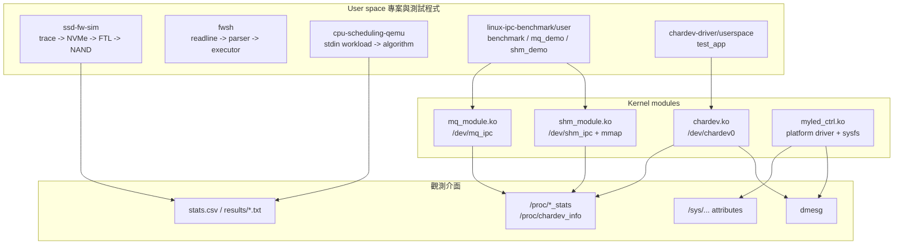
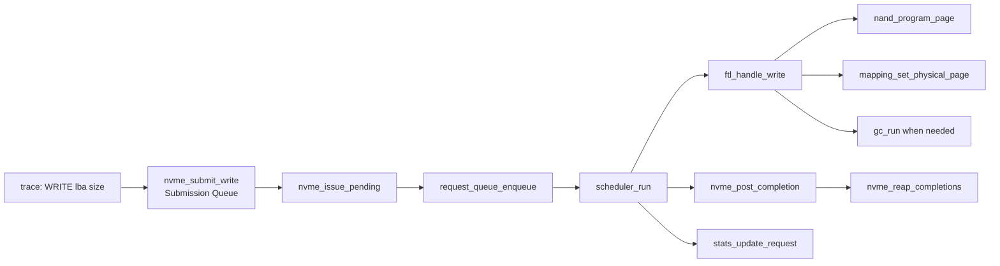
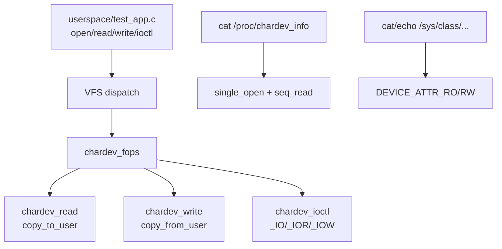
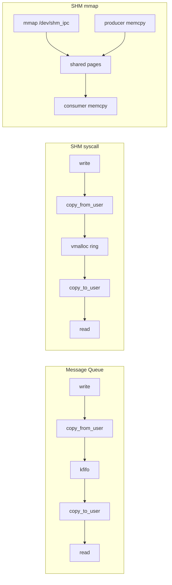
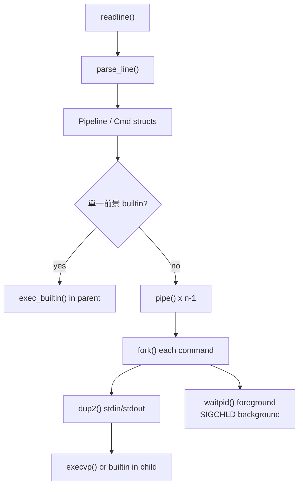
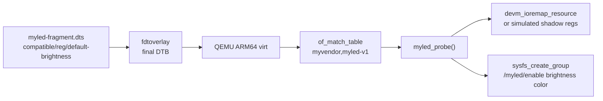
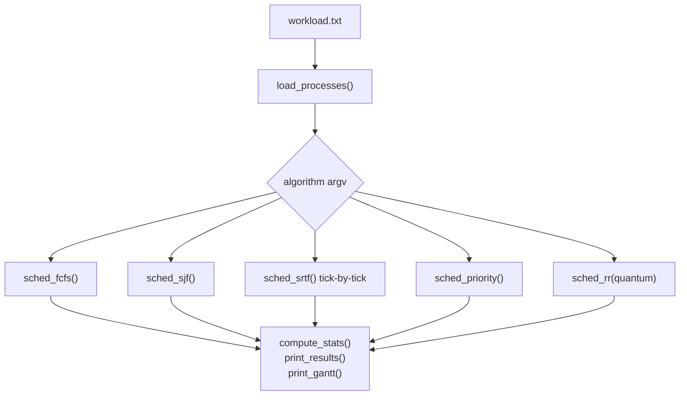

# Linux Kernel & Firmware Engineering Portfolio

本儲存庫收錄六個可獨立建置、獨立執行的系統程式子專案，主題涵蓋 Linux 字元裝置驅動、IPC 效能比較、POSIX Shell、QEMU Platform Driver、CPU 排程演算法模擬，以及 SSD 韌體寫入路徑模擬。

這份 README 先整理每個子專案在做什麼、怎麼跑、核心實作在哪裡；更完整的 API、圖解與選型比較放在 [`report.md`](report.md)。

---

## YT DEMO

https://youtu.be/477eGS1VDNE

---

## 專案總覽

| 子專案 | 路徑 | 執行空間 | 核心功能 | 主要學到 |
|--------|------|----------|----------|----------|
| SSD 寫入路徑模擬 | [`ssd-fw-sim/`](ssd-fw-sim/) | User space | 模擬 NVMe SQ/CQ、FTL、NAND、GC、延遲統計 | 儲存韌體、L2P、寫入放大 |
| 字元裝置驅動 | [`chardev-driver/`](chardev-driver/) | Kernel + User | `/dev/chardev0`、ioctl、procfs、sysfs | VFS、user/kernel copy、driver init |
| IPC 效能比較 | [`linux-ipc-benchmark/`](linux-ipc-benchmark/) | Kernel + User | kfifo MQ、SHM syscall、SHM mmap zero-copy（限定為每筆訊息不做 user/kernel copy） | mmap、wait queue、ring buffer |
| 韌體迷你 Shell | [`fwsh/`](fwsh/) | User space | REPL、pipe、redirect、background、hexdump/crc32 | fork/exec、pipe fd、signal |
| QEMU Platform Driver | [`qemu-platform-demo/`](qemu-platform-demo/) | Kernel on ARM64 QEMU | Device Tree、MMIO LED、sysfs 控制 | platform driver、devm、readl/writel |
| CPU 排程模擬 | [`cpu-scheduling-qemu/`](cpu-scheduling-qemu/) | User space + QEMU 腳本 | FCFS/SJF/SRTF/Priority/RR 與 Gantt chart | OS 排程演算法、指標計算 |

> 注意：`cpu-scheduling-qemu/src/scheduler.c` 是 user-space 排程演算法模擬器。`qemu-platform-demo` 是 Platform Driver demo，目前沒有真實 IRQ handler 或 DMA engine。

---

## 一張圖看懂整包專案



---

## 建議環境

| 項目 | 建議 |
|------|------|
| 作業系統 | Ubuntu 22.04 / 24.04 x86_64 |
| 權限 | kernel module、`/dev/*`、`/sys/*` 操作通常需要 `sudo` |
| 編譯器 | GCC、GNU Make |
| Kernel headers | 必須與目前開機 kernel 版本一致 |
| QEMU | `qemu-platform-demo` 需要 ARM64 QEMU；`cpu-scheduling-qemu` 需要 x86_64 QEMU/cloud image |

先安裝共用套件：

```bash
sudo apt update
sudo apt install -y build-essential gcc make \
    linux-headers-$(uname -r) kmod \
    libreadline-dev \
    qemu-system-x86 qemu-system-arm qemu-utils \
    device-tree-compiler bc bison flex libssl-dev libelf-dev wget
```

ARM64 platform driver demo 另需：

```bash
sudo apt install -y gcc-aarch64-linux-gnu
```

---

## 建議閱讀順序

1. 想先跑起來：讀本 README 的各子專案「建置與執行」。
2. 想理解怎麼實作：讀 [`report.md`](report.md) 的六個子專案章節。
3. 想查 API 細節：讀各子目錄的 `report_*_api.md`。
4. 想快速整理技術重點：讀 [`report.md`](report.md) 的「API 橫向比較」與「開發挑戰」。

---

## 子專案一：`ssd-fw-sim`

### 功能

`ssd-fw-sim` 是一個 user-space SSD 寫入路徑模擬器。它讀取 trace 檔中的 `WRITE <lba> <size_in_pages>`，模擬 host 將命令放進 NVMe Submission Queue，再由裝置端取出、排入內部 request queue，最後交給 FTL 寫入 NAND。



### 建置與執行

```bash
cd ssd-fw-sim
make
./ssd_fw_sim traces/sample.trace
./ssd_fw_sim --config ssd.conf --csv stats.csv traces/sample.trace
make test
./ssd_fw_sim_tests
```

### 關鍵 API 速查

| API / 函式 | 格式與作用 | 為什麼選它 |
|------------|------------|------------|
| `nvme_submit_write(controller, slba, nlb, timestamp)` | 把 host write command 放進 SQ，滿了回 `-1` | 保留 NVMe host/device 分層，不直接呼叫 FTL |
| `nvme_issue_pending(controller, rq)` | SQ -> internal request queue | 模擬 controller fetch command 的動作 |
| `scheduler_run(ftl, rq, controller)` | 取出 request、跑 FTL、填 CQ、更新 latency | 把 dispatch、completion 與統計集中管理 |
| `ftl_handle_request(ftl, request)` | 目前只支援 `REQUEST_TYPE_WRITE` | 預留 READ/TRIM 擴充點 |
| `gc_run(ftl, foreground)` | 選 victim block、搬 valid pages、erase block | 區分背景 GC 與 foreground stall |
| `mapping_set_physical_page(table, lpn, ppa)` | 更新 L2P 對應 | NAND 無法原地覆寫，必須靠映射表指向新頁 |

更完整說明見 [`ssd-fw-sim/report_ssd_api.md`](ssd-fw-sim/report_ssd_api.md)。

---

## 子專案二：`chardev-driver`

### 功能

`chardev-driver` 實作一個 Linux 字元裝置 `/dev/chardev0`，提供三種介面：

- 資料面：`read()` / `write()`
- 控制面：`ioctl()`
- 觀測面：`/proc/chardev_info`、`/sys/class/chardev/chardev0/*`



### 建置與執行

```bash
cd chardev-driver/driver
make

cd ..
chmod +x scripts/*.sh
sudo ./scripts/load.sh

echo "Hello Driver" | sudo tee /dev/chardev0
cat /dev/chardev0
cat /proc/chardev_info
cat /sys/class/chardev/chardev0/stats

cd userspace
make
sudo ./test_app
```

卸載：

```bash
cd chardev-driver
sudo ./scripts/unload.sh
```

### 關鍵 API 速查

| API / 巨集 | 格式與作用 | 跟類似 API 的差別 |
|------------|------------|-------------------|
| `alloc_chrdev_region(&devno, firstminor, count, name)` | 動態申請 major/minor | 比硬編 major 安全，避免號碼衝突 |
| `cdev_init()` / `cdev_add()` | 把 `file_operations` 註冊給 VFS | 這是 char device 的核心註冊流程 |
| `copy_from_user()` / `copy_to_user()` | 安全跨 user/kernel boundary | 不能用 `memcpy()` 直接碰 user pointer |
| `_IO`, `_IOR`, `_IOW` | 定義 ioctl command 編碼 | `_IO` 無資料；`_IOR` kernel 回傳；`_IOW` user 傳入 |
| `seq_file` | `single_open` + `seq_read` 輸出 proc 文字 | 比手寫 proc read 更不容易處理錯 offset |
| `sysfs_emit()` | sysfs show callback 產生文字 | 比 `sprintf` 更符合 sysfs buffer 規範 |
| `mutex` | 保護共享 buffer | 可睡眠，適合含 `copy_from_user()` 的路徑 |
| `atomic_t` | open/read/write 計數 | 只適合單一計數器，不保護整個 buffer |

更完整說明見 [`chardev-driver/report_char_api.md`](chardev-driver/report_char_api.md)。

---

## 子專案三：`linux-ipc-benchmark`

### 功能

這個子專案比較三條 IPC 路徑：

1. MQ：`/dev/mq_ipc`，核心端用 `kfifo` + `wait_queue`。
2. SHM syscall：`/dev/shm_ipc`，核心端用 `vmalloc` ring buffer，但每筆仍走 `read/write`。
3. SHM mmap：同一個 `/dev/shm_ipc` backing pages 映射到 user space，每筆訊息不再進 kernel。

注意：SHM syscall 與 SHM mmap 共用同一個 device 和 backing pages，但目前 kernel `struct shm_region` 與 user `shm_region_t` 的 `data` offset 不同。因此不能把它說成「兩條路徑共用完全相同的資料 slot layout」；benchmark 的 mmap path 是 producer / consumer 都用 user layout 操作。



### 建置與執行

```bash
cd linux-ipc-benchmark
sudo bash scripts/01_setup.sh

cd user
./mq_demo
./shm_demo
./benchmark
./benchmark 10000
```

觀測：

```bash
watch -n 1 cat /proc/mq_stats
watch -n 1 cat /proc/shm_stats
```

清理：

```bash
cd linux-ipc-benchmark
sudo bash scripts/04_cleanup.sh
```

### 關鍵 API 速查

| API / 函式 | 格式與作用 | 選擇依據 |
|------------|------------|----------|
| `DEFINE_KFIFO(g_fifo, char, FIFO_SIZE)` | 建立核心 FIFO | 適合固定大小訊息與 blocking queue demo |
| `wait_event_interruptible(wq, condition)` | 條件不成立時讓行程睡眠 | 比 busy-spin 省 CPU，適合 MQ 背壓 |
| `vmalloc(size)` | 配置虛擬連續、實體不一定連續的核心記憶體 | 適合較大的 shared buffer |
| `vmalloc_to_pfn()` | 取得 vmalloc 每頁的 PFN | 因 vmalloc 實體不連續，必須逐頁映射 |
| `remap_pfn_range(vma, uaddr, pfn, PAGE_SIZE, prot)` | 把實體頁映射到 user VMA | 建立 mmap zero-copy 路徑；此處 zero-copy 指每筆訊息不做 user/kernel copy |
| `smp_wmb()` / `smp_rmb()` | 控制多核心記憶體可見順序 | 比 `volatile` 更能約束 CPU memory ordering |
| `pthread_barrier_wait()` | producer/consumer 同步起跑 | 讓吞吐量測試較公平 |

更完整說明見 [`linux-ipc-benchmark/report_ipc_api.md`](linux-ipc-benchmark/report_ipc_api.md)。

---

## 子專案四：`fwsh`

### 功能

`fwsh` 是一個自製迷你 Shell，支援：

- readline 互動輸入
- pipeline：`cmd1 | cmd2`
- redirect：`<`, `>`, `>>`
- background：`sleep 3 &`
- builtin：`cd`, `pwd`, `history`, `hexdump`, `crc32`, `memmap`



### 建置與執行

```bash
cd fwsh
make
./fwsh
```

範例：

```bash
help
pwd
ls | wc -l
hexdump ./fwsh 0x80
crc32 ./fwsh
memmap
sleep 3 &
```

### 關鍵 API 速查

| API | 格式與作用 | 跟類似 API 的差別 |
|-----|------------|-------------------|
| `fork()` | 複製目前行程建立 child | 讓 shell parent 保持存在，child 執行命令 |
| `execvp(file, argv)` | 依 `PATH` 搜尋並替換 child 程式映像 | 比 `execv` 多 PATH 搜尋；比 `system()` 可控 |
| `pipe(int fd[2])` | 建立單向資料通道 | shell pipeline 的基礎 |
| `dup2(oldfd, newfd)` | 把 stdin/stdout 接到 pipe 或檔案 | 比手動搬資料簡潔，讓程式自然讀寫標準流 |
| `waitpid(pid, &status, 0)` | 等前景 child 結束 | 背景行程則由 SIGCHLD handler 回收 |
| `sigaction()` | 設定 SIGCHLD/SIGINT/SIGTSTP | 比舊式 `signal()` 語意更穩定 |
| `readline()` | 互動輸入與歷史編輯 | 比 `fgets()` 適合互動式 shell |

更完整說明見 [`fwsh/report_fwsh_api.md`](fwsh/report_fwsh_api.md)。

---

## 子專案五：`qemu-platform-demo`

### 功能

在 QEMU ARM64 `virt` 平台上放入一個 Device Tree 節點 `myled-controller@0d000000`，再載入 `myled_ctrl.ko`。Driver 會透過 `platform_driver` 的 `probe()` 取得 MMIO resource，建立 sysfs 介面控制虛擬 LED。



### 建置與執行

這個流程會下載/編譯 kernel，時間較長。請在 `qemu-platform-demo` 目錄依序執行：

```bash
cd qemu-platform-demo
bash scripts/00_install_deps.sh
bash scripts/01_build_kernel.sh
bash scripts/02_patch_dtb.sh
bash scripts/03_build_driver.sh
bash scripts/04_build_rootfs.sh
bash scripts/05_run_qemu.sh
```

QEMU shell 出現後：

```bash
/test_myled.sh
```

或手動找 sysfs 路徑：

```bash
find /sys -name enable 2>/dev/null
cd /sys/bus/platform/devices/*myled-controller*/myled
echo 1 > enable
echo 200 > brightness
echo ff8800 > color
cat info
```

離開 QEMU：按 `Ctrl-A`，放開後按 `x`。

清理：

```bash
bash scripts/06_clean.sh
```

### 關鍵 API 速查

| API / 函式 | 格式與作用 | 選擇依據 |
|------------|------------|----------|
| `platform_driver` | `.probe`, `.remove`, `.driver.of_match_table` | 適合非熱插拔、由 Device Tree 描述的 MMIO 裝置 |
| `of_device_id` | `.compatible = "myvendor,myled-v1"` | 用 compatible string 將 DT 節點配對到 driver |
| `platform_get_resource(pdev, IORESOURCE_MEM, 0)` | 取得 DT `reg` 轉成的 MMIO resource | 比硬寫位址更貼近 kernel device model |
| `devm_kzalloc()` / `devm_ioremap_resource()` | device-managed allocation / ioremap | probe 失敗或 remove 時由核心協助回收 |
| `readl()` / `writel()` | MMIO 32-bit register access | 不能用一般指標解參考存取硬體暫存器 |
| `sysfs_create_group()` | 建立 `/sys/.../myled/*` | 適合低頻、文字化、可 shell 操作的控制項 |
| `kstrtobool()` / `kstrtou32()` | 解析 sysfs 輸入文字 | 比手寫 `atoi()` 更能處理錯誤 |

更完整說明見 [`qemu-platform-demo/report_platform_api.md`](qemu-platform-demo/report_platform_api.md)。

---

## 子專案六：`cpu-scheduling-qemu`

### 功能

`cpu-scheduling-qemu` 的核心是 `src/scheduler.c`，從 stdin 讀取 workload：

```text
<process_count>
<pid> <arrival> <burst> <priority>
```

支援演算法：

- `fcfs`
- `sjf`
- `srtf`
- `priority`
- `rr [time_quantum]`



### 建置與執行

```bash
cd cpu-scheduling-qemu
make
./scheduler fcfs < src/workload_demo.txt
./scheduler rr 2 < src/workload_demo.txt
```

完整 QEMU 腳本：

```bash
cd cpu-scheduling-qemu
chmod +x scripts/*.sh
bash scripts/01_setup_env.sh
bash scripts/02_start_vm.sh
bash scripts/03_demo.sh
bash scripts/04_benchmark.sh
bash scripts/05_cleanup.sh
```

### 關鍵 API / 演算法速查

| 函式 | 作用 | 選擇依據 |
|------|------|----------|
| `load_processes()` | 讀 stdin workload 並檢查格式 | 讓 benchmark 腳本可用重導向餵資料 |
| `sched_fcfs()` | 依 arrival 排序後先到先服務 | 最容易作 baseline |
| `sched_sjf()` | 每輪從已到達行程挑 burst 最短 | 展示非搶佔式最佳化等待時間 |
| `sched_srtf()` | 每 tick 重新挑 remaining 最短 | 展示搶佔與 response time 差異 |
| `sched_priority()` | priority 數字越小越優先 | 展示優先權排程與飢餓風險 |
| `sched_rr(quantum)` | ready queue + time quantum | 展示公平性與切換頻率折衷 |
| `gantt_push()` | 合併連續同 PID 的區間 | 讓 Gantt chart 可讀，不會每 tick 一格 |

更完整說明見 [`cpu-scheduling-qemu/report_schedule_api.md`](cpu-scheduling-qemu/report_schedule_api.md)。

---

## API 選型快速比較

| 需求 | 本專案示範 | 選擇理由 | 不選誰 |
|------|------------|----------|--------|
| 跨 user/kernel 傳資料 | `copy_to_user` / `copy_from_user` | 安全處理 user pointer 與 page fault | 不直接 `memcpy` user pointer |
| 控制 driver 狀態 | ioctl / sysfs | ioctl 適合結構化命令；sysfs 適合單一文字屬性 | 不把所有控制塞進 read/write |
| 顯示診斷資訊 | procfs + seq_file | `cat`/`watch` 友善 | 不用 sysfs 輸出大段狀態 |
| 大塊共享記憶體 | `vmalloc` + mmap | 方便配置大 buffer，逐頁映射到 user | 不用 `kmalloc` 硬拚大連續實體記憶體 |
| 等待 queue 有資料/空間 | wait queue | 可睡眠、省 CPU | 不用 busy-spin |
| 短臨界區 MMIO | spinlock / `spin_lock_irqsave` | 不睡眠、保護 read-modify-write | 不用 mutex 包 MMIO |
| Shell 管線 | `pipe` + `dup2` + `fork` | 符合 POSIX shell 模型 | 不用 parent 手動搬資料 |
| Device Tree 裝置 | `platform_driver` + `of_match_table` | 適合非 discoverable MMIO 裝置 | 不硬寫 module init 裡的裝置位址 |

---

## 常見問題

| 現象 | 排查方向 |
|------|----------|
| `make` 找不到 kernel headers | 安裝 `linux-headers-$(uname -r)`，確認與目前開機 kernel 一致 |
| `insmod` 失敗 | 看 `dmesg`，通常是 vermagic、API 版本或符號問題 |
| `/dev/chardev0` 不存在 | 確認 `load.sh` 是否成功、`lsmod` 是否有模組、`dmesg` 是否報錯 |
| IPC benchmark 打不開 `/dev/mq_ipc` | 先跑 `sudo bash scripts/01_setup.sh` |
| mmap 測試卡住 | 檢查 producer/consumer 是否同時執行、ring head/tail 是否被重設 |
| QEMU 內找不到 myled sysfs | 用 `find /sys -name enable 2>/dev/null`，再看 guest `dmesg` |
| RR 結果與想像不同 | 檢查 time quantum 與同時間 arrival/requeue 的順序 |
| SSD trace 失敗 | 確認 `WRITE <lba> <size>` 沒超過 `logical_pages` |

---

## 文件索引

| 文件 | 用途 |
|------|------|
| [`report.md`](report.md) | 全專案詳細技術報告、API 比較與圖解 |
| [`ssd-fw-sim/report_ssd_api.md`](ssd-fw-sim/report_ssd_api.md) | SSD 模擬器 API 細節 |
| [`chardev-driver/report_char_api.md`](chardev-driver/report_char_api.md) | 字元驅動 API 細節 |
| [`linux-ipc-benchmark/report_ipc_api.md`](linux-ipc-benchmark/report_ipc_api.md) | IPC 與 mmap API 細節 |
| [`fwsh/report_fwsh_api.md`](fwsh/report_fwsh_api.md) | Shell / POSIX API 細節 |
| [`qemu-platform-demo/report_platform_api.md`](qemu-platform-demo/report_platform_api.md) | Platform Driver / Device Tree API 細節 |
| [`cpu-scheduling-qemu/report_schedule_api.md`](cpu-scheduling-qemu/report_schedule_api.md) | 排程演算法 API 細節 |

---

## 後續擴充方向

1. `ssd-fw-sim`：加入 READ/TRIM、wear leveling、多 channel/die 模型。
2. `chardev-driver`：修正 `read_only` 與 buffer 狀態同鎖、加入 `poll/epoll`。
3. `linux-ipc-benchmark`：mmap 路徑改用 C11 atomic、支援 MPSC/MPMC。
4. `fwsh`：加入 `jobs/fg/bg`、環境變數展開與更完整 quoting。
5. `qemu-platform-demo`：加入 IRQ/threaded IRQ，或整合 `led_classdev`。
6. `cpu-scheduling-qemu`：加入 context switch 成本、aging、多核心 ready queue。

---

## 授權

Kernel module 相關原始碼依各檔案 SPDX 標示，多為 GPL-2.0。使用者空間工具請以各檔案標頭與專案 LICENSE 為準。
