# chardev-driver 圖解筆記

這份文件只做一件事：把 `chardev-driver` 這個專案用圖整理清楚。Linux character device driver 的關鍵脈絡在於「使用者程式到底怎麼跑進 driver」、「/dev、/proc、/sys 差在哪」、「write 進去的資料放哪裡」、「ioctl 是不是另一種 read/write」。下面的圖就是照這個順序排的。

這個專案沒有硬體中斷、IRQ、POSIX signal。這裡提到的「訊號流」，指的是控制命令、flag、errno、counter 這些會改變行為的訊號。

---

## 0. 看圖前先抓住三件事

### 圖 01：整個專案只做一個小型字元裝置

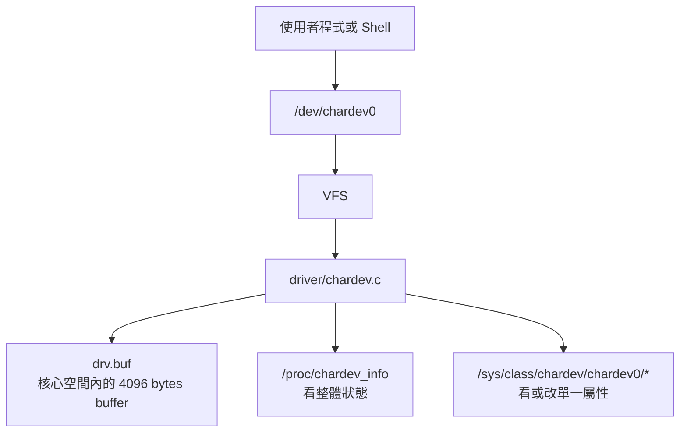

核心觀念是：使用者平常碰到的是 `/dev/chardev0`，真正做事的是 `driver/chardev.c`，狀態放在 `drv` 這個全域 driver state 裡。

### 圖 02：三個入口，各自的用途不同

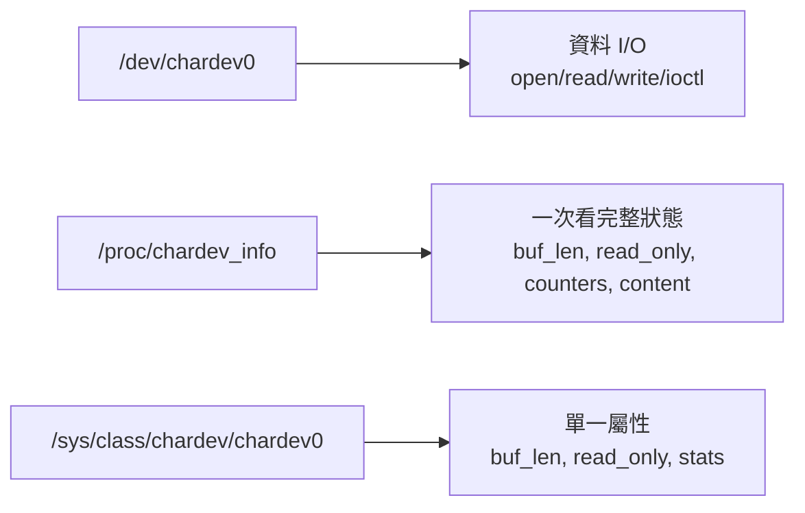

`/dev` 是主要資料通道，`/proc` 是狀態報表，`/sys` 比較像可被 shell 操作的設定面板。

### 圖 03：檔案分工

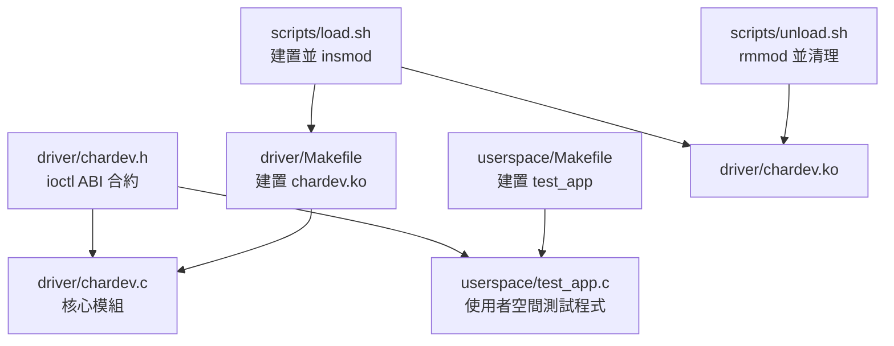

`chardev.h` 很重要，因為 driver 和 userspace 都 include 它。ioctl command 如果兩邊定義不一致，使用者程式送出去的命令就會變成 driver 看不懂的數字。

---

## 1. 執行順序

### 圖 04：從建置到載入

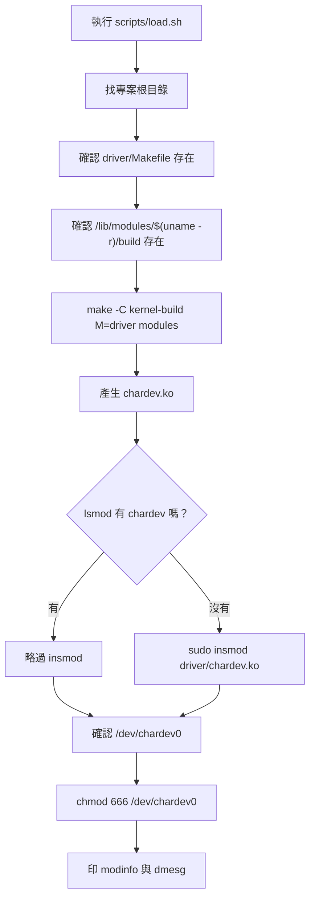

`load.sh` 不是單純載入，它也負責建置、檢查裝置節點、調整權限與印最後的 kernel log。

### 圖 05：insmod 之後，核心呼叫的初始化流程

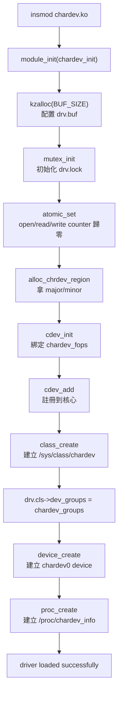

這張圖是整份 driver 的起點。`cdev_add()` 之後，VFS 才知道這個 major/minor 要交給哪些 callback。

### 圖 06：初始化成功後，系統上會多出三個介面

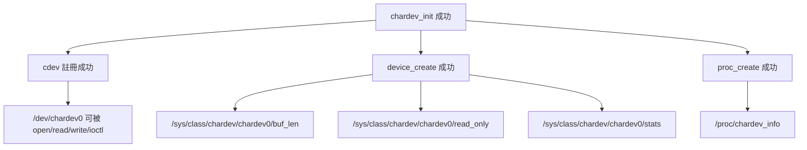

`/dev/chardev0` 多半是 udev 依照 `device_create()` 送出的 device event 建出來的。

### 圖 07：初始化失敗時的回收順序

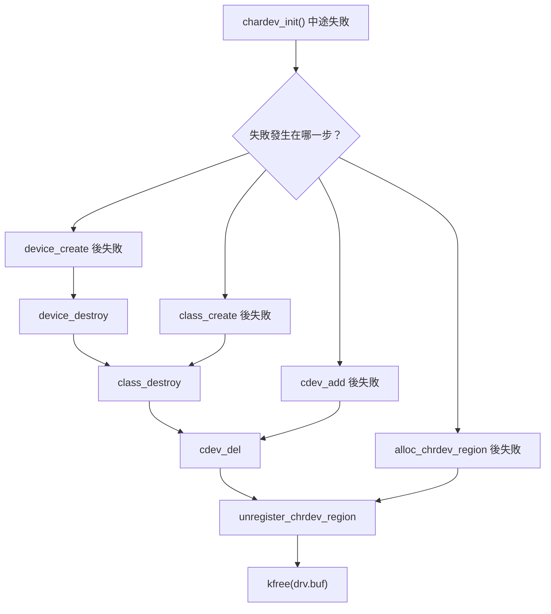

這就是 kernel driver 常見的 `goto err_xxx` 寫法。重點在於照「已經建立的東西，反方向拆掉」的順序回收資源。

### 圖 08：卸載流程

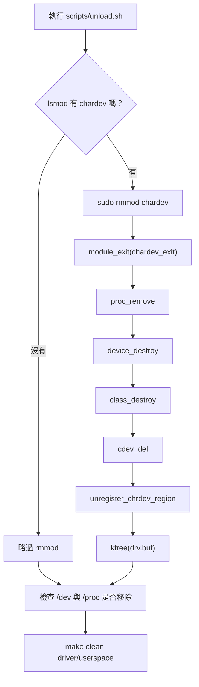

卸載順序跟初始化大致相反。先移掉外部入口，再移掉註冊與記憶體。

### 圖 09：測試程式 test_app.c 的執行順序

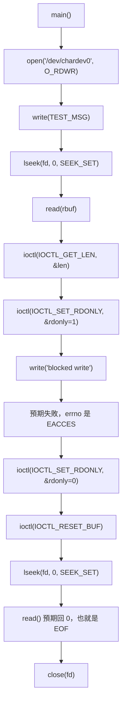

`lseek()` 不是裝飾，它是為了把同一個 fd 的 file position 拉回開頭，否則剛 write 完就 read，會直接站在 buffer 尾端。

---

## 2. 程式架構

### 圖 10：driver 的全域狀態 `drv`

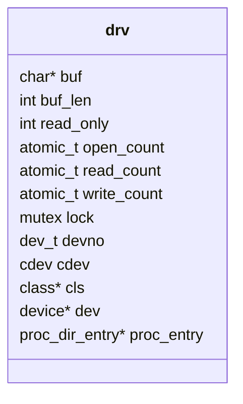

這個範例沒有 per-open 私有狀態，所有 fd 都共用同一份 `drv.buf`、`drv.buf_len`、`drv.read_only`。

### 圖 11：`drv` 裡的欄位用途

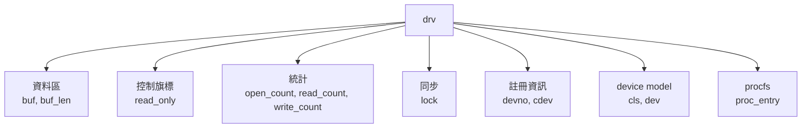

看 `drv` 就是在看 driver 的資料模型。這支 driver 沒有複雜物件圖，資料都集中在這個全域 state。

### 圖 12：VFS callback table

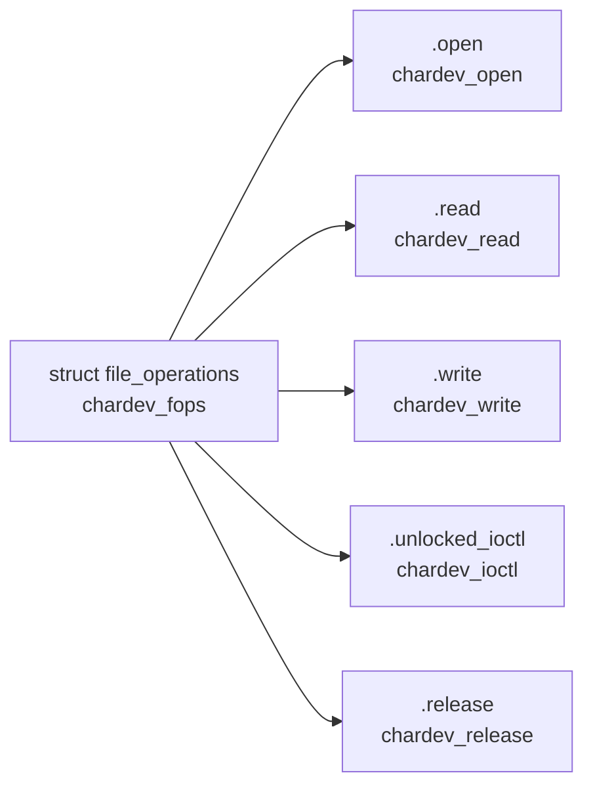

VFS 不會直接知道 `drv.buf` 是什麼，它只知道某個 fd 對應到 `chardev_fops`，然後依照系統呼叫去跑 callback。

### 圖 13：`chardev.h` 是 driver 和 userspace 的共同合約

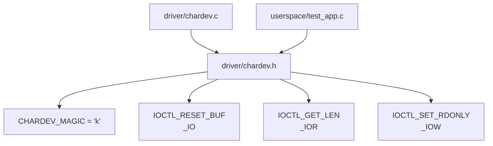

這個 header 定義了 ioctl 的語言。driver 和 userspace 都用同一份 header，才不會一邊用台語、一邊用英文。

### 圖 14：procfs 架構

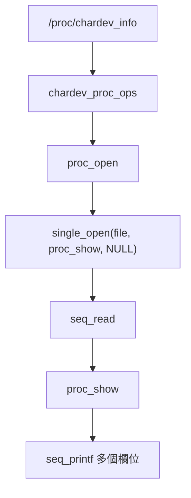

procfs 這邊走 `seq_file`。因為這份資訊很短，`single_open()` 就夠用。

### 圖 15：sysfs attribute 架構

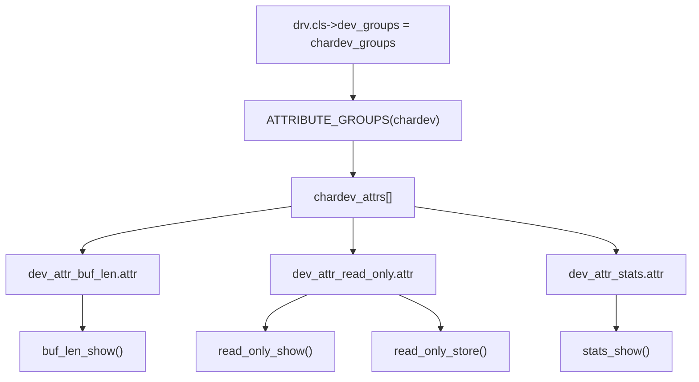

sysfs 的 `show()` 是讀，`store()` 是寫。`read_only` 有 show/store，所以可以 `cat`，也可以 `echo 1 > .../read_only`。

### 圖 16：外部介面到 callback 的對照表

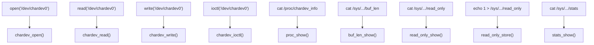

debug 時最有用的就是這張圖。先知道自己打的指令會進哪個 callback，再去讀那一段程式。

---

## 3. 資料流

### 圖 17：write 資料流

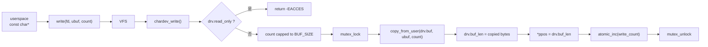

這支 driver 的 write 是覆寫模式，不是 append。每次成功 write 都會把 `drv.buf` 換成這次寫進來的內容。

### 圖 18：read 資料流

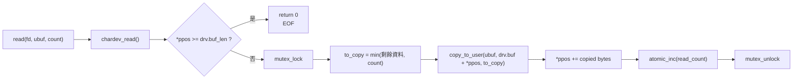

`read()` 會看 `*ppos`，所以同一個 fd 如果已經讀到尾端，再讀一次就會回 EOF。

### 圖 19：核心空間和使用者空間的邊界

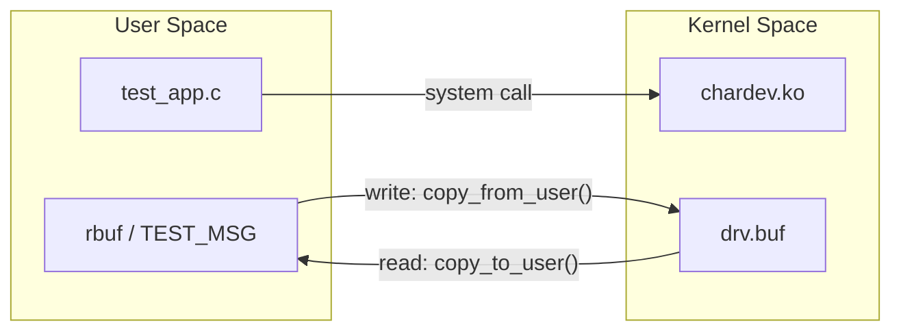

不要用 `memcpy()` 直接碰 user pointer。driver 裡用的是 `copy_from_user()` 和 `copy_to_user()`，這是跨 user/kernel 邊界時的基本安全動作。

### 圖 20：buffer 和 file position

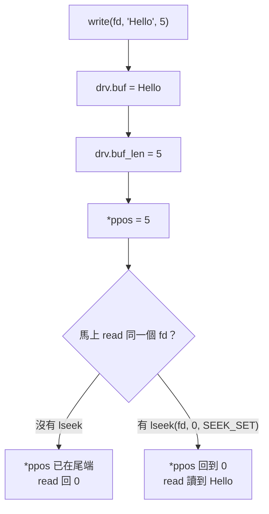

這張圖解釋為什麼 `test_app.c` 在 read 前一定要 `lseek(fd, 0, SEEK_SET)`。

### 圖 21：procfs 讀的是整份狀態

```mermaid
flowchart TD
  A["cat /proc/chardev_info"] --> B["proc_show()"]
  B --> C["buf_len"]
  B --> D["read_only"]
  B --> E["open_count"]
  B --> F["read_count"]
  B --> G["write_count"]
  B --> H["buf_content"]
  C --> I["文字報表"]
  D --> I
  E --> I
  F --> I
  G --> I
  H --> I
```

procfs 的定位是「一次看 driver 現況」，很適合 demo 或快速確認。

### 圖 22：sysfs 讀寫的是單一屬性

```mermaid
flowchart TD
  A["cat /sys/.../buf_len"] --> B["buf_len_show()"] --> B1["drv.buf_len"]
  C["cat /sys/.../stats"] --> D["stats_show()"] --> D1["open/read/write counters"]
  E["cat /sys/.../read_only"] --> F["read_only_show()"] --> F1["drv.read_only"]
  G["echo 1 > /sys/.../read_only"] --> H["read_only_store()"] --> H1["drv.read_only = 1"]
```

sysfs 適合做「一個檔案代表一個設定或狀態」的介面。這個專案裡，真正可以寫的是 `read_only`。

### 圖 23：計數器資料流

```mermaid
flowchart LR
  A["chardev_open()"] --> B["atomic_inc(open_count)"]
  C["chardev_read()"] --> D["atomic_inc(read_count)"]
  E["chardev_write()"] --> F["atomic_inc(write_count)"]
  B --> G["stats_show()"]
  D --> G
  F --> G
  B --> H["proc_show()"]
  D --> H
  F --> H
```

counter 用 `atomic_t`，因為這些只是簡單加一，不需要用 mutex 包整段。

### 圖 24：read/write/reset 共用同一把 mutex

```mermaid
flowchart TD
  A["drv.lock"] --> B["chardev_write()<br/>copy_from_user + 更新 buf_len"]
  A --> C["chardev_read()<br/>copy_to_user + 更新 ppos"]
  A --> D["IOCTL_RESET_BUF<br/>memset + buf_len=0"]
```

鎖住的是 `drv.buf` 和 `drv.buf_len` 的主要修改路徑。這支範例程式有些狀態讀取沒有全部包 lock，可以先把它看成簡化版 driver。

---

## 4. 控制訊號流

### 圖 25：read_only 控制訊號來源有兩個

```mermaid
flowchart TD
  A["ioctl(fd, IOCTL_SET_RDONLY, &val)"] --> B["copy_from_user(&val)"]
  C["echo 1 > /sys/.../read_only"] --> D["kstrtoint(buf, 10, &val)"]
  B --> E["drv.read_only = !!val"]
  D --> E
  E --> F["chardev_write()"]
  F --> G{"read_only ?"}
  G -- "1" --> H["拒絕 write<br/>return -EACCES"]
  G -- "0" --> I["接受 write<br/>copy_from_user"]
```

`read_only` 就像 driver 的紅綠燈。ioctl 可以切，sysfs 也可以切，最後都影響 `write()`。

### 圖 26：ioctl command dispatch

```mermaid
flowchart TD
  A["ioctl(fd, cmd, arg)"] --> B["chardev_ioctl()"]
  B --> C{"_IOC_TYPE(cmd) == 'k' ?"}
  C -- "否" --> X["return -ENOTTY"]
  C -- "是" --> D{"_IOC_NR(cmd) <= 2 ?"}
  D -- "否" --> X
  D -- "是" --> E{"cmd 是哪個？"}
  E --> F["IOCTL_RESET_BUF<br/>清空 drv.buf"]
  E --> G["IOCTL_GET_LEN<br/>把 drv.buf_len 複製回 userspace"]
  E --> H["IOCTL_SET_RDONLY<br/>從 userspace 讀 val 並更新 read_only"]
```

ioctl 一進來先驗證 magic 和 command number。這是 driver 自保，不是每個數字都應該接受。

### 圖 27：errno 訊號怎麼回到使用者

```mermaid
flowchart LR
  A["driver callback"] --> B{"發生錯誤？"}
  B -- "沒有" --> C["回傳 bytes 或 0"]
  B -- "有" --> D["回傳負 errno<br/>例如 -EACCES"]
  D --> E["VFS / syscall layer"]
  E --> F["userspace 看到 -1"]
  F --> G["errno 被設成 EACCES"]
  G --> H["perror 或 strerror(errno) 印出原因"]
```

driver 裡回傳的是負的 errno。userspace 看到的是 syscall 回 `-1`，再從 `errno` 拿原因。

### 圖 28：常見錯誤分流

```mermaid
flowchart TD
  A["操作失敗"] --> B{"write 失敗？"}
  B -- "是" --> C{"read_only = 1 ?"}
  C -- "是" --> D["driver 回 -EACCES"]
  C -- "否" --> E["檢查 /dev/chardev0 權限"]
  B -- "不是" --> F{"ioctl 失敗？"}
  F -- "是" --> G{"magic 或 command number 錯？"}
  G -- "是" --> H["driver 回 -ENOTTY"]
  G -- "否" --> I["檢查 user pointer<br/>可能 -EFAULT"]
  F -- "不是" --> J["看 dmesg 和 callback log"]
```

Shell 印 `Permission denied` 時，不要只看檔案權限，也要看 driver 的 `read_only` 狀態。

### 圖 29：`IOCTL_RESET_BUF` 的控制效果

```mermaid
flowchart LR
  A["ioctl(IOCTL_RESET_BUF)"] --> B["mutex_lock"]
  B --> C["memset(drv.buf, 0, BUF_SIZE)"]
  C --> D["drv.buf_len = 0"]
  D --> E["mutex_unlock"]
  E --> F["下一次從 ppos=0 read"]
  F --> G["*ppos >= drv.buf_len"]
  G --> H["回 0，EOF"]
```

reset 沒有回傳資料，它是直接改 driver 內部狀態。

### 圖 30：GET_LEN 的訊號流

```mermaid
flowchart LR
  A["userspace int len"] --> B["ioctl(fd, IOCTL_GET_LEN, &len)"]
  B --> C["chardev_ioctl()"]
  C --> D["val = drv.buf_len"]
  D --> E["copy_to_user((int __user*)arg, &val, sizeof(val))"]
  E --> F["userspace len 被更新"]
```

`_IOR` 的 R 是從 userspace 角度看：使用者要從 driver 讀回資料。

### 圖 31：SET_RDONLY 的訊號流

```mermaid
flowchart LR
  A["userspace int rdonly"] --> B["ioctl(fd, IOCTL_SET_RDONLY, &rdonly)"]
  B --> C["copy_from_user(&val, arg, sizeof(val))"]
  C --> D["drv.read_only = !!val"]
  D --> E["後續 write 行為改變"]
```

`!!val` 代表只保留布林意義。0 是 false，非 0 都是 true。

---

## 5. 時序圖

### 圖 32：Shell echo 到 driver write

```mermaid
sequenceDiagram
  participant User as 使用者
  participant Shell as Shell
  participant VFS as VFS
  participant Driver as chardev_write
  participant State as drv

  User->>Shell: echo "hello" > /dev/chardev0
  Shell->>VFS: open + write
  VFS->>Driver: .write callback
  Driver->>State: 檢查 read_only
  Driver->>State: mutex_lock
  Driver->>State: copy_from_user 到 drv.buf
  Driver->>State: 更新 buf_len 和 write_count
  Driver->>State: mutex_unlock
  Driver-->>Shell: 回傳寫入 bytes
```

Shell redirection 會幫你做 open/write/close，所以 demo 時看起來很短，實際上還是進 VFS。

### 圖 33：Shell cat 從 driver read

```mermaid
sequenceDiagram
  participant User as 使用者
  participant Cat as cat
  participant VFS as VFS
  participant Driver as chardev_read
  participant State as drv

  User->>Cat: cat /dev/chardev0
  Cat->>VFS: open + read loop
  VFS->>Driver: .read callback
  Driver->>State: 檢查 *ppos 與 buf_len
  Driver->>State: mutex_lock
  Driver->>Cat: copy_to_user
  Driver->>State: 更新 *ppos 和 read_count
  Driver->>State: mutex_unlock
  Cat->>VFS: 再 read 一次確認 EOF
  VFS->>Driver: .read callback
  Driver-->>Cat: 回 0
```

`cat` 通常會反覆 read，直到 driver 回 0。

### 圖 34：test_app.c 完整時序

```mermaid
sequenceDiagram
  participant App as test_app
  participant VFS as VFS
  participant Driver as chardev driver
  participant State as drv

  App->>VFS: open("/dev/chardev0", O_RDWR)
  VFS->>Driver: chardev_open()
  Driver->>State: open_count++
  App->>VFS: write(TEST_MSG)
  VFS->>Driver: chardev_write()
  Driver->>State: drv.buf = TEST_MSG
  App->>VFS: lseek(fd, 0, SEEK_SET)
  App->>VFS: read(rbuf)
  VFS->>Driver: chardev_read()
  Driver-->>App: copy_to_user(TEST_MSG)
  App->>VFS: ioctl(GET_LEN)
  VFS->>Driver: chardev_ioctl()
  Driver-->>App: len = drv.buf_len
  App->>VFS: ioctl(SET_RDONLY, 1)
  VFS->>Driver: chardev_ioctl()
  Driver->>State: read_only = 1
  App->>VFS: write("blocked write")
  VFS->>Driver: chardev_write()
  Driver-->>App: -EACCES
  App->>VFS: ioctl(SET_RDONLY, 0)
  App->>VFS: ioctl(RESET_BUF)
  VFS->>Driver: chardev_ioctl()
  Driver->>State: buf cleared
  App->>VFS: close(fd)
  VFS->>Driver: chardev_release()
```

這支測試程式不是只測 read/write，它也測了 ioctl 對 driver 行為的影響。

### 圖 35：sysfs 切 read_only 的時序

```mermaid
sequenceDiagram
  participant User as 使用者
  participant Shell as Shell
  participant Sysfs as sysfs
  participant Store as read_only_store
  participant State as drv

  User->>Shell: echo 1 > /sys/.../read_only
  Shell->>Sysfs: write attribute
  Sysfs->>Store: call store(buf)
  Store->>Store: kstrtoint(buf, 10, &val)
  Store->>State: read_only = !!val
  Store-->>Shell: return count
```

sysfs 的 `store()` 成功時通常回 `count`，表示輸入內容被吃掉了。

### 圖 36：procfs 讀狀態的時序

```mermaid
sequenceDiagram
  participant User as 使用者
  participant Cat as cat
  participant Proc as procfs
  participant Open as proc_open
  participant Show as proc_show
  participant State as drv

  User->>Cat: cat /proc/chardev_info
  Cat->>Proc: open
  Proc->>Open: proc_open()
  Open->>Proc: single_open(proc_show)
  Cat->>Proc: read
  Proc->>Show: seq_read triggers show
  Show->>State: 讀 buf_len/read_only/counters/buf
  Show-->>Cat: 文字報表
```

procfs 比較像 debug 報表，不是主要資料通道。

### 圖 37：模組卸載時序

```mermaid
sequenceDiagram
  participant Admin as 管理者
  participant Script as unload.sh
  participant Kernel as Kernel
  participant Exit as chardev_exit

  Admin->>Script: sudo ./scripts/unload.sh
  Script->>Kernel: rmmod chardev
  Kernel->>Exit: module_exit callback
  Exit->>Kernel: proc_remove
  Exit->>Kernel: device_destroy
  Exit->>Kernel: class_destroy
  Exit->>Kernel: cdev_del
  Exit->>Kernel: unregister_chrdev_region
  Exit->>Kernel: kfree(drv.buf)
  Kernel-->>Script: module removed
```

卸載時如果還有人開著 `/dev/chardev0`，真實情境要更小心。這個範例重點是教資源生命週期。

---

## 6. 行為圖與狀態機

### 圖 38：driver 生命週期

```mermaid
stateDiagram-v2
  [*] --> NotLoaded
  NotLoaded --> Loading: insmod
  Loading --> Ready: chardev_init 成功
  Loading --> Failed: init 任一步失敗
  Failed --> NotLoaded: unwind 完成
  Ready --> Busy: open/read/write/ioctl
  Busy --> Ready: callback 回傳
  Ready --> Unloading: rmmod
  Busy --> Unloading: 沒有使用者持有時才安全
  Unloading --> NotLoaded: chardev_exit 完成
```

這張圖用來說明「driver 不是程式 main 跑完就結束」，它是被 kernel 載入後等待 callback。

### 圖 39：buffer 狀態機

```mermaid
stateDiagram-v2
  [*] --> Empty
  Empty --> HasData: write 成功
  HasData --> HasData: write 成功，覆寫舊資料
  HasData --> Empty: IOCTL_RESET_BUF
  Empty --> Empty: read 回 EOF
  HasData --> HasData: read 不會清資料，只推進 fd 的 ppos
```

`read()` 不會把 `drv.buf` 清掉。清掉 buffer 的是 `IOCTL_RESET_BUF`。

### 圖 40：read_only 狀態機

```mermaid
stateDiagram-v2
  [*] --> Writable
  Writable --> ReadOnly: ioctl SET_RDONLY=1
  Writable --> ReadOnly: sysfs echo 1
  ReadOnly --> Writable: ioctl SET_RDONLY=0
  ReadOnly --> Writable: sysfs echo 0
  Writable --> Writable: write 成功
  ReadOnly --> ReadOnly: write 回 -EACCES
```

`read_only` 只擋 write，不擋 read、不擋 procfs/sysfs 查詢。

### 圖 41：同一個 fd 的 file position

```mermaid
stateDiagram-v2
  [*] --> P0: open
  P0 --> PEnd: write 後 *ppos = buf_len
  PEnd --> EOF: read 直接從尾端讀
  PEnd --> P0Again: lseek(fd, 0, SEEK_SET)
  P0Again --> PEndAgain: read 讀完資料
  PEndAgain --> EOF: 再 read 回 0
```

`lseek()` 影響的是 fd 的位置，不是 driver 的 buffer 內容。

### 圖 42：write 行為分岔

```mermaid
flowchart TD
  A["write(fd, data, count)"] --> B{"read_only = 1 ?"}
  B -- "是" --> C["拒絕<br/>return -EACCES"]
  B -- "否" --> D{"count > BUF_SIZE ?"}
  D -- "是" --> E["count = BUF_SIZE"]
  D -- "否" --> F["維持原 count"]
  E --> G["copy_from_user"]
  F --> G
  G --> H{"copy 完全成功？"}
  H -- "是" --> I["回傳 count"]
  H -- "部分失敗" --> J["回傳實際 copied bytes"]
```

這支 driver 沒有讓 write 超過 4096 bytes，超過就截到 `BUF_SIZE`。

### 圖 43：read 行為分岔

```mermaid
flowchart TD
  A["read(fd, buf, count)"] --> B{"*ppos >= drv.buf_len ?"}
  B -- "是" --> C["EOF<br/>return 0"]
  B -- "否" --> D["remaining = drv.buf_len - *ppos"]
  D --> E["to_copy = min(remaining, count)"]
  E --> F["copy_to_user"]
  F --> G["*ppos += copied"]
  G --> H["return copied"]
```

`read()` 回 0 在字元裝置裡也可以代表 EOF，不一定是錯誤。

---

## 7. API 呼叫圖

### 圖 44：初始化 API 呼叫圖

```mermaid
flowchart TD
  A["chardev_init()"] --> B["kzalloc"]
  A --> C["mutex_init"]
  A --> D["atomic_set"]
  A --> E["alloc_chrdev_region"]
  A --> F["cdev_init"]
  A --> G["cdev_add"]
  A --> H["class_create"]
  A --> I["device_create"]
  A --> J["proc_create"]
```

這些 API 分成三類：記憶體、字元裝置註冊、對外介面建立。

### 圖 45：執行期 API 呼叫圖

```mermaid
flowchart TD
  A["chardev_open()"] --> A1["atomic_inc"]
  B["chardev_read()"] --> B1["mutex_lock"]
  B --> B2["copy_to_user"]
  B --> B3["atomic_inc"]
  B --> B4["mutex_unlock"]
  C["chardev_write()"] --> C1["mutex_lock"]
  C --> C2["copy_from_user"]
  C --> C3["atomic_inc"]
  C --> C4["mutex_unlock"]
  D["chardev_ioctl()"] --> D1["_IOC_TYPE / _IOC_NR"]
  D --> D2["copy_to_user"]
  D --> D3["copy_from_user"]
  D --> D4["memset"]
```

真正資料搬移都在 `copy_*_user()`，真正保護 buffer 的是 `mutex_lock()` 到 `mutex_unlock()` 這段。

### 圖 46：procfs/sysfs API 呼叫圖

```mermaid
flowchart TD
  A["proc_create"] --> B["proc_open"]
  B --> C["single_open"]
  C --> D["seq_read"]
  D --> E["proc_show"]
  E --> F["seq_printf"]

  G["DEVICE_ATTR_RO(buf_len)"] --> H["buf_len_show"]
  I["DEVICE_ATTR_RW(read_only)"] --> J["read_only_show"]
  I --> K["read_only_store"]
  L["DEVICE_ATTR_RO(stats)"] --> M["stats_show"]
  H --> N["sysfs_emit"]
  J --> N
  M --> N
  K --> O["kstrtoint"]
```

procfs 的輸出用 `seq_printf()`，sysfs 的輸出用 `sysfs_emit()`。

### 圖 47：userspace test_app 呼叫圖

```mermaid
flowchart TD
  A["main()"] --> B["open"]
  A --> C["write"]
  A --> D["lseek"]
  A --> E["read"]
  A --> F["ioctl GET_LEN"]
  A --> G["ioctl SET_RDONLY"]
  A --> H["ioctl RESET_BUF"]
  A --> I["close"]
  B --> J["/dev/chardev0"]
  C --> J
  D --> J
  E --> J
  F --> J
  G --> J
  H --> J
  I --> J
```

測試程式只跟 `/dev/chardev0` 互動，不會直接碰 `/proc` 或 `/sys`。最後印出那些路徑，是提醒你可以手動查。

### 圖 48：腳本呼叫圖

```mermaid
flowchart TD
  A["scripts/load.sh"] --> B["make -C KDIR M=DRIVER_DIR modules"]
  B --> C["insmod chardev.ko"]
  C --> D["ls -la /dev/chardev0"]
  D --> E["chmod 666 /dev/chardev0"]
  E --> F["modinfo"]
  E --> G["dmesg tail"]

  H["scripts/unload.sh"] --> I["rmmod chardev"]
  I --> J["確認 /dev/chardev0 移除"]
  I --> K["確認 /proc/chardev_info 移除"]
  I --> L["make clean driver"]
  I --> M["make clean userspace"]
```

如果 demo 失敗，先看 `load.sh` 卡在哪一格。最常見是 kernel build directory 不存在。

---

## 8. 最容易卡住的地方

### 圖 49：為什麼 write 後 read 要 lseek

```mermaid
flowchart TD
  A["open fd"] --> B["ppos = 0"]
  B --> C["write 20 bytes"]
  C --> D["ppos = 20"]
  D --> E["read"]
  E --> F{"ppos >= buf_len ?"}
  F -- "20 >= 20" --> G["回 0，像沒資料"]
  D --> H["lseek(fd, 0, SEEK_SET)"]
  H --> I["ppos = 0"]
  I --> J["read"]
  J --> K["讀到資料"]
```

看到 read 回 0，不要第一時間懷疑 copy_to_user，先看 file position。

### 圖 50：Permission denied 的兩條路

```mermaid
flowchart TD
  A["Permission denied"] --> B{"是 open 失敗還是 write 失敗？"}
  B -- "open 失敗" --> C["看 /dev/chardev0 檔案權限"]
  B -- "write 失敗" --> D{"read_only = 1 ?"}
  D -- "是" --> E["driver 主動回 -EACCES"]
  D -- "否" --> F["再看權限、SELinux/AppArmor、其他環境因素"]
  C --> G["ls -l /dev/chardev0"]
  D --> H["cat /sys/class/chardev/chardev0/read_only"]
```

同一句錯誤訊息，可能來自檔案權限，也可能來自 driver callback 回 errno。

### 圖 51：kernel headers 問題怎麼查

```mermaid
flowchart TD
  A["make driver 失敗"] --> B["看 /lib/modules/$(uname -r)/build"]
  B --> C{"目錄存在？"}
  C -- "不存在" --> D["安裝對應 kernel headers<br/>或換到有 build tree 的環境"]
  C -- "存在" --> E["檢查 driver/Makefile 的 M= 路徑"]
  E --> F{"M 指到 driver 目錄？"}
  F -- "否" --> G["修 Makefile 或改用 load.sh"]
  F -- "是" --> H["再看實際編譯錯誤"]
```

這是建置環境問題，不是 C code 一定寫錯。

### 圖 52：class_create 因 kernel 版本不同而分流

```mermaid
flowchart TD
  A["編譯 chardev.c"] --> B{"LINUX_VERSION_CODE >= 6.4.0 ?"}
  B -- "是" --> C["class_create(CLASS_NAME)"]
  B -- "否" --> D["class_create(THIS_MODULE, CLASS_NAME)"]
```

這段版本判斷是為了讓同一份 code 適應不同 kernel API。

### 圖 53：ioctl command 看不懂時

```mermaid
flowchart TD
  A["ioctl 進 driver"] --> B{"magic 是 CHARDEV_MAGIC ?"}
  B -- "否" --> C["-ENOTTY"]
  B -- "是" --> D{"command number <= 2 ?"}
  D -- "否" --> C
  D -- "是" --> E{"有對應 case ?"}
  E -- "否" --> C
  E -- "有" --> F["執行對應功能"]
```

如果 userspace 沒 include 同一份 `chardev.h`，很容易送出 driver 不認得的 command。

### 圖 54：procfs 和 sysfs 不要混用概念

```mermaid
flowchart LR
  A["想看完整狀態"] --> B["cat /proc/chardev_info"]
  C["想看單一數值"] --> D["cat /sys/.../buf_len"]
  E["想切唯讀模式"] --> F["echo 1 > /sys/.../read_only"]
  G["想跑 C 程式控制"] --> H["ioctl(fd, IOCTL_SET_RDONLY, &val)"]
```

procfs 用於狀態摘要，read/write 才是資料通道；sysfs 則適合單一屬性，不適合塞大段資料。

---

## 9. 建議照這個順序看 code

### 圖 55：code walk-through 路線

```mermaid
flowchart TD
  A["先看 driver/chardev.h<br/>知道 ioctl 合約"] --> B["看 chardev_init<br/>知道介面怎麼建立"]
  B --> C["看 chardev_fops<br/>知道 VFS 會叫誰"]
  C --> D["看 chardev_write/read<br/>知道資料怎麼進出"]
  D --> E["看 chardev_ioctl<br/>知道控制命令怎麼改狀態"]
  E --> F["看 procfs/sysfs<br/>知道怎麼觀察狀態"]
  F --> G["看 test_app.c<br/>把流程跑一次"]
  G --> H["看 load.sh/unload.sh<br/>知道怎麼操作環境"]
```

照這條路看，會比從檔案第一行一路讀到底更快進入狀況。

### 圖 56：先建立的心智模型

```mermaid
flowchart TD
  A["系統呼叫"] --> B["VFS"]
  B --> C["file_operations"]
  C --> D["driver callback"]
  D --> E["driver state"]
  E --> F["回傳 bytes 或 errno"]
  F --> A
```

character device driver 的入門模型就是這圈。理解這圈，再看 procfs/sysfs/ioctl 就不會散掉。

### 圖 57：一張圖串起 demo 指令

```mermaid
flowchart TD
  A["sudo ./scripts/load.sh"] --> B["/dev/chardev0 出現"]
  B --> C["echo hello > /dev/chardev0"]
  C --> D["chardev_write()"]
  D --> E["cat /dev/chardev0"]
  E --> F["chardev_read()"]
  F --> G["cat /proc/chardev_info"]
  G --> H["看 buffer 與 counters"]
  H --> I["echo 1 > /sys/.../read_only"]
  I --> J["再 write 會被擋"]
  J --> K["sudo ./scripts/unload.sh"]
```

不一定要先跑 `test_app`。先用 shell 指令確認介面，再回頭看 C code。

---

## 10. 五分鐘快速閱讀路線

### 圖 58：五分鐘導讀路線

```mermaid
flowchart LR
  A["0:00<br/>這是什麼"] --> B["0:45<br/>介面有哪些"]
  B --> C["1:30<br/>載入後建立什麼"]
  C --> D["2:15<br/>read/write 資料流"]
  D --> E["3:15<br/>ioctl/sysfs 控制流"]
  E --> F["4:15<br/>test_app 跑一次"]
  F --> G["5:00<br/>提醒常見坑"]
```

下面這段整理成一條由外到內的閱讀路線。

### 0:00 到 0:45，先看它是什麼

搭配圖 01、圖 02。

「這個專案是一個最小但完整的 Linux character device driver。載入後會有 `/dev/chardev0` 給使用者做 read/write/ioctl，另外有 `/proc/chardev_info` 看完整狀態，還有 `/sys/class/chardev/chardev0/*` 看或改單一屬性。核心資料就放在 driver 裡的 `drv.buf`。」

### 0:45 到 1:30，看檔案怎麼分工

搭配圖 03、圖 13。

「`driver/chardev.c` 是核心模組，`driver/chardev.h` 是 driver 和 userspace 共用的 ioctl 合約，`userspace/test_app.c` 是測試程式。兩邊共用 header 這點很重要，因為 ioctl command 本質上就是一組數字，兩邊要使用同一套。」

### 1:30 到 2:15，看載入後建立了什麼

搭配圖 05、圖 06、圖 12。

「`insmod` 之後 kernel 會呼叫 `chardev_init()`。它先配置 buffer，再註冊 major/minor，接著用 `cdev_add()` 把 `chardev_fops` 掛進 VFS，最後建立 `/dev`、`/proc`、`/sys` 這些入口。之後使用者呼叫 read/write，VFS 就會依照 `chardev_fops` 找到 driver callback。」

### 2:15 到 3:15，看 read/write 資料流

搭配圖 17、圖 18、圖 19、圖 20。

「write 是 user 到 kernel，所以用 `copy_from_user()` 把資料放進 `drv.buf`，並更新 `drv.buf_len`。read 是 kernel 到 user，所以用 `copy_to_user()`。這支 driver 的 buffer 是覆寫模式，不是 append。還有一個容易踩到的點是 file position，write 完同一個 fd 的位置在尾端，所以 `test_app` read 前要 `lseek(fd, 0, SEEK_SET)`。」

### 3:15 到 4:15，看控制流和觀察方式

搭配圖 25、圖 26、圖 30、圖 31。

「ioctl 用來做資料流以外的控制。這裡有三個命令：reset buffer、取得 buffer 長度、切 read_only。read_only 也可以從 sysfs 切，所以 `ioctl SET_RDONLY` 和 `echo 1 > /sys/.../read_only` 最後都會影響同一個 `drv.read_only`。如果 read_only 是 1，write callback 會直接回 `-EACCES`。」

### 4:15 到 5:00，跑測試並收尾

搭配圖 09、圖 34、圖 49、圖 50。

「`test_app` 會 open、write、lseek、read，接著用 ioctl 讀長度、打開 read_only、確認 write 被擋，再關掉 read_only，最後 reset buffer 並確認 read 回 EOF。最常卡兩個地方：第一，write 後沒有 lseek 會讀不到；第二，Permission denied 不一定是檔案權限，也可能是 driver 的 read_only 在擋。」

### 五分鐘版本只要記這六張圖

```mermaid
flowchart TD
  A["圖 01<br/>專案在做什麼"] --> B["圖 03<br/>檔案分工"]
  B --> C["圖 05<br/>載入流程"]
  C --> D["圖 12<br/>VFS callback"]
  D --> E["圖 17 + 圖 18<br/>write/read 資料流"]
  E --> F["圖 25 + 圖 26<br/>read_only 和 ioctl 控制流"]
  F --> G["圖 49 + 圖 50<br/>常見坑"]
```

快速閱讀時，先把「使用者呼叫進 `/dev/chardev0`，VFS 分派到 callback，callback 改 `drv`」這條線看穩，再回頭補 Makefile 和 kernel API 細節。
