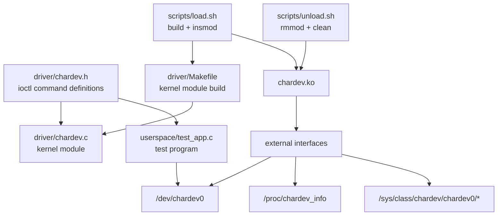
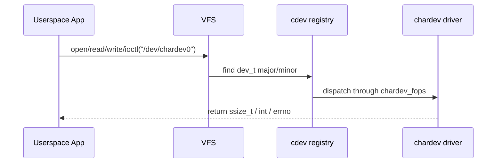
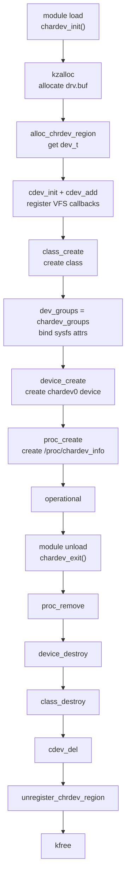
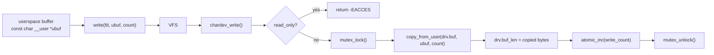
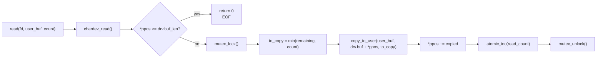
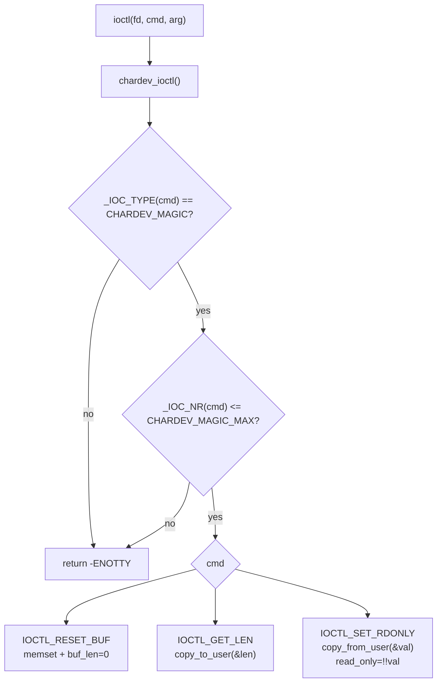
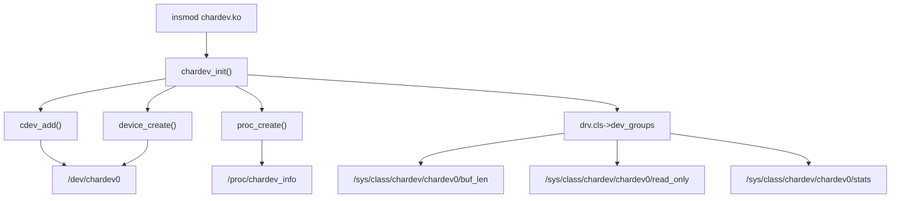
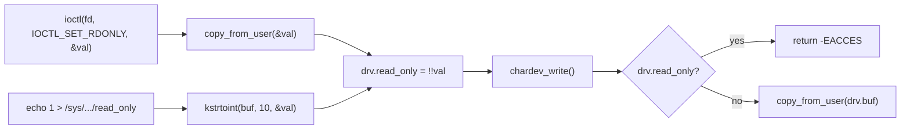
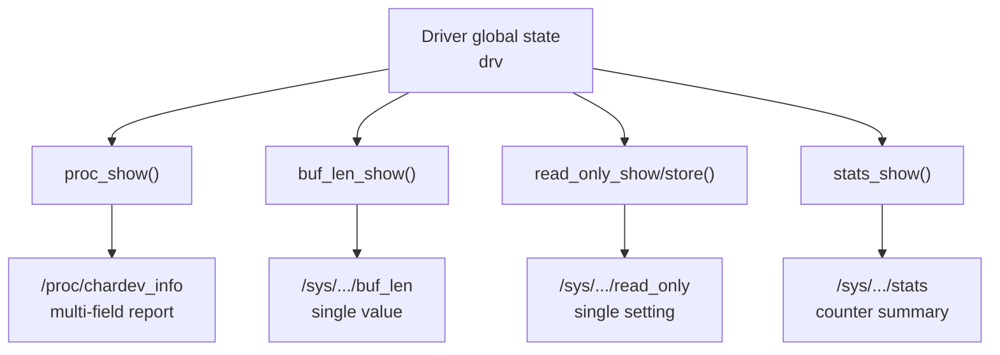

# Character Device Driver API 技術分析報告

本報告整理 `chardev-driver` 目前使用的 Linux kernel API、callback chain、資源生命週期與常見錯誤。閱讀順序建議是：先看整體圖，再看每個 API 的角色，最後看 BUG 分析與選擇依據。

本文使用兩種標示：

- `Direct Observation`：目前程式碼或腳本可以直接驗證。
- `Conservative Inference`：根據 Linux driver model 與目前呼叫關係做出的保守推論。

---

## 第一階段：Codebase Trace

### 1. Project Structure

#### Direct Observation

| 類別 | 檔案 | 角色 |
|---|---|---|
| Kernel source | `driver/chardev.c` | kernel module 主體，實作 char device、VFS callbacks、ioctl、procfs、sysfs、init/exit、error unwind。 |
| Shared header | `driver/chardev.h` | 定義 ioctl magic number 與 command macro，driver 與 userspace 測試程式共用。 |
| Kernel Makefile | `driver/Makefile` | 使用 kernel build system 建置 out-of-tree module。 |
| Userspace source | `userspace/test_app.c` | 使用 `/dev/chardev0` 測試 `open()`、`write()`、`lseek()`、`read()`、`ioctl()`、`close()`。 |
| Userspace Makefile | `userspace/Makefile` | 使用 `gcc -Wall -Wextra -I../driver` 編譯 `test_app.c`。 |
| Load script | `scripts/load.sh` | 建置 driver、載入 `chardev.ko`、檢查 `/dev/chardev0`、顯示 module info 與 dmesg。 |
| Unload script | `scripts/unload.sh` | 卸載 module、檢查 `/dev` 與 `/proc` 是否清除、執行 clean。 |
| Documents | `README_char.md`、`report_char.md` | 操作教學與整體技術報告。 |

#### Component Relationship



---

### 2. Runtime Interface Map

#### Direct Observation

| 對外介面 | 觸發方式 | Kernel dispatch | Driver callback | 主要狀態 |
|---|---|---|---|---|
| `/dev/chardev0` | `open()` | VFS + `file_operations.open` | `chardev_open()` | `open_count` |
| `/dev/chardev0` | `read()` / `cat` | VFS + `file_operations.read` | `chardev_read()` | `drv.buf`、`drv.buf_len`、`read_count` |
| `/dev/chardev0` | `write()` / shell redirection | VFS + `file_operations.write` | `chardev_write()` | `drv.buf`、`drv.buf_len`、`read_only`、`write_count` |
| `/dev/chardev0` | `ioctl()` | VFS + `file_operations.unlocked_ioctl` | `chardev_ioctl()` | `drv.buf_len`、`read_only` |
| `/proc/chardev_info` | `cat` | procfs + `proc_ops` + `seq_file` | `proc_show()` | 狀態快照 |
| `/sys/.../buf_len` | `cat` | sysfs attribute show | `buf_len_show()` | `drv.buf_len` |
| `/sys/.../read_only` | `cat` / `echo` | sysfs attribute show/store | `read_only_show()` / `read_only_store()` | `drv.read_only` |
| `/sys/.../stats` | `cat` | sysfs attribute show | `stats_show()` | atomic counters |

---

### 3. Callback Chain

#### VFS / Character Device



`chardev_fops` 是核心的轉接表：

```c
static const struct file_operations chardev_fops = {
    .owner = THIS_MODULE,
    .open = chardev_open,
    .release = chardev_release,
    .read = chardev_read,
    .write = chardev_write,
    .unlocked_ioctl = chardev_ioctl,
};
```

重點：

- `.owner = THIS_MODULE` 可讓核心知道 callback 屬於本 module。
- `.read`、`.write` 使用 `ssize_t` 回傳成功處理的 bytes，錯誤時回傳負 errno。
- `.unlocked_ioctl` 是新版常用 ioctl callback，呼叫時不再由 VFS 幫 driver 上 Big Kernel Lock。

#### procfs

```text
cat /proc/chardev_info
  -> procfs open
  -> chardev_proc_ops.proc_open
  -> proc_open()
  -> single_open(file, proc_show, NULL)
  -> seq_read()
  -> proc_show()
  -> single_release()
```

#### sysfs

```text
cat /sys/class/chardev/chardev0/buf_len
  -> sysfs
  -> dev_attr_buf_len.show
  -> buf_len_show()

echo 1 > /sys/class/chardev/chardev0/read_only
  -> sysfs
  -> dev_attr_read_only.store
  -> read_only_store()
```

---

### 4. Resource Lifecycle

#### Direct Observation



#### Ownership Table

| Resource | 建立 API | 保存位置 | 釋放 API | 為什麼要釋放 |
|---|---|---|---|---|
| Kernel buffer | `kzalloc()` | `drv.buf` | `kfree()` | 避免 kernel memory leak。 |
| Device number | `alloc_chrdev_region()` | `drv.devno` | `unregister_chrdev_region()` | 歸還 major/minor range。 |
| cdev registration | `cdev_add()` | `drv.cdev` | `cdev_del()` | 解除 VFS 到 driver callback 的連結。 |
| Class | `class_create()` | `drv.cls` | `class_destroy()` | 移除 `/sys/class/chardev`。 |
| Device | `device_create()` | `drv.dev` | `device_destroy()` | 移除 device object 與對應節點。 |
| proc entry | `proc_create()` | `drv.proc_entry` | `proc_remove()` | 移除 `/proc/chardev_info`。 |

---

### 5. Data Flow

#### write path



#### read path



#### ioctl path



---

## 第二階段：API Technical Report

### 1. Module Entry API

#### `module_init()` / `module_exit()`

| API | 類型 | 功能 | 本專案使用方式 |
|---|---|---|---|
| `module_init(fn)` | Macro | 指定 module 載入入口 | `module_init(chardev_init)` |
| `module_exit(fn)` | Macro | 指定 module 卸載入口 | `module_exit(chardev_exit)` |

教學重點：

- `insmod` 成功載入 `.ko` 時，核心呼叫 `chardev_init()`。
- `rmmod` 卸載 module 時，核心呼叫 `chardev_exit()`。
- init 成功後建立的資源，exit 必須對應釋放。

相近概念比較：

| 機制 | 英文 | 差異 |
|---|---|---|
| `module_init()` | Module Entry | 給可載入模組使用，透過 `insmod` 觸發。 |
| `module_exit()` | Module Exit | 給可卸載模組使用，透過 `rmmod` 觸發。 |
| `subsys_initcall()` 等 initcall | Built-in Initcall | 常用於編進 kernel image 的子系統初始化，不是本專案情境。 |

選擇依據：

- 本專案是 out-of-tree kernel module，因此使用 `module_init()` / `module_exit()` 最直接。

---

### 2. Memory Allocation API

#### `kzalloc()` vs `kmalloc()` vs `vmalloc()` vs `devm_kzalloc()`

| API | 英文 | 特性 | 適合情境 | 本專案選擇 |
|---|---|---|---|---|
| `kzalloc(size, GFP_KERNEL)` | Zeroed Kernel Allocation | 配置連續實體頁對應的 kernel memory，內容清零 | 小型結構或 buffer，需初始為 0 | 使用 |
| `kmalloc(size, GFP_KERNEL)` | Kernel Allocation | 配置後不保證清零 | 需要自行初始化，追求少一點清零成本 | 未使用 |
| `vmalloc(size)` | Virtual Allocation | 虛擬位址連續，實體頁不一定連續 | 大型 buffer | 未使用 |
| `devm_kzalloc(dev, size, GFP_KERNEL)` | Device-managed Allocation | device 生命週期自動釋放 | platform driver / device driver probe | 未使用 |

本專案選 `kzalloc()` 的原因：

- `BUF_SIZE` 是 4096 bytes，屬於小型 buffer。
- 初始化後 buffer 應該是乾淨狀態。
- 本專案沒有 platform device 的 `struct device *` probe 生命週期，不適合示範 `devm_kzalloc()`。

關鍵字：

- `GFP_KERNEL`：一般 process context 可用的配置旗標，配置時可以睡眠。
- Kernel Buffer：核心空間中的資料緩衝區，不能直接交給 user space 指標使用。

---

### 3. Character Device Registration API

#### `alloc_chrdev_region()`

用途：

```c
ret = alloc_chrdev_region(&drv.devno, 0, 1, DRIVER_NAME);
```

意義：

- 動態分配一組 `dev_t`。
- `dev_t` 內含 major number 與 minor number。
- `0, 1` 表示從 minor 0 開始，分配 1 個裝置。

比較：

| API | 英文 | 特性 | 適合情境 |
|---|---|---|---|
| `alloc_chrdev_region()` | Allocate Character Device Region | 由 kernel 動態分配 major | 教學、一般 driver，避免手動衝突 |
| `register_chrdev_region()` | Register Fixed Device Region | 使用指定 major/minor | 已有固定 major 的 driver |
| `register_chrdev()` | Legacy Character Device Register | 較舊式介面，抽象較少彈性 | 舊程式或簡單範例 |

選擇依據：

- 本專案不需要固定 major number。
- 動態配置可降低與既有 driver 衝突的機率。

#### `cdev_init()` / `cdev_add()`

```c
cdev_init(&drv.cdev, &chardev_fops);
drv.cdev.owner = THIS_MODULE;
ret = cdev_add(&drv.cdev, drv.devno, 1);
```

角色：

- `cdev_init()`：把 `struct cdev` 和 `struct file_operations` 綁在一起。
- `cdev_add()`：把這個字元裝置加入 kernel registry。

比較：

| 寫法 | 英文 | 優點 | 限制 |
|---|---|---|---|
| `cdev_init()` + `cdev_add()` | Explicit cdev Registration | 清楚控制 dev_t、cdev、class、device | 程式碼較長 |
| `misc_register()` | Misc Device | 快速建立 misc device，自動使用 misc major | 不適合教學 major/minor 與完整 cdev 流程 |

選擇依據：

- 本專案目標是理解 character device 的完整流程，所以使用 `cdev`。

---

### 4. Device Model API

#### `class_create()` / `device_create()`

```c
drv.cls = class_create(...);
drv.cls->dev_groups = chardev_groups;
drv.dev = device_create(drv.cls, NULL, drv.devno, NULL, "chardev0");
```

作用：

- `class_create()` 建立 `/sys/class/chardev`。
- `dev_groups` 讓同一 class 底下的 device 自動帶有 sysfs attributes。
- `device_create()` 建立 `/sys/class/chardev/chardev0`。
- udev 收到 kernel uevent 後，通常會建立 `/dev/chardev0`。

與手動 `mknod` 比較：

| 方法 | 英文 | 優點 | 缺點 |
|---|---|---|---|
| `device_create()` + udev | Device Model / udev | 自動化，符合現代 Linux device model | 需要 udev 正常運作 |
| `mknod /dev/chardev0 c major minor` | Manual Device Node | 不依賴 udev | 容易忘記 major/minor，部署較不方便 |

選擇依據：

- 本專案希望載入 module 後可直接看到 `/dev/chardev0`，所以使用 device model。

#### `class_create()` 版本差異

開發 driver 常遇到 kernel API 版本差異。`class_create()` 就是一個例子：

```c
#if LINUX_VERSION_CODE >= KERNEL_VERSION(6, 4, 0)
  drv.cls = class_create(CLASS_NAME);
#else
  drv.cls = class_create(THIS_MODULE, CLASS_NAME);
#endif
```

分析：

- 舊 kernel 需要傳入 module owner。
- 新 kernel 移除這個參數。
- 用版本判斷可以讓同一份程式碼較容易跨 kernel 編譯。

---

### 5. VFS File Operation API

#### `open()` / `release()`

`chardev_open()` 目前只增加 `open_count`：

```text
open("/dev/chardev0")
  -> VFS
  -> chardev_open()
  -> atomic_inc(open_count)
```

`release()` 目前只印 log，沒有 per-open state 要清理。

關鍵字：

- File Descriptor：使用者空間拿到的整數 fd。
- `struct file`：kernel 內部代表一次 open 的檔案物件。
- `filp->private_data`：常用來保存每次 open 的私有狀態，本專案沒有使用。

#### `read()` / `write()`

| callback | 資料方向 | User pointer | Kernel API |
|---|---|---|---|
| `chardev_write()` | User -> Kernel | `const char __user *ubuf` | `copy_from_user()` |
| `chardev_read()` | Kernel -> User | `char __user *ubuf` | `copy_to_user()` |

`__user` 是給 sparse 等靜態檢查工具看的註記，提醒這個指標來自 user space。

#### `copy_to_user()` vs `copy_from_user()` vs `memcpy()`

| API | 英文 | 來源 | 目的 | 能否直接用於 user pointer |
|---|---|---|---|---|
| `copy_from_user()` | Copy From User | User Space | Kernel Space | 可以 |
| `copy_to_user()` | Copy To User | Kernel Space | User Space | 可以 |
| `memcpy()` | Memory Copy | 一般記憶體 | 一般記憶體 | 不可直接拿來複製 user pointer |

選擇依據：

- user pointer 可能無效，也可能觸發 page fault。
- `copy_*_user()` 會處理 user/kernel 邊界檢查與錯誤回報。
- 在 kernel 中直接 `memcpy()` user pointer 可能造成錯誤甚至系統不穩。

---

### 6. ioctl API

#### Command macro

`driver/chardev.h` 定義：

```c
#define CHARDEV_MAGIC 'k'
#define IOCTL_RESET_BUF _IO(CHARDEV_MAGIC, 0)
#define IOCTL_GET_LEN _IOR(CHARDEV_MAGIC, 1, int)
#define IOCTL_SET_RDONLY _IOW(CHARDEV_MAGIC, 2, int)
```

| Macro | 英文 | 資料方向 | 本專案用途 |
|---|---|---|---|
| `_IO` | I/O command without data | 無 | 清空 buffer。 |
| `_IOR` | I/O read | Kernel -> User | 取得 `buf_len`。 |
| `_IOW` | I/O write | User -> Kernel | 設定 `read_only`。 |
| `_IOWR` | I/O read/write | 雙向 | 本專案未使用。 |

#### Command validation

```c
if (_IOC_TYPE(cmd) != CHARDEV_MAGIC) return -ENOTTY;
if (_IOC_NR(cmd) > CHARDEV_MAGIC_MAX) return -ENOTTY;
```

用途：

- `_IOC_TYPE(cmd)` 檢查 magic number。
- `_IOC_NR(cmd)` 檢查 command number。
- `-ENOTTY` 表示此 ioctl 不適用於這個裝置。

#### ioctl 與 read/write/sysfs 的比較

| 介面 | 適合資料 | 使用方式 | 本專案例子 |
|---|---|---|---|
| `read()` / `write()` | 連續資料流 | 檔案 I/O | 傳入或讀出 buffer 內容 |
| `ioctl()` | 控制命令 | C 程式呼叫，需 header | reset、get length、set read-only |
| sysfs | 裝置屬性 | `cat` / `echo` | `read_only`、`buf_len`、`stats` |
| procfs | 診斷資訊 | `cat` | `/proc/chardev_info` 狀態輸出 |

選擇依據：

- 如果是資料內容，使用 `read()` / `write()`。
- 如果是明確控制命令，使用 `ioctl()`。
- 如果是單一裝置屬性，使用 sysfs。
- 如果是整份診斷報告，使用 procfs。

---

### 7. procfs API

#### `proc_create()` / `single_open()` / `seq_file`

建立：

```c
drv.proc_entry = proc_create(PROC_ENTRY_NAME, 0444, NULL, &chardev_proc_ops);
```

讀取流程：

```text
cat /proc/chardev_info
  -> proc_open()
  -> single_open(file, proc_show, NULL)
  -> seq_read()
  -> proc_show()
```

`seq_file` 的用途：

- 管理輸出 buffer。
- 避免自己處理多次 read 時的分段輸出細節。
- `seq_printf()` 比手動維護 offset 容易讀。

相近 API 比較：

| API | 英文 | 適合情境 |
|---|---|---|
| `single_open()` | Single seq_file Open | 輸出一次性狀態，本專案使用。 |
| `seq_open()` | Sequence Open | 輸出列表或需要 iterator 的內容。 |
| `simple_read_from_buffer()` | Simple Buffer Read | 已經有一段固定字串 buffer，可簡單輸出。 |

選擇依據：

- `/proc/chardev_info` 是動態產生的一次性狀態報告，因此 `single_open()` 很適合。

---

### 8. sysfs API

#### `DEVICE_ATTR_RO()` / `DEVICE_ATTR_RW()`

```c
static DEVICE_ATTR_RO(buf_len);
static DEVICE_ATTR_RW(read_only);
static DEVICE_ATTR_RO(stats);
```

巨集會依命名規則尋找 callback：

| Macro | 需要的 callback | 權限 |
|---|---|---|
| `DEVICE_ATTR_RO(name)` | `name_show()` | Read-only |
| `DEVICE_ATTR_RW(name)` | `name_show()`、`name_store()` | Read / Write |
| `DEVICE_ATTR_WO(name)` | `name_store()` | Write-only |

本專案屬性：

| Attribute | show/store | 說明 |
|---|---|---|
| `buf_len` | `buf_len_show()` | 回傳目前 buffer 長度。 |
| `read_only` | `read_only_show()` / `read_only_store()` | 讀取或設定唯讀模式。 |
| `stats` | `stats_show()` | 回傳 open/read/write 計數。 |

#### `sysfs_emit()` vs `sprintf()`

| API | 英文 | 適合情境 | 原因 |
|---|---|---|---|
| `sysfs_emit()` | sysfs formatted output | sysfs show callback | 專為 sysfs buffer 設計，較安全。 |
| `sprintf()` | formatted string output | 一般字串格式化 | 不知道 sysfs buffer 限制，不建議用於 sysfs show。 |
| `scnprintf()` | size-limited formatted output | 需要自行管理 buffer 長度 | 可控但較麻煩。 |

選擇依據：

- sysfs show callback 應優先使用 `sysfs_emit()`。

#### `kstrtoint()` vs `sscanf()`

`read_only_store()` 使用：

```c
if (kstrtoint(buf, 10, &val)) return -EINVAL;
```

比較：

| API | 英文 | 優點 | 注意事項 |
|---|---|---|---|
| `kstrtoint()` | Kernel String To Integer | kernel 常用轉換 API，錯誤回傳明確 | 適合 sysfs store。 |
| `sscanf()` | String Scan Format | 彈性高 | 格式錯誤判斷較容易寫得不精確。 |
| `simple_strtol()` | Simple String To Long | 舊式 API | 新程式較不建議。 |

選擇依據：

- sysfs 輸入是文字，`kstrtoint()` 讓錯誤處理簡單清楚。

---

### 9. Synchronization API

#### `mutex`

本專案用 `struct mutex lock` 保護：

- `chardev_read()` 中的 buffer copy 與 file position 更新。
- `chardev_write()` 中的 buffer copy 與 `buf_len` 更新。
- `IOCTL_RESET_BUF` 中的 buffer 清空。

選擇 mutex 的原因：

- `copy_to_user()` / `copy_from_user()` 可能睡眠。
- mutex 允許睡眠。
- spinlock 不允許在持鎖期間睡眠。

#### `atomic_t`

本專案使用 `atomic_t` 計數：

- `open_count`
- `read_count`
- `write_count`

選擇 atomic 的原因：

- 單純整數遞增，不需要保護一整段複雜邏輯。
- 比為了計數而拿 mutex 更簡潔。

比較：

| 工具 | 英文 | 可否睡眠 | 適合 |
|---|---|---|---|
| `mutex` | Mutual Exclusion Lock | 可以 | user copy、較長臨界區。 |
| `spinlock_t` | Spin Lock | 不可以 | 中斷上下文或極短臨界區。 |
| `atomic_t` | Atomic Variable | 不適用 | 單一整數操作。 |

---

### 10. Error Handling API

#### `IS_ERR()` / `PTR_ERR()`

`class_create()` 與 `device_create()` 回傳 pointer，但失敗時可能回傳 encoded error pointer。這類 API 不能只用 `NULL` 判斷。

```c
drv.cls = class_create(...);
if (IS_ERR(drv.cls)) {
  ret = PTR_ERR(drv.cls);
  goto err_cdev;
}
```

比較：

| 判斷方式 | 適用情境 |
|---|---|
| `if (!ptr)` | API 明確說失敗回傳 `NULL`，例如部分 allocation API。 |
| `if (IS_ERR(ptr))` | API 失敗回傳 error pointer，例如 `class_create()`。 |
| `if (ret < 0)` | API 回傳整數錯誤碼，例如 `alloc_chrdev_region()`。 |

#### errno 回傳

| errno | 英文 | 本專案使用位置 | 意義 |
|---|---|---|---|
| `-ENOMEM` | Out of Memory | `kzalloc()` 或 `proc_create()` 失敗 | 記憶體或資源不足。 |
| `-EACCES` | Permission Denied | read-only 模式下寫入 | driver 主動拒絕寫入。 |
| `-EFAULT` | Bad Address | user copy 失敗 | user pointer 無效或無法完整複製。 |
| `-EINVAL` | Invalid Argument | sysfs 輸入無法轉整數 | 輸入格式錯誤。 |
| `-ENOTTY` | Inappropriate ioctl | ioctl command 不屬於本 driver | ioctl command 不支援。 |

---

## 第三階段：重點功能圖示

### 1. 模組載入後建立三種外部介面



### 2. `read_only` 同時可由 ioctl 與 sysfs 控制



重點：

- ioctl 與 sysfs 是兩個入口，但最後都改同一個 `drv.read_only`。
- 所以除錯時要同時考慮兩邊是否曾經改過狀態。

### 3. procfs 與 sysfs 的角色差異



---

## 第四階段：BUG 分析與解法

### BUG 1：Kernel headers / build directory 不存在

#### 現象

```text
make[1]: *** /lib/modules/6.6.87.2-microsoft-standard-WSL2/build: No such file or directory. Stop.
```

#### 發生原因

kernel module 是針對目前執行中的 kernel 建置。`driver/Makefile` 會找：

```text
/lib/modules/$(uname -r)/build
```

如果這個目錄不存在，代表系統沒有目前 kernel 的 build tree 或 headers。

#### 解法

一般 Ubuntu：

```bash
sudo apt install linux-headers-$(uname -r)
```

WSL：

- Microsoft WSL kernel 常見沒有現成 headers。
- 可改用一般 VM、安裝可對應 headers 的 kernel，或自行準備 WSL kernel source/build tree。

#### 分析重點

這不是 `chardev.c` 寫錯，而是建置環境沒有 kernel build system。除錯時要先分清楚「編譯環境問題」和「程式碼語法問題」。

---

### BUG 2：`Makefile` 使用 `$(PWD)` 導致 `M=` 指錯目錄

#### 現象

從專案根目錄執行：

```bash
make -C driver
```

可能看到 kernel build command 的 `M=` 指到專案根目錄，而不是 `driver` 目錄。

#### 發生原因

`PWD` 常來自 shell 環境變數。`make -C driver` 會切換 Make 的工作目錄，但 `PWD` 不一定同步更新。

#### 解法

改用 GNU Make 的 `$(CURDIR)`：

```make
$(MAKE) -C $(KDIR) M=$(CURDIR) modules
```

#### 分析重點

外部 kernel module build 很依賴 `M=`。`M=` 指向哪裡，kernel build system 就去哪裡找 module source 與 `Makefile`。

---

### BUG 3：`class_create()` 在不同 kernel 版本編譯失敗

#### 現象

可能出現：

```text
too many arguments to function 'class_create'
```

或：

```text
too few arguments to function 'class_create'
```

#### 發生原因

Linux kernel API 會隨版本調整。`class_create()` 曾經需要 `THIS_MODULE` 參數，較新的 kernel 則移除此參數。

#### 解法

用 `LINUX_VERSION_CODE` 判斷：

```c
#if LINUX_VERSION_CODE >= KERNEL_VERSION(6, 4, 0)
  drv.cls = class_create(CLASS_NAME);
#else
  drv.cls = class_create(THIS_MODULE, CLASS_NAME);
#endif
```

#### 分析重點

driver 開發不能只記 API 名稱，也要注意 kernel version。文件和註解應該說明為什麼有條件編譯，否則下一位維護者可能誤刪。

---

### BUG 4：`write()` 後直接 `read()` 讀不到資料

#### 現象

使用同一個 fd：

```c
write(fd, "abc", 3);
read(fd, buf, sizeof(buf));
```

可能讀到 `0` bytes。

#### 發生原因

`write()` 後 file position 在資料尾端。`read()` 會從目前 position 開始讀，若已在尾端就得到 EOF。

#### 解法

```c
lseek(fd, 0, SEEK_SET);
read(fd, buf, sizeof(buf));
```

#### 分析重點

這是 VFS file position 的語意，不是 buffer 沒寫進去。測試 driver 時要確認 fd position。

---

### BUG 5：`Permission denied` 可能不是檔案權限問題

#### 現象

```bash
echo "abc" > /dev/chardev0
bash: /dev/chardev0: Permission denied
```

#### 發生原因

可能原因：

1. `/dev/chardev0` 權限不足。
2. `read_only` 被設為 `1`，driver 回傳 `-EACCES`。

#### 解法

```bash
ls -l /dev/chardev0
cat /sys/class/chardev/chardev0/read_only
echo 0 | sudo tee /sys/class/chardev/chardev0/read_only
```

#### 分析重點

Shell 只顯示系統呼叫失敗後的 errno 文字，不會主動說明 errno 是由 VFS 權限檢查產生，還是由 driver callback 回傳。

---

### BUG 6：狀態快照可能不完全一致

#### 現象

同時執行大量 `write()` 與：

```bash
cat /proc/chardev_info
cat /sys/class/chardev/chardev0/buf_len
```

可能看到某些欄位來自不同時間點。

#### 發生原因

目前 buffer read/write/reset path 有 mutex，但 procfs/sysfs/ioctl 的部分觀察路徑沒有全部使用同一把 lock。

#### 解法方向

如果要強化一致性，可考慮：

- `proc_show()` 讀取 `buf_len` 與 `buf` 時也取得 `drv.lock`。
- `IOCTL_GET_LEN` 與 `buf_len_show()` 讀 `buf_len` 時取得一致的鎖。
- `read_only` 若只需要簡單旗標，可考慮使用 atomic 或用同一把 mutex 保護。

#### 分析重點

教學 driver 可以接受較簡潔的同步策略；實務 driver 要根據資料一致性需求決定鎖的範圍。

---

## 第五階段：API 選擇總表

| 需求 | 本專案選用 | 可替代 API | 選擇原因 |
|---|---|---|---|
| 建立可載入模組 | `module_init()` / `module_exit()` | initcall | out-of-tree module 最直接。 |
| 配置小型 kernel buffer | `kzalloc()` | `kmalloc()`、`vmalloc()` | buffer 小，且需要清零。 |
| 取得 major/minor | `alloc_chrdev_region()` | `register_chrdev_region()` | 不需要固定 major，動態配置較安全。 |
| 註冊字元裝置 | `cdev_init()` / `cdev_add()` | `misc_register()` | 可完整示範 char device 流程。 |
| 建立 `/dev` 節點 | `class_create()` / `device_create()` | `mknod` | 交給 device model 與 udev 管理。 |
| 使用者資料複製 | `copy_from_user()` / `copy_to_user()` | `memcpy()` | user pointer 需要安全檢查。 |
| 控制命令 | `ioctl()` | sysfs、write command string | ioctl 適合 C 程式的結構化控制命令。 |
| 狀態報告 | procfs + `seq_file` | debugfs、sysfs 多檔案 | procfs 適合一次輸出多欄位診斷資訊。 |
| 裝置屬性 | sysfs + `DEVICE_ATTR_*` | procfs write、ioctl | sysfs 適合單一屬性讀寫。 |
| buffer 同步 | `mutex` | `spinlock_t` | user copy 可能睡眠，不能用 spinlock。 |
| 計數器 | `atomic_t` | mutex-protected int | 單純遞增用 atomic 較清楚。 |

---

## 第六階段：實際範例

### 1. 檢查 driver 是否載入

```bash
lsmod | grep chardev
dmesg | grep chardev | tail
```

### 2. 寫入與讀取 buffer

```bash
echo "hello api" > /dev/chardev0
cat /dev/chardev0
```

對應 callback：

```text
echo -> write() -> chardev_write()
cat  -> read()  -> chardev_read()
```

### 3. 取得狀態

```bash
cat /proc/chardev_info
cat /sys/class/chardev/chardev0/buf_len
cat /sys/class/chardev/chardev0/stats
```

對應 callback：

```text
/proc/chardev_info -> proc_show()
/sys/.../buf_len   -> buf_len_show()
/sys/.../stats     -> stats_show()
```

### 4. 控制唯讀模式

sysfs：

```bash
echo 1 | sudo tee /sys/class/chardev/chardev0/read_only
echo 0 | sudo tee /sys/class/chardev/chardev0/read_only
```

ioctl：

```c
int rdonly = 1;
ioctl(fd, IOCTL_SET_RDONLY, &rdonly);
```

選擇方式：

- Shell 或人工測試：sysfs 較方便。
- C 程式內部控制：ioctl 較直接。

---

## 結論

`chardev-driver` 的 API 設計可以分成三層理解：

1. **註冊層 (Registration Layer)**：`alloc_chrdev_region()`、`cdev_add()`、`class_create()`、`device_create()`、`proc_create()` 讓 driver 對外可見。
2. **執行層 (Runtime Layer)**：VFS、procfs、sysfs 透過 callback table 間接呼叫 driver 函式。
3. **資料層 (Data Layer)**：`drv.buf`、`drv.buf_len`、`drv.read_only`、atomic counters 保存狀態，並用 `copy_*_user()`、mutex、atomic 保護基本操作。

這份專案的價值在於它把字元裝置常見的幾個介面放在同一個可測試範例中。讀懂這份程式後，再往 blocking I/O、poll/epoll、multi-minor、interrupt handling、DMA 或 platform driver 前進，會比較容易掌握 Linux driver 的基本脈絡。
