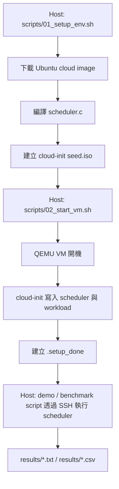

# CPU Scheduling Simulator：QEMU 可重現排程實驗環境

[](https://ubuntu.com)
[](https://www.qemu.org/)
[](LICENSE)

這個專案用 C 語言實作 CPU 排程演算法，並用 QEMU 建立一個可以重複執行的 Ubuntu 24.04 虛擬機器環境。目標不是修改 Linux kernel 內部排程器，而是用離散事件模擬（Discrete Event Simulation）的方式，把幾個典型排程策略的差異看清楚。

目前支援的排程策略：

- FCFS（First-Come First-Served，先到先服務）
- SJF（Shortest Job First，最短工作優先，非搶佔式）
- SRTF（Shortest Remaining Time First，最短剩餘時間優先，搶佔式）
- Priority Scheduling（優先權排程，非搶佔式）
- RR（Round Robin，循環排程，可調整 Time Quantum）

---

## 專案重點

1. **用 C 寫排程核心**
   `src/scheduler.c` 讀取 workload，依演算法計算每個行程（Process）的開始時間、完成時間、等待時間與回應時間。

2. **用 QEMU 固定執行環境**
   Host 端用腳本建立 Ubuntu 24.04 cloud image，讓 demo 與 benchmark 可以在相同 VM 條件下重跑。

3. **用 Cloud-init 自動佈署**
   `scripts/01_setup_env.sh` 會把 scheduler binary、source code、workload 放進 cloud-init seed ISO，VM 開機後即可執行。

4. **輸出可讀與可解析結果**
   程式同時輸出表格、Gantt Chart，以及 `BENCHMARK` 機器可讀列，方便 shell script 產生 CSV 與文字報告。

---

## 專案結構

```text
cpu-scheduling-qemu/
├── src/
│   ├── scheduler.c          # 排程模擬器主程式
│   ├── workload_demo.txt    # 6 個行程的展示用 workload
│   └── workload_bench.txt   # 12 個行程的 benchmark workload
├── scripts/
│   ├── 01_setup_env.sh      # 下載映像檔、建立 VM disk、產生 cloud-init seed
│   ├── 02_start_vm.sh       # 啟動 QEMU VM，等待 SSH 與 cloud-init 完成
│   ├── 03_demo.sh           # 在 VM 內執行 demo workload
│   ├── 04_benchmark.sh      # 在 VM 內執行 benchmark，產生 CSV/report
│   └── 05_cleanup.sh        # 關閉 VM，清除 VM 產物
├── results/
│   ├── demo_output.txt
│   ├── benchmark.csv
│   └── benchmark_report.txt
├── docs/                    # Demo 圖片素材
├── Makefile                 # 常用指令入口
├── README_schedule.md       # 使用說明
├── report_schedule.md       # 專題技術報告
└── report_schedule_api.md   # API 與程式流程分析
```

---

## 環境需求

建議 Host 使用 Ubuntu 24.04 或 WSL2 + Ubuntu 22.04/24.04。需要的套件如下：

```bash
sudo apt update
sudo apt install -y qemu-system-x86 qemu-utils cloud-image-utils \
                    libguestfs-tools gcc wget sshpass bc
```

如果 Host 有 `/dev/kvm` 權限，QEMU 會使用 KVM 加速（Kernel-based Virtual Machine）。如果沒有，腳本會改用 TCG（Tiny Code Generator）模擬執行，但開機會比較慢。

---

## 快速開始

### 1. 設定腳本執行權限

```bash
chmod +x scripts/*.sh
```

### 2. 建立 QEMU 環境

```bash
bash scripts/01_setup_env.sh
```

這一步會：

- 檢查 Host 端必要工具
- 下載 Ubuntu 24.04 cloud image
- 建立 `vm/ubuntu2404.qcow2`
- 編譯 `src/scheduler.c`
- 產生 `vm/seed.iso`

### 3. 啟動 VM

```bash
bash scripts/02_start_vm.sh
```

腳本會等待兩件事：

- SSH 可以連線
- VM 內 `/home/scheduler/.setup_done` 出現，表示 cloud-init 已完成佈署

手動登入方式：

```bash
ssh -p 2222 scheduler@localhost
```

預設密碼：

```text
scheduler123
```

這組帳密只用於本機 demo，不適合用在公開網路或正式環境。

### 4. 執行 Demo

```bash
bash scripts/03_demo.sh
```

輸出會同時顯示在終端機，並寫入：

```text
results/demo_output.txt
```

### 5. 執行 Benchmark

```bash
bash scripts/04_benchmark.sh
```

輸出檔案：

```text
results/benchmark.csv
results/benchmark_report.txt
```

### 6. 清理 VM

```bash
bash scripts/05_cleanup.sh
```

完整清理，包含刪掉約 600 MB 的 base image：

```bash
bash scripts/05_cleanup.sh --full
```

---

## Makefile 常用指令

```bash
make build       # 在 Host 編譯 scheduler.c
make demo-host   # 不啟動 QEMU，直接在 Host 執行 demo workload
make setup       # 執行 scripts/01_setup_env.sh
make start       # 執行 scripts/02_start_vm.sh
make demo        # 執行 scripts/03_demo.sh
make bench       # 執行 scripts/04_benchmark.sh
make clean       # 執行 scripts/05_cleanup.sh
make clean-full  # 執行 scripts/05_cleanup.sh --full
make all         # setup -> start -> demo -> bench
```

如果只是想看排程器本身是否正確，可以先跑：

```bash
make demo-host
```

這個指令不需要 QEMU，除錯速度比較快。

---

## Workload 格式

每份 workload 的第一行是行程數量，後面每行代表一個行程：

```text
<process_count>
<pid> <arrival_time> <burst_time> <priority>
```

欄位說明：

| 欄位 | 英文 | 說明 |
| --- | --- | --- |
| `pid` | Process ID | 行程編號，只用來辨識輸出結果 |
| `arrival_time` | Arrival Time | 行程進入 ready queue 的時間 |
| `burst_time` | CPU Burst Time | 行程需要使用 CPU 的總時間 |
| `priority` | Priority | 優先權數字；本專案設定數字越小，優先權越高 |

範例：

```text
6
1 0 8 3
2 1 4 1
3 2 9 4
4 3 5 2
5 4 2 5
6 5 1 3
```

這代表：

- P1 在時間 0 到達，需要 8 個時間單位，優先權 3。
- P2 在時間 1 到達，需要 4 個時間單位，優先權 1。
- Priority Scheduling 中，P2 的優先權高於 P1，因為 1 小於 3。

---

## 執行流程圖



---

## 排程指標說明

| 指標 | 英文 | 公式 | 意義 |
| --- | --- | --- | --- |
| WT | Waiting Time | `Turnaround - Burst` | 行程在 ready queue 等待 CPU 的時間 |
| TAT | Turnaround Time | `Finish - Arrival` | 行程從到達到完成的總時間 |
| RT | Response Time | `Start - Arrival` | 行程第一次取得 CPU 前等待多久 |
| AWT | Average Waiting Time | `sum(WT) / n` | 所有行程平均等待時間 |
| ATT | Average Turnaround Time | `sum(TAT) / n` | 所有行程平均完成週期 |
| ART | Average Response Time | `sum(RT) / n` | 所有行程平均首次回應時間 |

範例：某行程在時間 2 到達，第一次在時間 5 執行，時間 11 完成，CPU burst 是 4。

```text
Response Time   = 5 - 2  = 3
Turnaround Time = 11 - 2 = 9
Waiting Time    = 9 - 4  = 5
```

---

## 演算法簡介

### FCFS：First-Come First-Served

依照 arrival time 排隊，先到的先執行。它容易理解，但如果第一個行程很長，後面短行程會一起被卡住，這種現象叫 convoy effect（車隊效應）。

### SJF：Shortest Job First

每次從已到達的行程中選 burst time 最短者執行。這通常能降低平均等待時間，但它是非搶佔式（Non-preemptive），一旦某個行程開始執行，就不會被新到達的短行程中斷。

### SRTF：Shortest Remaining Time First

SJF 的搶佔式版本。每個時間 tick 都重新檢查 ready queue，選 remaining time 最短的行程執行。它能讓短工作更快完成，但切換頻率也可能變高。

### Priority Scheduling

每次從已到達的行程中選 priority 數值最小者執行。本專案是非搶佔式 Priority Scheduling。若高優先權工作一直進來，低優先權工作可能長時間等不到 CPU，這叫 starvation（飢餓）。

### Round Robin

使用 ready queue 與 time quantum。每個行程最多執行一段 quantum，沒做完就排回隊尾。小 quantum 通常能讓 response time 變短，但真實系統中會增加 context switch overhead（上下文切換成本）。

---

## Benchmark 結果摘要

以 `src/workload_bench.txt` 的 12 個行程為例：

| Algorithm | AWT | ATT | ART |
| --- | ---: | ---: | ---: |
| FCFS | 21.8333 | 26.5833 | 21.8333 |
| SJF Non-Preemptive | 14.5833 | 19.3333 | 14.5833 |
| SRTF Preemptive | 13.3333 | 18.0833 | 11.4167 |
| Priority Non-Preemptive | 18.3333 | 23.0833 | 18.3333 |
| Round Robin Q=1 | 26.8333 | 31.5833 | 4.0833 |
| Round Robin Q=2 | 27.3333 | 32.0833 | 8.2500 |
| Round Robin Q=4 | 25.3333 | 30.0833 | 15.0833 |
| Round Robin Q=8 | 22.5000 | 27.2500 | 21.5833 |

在這組 workload 中：

- SRTF 的 AWT 與 ATT 最低，因為短工作可以搶佔長工作。
- Round Robin Q=1 的 ART 最低，因為行程很快能第一次拿到 CPU。
- RR 的 AWT/ATT 不一定漂亮，因為每個行程輪流取得 CPU，完成時間可能被拉長。

---

## 常見問題

### 1. `02_start_vm.sh` 一直等 SSH

可能原因：

- Host 沒有 KVM 權限，QEMU 使用 TCG，開機時間較長。
- VM 還在執行 cloud-init。
- SSH port 2222 被其他程式占用。

可以查看：

```bash
cat vm/qemu.log
cat vm/qemu-serial.log
```

### 2. `03_demo.sh` 顯示找不到 scheduler binary

代表 SSH 可能已經能連線，但 cloud-init 還沒把 scheduler 放好。`02_start_vm.sh` 已加入 `.setup_done` 檢查，正常情況下應該會等到檔案完成才結束。

### 3. Benchmark parser 為什麼看 `BENCHMARK` 這行？

表格是給人看的，格式可能會改；`BENCHMARK` 是給 script 解析的固定介面。這樣 `04_benchmark.sh` 不需要猜表格欄位位置。

### 4. 為什麼不直接改 Linux kernel scheduler？

這個專案聚焦在演算法行為與實驗流程。直接改 kernel scheduler 會牽涉 kernel build、boot、trace、debug，成本和風險高很多。先用 simulator 把排程概念與指標驗證清楚，再往 kernel trace 或 kernel module 延伸會比較穩。

---

## 可延伸方向

- 加入 aging（老化）機制，降低 Priority Scheduling 的 starvation。
- 加入 context switch overhead，讓 Round Robin 的 quantum 選擇更接近真實系統。
- 將 benchmark CSV 串到 Python 或 Grafana 做視覺化。
- 增加多核心排程（Multi-core Scheduling）與 load balancing。
- 用 `ftrace` 或 eBPF 觀察真實 Linux scheduler 事件，再和 simulator 結果比較。
