# CPU Scheduling QEMU 專案圖解

這份文件只照目前程式碼整理，不另外腦補不存在的功能。看法很簡單：外層 shell script 負責把環境弄好、把程式丟進 QEMU VM；內層 `src/scheduler.c` 負責讀 workload、跑排程演算法、印出結果。

建議閱讀順序是：

1. 先看「專案外殼」：`Makefile`、`scripts/`、QEMU、VM、`results/`。
2. 再看「scheduler 核心」：`main()`、`load_processes()`、`sched_*()`、`compute_stats()`。
3. 最後看「各演算法行為」：FCFS、SJF、SRTF、Priority、Round Robin。

---

## 1. 專案一眼看懂

### 圖 1-1：整體地圖

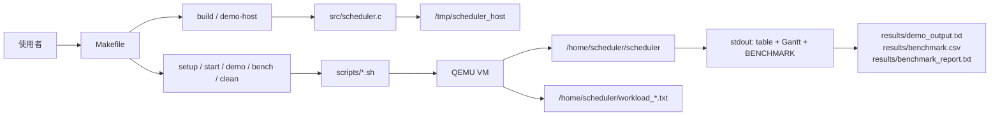

本專案是以 C 實作的 CPU scheduling simulator，並透過 QEMU 提供乾淨、可重現的 Linux VM 執行環境。

### 圖 1-2：資料、控制、訊號分層

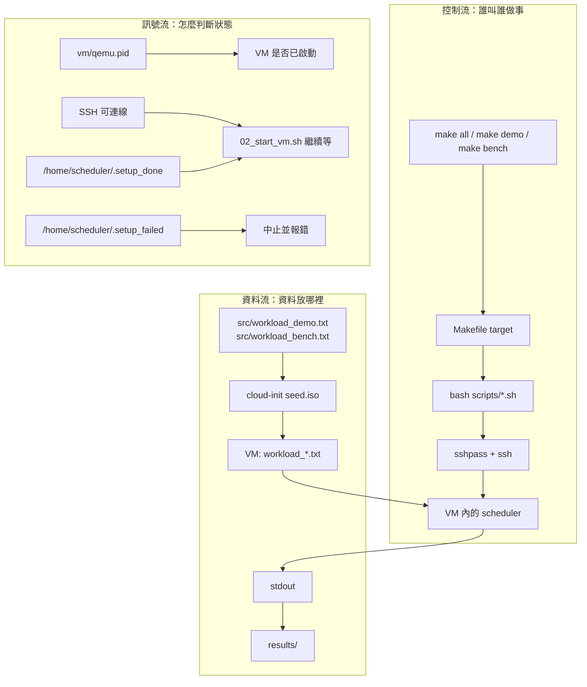

把這三種流分開看會比較清楚：

- 控制流：腳本怎麼一段一段叫下去。
- 資料流：source、binary、workload、result 放哪裡。
- 訊號流：VM 到底準備好了沒，不是用感覺猜，是看 SSH 和 `.setup_done`。

### 圖 1-3：目錄角色

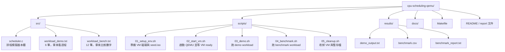

---

## 2. 從 make all 看完整執行順序

### 圖 2-1：`make all` 會串哪些步驟

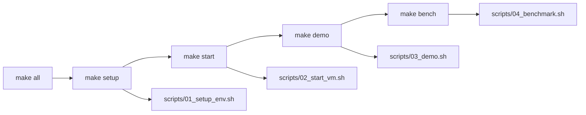

`make all` 沒有包含 `clean`。跑完 VM 會留著，結果留在 `results/`，等你自己決定什麼時候清掉。

### 圖 2-2：Makefile target 關係

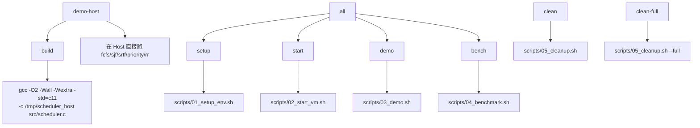

`demo-host` 很適合先確認 C 程式是否能跑，不需要等 QEMU。`demo` 和 `bench` 則是走 VM 路線。

### 圖 2-3：第一條路線

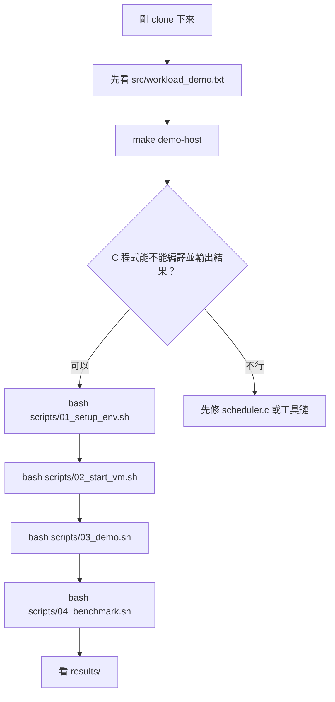

這條路線會把問題拆開：先排除 C 程式本身，再處理 QEMU。

---

## 3. QEMU 環境準備圖

### 圖 3-1：`01_setup_env.sh` 大流程

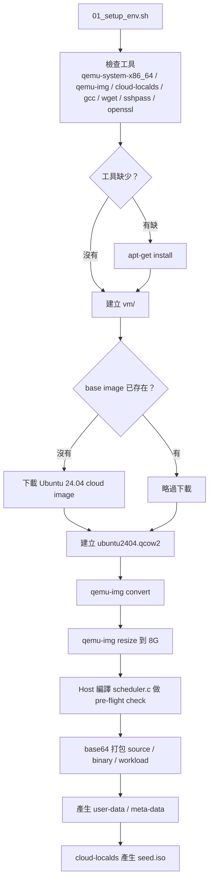

重點是 `01_setup_env.sh` 不是只下載 VM，它還會先在 Host 編譯一次 `scheduler.c`。這樣如果 C 程式壞掉，不會等到 VM 裡才發現。

### 圖 3-2：cloud-init seed 裡放什麼

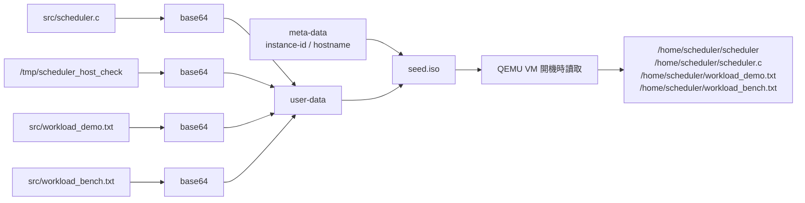

這裡用 base64 是為了把 binary、source、workload 都塞進 cloud-init 的 `user-data`，VM 第一次開機時再還原成檔案。

### 圖 3-3：VM 內部初始化狀態

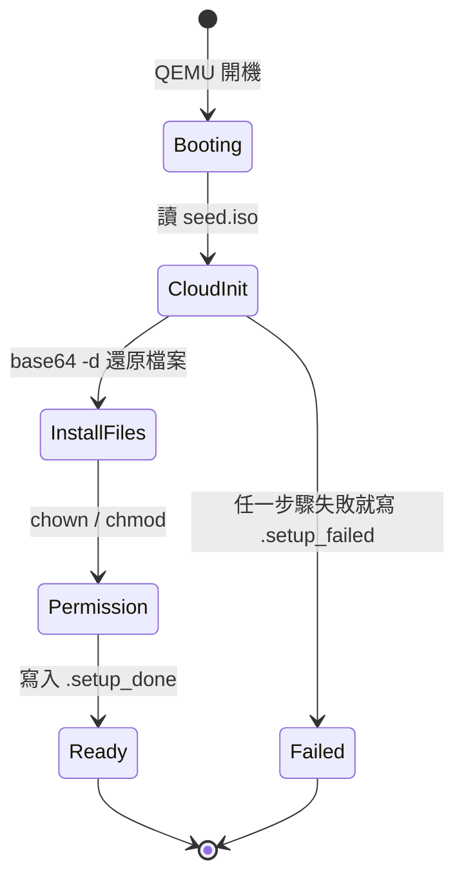

`02_start_vm.sh` 等待 `scheduler` 可執行，且 `.setup_done` 裡有 `SCHEDULER_READY`。

### 圖 3-4：QEMU 啟動時的判斷

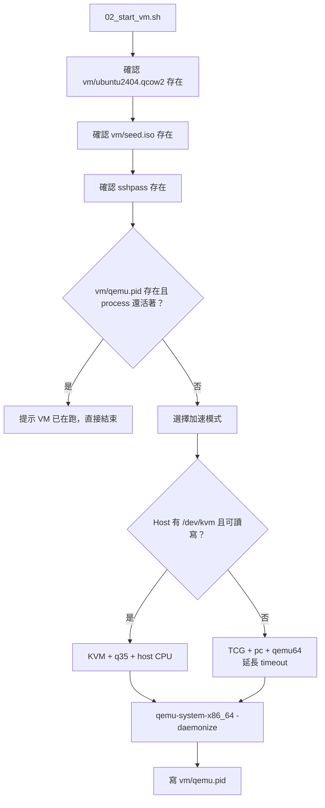

KVM 有就用 KVM；沒有就退到 TCG。TCG 會比較慢，所以腳本把 timeout 拉長。

### 圖 3-5：VM ready 訊號流

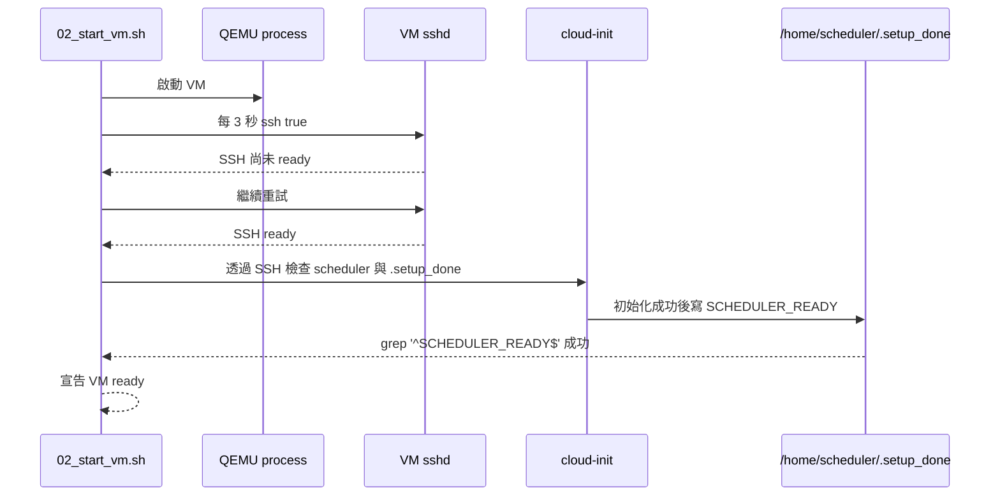

這個設計比 sleep 固定秒數可靠，因為不同機器啟動速度差很多。

### 圖 3-6：QEMU 網路與 SSH

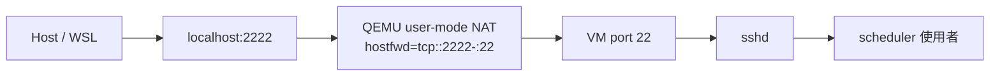

這裡沒有 bridge network。Host 只需要打 `localhost:2222`，QEMU 會轉到 VM 的 22 port。

---

## 4. Demo 與 Benchmark 怎麼跑

### 圖 4-1：`03_demo.sh` 順序

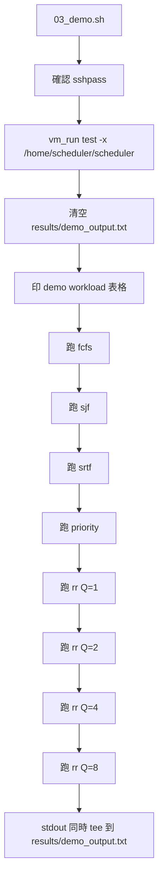

Demo 的價值是看每個演算法的 Gantt Chart，不是只看平均值。

### 圖 4-2：Demo 腳本呼叫 VM 的時序

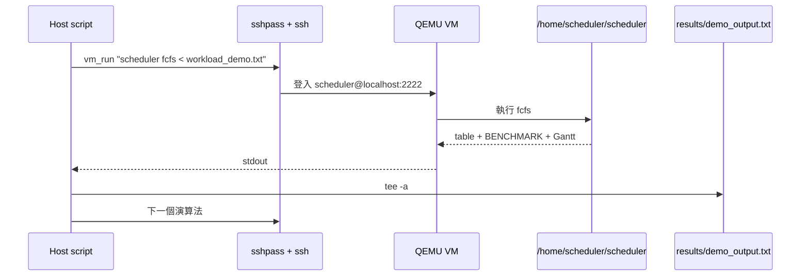

每個演算法都是一次獨立執行。`scheduler.c` 裡的全域陣列不會跨演算法共用狀態，因為每次都是新的 process。

### 圖 4-3：`04_benchmark.sh` 順序

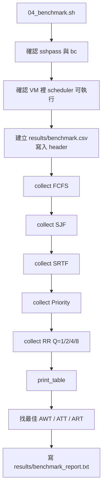

Benchmark 不解析整張表，只抓 `BENCHMARK` 那一行。這行就是 C 程式和 shell script 之間最重要的輸出契約。

### 圖 4-4：Benchmark parser 資料流

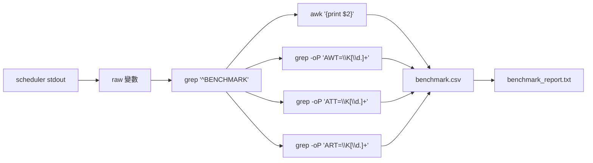

只要 `BENCHMARK` 格式改掉，`04_benchmark.sh` 就會壞。這也是文件裡要特別標出來的 API。

### 圖 4-5：Cleanup 流程

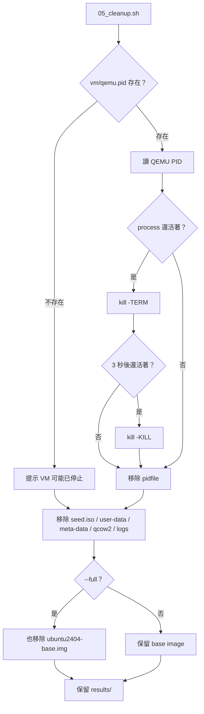

Cleanup 會保留 `results/`，所以 demo 和 benchmark 的輸出不會被一起刪掉。

---

## 5. `scheduler.c` 架構圖

### 圖 5-1：C 程式模組切法

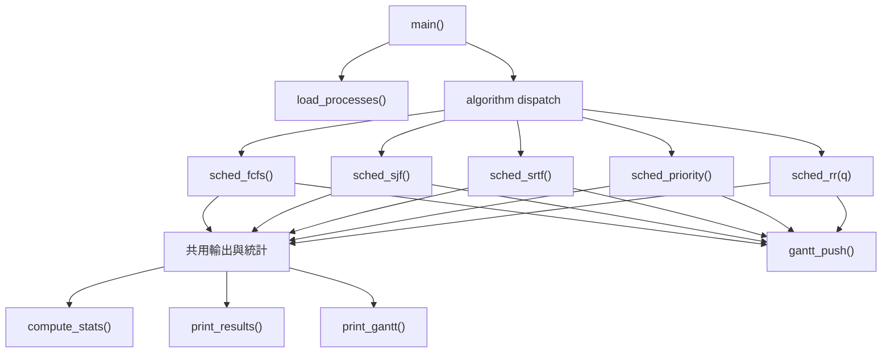

排程演算法各自決定 `start`、`finish`、`remaining`、`gantt[]`。統計與輸出集中在共用函式，這樣結果格式會一致。

### 圖 5-2：主要資料結構

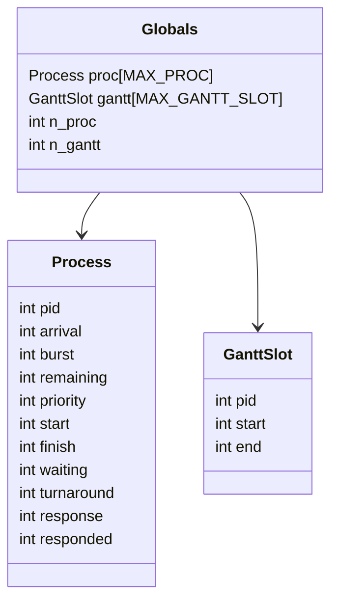

`responded` 目前沒有實際參與計算；程式用 `start == -1` 判斷行程是不是第一次拿到 CPU。

### 圖 5-3：`Process` 欄位分組

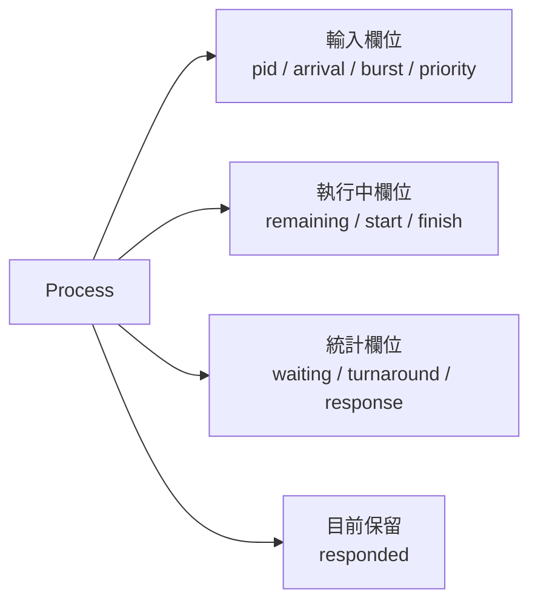

看 `Process` 時不要每個欄位都一起背。先分成「輸入、執行中、統計」三組就很好懂。

### 圖 5-4：行程生命週期

```mermaid
stateDiagram-v2
    [*] --> Loaded: load_processes()
    Loaded --> Waiting: arrival 尚未到
    Waiting --> Ready: arrival <= clock
    Ready --> Running: 被演算法選中
    Running --> Ready: 被搶占或 RR quantum 用完
    Running --> Finished: remaining == 0 或非搶占跑完
    Finished --> Stats: compute_stats()
    Stats --> Printed: print_results()
    Printed --> [*]
```

FCFS、SJF、Priority 沒有「Running 回 Ready」這條，因為它們都是非搶占。SRTF 和 RR 才會發生。

### 圖 5-5：全域陣列上限

```mermaid
flowchart TD
    Limits["固定上限"] --> P["MAX_PROC = 64"]
    Limits --> G["MAX_GANTT_SLOT = MAX_PROC * 200"]
    Limits --> Q["MAX_QUEUE_SLOT = MAX_PROC * 200"]

    P --> Load["load_processes() 檢查 n_proc"]
    G --> GP["gantt_push() 檢查 n_gantt"]
    Q --> Enq["rr_enqueue() 檢查 q_tail"]
```

這份程式用固定大小陣列，不用 `malloc()`。程式路徑很好追，但 workload 太大時要靠上限檢查擋住。

---

## 6. CLI、Input、Output API 圖

### 圖 6-1：CLI API

```mermaid
flowchart LR
    CLI["scheduler <algorithm> [time_quantum]"] --> Algo{"algorithm"}
    Algo -- "fcfs" --> FCFS["sched_fcfs()"]
    Algo -- "sjf" --> SJF["sched_sjf()"]
    Algo -- "srtf" --> SRTF["sched_srtf()"]
    Algo -- "priority" --> PRI["sched_priority()"]
    Algo -- "rr" --> ParseQ["parse_quantum()"]
    ParseQ --> RR["sched_rr(q)"]
    Algo -- "其他" --> Err["Unknown algorithm"]
```

Round Robin 的 quantum 沒給時，預設是 2。

### 圖 6-2：`main()` 執行序

```mermaid
sequenceDiagram
    participant OS as shell
    participant Main as main()
    participant Input as load_processes()
    participant Algo as sched_*()
    participant Out as print_results()/print_gantt()

    OS->>Main: argv + stdin workload
    Main->>Main: 檢查 argc
    Main->>Input: 讀取 n_proc 與每列 process
    Input-->>Main: proc[] 填好
    Main->>Algo: 依 argv[1] 呼叫
    Algo->>Algo: 排程並填 start/finish/gantt
    Algo->>Out: 統計與輸出
    Out-->>OS: stdout
```

注意：`load_processes()` 在 dispatch 前就執行，所以演算法名稱打錯時，程式還是會先讀完 workload 才報 unknown algorithm。

### 圖 6-3：Workload 格式

```mermaid
flowchart TD
    A["第一行: n_proc"] --> B["接著 n_proc 行"]
    B --> C["pid arrival burst priority"]
    C --> D["load_processes()"]
    D --> E["proc[i].pid"]
    D --> F["proc[i].arrival"]
    D --> G["proc[i].burst"]
    D --> H["proc[i].priority"]
    D --> I["proc[i].remaining = burst"]
    D --> J["proc[i].start = -1"]
```

Demo workload 是 6 個行程：

```text
6
1 0 8 3
2 1 4 1
3 2 9 4
4 3 5 2
5 4 2 5
6 5 1 3
```

### 圖 6-4：Input validation

```mermaid
flowchart TD
    A["scanf n_proc"] --> B{"讀得到？"}
    B -- "否" --> X["Input error"]
    B -- "是" --> C{"1 <= n_proc <= MAX_PROC？"}
    C -- "否" --> X
    C -- "是" --> D["逐列讀 pid arrival burst priority"]
    D --> E{"四個欄位都讀得到？"}
    E -- "否" --> X
    E -- "是" --> F{"arrival >= 0？"}
    F -- "否" --> X
    F -- "是" --> G{"burst > 0？"}
    G -- "否" --> X
    G -- "是" --> H["初始化 remaining/start/responded"]
```

Priority 目前沒有檢查正負，程式只規定數字越小優先權越高。

### 圖 6-5：Output API

```mermaid
flowchart TD
    Algo["sched_*()"] --> Stats["compute_stats()"]
    Stats --> Table["print_results(): per-process table"]
    Stats --> Avg["print_results(): AWT / ATT / ART"]
    Stats --> Bench["print_results(): BENCHMARK line"]
    Algo --> Gantt["print_gantt(): Gantt Chart"]

    Bench --> Script["04_benchmark.sh 解析"]
    Script --> CSV["results/benchmark.csv"]
```

`BENCHMARK <label> AWT=<f> ATT=<f> ART=<f>` 是機器讀的；前面的表格和 Gantt 是人看的。

### 圖 6-6：統計公式

```mermaid
flowchart LR
    Arrival["arrival"] --> TAT["turnaround = finish - arrival"]
    Finish["finish"] --> TAT
    TAT --> WT["waiting = turnaround - burst"]
    Burst["burst"] --> WT
    Start["start"] --> RT["response = start - arrival"]
    Arrival --> RT
```

這三個指標在 `compute_stats()` 算：

- Waiting Time：在 ready 狀態等 CPU 的時間。
- Turnaround Time：從 arrival 到 finish 的總時間。
- Response Time：從 arrival 到第一次開始跑的時間。

---

## 7. 共用函式行為圖

### 圖 7-1：`gantt_push()` 壓縮相鄰同 PID

```mermaid
flowchart TD
    A["gantt_push(pid, t_start, t_end)"] --> B{"t_start >= t_end？"}
    B -- "是" --> C["直接 return"]
    B -- "否" --> D{"上一格 pid 相同？"}
    D -- "是" --> E["延長上一格 end"]
    D -- "否" --> F{"n_gantt 超過上限？"}
    F -- "是" --> G["Runtime error"]
    F -- "否" --> H["新增一格 GanttSlot"]
```

SRTF 每 tick 都呼叫 `gantt_push()`，但連續跑同一個 PID 時會被合併，所以輸出不會炸成一堆一格一格的時間點。

### 圖 7-2：Gantt 壓縮例子

```mermaid
flowchart LR
    A["push P1 [0,1]"] --> B["gantt: P1 [0,1]"]
    B --> C["push P1 [1,2]"]
    C --> D["gantt: P1 [0,2]"]
    D --> E["push P2 [2,3]"]
    E --> F["gantt: P1 [0,2], P2 [2,3]"]
```

這個小細節會影響 Gantt Chart 好不好讀。

### 圖 7-3：Comparator tie-break 規則

```mermaid
flowchart TD
    Arrival["cmp_arrival"] --> A1["先比 arrival"]
    A1 --> A2["arrival 一樣比 pid"]

    Burst["SJF / SRTF 選擇"] --> B1["先比 burst 或 remaining"]
    B1 --> B2["一樣比 arrival"]
    B2 --> B3["再一樣比 pid"]

    Priority["Priority 選擇"] --> P1["先比 priority\n數字越小越優先"]
    P1 --> P2["一樣比 arrival"]
    P2 --> P3["再一樣比 pid"]
```

tie-break 很重要，否則同樣的 workload 可能每次輸出順序都不穩。

### 圖 7-4：錯誤處理路徑

```mermaid
flowchart TD
    InputErr["輸入格式錯誤"] --> DieInput["die_input() 或 fprintf(stderr)"]
    RuntimeErr["Gantt / RR queue 超過上限"] --> DieRuntime["die_runtime()"]
    BadQ["RR quantum 不合法"] --> Parse["parse_quantum()"]
    Parse --> ErrQ["Invalid time quantum"]
    Unknown["未知 algorithm"] --> UnknownErr["Unknown algorithm"]

    DieInput --> Exit["exit(1) / return 1"]
    DieRuntime --> Exit
    ErrQ --> Exit
    UnknownErr --> Exit
```

stdout 留給正常結果，stderr 留給錯誤訊息，這樣 benchmark parser 比較不會被干擾。

---

## 8. 五個排程演算法總覽

### 圖 8-1：演算法分類

```mermaid
flowchart TD
    Algo["目前支援的排程"] --> NonPreempt["非搶占"]
    Algo --> Preempt["搶占 / 分時"]

    NonPreempt --> FCFS["FCFS\n先到先跑"]
    NonPreempt --> SJF["SJF\nready 中 burst 最短先跑"]
    NonPreempt --> PRI["Priority\nready 中 priority 數字最小先跑"]

    Preempt --> SRTF["SRTF\n每 tick 挑 remaining 最短"]
    Preempt --> RR["Round Robin\nFIFO queue + time quantum"]
```

非搶占就是一旦拿到 CPU，就跑到完成。搶占或分時則會中途換人。

### 圖 8-2：同一份 demo workload 的 Gantt

```text
FCFS:
0     8     12    21    26    28    29
| P1  | P2  | P3  | P4  | P5  | P6  |

SJF Non-Preemptive:
0     8     9     11    15    20    29
| P1  | P6  | P5  | P2  | P4  | P3  |

SRTF Preemptive:
0     1     5     6     8     13    20    29
| P1  | P2  | P6  | P5  | P4  | P1  | P3  |

Priority Non-Preemptive:
0     8     12    17    18    27    29
| P1  | P2  | P4  | P6  | P3  | P5  |

Round Robin Q=2:
0     2     4     6     8     10    12    14    15    17    19    21    23    25    26    29
| P1  | P2  | P3  | P1  | P4  | P5  | P2  | P6  | P3  | P1  | P4  | P3  | P1  | P4  | P3  |
```

這張很適合拿來教「同一批行程，不同策略會排出完全不同的時間軸」。

### 圖 8-3：演算法共用骨架

```mermaid
flowchart TD
    A["選到下一個要跑的 process"] --> B["設定 start\n如果第一次跑"]
    B --> C["決定跑多久"]
    C --> D["gantt_push(pid, start, end)"]
    D --> E["更新 clock / remaining / finish"]
    E --> F{"全部完成？"}
    F -- "否" --> A
    F -- "是" --> G["compute_stats()"]
    G --> H["print_results()"]
    H --> I["print_gantt()"]
```

差別主要在第一步「怎麼選下一個」和第三步「跑多久」。

---

## 9. FCFS 圖解

### 圖 9-1：FCFS 決策流程

```mermaid
flowchart TD
    A["sched_fcfs()"] --> B["qsort by arrival, pid"]
    B --> C["clock = 0"]
    C --> D["逐一處理 proc[i]"]
    D --> E{"clock < arrival？"}
    E -- "是" --> F["clock = arrival\nCPU 前面是閒置"]
    E -- "否" --> G["start = clock"]
    F --> G
    G --> H["finish = start + burst"]
    H --> I["gantt_push(pid, start, finish)"]
    I --> J["clock = finish"]
    J --> K{"還有下一個？"}
    K -- "有" --> D
    K -- "沒有" --> L["compute_stats + output"]
```

FCFS 的程式碼最直覺，排序後一路跑到底。

### 圖 9-2：FCFS demo 時序

```mermaid
gantt
    title FCFS demo workload
    dateFormat X
    axisFormat %s
    P1 :0, 8
    P2 :8, 4
    P3 :12, 9
    P4 :21, 5
    P5 :26, 2
    P6 :28, 1
```

P1 的 burst 是 8，所以 P2 到 P6 雖然很早就到了，還是得先等 P1 跑完。

### 圖 9-3：FCFS 的資料更新

```mermaid
flowchart LR
    P1["P1 arrival=0 burst=8"] --> S1["start=0 finish=8"]
    S1 --> Clock1["clock=8"]
    P2["P2 arrival=1 burst=4"] --> S2["start=8 finish=12"]
    Clock1 --> S2
    S2 --> Clock2["clock=12"]
```

FCFS 裡 `waiting` 和 `response` 會一樣，因為每個行程第一次拿到 CPU 後就一路跑完。

---

## 10. SJF 圖解

### 圖 10-1：SJF 決策流程

```mermaid
flowchart TD
    A["sched_sjf()"] --> B["done[] = 0\nclock = 0\ncompleted = 0"]
    B --> C{"completed < n_proc？"}
    C -- "否" --> Z["compute_stats + output"]
    C -- "是" --> D["掃描所有 proc"]
    D --> E["找 arrival <= clock 且未完成者"]
    E --> F{"有 ready process？"}
    F -- "沒有" --> G["clock = 下一個尚未完成行程的 arrival"]
    G --> C
    F -- "有" --> H["選 burst 最短\n同分比 arrival 再比 pid"]
    H --> I["start = clock"]
    I --> J["finish = clock + burst"]
    J --> K["gantt_push()"]
    K --> L["clock = finish\ndone[sel] = 1\ncompleted++"]
    L --> C
```

SJF 不是一開始把全部行程用 burst 排好就結束。它每次只從「已經 arrival」的 ready set 裡挑最短的。

### 圖 10-2：SJF ready set 範例

```mermaid
flowchart TD
    T0["clock=0"] --> R0["ready: P1\n選 P1"]
    R0 --> T8["clock=8\nP1 完成"]
    T8 --> R8["ready: P2 P3 P4 P5 P6"]
    R8 --> Pick6["burst 最短: P6"]
    Pick6 --> T9["clock=9"]
    T9 --> Pick5["ready 中 burst 最短: P5"]
    Pick5 --> T11["clock=11"]
    T11 --> Pick2["ready 中 burst 最短: P2"]
```

P6 雖然 arrival=5，但到 clock=8 時它已經 ready，而且 burst=1，所以排在 P2 前面。

### 圖 10-3：SJF demo 時序

```mermaid
gantt
    title SJF Non-Preemptive demo workload
    dateFormat X
    axisFormat %s
    P1 :0, 8
    P6 :8, 1
    P5 :9, 2
    P2 :11, 4
    P4 :15, 5
    P3 :20, 9
```

這張可以用來看 SJF 的重點：它會偏愛短工作，所以平均等待通常會不錯，但長工作可能被往後放。

---

## 11. SRTF 圖解

### 圖 11-1：SRTF 決策流程

```mermaid
flowchart TD
    A["sched_srtf()"] --> B["remaining = burst\nstart = -1"]
    B --> C{"completed < n_proc？"}
    C -- "否" --> Z["compute_stats + output"]
    C -- "是" --> D["掃描所有 proc"]
    D --> E["找 arrival <= clock 且 remaining > 0"]
    E --> F{"有 ready process？"}
    F -- "沒有" --> G["clock++"]
    G --> C
    F -- "有" --> H["選 remaining 最短\n同分比 arrival 再比 pid"]
    H --> I{"start == -1？"}
    I -- "是" --> J["start = clock"]
    I -- "否" --> K["維持原 start"]
    J --> L["跑 1 tick"]
    K --> L
    L --> M["gantt_push(pid, clock, clock+1)"]
    M --> N["remaining--\nclock++"]
    N --> O{"remaining == 0？"}
    O -- "是" --> P["finish = clock\ncompleted++"]
    O -- "否" --> C
    P --> C
```

SRTF 是 SJF 的搶占版。每個 tick 都可能重新選人。

### 圖 11-2：SRTF 搶占時序

```mermaid
sequenceDiagram
    participant Clock as clock
    participant P1 as P1 remaining
    participant P2 as P2 remaining
    participant CPU as CPU

    Clock->>CPU: t=0，只有 P1 ready
    CPU->>P1: P1 跑 1 tick，remaining 8 -> 7
    Clock->>CPU: t=1，P2 arrival，remaining=4
    CPU->>P2: P2 比 P1 短，改跑 P2
    CPU->>P2: P2 從 t=1 跑到 t=5 完成
    Clock->>CPU: t=5，P6 arrival，remaining=1
    CPU->>P6: P6 最短，先跑完
```

這就是「搶占」最容易懂的地方：P1 明明還沒跑完，但 P2 進來後更短，所以 P1 被放回去等。

### 圖 11-3：SRTF demo 時序

```mermaid
gantt
    title SRTF Preemptive demo workload
    dateFormat X
    axisFormat %s
    P1 :0, 1
    P2 :1, 4
    P6 :5, 1
    P5 :6, 2
    P4 :8, 5
    P1 :13, 7
    P3 :20, 9
```

SRTF demo 的平均等待時間是 6.17，比 FCFS 的 13.33 低很多。

### 圖 11-4：SRTF 每 tick 的選擇概念

```mermaid
flowchart LR
    Tick["每個 clock tick"] --> Ready["列出 ready process"]
    Ready --> Remaining["看 remaining"]
    Remaining --> Pick["挑最短"]
    Pick --> Run["只跑 1 tick"]
    Run --> Recheck["下一 tick 重新檢查"]
```

這也是 SRTF 成本較高的地方：概念上每個時間點都要重新比較 ready set。

---

## 12. Priority Scheduling 圖解

### 圖 12-1：Priority 決策流程

```mermaid
flowchart TD
    A["sched_priority()"] --> B["done[] = 0\nclock = 0\ncompleted = 0"]
    B --> C{"completed < n_proc？"}
    C -- "否" --> Z["compute_stats + output"]
    C -- "是" --> D["掃描所有 proc"]
    D --> E["找 arrival <= clock 且未完成者"]
    E --> F{"有 ready process？"}
    F -- "沒有" --> G["clock = 下一個 arrival"]
    F -- "有" --> H["選 priority 最小\n同分比 arrival 再比 pid"]
    G --> C
    H --> I["非搶占：一路跑到 finish"]
    I --> J["gantt_push()"]
    J --> K["done[sel] = 1\ncompleted++"]
    K --> C
```

這份程式裡 priority 數字越小，優先權越高。

### 圖 12-2：Priority demo 時序

```mermaid
gantt
    title Priority Non-Preemptive demo workload
    dateFormat X
    axisFormat %s
    P1 :0, 8
    P2 :8, 4
    P4 :12, 5
    P6 :17, 1
    P3 :18, 9
    P5 :27, 2
```

P2 priority=1，P4 priority=2，P6 priority=3。P1 先來先跑完後，才從當下 ready 的行程裡照 priority 挑。

### 圖 12-3：Priority 與 SJF 的相似處

```mermaid
flowchart LR
    Common["共同骨架\n掃描 ready set"] --> SJF["SJF 選 burst 最短"]
    Common --> PRI["Priority 選 priority 最小"]
    SJF --> NonPreempt["非搶占：選到就跑完"]
    PRI --> NonPreempt
```

這兩個函式長得很像，差別只是選擇條件不同。

---

## 13. Round Robin 圖解

### 圖 13-1：Round Robin 主要資料

```mermaid
flowchart TD
    RR["sched_rr(quantum)"] --> Proc["proc[]\n依 arrival 排序"]
    RR --> Remaining["remaining[]\n每個行程剩餘 burst"]
    RR --> Admitted["admitted[]\n是否已進過 ready queue"]
    RR --> Queue["queue[]\n存 proc index"]
    RR --> HeadTail["q_head / q_tail\nFIFO 指標"]
```

Round Robin 用 queue 存的是 `proc[]` 的 index，不是 PID。

### 圖 13-2：Round Robin 初始化

```mermaid
flowchart TD
    A["qsort by arrival"] --> B["remaining[i] = burst"]
    B --> C["start = -1"]
    C --> D["admitted[i] = 0"]
    D --> E["arrival == 0 的行程 enqueue"]
    E --> F["admitted = 1"]
```

只有 arrival=0 的行程會一開始進 queue。其他行程要等 clock 往前走後才會被 admitted。

### 圖 13-3：Round Robin 主迴圈

```mermaid
flowchart TD
    A{"completed < n_proc？"} -->|否| Z["compute_stats + output"]
    A -->|是| B{"queue 空？"}
    B -->|是| C["clock 跳到下一個未 admitted 的 arrival"]
    C --> D["把 arrival <= clock 的行程 enqueue"]
    D --> A
    B -->|否| E["dequeue idx"]
    E --> F{"start == -1？"}
    F -->|是| G["start = clock"]
    F -->|否| H["run = min(remaining, quantum)"]
    G --> H
    H --> I["gantt_push(pid, clock, clock+run)"]
    I --> J["clock += run\nremaining -= run"]
    J --> K["enqueue 新 arrival 的行程"]
    K --> L{"remaining == 0？"}
    L -->|是| M["finish = clock\ncompleted++"]
    L -->|否| N["把自己 enqueue 回尾端"]
    M --> A
    N --> A
```

這裡有個細節：跑完一個 quantum 後，先把新 arrival 的行程 enqueue，再決定目前這個沒跑完的行程要不要回 queue 尾端。

### 圖 13-4：Round Robin queue 訊號流

```mermaid
sequenceDiagram
    participant CPU as CPU
    participant Q as ready queue
    participant New as 新 arrival 行程
    participant Cur as 目前行程

    Q->>CPU: dequeue 目前行程
    CPU->>Cur: 跑 min(remaining, quantum)
    New->>Q: arrival <= clock 的行程先入隊
    alt 目前行程還沒完成
        Cur->>Q: 回到 queue 尾端
    else 已完成
        Cur-->>CPU: 記錄 finish
    end
```

這個順序會影響 Gantt，尤其是剛好在 quantum 結束時進來的新行程。

### 圖 13-5：Round Robin Q=2 demo 時序

```mermaid
gantt
    title Round Robin Q=2 demo workload
    dateFormat X
    axisFormat %s
    P1 :0, 2
    P2 :2, 2
    P3 :4, 2
    P1 :6, 2
    P4 :8, 2
    P5 :10, 2
    P2 :12, 2
    P6 :14, 1
    P3 :15, 2
    P1 :17, 2
    P4 :19, 2
    P3 :21, 2
    P1 :23, 2
    P4 :25, 1
    P3 :26, 3
```

Round Robin 很容易讓每個行程早點第一次拿到 CPU，但總等待和週轉不一定漂亮。

### 圖 13-6：Quantum 大小的行為變化

```mermaid
flowchart LR
    Small["Quantum 小\n例如 Q=1"] --> FastResp["首次回應快"]
    Small --> MoreSwitch["切換次數多\n等待/週轉可能變長"]
    Large["Quantum 大\n例如 Q=8"] --> LikeFCFS["越來越像 FCFS"]
    Large --> SlowResp["後面到的行程首次回應較慢"]
```

這份 benchmark 裡，RR Q=1 的 ART 最好，但 AWT/ATT 不是最好。

---

## 14. Demo 結果比較圖

### 圖 14-1：demo workload 指標

```mermaid
xychart-beta
    title "Demo workload 平均等待時間 AWT"
    x-axis ["FCFS", "SJF", "SRTF", "Priority", "RR Q1", "RR Q2", "RR Q4", "RR Q8"]
    y-axis "AWT" 0 --> 15
    bar [13.33, 8.00, 6.17, 11.17, 12.33, 12.83, 14.00, 14.17]
```

Demo workload 裡 SRTF 的 AWT 最低，SJF 次之。

### 圖 14-2：demo workload 回應時間

```mermaid
xychart-beta
    title "Demo workload 平均回應時間 ART"
    x-axis ["FCFS", "SJF", "SRTF", "Priority", "RR Q1", "RR Q2", "RR Q4", "RR Q8"]
    y-axis "ART" 0 --> 15
    bar [13.33, 8.00, 4.17, 11.17, 1.67, 3.83, 7.83, 12.83]
```

這張最能說明 Round Robin 的定位：它不一定讓整體最短，但可以讓大家比較快第一次摸到 CPU。

### 圖 14-3：benchmark workload 指標

```mermaid
xychart-beta
    title "Benchmark workload 平均等待時間 AWT"
    x-axis ["FCFS", "SJF", "SRTF", "Priority", "RR Q1", "RR Q2", "RR Q4", "RR Q8"]
    y-axis "AWT" 0 --> 30
    bar [21.83, 14.58, 13.33, 18.33, 26.83, 27.33, 25.33, 22.50]
```

Benchmark workload 也一樣，SRTF 在平均等待時間最好。

### 圖 14-4：benchmark 最佳指標

```mermaid
flowchart TD
    Bench["benchmark.csv"] --> AWT["最佳 AWT\nSRTF_Preemptive\n13.3333"]
    Bench --> ATT["最佳 ATT\nSRTF_Preemptive\n18.0833"]
    Bench --> ART["最佳 ART\nRoundRobin_Q1\n4.0833"]
```

所以看 benchmark 時不要只說「哪個最好」。要先說你在看哪個指標。

---

## 15. API 呼叫圖

### 圖 15-1：從 Makefile 到 C function

```mermaid
flowchart TD
    MakeDemo["make demo"] --> ScriptDemo["scripts/03_demo.sh"]
    ScriptDemo --> SSHDemo["ssh scheduler@localhost:2222"]
    SSHDemo --> BinDemo["/home/scheduler/scheduler fcfs|sjf|srtf|priority|rr"]
    BinDemo --> Main["main()"]
    Main --> Load["load_processes()"]
    Main --> Dispatch["strcmp dispatch"]
    Dispatch --> Sched["sched_*()"]
    Sched --> Stats["compute_stats()"]
    Sched --> Results["print_results()"]
    Sched --> Gantt["print_gantt()"]
```

如果要確認「`make demo` 最後到底跑到哪裡」，這張圖就夠用了。

### 圖 15-2：`scheduler.c` function call graph

```mermaid
flowchart TD
    main["main"] --> load["load_processes"]
    main --> parseQ["parse_quantum\nRR only"]
    main --> fcfs["sched_fcfs"]
    main --> sjf["sched_sjf"]
    main --> srtf["sched_srtf"]
    main --> pri["sched_priority"]
    main --> rr["sched_rr"]

    fcfs --> cmpArrival["cmp_arrival via qsort"]
    rr --> cmpArrival
    fcfs --> gp["gantt_push"]
    sjf --> gp
    srtf --> gp
    pri --> gp
    rr --> gp

    rr --> enq["rr_enqueue"]

    fcfs --> stats["compute_stats"]
    sjf --> stats
    srtf --> stats
    pri --> stats
    rr --> stats

    fcfs --> pr["print_results"]
    sjf --> pr
    srtf --> pr
    pri --> pr
    rr --> pr

    fcfs --> pg["print_gantt"]
    sjf --> pg
    srtf --> pg
    pri --> pg
    rr --> pg
```

`cmp_burst()` 和 `cmp_priority()` 目前存在，但主要選擇邏輯是各排程函式裡掃描 ready set，不是用這兩個 comparator 直接排序完解決。

### 圖 15-3：Shell helper call graph

```mermaid
flowchart TD
    S03["03_demo.sh"] --> vmrun3["vm_run()"]
    S03 --> runalgo["run_algo()"]
    runalgo --> vmrun3
    vmrun3 --> ssh3["sshpass ssh"]

    S04["04_benchmark.sh"] --> vmrun4["vm_run()"]
    S04 --> runbench["run_bench()"]
    S04 --> collect["collect()"]
    S04 --> printtable["print_table()"]
    collect --> runbench
    runbench --> vmrun4
    vmrun4 --> ssh4["sshpass ssh"]
    runbench --> parser["grep / awk / grep -oP"]
```

`03_demo.sh` 重視完整輸出，`04_benchmark.sh` 重視萃取數字。

### 圖 15-4：輸出契約

```mermaid
flowchart LR
    C["print_results(algo_label)"] --> Human["人看\n表格 + 平均值"]
    C --> Machine["機器看\nBENCHMARK line"]
    Machine --> Parser["04_benchmark.sh"]
    Parser --> CSV["benchmark.csv"]
    Parser --> TXT["benchmark_report.txt"]
```

如果未來要改輸出格式，建議保留 `BENCHMARK` line，或同步改 benchmark script。

---

## 16. 行為圖：clock、ready、finish

### 圖 16-1：非搶占演算法的 clock 行為

```mermaid
flowchart LR
    Clock["clock"] --> Ready["挑 ready process"]
    Ready --> RunAll["跑完整個 burst"]
    RunAll --> Finish["finish = clock + burst"]
    Finish --> NewClock["clock = finish"]
    NewClock --> Ready
```

FCFS、SJF、Priority 都是這種模式。

### 圖 16-2：搶占演算法的 clock 行為

```mermaid
flowchart LR
    Clock["clock"] --> Ready["挑 ready process"]
    Ready --> RunPart["只跑一段\nSRTF: 1 tick\nRR: quantum"]
    RunPart --> Remaining["remaining 減少"]
    Remaining --> Done{"remaining == 0？"}
    Done -- "是" --> Finish["finish = clock"]
    Done -- "否" --> Back["回 ready 或 queue"]
    Finish --> Clock
    Back --> Clock
```

SRTF 和 RR 都會追 `remaining`，非搶占演算法則不需要用它做主要決策。

### 圖 16-3：CPU idle 處理差異

```mermaid
flowchart TD
    Idle["沒有 ready process"] --> FCFS["FCFS/SJF/Priority/RR"]
    Idle --> SRTF["SRTF"]

    FCFS --> Jump["clock 跳到下一個 arrival"]
    SRTF --> Tick["clock++"]
```

目前程式沒有把 idle 時段寫進 Gantt Chart，所以 Gantt 只顯示有 PID 在跑的時段。

### 圖 16-4：`start` 欄位何時設定

```mermaid
flowchart TD
    Start["start 欄位"] --> NonP["非搶占\nFCFS/SJF/Priority"]
    Start --> SRTF["SRTF"]
    Start --> RR["Round Robin"]

    NonP --> A["選中時直接 start = clock"]
    SRTF --> B["第一次被選中且 start == -1 時設定"]
    RR --> C["dequeue 後第一次跑且 start == -1 時設定"]
```

`response = start - arrival`，所以 start 的設定點會直接影響 ART。

---

## 17. 專案常見問題定位圖

### 圖 17-1：`make demo-host` 失敗

```mermaid
flowchart TD
    A["make demo-host 失敗"] --> B{"gcc 編譯錯？"}
    B -- "是" --> C["看 src/scheduler.c"]
    B -- "否" --> D{"workload 讀取錯？"}
    D -- "是" --> E["看 src/workload_demo.txt 格式"]
    D -- "否" --> F["看 scheduler stdout/stderr"]
```

Host demo 失敗通常跟 QEMU 無關，先不要去查 VM。

### 圖 17-2：`02_start_vm.sh` 卡住

```mermaid
flowchart TD
    A["02_start_vm.sh 卡住"] --> B{"卡在 SSH ready？"}
    B -- "是" --> C["看 vm/qemu.log\n看 vm/qemu-serial.log"]
    B -- "否" --> D{"卡在 cloud-init？"}
    D -- "是" --> E["檢查 .setup_done / .setup_failed\n看 serial log"]
    D -- "否" --> F["確認 vm/qemu.pid 與 port 2222"]
```

`02_start_vm.sh` 已經有 Kernel panic 檢查，遇到 panic 會看 serial log。

### 圖 17-3：Benchmark 沒有 CSV

```mermaid
flowchart TD
    A["benchmark.csv 沒產生"] --> B{"VM scheduler 可執行？"}
    B -- "否" --> C["先跑 02_start_vm.sh"]
    B -- "是" --> D{"scheduler stdout 有 BENCHMARK？"}
    D -- "否" --> E["看 scheduler.c print_results()"]
    D -- "是" --> F{"grep/awk/grep -oP 可用？"}
    F -- "否" --> G["看 shell 環境工具"]
    F -- "是" --> H["看 results/ 權限或路徑"]
```

Benchmark script 最怕的是 `BENCHMARK` line 消失或格式變了。

### 圖 17-4：結果數字怪怪的

```mermaid
flowchart TD
    A["結果數字怪"] --> B["先看 Gantt Chart"]
    B --> C{"Gantt 順序合理？"}
    C -- "否" --> D["查 sched_* 選擇邏輯"]
    C -- "是" --> E["查 compute_stats() 公式"]
    D --> F["看 tie-break: arrival / pid"]
    E --> G["核對 start / finish / arrival / burst"]
```

排程結果 debug 不要直接看平均值。先看 Gantt，因為平均值只是最後算出來的摘要。

---

## 18. 一句話總結圖

### 圖 18-1：這個專案真正的管線

```mermaid
flowchart LR
    C["C simulator"] --> Pack["被打包進 cloud-init"]
    Pack --> VM["在 QEMU VM 裡跑"]
    VM --> Text["輸出文字結果"]
    Text --> CSV["Shell 解析成 CSV/report"]
```

### 圖 18-2：scheduler 的核心管線

```mermaid
flowchart LR
    Workload["workload"] --> Proc["proc[]"]
    Proc --> Algo["sched_*()"]
    Algo --> Gantt["gantt[]"]
    Algo --> Times["start / finish"]
    Times --> Metrics["WT / TAT / RT"]
    Metrics --> Output["table / BENCHMARK"]
    Gantt --> Output
```

### 圖 18-3：五個演算法差在哪

```mermaid
flowchart TD
    Question["下一個誰跑？"] --> FCFS["FCFS：arrival 最早"]
    Question --> SJF["SJF：ready 裡 burst 最短"]
    Question --> SRTF["SRTF：ready 裡 remaining 最短，每 tick 重選"]
    Question --> PRI["Priority：ready 裡 priority 最小"]
    Question --> RR["RR：queue 最前面，跑 quantum"]
```

這三張圖很適合放在開場，先把整體感覺拉起來。

---

## 19. 5 分鐘快速閱讀路線

這段整理一條快速導讀路線，照這個順序會比較順。

### 0:00 - 0:40：先看專案在做什麼

用圖 1-1 和圖 18-1。

摘要：

> 這個專案用 C 寫一個 CPU scheduling simulator，並放進 QEMU Ubuntu VM 裡跑。外層腳本負責環境和重現，內層 C 程式負責排程邏輯。最後結果會進 `results/`。

先抓住一件事：QEMU 是執行環境，排程邏輯在 `src/scheduler.c`。

### 0:40 - 1:30：看執行順序

用圖 2-1、圖 3-1、圖 3-5。

摘要：

> `make all` 其實就是 `setup -> start -> demo -> bench`。`setup` 下載 image、建 qcow2、編譯 scheduler、把 binary 和 workload 包進 cloud-init seed。`start` 啟 QEMU，不只等 SSH，還會等 VM 裡出現 `.setup_done`，所以不是盲等。

這裡要強調 `.setup_done` 是 ready signal。

### 1:30 - 2:20：看 scheduler 的核心資料流

用圖 5-1、圖 6-2、圖 18-2。

摘要：

> C 程式進來後，`main()` 先呼叫 `load_processes()` 從 stdin 讀 workload，塞進 `proc[]`。接著依照 `argv[1]` 選 `sched_fcfs()`、`sched_sjf()` 這些函式。演算法會填 `start`、`finish`、`remaining`，也會透過 `gantt_push()` 記錄 CPU 時間軸。最後 `compute_stats()` 算 WT、TAT、RT，`print_results()` 印人看的表和機器看的 `BENCHMARK` line。

這一段先看所有演算法共同產出什麼，再展開五個演算法的差異。

### 2:20 - 3:40：看五個演算法差異

用圖 8-1、圖 8-2、圖 18-3。

摘要：

> 五個演算法都在回答同一題：下一個誰跑？FCFS 看 arrival；SJF 看 ready 裡 burst 最短；SRTF 是每個 tick 看 remaining 最短，所以會搶占；Priority 看 priority 數字最小；Round Robin 則是 FIFO queue，每次最多跑一個 quantum。

接著拿圖 8-2 的 Gantt 比較同一份 demo workload。這比直接看定義有效，因為執行順序的差異會直接呈現出來。

### 3:40 - 4:30：看 benchmark 怎麼讀

用圖 4-4、圖 14-4。

摘要：

> Benchmark script 會抓 `BENCHMARK` 那一行，解析出 AWT、ATT、ART 寫成 CSV。這份 benchmark 裡，SRTF 的平均等待和週轉最好；Round Robin Q=1 的平均回應最好。比較結果要搭配最佳化目標一起看。

這裡順便提醒：如果改 `print_results()` 的 `BENCHMARK` 格式，要同步改 `04_benchmark.sh`。

### 4:30 - 5:00：看 debug 入口

用圖 17-1 到圖 17-4。

摘要：

> 出問題先分層。`demo-host` 壞了，多半是 C 或 workload；`start_vm` 壞了，看 QEMU log 和 serial log；benchmark 沒結果，先確認 VM 裡 scheduler 能不能跑，再看 `BENCHMARK` line。排程數字怪，先看 Gantt，再看平均值。

最後收在一句：

> 這個專案其實就是三層：腳本把 VM 準備好，VM 跑 C simulator，C simulator 把 workload 變成 Gantt 和統計數字。只要沿著這三層看，就不會迷路。

---

## 20. 圖表索引

如果只想快速帶人看，推薦這幾張：

| 情境 | 建議圖 |
| --- | --- |
| 專案總覽 | 圖 1-1、圖 18-1 |
| 執行順序 | 圖 2-1、圖 3-5 |
| QEMU 初始化 | 圖 3-1、圖 3-2、圖 3-3 |
| Demo/Benchmark | 圖 4-1、圖 4-4 |
| C 架構 | 圖 5-1、圖 5-2、圖 6-2 |
| 演算法比較 | 圖 8-1、圖 8-2、圖 18-3 |
| SRTF | 圖 11-1、圖 11-2、圖 11-3 |
| Round Robin | 圖 13-1、圖 13-3、圖 13-5 |
| Debug | 圖 17-1 到圖 17-4 |
