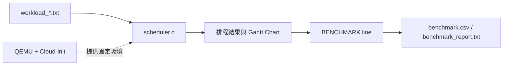
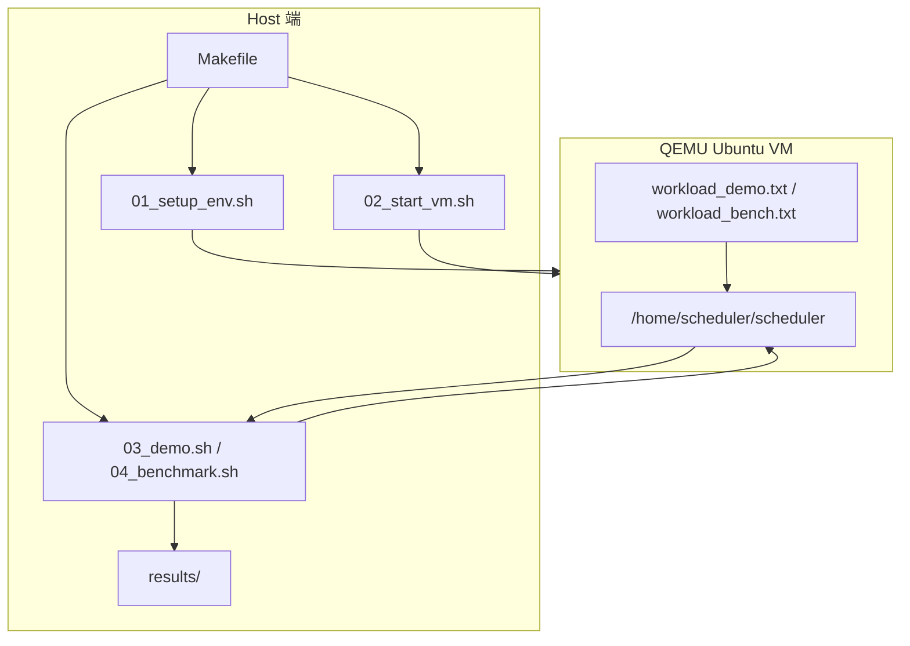
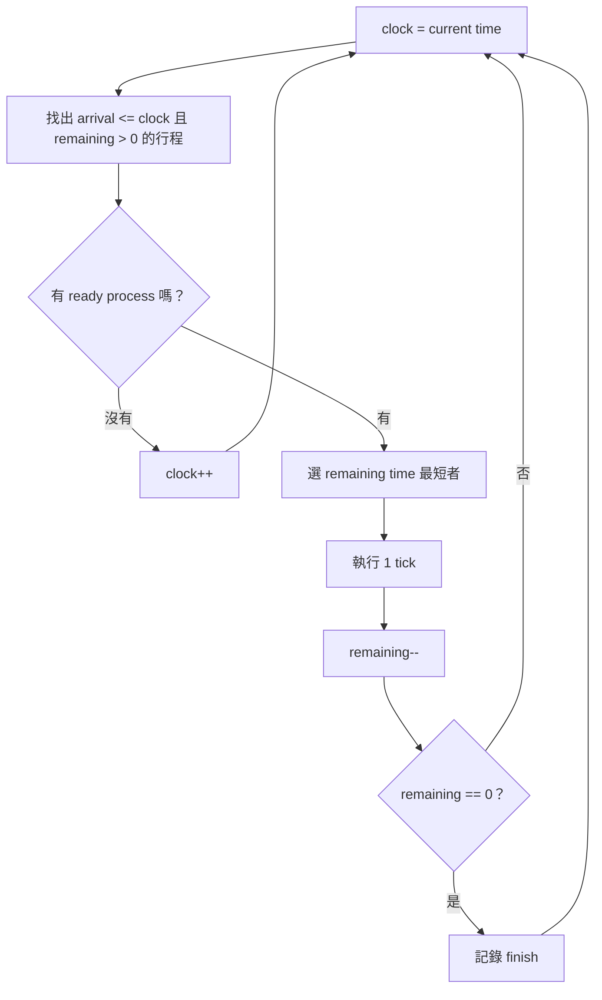
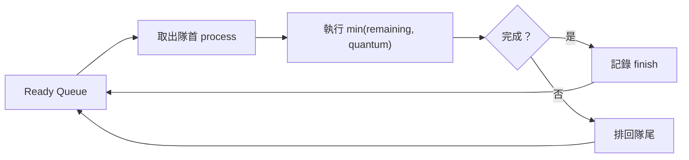

# CPU 排程模擬器技術報告

本報告說明 `cpu-scheduling-qemu` 的設計、排程演算法、實驗結果，以及開發過程中遇到的問題。整個專案的核心是用可重複的環境觀察 CPU 排程演算法。

閱讀順序建議：

1. `README_schedule.md`：先照著建置與執行。
2. `report_schedule.md`：理解專案架構、演算法與實驗結果。
3. `report_schedule_api.md`：深入看程式流程、API 選擇與腳本設計。

---

## 1. 問題定義

CPU Scheduling（CPU 排程）要解決的問題是：當多個行程（Process）都準備好使用 CPU 時，系統應該先讓誰執行、執行多久、何時切換。

在作業系統中，真實排程器還會考慮：

- interrupt（中斷）
- context switch（上下文切換）
- cache locality（快取區域性）
- multi-core load balancing（多核心負載平衡）
- I/O wait（I/O 等待）

本專案先把問題收斂成單核心、離散時間的排程模擬：

- 每個行程只有一段 CPU burst。
- 時間以整數 tick 表示。
- 不模擬 I/O blocking。
- 不模擬實際 context switch overhead。
- 使用相同 workload 比較不同演算法的結果。

這樣做的好處是概念清楚，能先看懂 FCFS、SJF、SRTF、Priority、Round Robin 的差異。

---

## 2. 系統邊界

這個專案有兩個容易混淆的邊界，需要先說清楚。

### 2.1 User-space 排程模擬器

`src/scheduler.c` 是使用者空間（User Space）的模擬器。它不會呼叫 Linux kernel 的排程 API，也不會替換 CFS（Completely Fair Scheduler）。

QEMU 的用途是提供穩定的 Ubuntu 執行環境；排程事件由 user-space 模擬器產生，並非 guest kernel 內部事件。

### 2.2 QEMU 作為實驗環境

排程演算法都在 `scheduler.c`。QEMU、Cloud-init、SSH、Makefile 是為了讓實驗可以自動建置、重複執行、整理結果。



---

## 3. 架構設計

整個專案可以分成四層。

| 層級 | 主要檔案 | 責任 |
| --- | --- | --- |
| 排程核心層 | `src/scheduler.c` | 讀取 workload，執行排程演算法，計算統計值 |
| Workload 層 | `src/workload_demo.txt`, `src/workload_bench.txt` | 定義行程到達時間、執行時間、優先權 |
| 環境自動化層 | `scripts/*.sh` | 建立 VM、啟動 VM、透過 SSH 執行測試 |
| 報告輸出層 | `results/*.txt`, `results/*.csv` | 保存 demo 與 benchmark 結果 |



---

## 4. 關鍵字說明

| 關鍵字 | 英文 | 說明 |
| --- | --- | --- |
| 行程 | Process | 被排程器管理的工作單位。這裡用 `pid` 辨識。 |
| 到達時間 | Arrival Time | 行程進入 ready queue 的時間。 |
| CPU 執行時間 | CPU Burst Time | 行程需要使用 CPU 的時間。 |
| 剩餘時間 | Remaining Time | 搶佔式演算法中，行程還沒完成的 CPU 時間。 |
| Ready Queue | Ready Queue | 已到達且等待 CPU 的行程集合。 |
| 搶佔 | Preemption | 正在執行的行程被暫停，CPU 改給另一個行程。 |
| 非搶佔式 | Non-preemptive | 行程一旦開始執行，就會跑到完成或主動放棄 CPU。 |
| 時間片 | Time Quantum | Round Robin 中每次最多讓行程執行的時間長度。 |
| 上下文切換 | Context Switch | CPU 從一個行程切到另一個行程時需要保存與恢復狀態。 |
| Gantt Chart | Gantt Chart | 用時間軸顯示 CPU 在不同時間執行哪個行程。 |
| 車隊效應 | Convoy Effect | 長工作卡在前面，導致後面短工作一起等待。 |
| 飢餓 | Starvation | 某些行程長時間得不到 CPU。 |

---

## 5. 資料模型

每個行程在程式中使用 `Process` 結構表示。主要欄位可分成輸入資料與排程後資料。

### 5.1 輸入資料

| 欄位 | 說明 |
| --- | --- |
| `pid` | 行程編號 |
| `arrival` | 到達時間 |
| `burst` | 總 CPU 執行時間 |
| `priority` | 優先權，數值越小優先權越高 |

### 5.2 排程後資料

| 欄位 | 說明 |
| --- | --- |
| `start` | 第一次取得 CPU 的時間 |
| `finish` | 完成時間 |
| `remaining` | 剩餘 CPU 時間，主要給 SRTF 使用 |
| `waiting` | 等待時間 |
| `turnaround` | 從到達到完成的總時間 |
| `response` | 從到達到第一次取得 CPU 的時間 |

公式：

```text
Turnaround Time = Finish - Arrival
Waiting Time    = Turnaround - Burst
Response Time   = Start - Arrival
```

實例：

```text
P4 arrival = 3
P4 burst   = 5
P4 start   = 12
P4 finish  = 17

Turnaround Time = 17 - 3 = 14
Waiting Time    = 14 - 5 = 9
Response Time   = 12 - 3 = 9
```

---

## 6. 排程演算法

### 6.1 FCFS：First-Come First-Served

FCFS 依照 arrival time 排序，先到先執行。它的規則最直接，也最容易出現 convoy effect。

演算法流程：

```text
1. 依 arrival time 排序
2. 從第一個行程開始執行
3. 如果 CPU 閒置，就把 clock 推進到下一個 arrival time
4. 行程執行到完成
5. 記錄 start / finish / Gantt slot
```

範例 workload 前三個行程：

```text
P1: arrival 0, burst 8
P2: arrival 1, burst 4
P3: arrival 2, burst 9
```

FCFS 會得到：

```text
0      8      12      21
|  P1  |  P2  |   P3   |
```

P2 明明在時間 1 就到了，但要等 P1 跑完，因此等待時間是 `8 - 1 = 7`。

### 6.2 SJF：Shortest Job First

SJF 每次從已到達的行程中選 burst time 最短者。重點是「已到達」，不是把全部行程一開始就照 burst 排序。

如果時間 8 時 ready queue 裡有：

```text
P2 burst 4
P3 burst 9
P4 burst 5
P5 burst 2
P6 burst 1
```

SJF 會先選 P6，接著 P5、P2、P4、P3。

這解釋了 demo 的 SJF Gantt Chart：

```text
0     8     9     11     15     20     29
| P1  | P6  | P5  | P2   | P4   | P3   |
```

SJF 通常能降低平均等待時間，但如果一直有短工作進來，長工作可能長時間等不到 CPU。

### 6.3 SRTF：Shortest Remaining Time First

SRTF 是 SJF 的搶佔式版本。每個時間 tick 都檢查所有已到達行程，選 remaining time 最短者。

流程圖：



在 demo 中，P1 先執行 1 tick 後，P2 到達且剩餘時間比 P1 短，因此 P1 被搶佔：

```text
0     1     5     6     8     13     20     29
| P1  | P2  | P6  | P5  | P4   | P1   | P3   |
```

SRTF 的優點是短工作反應快、平均等待時間通常低。缺點是真實系統中頻繁搶佔會增加 context switch overhead。本專案尚未把 overhead 加入時間計算。

### 6.4 Priority Scheduling

Priority Scheduling 每次從已到達的行程中選 priority 數值最小者。本專案使用非搶佔式版本。

設定：

```text
priority 數字越小，優先權越高
```

範例：

```text
P2 priority = 1
P4 priority = 2
P1 priority = 3
```

如果 P2、P4、P1 同時在 ready queue 中，會先選 P2。

風險是 starvation。假設低優先權 P5 已經等待很久，但高優先權行程一直到達，P5 可能一直被延後。常見解法是 aging（老化）：等待越久，逐步提高優先權。

### 6.5 Round Robin

Round Robin 使用 FIFO ready queue 與固定 time quantum。每次取隊首行程執行，最多跑 `quantum` 個時間單位；如果沒完成，就排回隊尾。



Time Quantum 的影響：

| Quantum | 常見效果 |
| ---: | --- |
| 很小 | Response Time 較低，但切換頻繁 |
| 中等 | 互動性與完成時間較平衡 |
| 很大 | 行為會越來越接近 FCFS |

在 benchmark 中，Round Robin Q=1 的 ART 最低：

```text
RoundRobin_Q1 ART = 4.0833
```

但它的 AWT 與 ATT 較高，因為很多行程很早拿到第一次 CPU，卻要輪很多次才完成。

---

## 7. 實驗設計

### 7.1 Demo Workload

`src/workload_demo.txt` 用 6 個行程展示排程順序。它的特性是：

- P1 很早到達且 burst 較長。
- P6 burst 最短但較晚到達。
- P2 priority 最高。
- 可以清楚看到 SRTF 搶佔與 RR 輪轉。

### 7.2 Benchmark Workload

`src/workload_bench.txt` 用 12 個行程比較平均指標。它包含不同 arrival time、burst time、priority，適合觀察：

- FCFS 是否受長工作影響。
- SJF/SRTF 對短工作的改善。
- Priority 的排序效果。
- Round Robin quantum 對 ART/AWT/ATT 的取捨。

### 7.3 指標選擇

| 指標 | 用途 | 為什麼需要 |
| --- | --- | --- |
| AWT | 衡量平均等待成本 | 看 ready queue 裡等 CPU 的壓力 |
| ATT | 衡量完成週期 | 看工作從到達到完成的總延遲 |
| ART | 衡量首次回應 | 看互動式工作多久得到第一次 CPU |

只看一個指標容易誤判。例如 Round Robin Q=1 的 ART 很好，但 AWT/ATT 不一定好。

---

## 8. Benchmark 結果分析

以下是 `results/benchmark.csv` 的結果：

| Algorithm | AWT | ATT | ART |
| --- | ---: | ---: | ---: |
| FCFS | 21.8333 | 26.5833 | 21.8333 |
| SJF Non-Preemptive | 14.5833 | 19.3333 | 14.5833 |
| SRTF Preemptive | 13.3333 | 18.0833 | 11.4167 |
| Priority Non-Preemptive | 18.3333 | 23.0833 | 18.3333 |
| Round Robin Q=1 | 26.8333 | 31.5833 | 4.0833 |
| Round Robin Q=2 | 27.3333 | 32.0833 | 8.2500 |
| Round Robin Q=4 | 25.3333 | 30.0833 | 15.0833 |
| Round Robin Q=8 | 22.5000 | 27.2500 | 21.5833 |

### 8.1 SRTF 的 AWT/ATT 最低

SRTF 能在短行程到達後搶佔長行程，所以短行程比較快完成。在這組 workload 中，SRTF 的平均等待時間與平均完成週期最低。

### 8.2 Round Robin Q=1 的 ART 最低

Q=1 讓 ready queue 中的行程很快輪到第一次 CPU，因此 ART 最低。但因為每次只跑 1 tick，行程需要多次排隊才能完成，所以 AWT 與 ATT 偏高。

### 8.3 Priority 不一定比 SJF 好

Priority Scheduling 的結果取決於 priority 欄位是否真的反映工作的重要程度。這組 workload 的 priority 並不等於 burst 長短，因此 Priority 的 AWT/ATT 介於 FCFS 與 SJF/SRTF 之間。

### 8.4 FCFS 是重要基準線

FCFS 不一定表現最好，但它是很好的 baseline。其他演算法若要證明有改善，至少要和 FCFS 比較等待時間、完成時間與回應時間。

---

## 9. 開發過程中的問題、原因與解法

### Bug 1：SSH 已可連線，但 scheduler 還沒準備好

現象：

```text
03_demo.sh 透過 SSH 進 VM 後，找不到 /home/scheduler/scheduler
```

原因：

SSH service 啟動完成不代表 cloud-init 的 `runcmd` 已經執行完。VM 可能已經能登入，但 scheduler binary、workload 還在寫入中。

解法：

- `01_setup_env.sh` 在 cloud-init 完成後寫入 `/home/scheduler/.setup_done`。
- `02_start_vm.sh` 不只等待 SSH，也等待 `.setup_done` 且確認 scheduler 可執行。
- 如果 cloud-init 失敗，寫入 `.setup_failed`，讓 start script 可以輸出明確錯誤。

學到的重點：

ready condition（就緒條件）要定義成「應用程式真的可用」，不是只看網路服務已開。

### Bug 2：沒有 KVM 權限時，QEMU 開機很慢或啟動失敗

現象：

```text
02_start_vm.sh 等待 SSH timeout
```

原因：

在 WSL2、權限不足或沒有 `/dev/kvm` 的環境中，QEMU 不能使用 KVM acceleration。若仍假設 KVM 可用，啟動可能失敗；若改用純模擬 TCG，開機時間會變長。

解法：

- `02_start_vm.sh` 檢查 `/dev/kvm` 是否存在且可讀寫。
- 有 KVM 時使用 `-machine q35,accel=kvm` 與 `-cpu host,+x2apic`。
- 沒有 KVM 時改用 `-machine pc,accel=tcg` 與 `-cpu qemu64`。
- TCG 模式調高 boot timeout。

學到的重點：

虛擬化腳本不能只在自己的電腦可用，應該偵測能力並提供 fallback（備援路徑）。

### Bug 3：Benchmark parser 容易被表格格式影響

現象：

早期若只解析人類可讀的表格，欄位寬度或標題一改，`awk`/`grep` 就可能抓錯。

原因：

人類可讀輸出不是穩定 API。表格會為了閱讀性調整，但腳本需要固定格式。

解法：

`scheduler.c` 固定輸出：

```text
BENCHMARK <label> AWT=<value> ATT=<value> ART=<value>
```

`04_benchmark.sh` 只解析這一行，再寫入 CSV。

學到的重點：

給人看的輸出與給程式解析的輸出最好分開。這也是 CLI 工具常見的設計原則。

### Bug 4：Round Robin quantum 若是 0，可能造成無限迴圈

現象：

如果執行：

```bash
./scheduler rr 0 < src/workload_demo.txt
```

`run = min(remaining, quantum)` 會變成 0，clock 不前進，remaining 也不減少。

原因：

`atoi()` 對非數字或 `0` 都可能得到 0，若沒有檢查，排程迴圈無法推進。

解法：

- 改用 `strtol()` 解析 quantum。
- 檢查 quantum 必須是正整數。
- 非法輸入直接輸出錯誤並結束。

學到的重點：

模擬器的時間必須單調前進。任何會讓 clock 不前進的輸入都要擋下來。

### Bug 5：行程數量超過 `MAX_PROC` 會造成陣列越界

現象：

如果 workload 第一行填入大於 64 的數量，程式可能寫超過 `proc[MAX_PROC]`。

原因：

C 的固定大小陣列不會自動檢查界線，`scanf()` 讀到多少就照程式邏輯寫入。

解法：

- 讀取 `n_proc` 後立即檢查範圍。
- 合法範圍設定為 `1 <= n_proc <= MAX_PROC`。
- 發現非法輸入時停止執行。

學到的重點：

C 程式只要有固定陣列，就要明確處理 bounds checking（邊界檢查）。

### Bug 6：Gantt slot 與 RR queue 有容量上限

現象：

Round Robin 在 quantum 很小、burst 很長時，可能產生大量 Gantt slot 或 queue push。

原因：

本專案用固定陣列儲存 Gantt Chart 與 RR queue。固定陣列簡單、容易理解，但容量不是無限。

解法：

- 定義 `MAX_GANTT_SLOT` 與 `MAX_QUEUE_SLOT`。
- push 前檢查容量。
- 超過容量時輸出明確錯誤，不讓程式寫出陣列外。

學到的重點：

固定陣列適合小型 workload，但必須讓容量限制變成明確規格。

### Bug 7：終端機裝飾字元在不同環境顯示成亂碼

現象：

某些報告或腳本輸出中的框線字元，在 Windows/WSL/不同 locale 下顯示成亂碼。

原因：

終端機編碼、字型與檔案編碼不一致。漂亮框線不一定能跨環境穩定顯示。

解法：

- 文件與註解統一使用 UTF-8。
- 腳本輸出中的分隔線改成 ASCII 字元，例如 `====` 與 `----`。
- 重要資訊靠標題與欄位，不靠特殊裝飾字元。

學到的重點：

工具輸出要優先考慮可讀性與可攜性，裝飾性字元不是必要功能。

---

## 10. 限制與改進方向

目前版本刻意保持模型簡單，因此有幾個限制。

| 限制 | 影響 | 可改進方式 |
| --- | --- | --- |
| 沒有 context switch overhead | RR 與 SRTF 的切換成本被低估 | 每次切換 PID 時加固定成本 |
| 沒有 I/O wait | 無法模擬互動式程式或磁碟等待 | 加入 CPU burst / I/O burst 交替模型 |
| 單核心模型 | 無法觀察多核心負載平衡 | 加入 per-core ready queue |
| Priority 沒有 aging | 低優先權行程可能 starvation | 等待越久自動提高優先權 |
| 固定陣列容量 | 大 workload 需要調整上限 | 改用動態配置或 linked list |

---

## 11. 結論

這個專案把 CPU 排程拆成可觀察的幾個部分：workload、演算法、Gantt Chart、統計指標與自動化執行環境。透過同一份 workload 比較 FCFS、SJF、SRTF、Priority、Round Robin，可以看到不同策略的取捨：

- FCFS 簡單，但容易受長工作影響。
- SJF/SRTF 對平均等待時間有幫助，但需要知道或估計工作長度。
- Priority 的效果取決於 priority 的定義，且要注意 starvation。
- Round Robin 對首次回應時間友善，但 quantum 選擇會影響完成時間。

後續若要更接近真實作業系統，可以加入 context switch overhead、I/O wait、多核心排程，或用 eBPF/ftrace 對照 Linux kernel 的實際排程事件。
