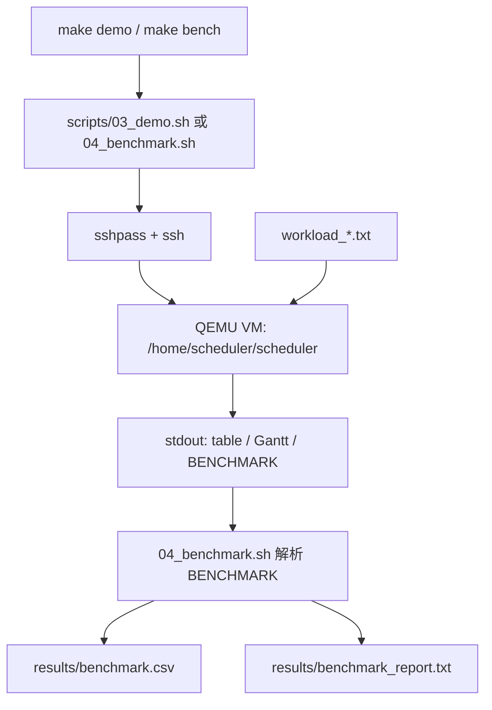
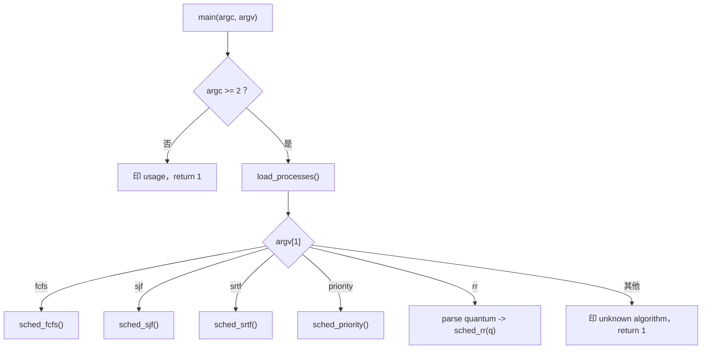
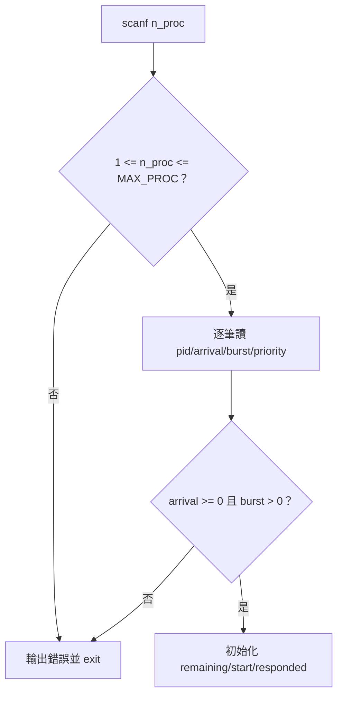
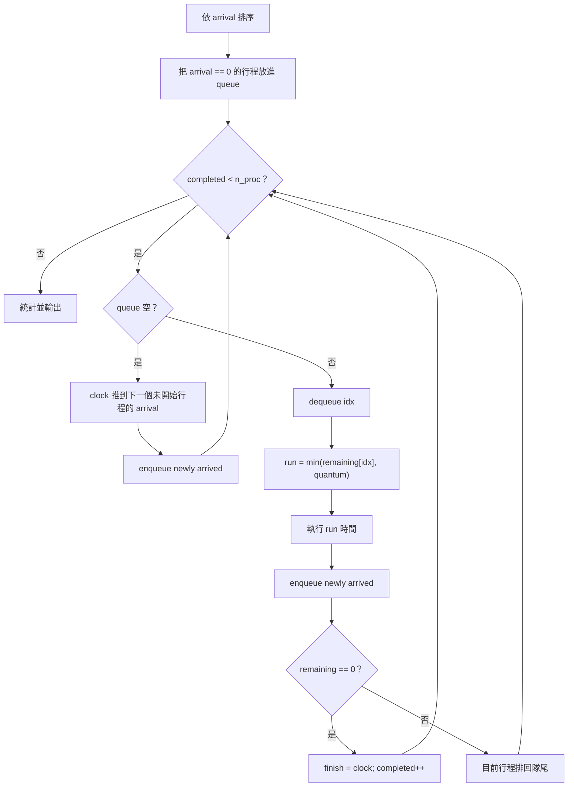
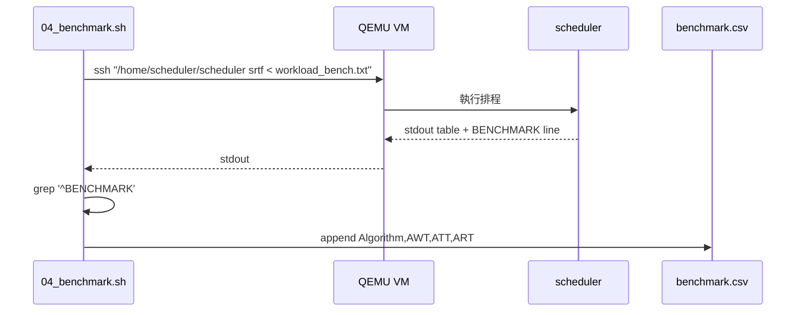
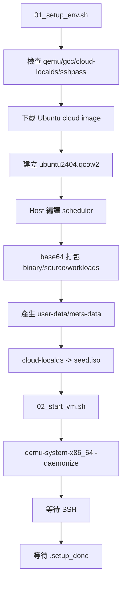
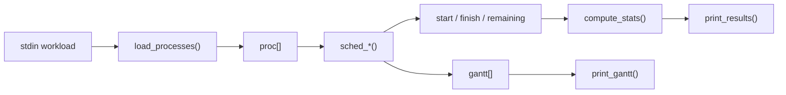
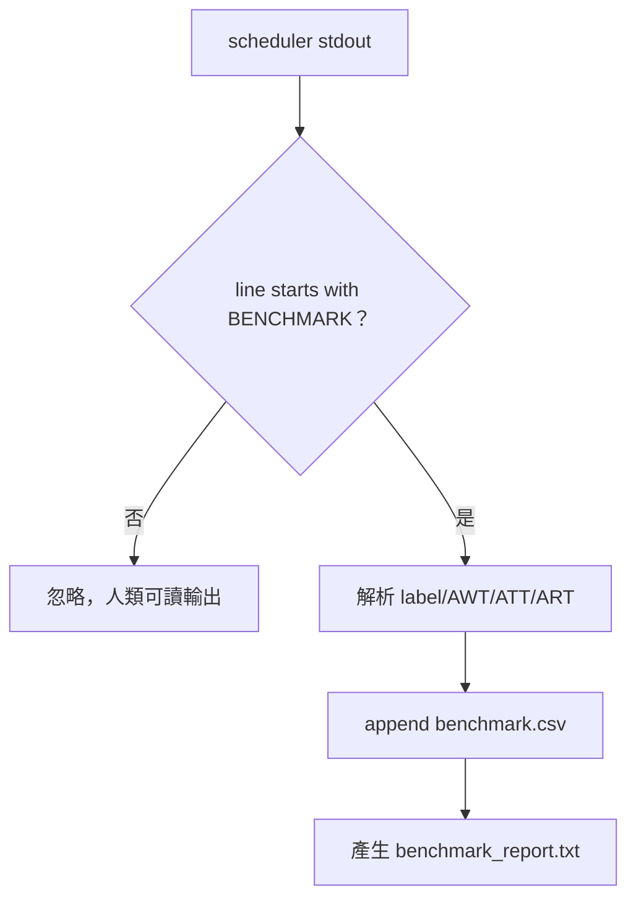

# CPU Scheduling Simulator API 與程式流程分析

本文件聚焦在程式碼與腳本的 API 設計。這裡的 API 不只指 C library function，也包含 CLI 介面、workload 格式、Makefile target、QEMU 啟動參數、Cloud-init 設定、SSH 執行流程，以及 benchmark script 與 scheduler 之間的輸出契約。

---

## 1. 文件範圍

本文件分析下列檔案：

```text
src/scheduler.c
Makefile
scripts/01_setup_env.sh
scripts/02_start_vm.sh
scripts/03_demo.sh
scripts/04_benchmark.sh
scripts/05_cleanup.sh
src/workload_demo.txt
src/workload_bench.txt
```

主要問題：

- scheduler 的外部使用方式是什麼？
- 每個 C 函式負責哪一段流程？
- 為什麼使用某些 API，而不是其他相似做法？
- Host script 如何把程式放進 QEMU VM 並執行？
- Benchmark 如何避免解析脆弱的表格輸出？
- 開發時遇到的 bug 與修正方式是什麼？

---

## 2. 系統 API 總覽

整體可以看成四種介面：

| 類型 | 介面 | 使用者 |
| --- | --- | --- |
| CLI API | `scheduler <algorithm> [time_quantum]` | 人、shell script |
| Input API | workload text format | `load_processes()` |
| Output API | table + Gantt Chart + `BENCHMARK` line | 人、benchmark script |
| Automation API | Makefile target + shell scripts | 人、CI 或 demo 流程 |

整體呼叫鏈：



---

## 3. CLI API：`scheduler <algorithm> [time_quantum]`

### 3.1 使用方式

```bash
./scheduler fcfs < src/workload_demo.txt
./scheduler sjf < src/workload_demo.txt
./scheduler srtf < src/workload_demo.txt
./scheduler priority < src/workload_demo.txt
./scheduler rr 2 < src/workload_demo.txt
```

### 3.2 參數

| 參數 | 英文 | 說明 |
| --- | --- | --- |
| `algorithm` | Scheduling Algorithm | 指定排程策略：`fcfs`, `sjf`, `srtf`, `priority`, `rr` |
| `time_quantum` | Time Quantum | 只有 `rr` 需要，必須是正整數 |

### 3.3 Algorithm dispatch

`main()` 使用 `strcmp()` 比對 `argv[1]`，再呼叫對應函式。

```text
fcfs     -> sched_fcfs()
sjf      -> sched_sjf()
srtf     -> sched_srtf()
priority -> sched_priority()
rr       -> parse_quantum() -> sched_rr(q)
```



### 3.4 `strcmp()` 與相似做法比較

| 做法 | 優點 | 缺點 | 本專案選擇 |
| --- | --- | --- | --- |
| `strcmp()` if/else | 直覺、流程容易追 | algorithm 變多時會變長 | 目前演算法數量少，適合 |
| function pointer table | 擴充性好，新增演算法只要加表格列 | 需要理解函式指標 | 可作為後續重構方向 |
| `switch` + enum | 結構清楚 | 仍要先把字串轉 enum | 對目前規模不是必要 |

---

## 4. Workload Input API

### 4.1 格式

```text
<n_proc>
<pid> <arrival> <burst> <priority>
...
```

範例：

```text
6
1 0 8 3
2 1 4 1
3 2 9 4
4 3 5 2
5 4 2 5
6 5 1 3
```

### 4.2 欄位語意

| 欄位 | 英文 | 程式欄位 | 規則 |
| --- | --- | --- | --- |
| 行程數 | Process Count | `n_proc` | `1 <= n_proc <= MAX_PROC` |
| 行程 ID | Process ID | `pid` | 用於輸出與 Gantt Chart |
| 到達時間 | Arrival Time | `arrival` | 不可小於 0 |
| CPU 執行時間 | Burst Time | `burst` | 必須大於 0 |
| 優先權 | Priority | `priority` | 數值越小優先權越高 |

### 4.3 `scanf()` 與相似 API 比較

| API | 優點 | 缺點 | 適用情境 |
| --- | --- | --- | --- |
| `scanf()` | 寫法短，適合固定欄位格式 | 錯誤訊息較難精準，處理註解行不方便 | 本專案 workload 格式固定，因此可用 |
| `fgets()` + `sscanf()` | 可以保留整行，錯誤訊息較好做 | 程式碼較長 | 若要支援空行、註解、行號錯誤提示，可改用 |
| 自訂 parser | 彈性最大 | 成本最高，容易過度設計 | 若 workload 語法變複雜才需要 |

本專案使用 `scanf()`，因為 workload 是固定格式。不過程式仍需要檢查 `n_proc`、`arrival`、`burst`，避免非法輸入造成陣列越界或排程時間不前進。

---

## 5. Output API

Scheduler 會輸出三種資訊。

### 5.1 人類可讀表格

```text
PID    Arrival  Burst   Start    Finish     Wait     TAT
1      0        8       0        8          0        8
```

表格適合人看，但不適合 script 依賴，因為欄寬或標題可能調整。

### 5.2 Gantt Chart

```text
Gantt Chart:
| P1  | P2  | P6  | P5  |
0     1     5     6     8
```

Gantt Chart 用來看 CPU 在每段時間執行哪個行程。

### 5.3 Machine-readable `BENCHMARK` line

```text
BENCHMARK SRTF_Preemptive AWT=6.1667 ATT=11.0000 ART=4.1667
```

`04_benchmark.sh` 只解析這一行。

### 5.4 輸出格式比較

| 格式 | 優點 | 缺點 | 本專案選擇 |
| --- | --- | --- | --- |
| 表格 | 人類易讀 | 對 script 不穩定 | 保留，作為 demo 輸出 |
| 單行 key/value | shell 容易解析 | 結構比 JSON 少 | 用於 `BENCHMARK` |
| CSV | Excel/Python 容易讀 | 不適合直接顯示細節 | 由 benchmark script 產生 |
| JSON | 結構完整 | 需要 JSON parser | 可作為未來輸出格式 |

選擇 `BENCHMARK` 單行的原因是 shell script 用 `grep`、`awk`、`grep -oP` 就能穩定抽取欄位，不需要額外安裝 JSON 工具。

---

## 6. 核心資料結構

### 6.1 `Process`

```c
typedef struct {
    int pid;
    int arrival;
    int burst;
    int remaining;
    int priority;
    int start;
    int finish;
    int waiting;
    int turnaround;
    int response;
    int responded;
} Process;
```

欄位分組：

| 分組 | 欄位 | 說明 |
| --- | --- | --- |
| Workload input | `pid`, `arrival`, `burst`, `priority` | 從 workload 讀入 |
| Runtime state | `remaining`, `start`, `finish` | 排程過程會更新 |
| Derived metrics | `waiting`, `turnaround`, `response` | 排程完成後計算 |
| Reserved flag | `responded` | 保留欄位，目前主要由 `start == -1` 判斷首次執行 |

### 6.2 `GanttSlot`

```c
typedef struct {
    int pid;
    int start;
    int end;
} GanttSlot;
```

每個 slot 代表 CPU 從 `start` 到 `end` 執行 `pid`。

```text
GanttSlot { pid = 2, start = 1, end = 5 }
代表 P2 在時間 [1, 5) 執行
```

### 6.3 靜態陣列與動態配置比較

| 做法 | 優點 | 缺點 | 本專案選擇 |
| --- | --- | --- | --- |
| 固定陣列 | 簡單、容易追蹤、不需要 `malloc/free` | 有容量上限 | 適合小型 workload |
| `malloc()` 動態配置 | 可依輸入大小配置 | 要處理釋放與錯誤路徑 | 大型 workload 可改用 |
| linked list | 插入刪除彈性高 | cache locality 差，程式較長 | 不適合目前需求 |

本專案使用固定陣列，但用 `MAX_PROC`、`MAX_GANTT_SLOT`、`MAX_QUEUE_SLOT` 把容量限制明確寫出來。

---

## 7. 核心函式 API

### 7.1 `load_processes()`

責任：

- 從 `stdin` 讀 workload。
- 寫入全域 `proc[]`。
- 初始化 `remaining`、`start`、`responded`。
- 檢查基本輸入範圍。

流程：



### 7.2 `gantt_push(pid, start, end)`

責任：

- 記錄 CPU 執行區間。
- 如果上一個 Gantt slot 是同一個 PID，就合併區間。
- 檢查 Gantt slot 容量。

合併例子：

```text
原本:
| P1 [0,1] |

push P1 [1,2]

合併後:
| P1 [0,2] |
```

這對 SRTF 很重要。SRTF 每 tick 呼叫一次 `gantt_push()`，如果同一個行程連續執行，就不需要印出一堆重複片段。

### 7.3 `compute_stats()`

責任：

- 根據 `arrival`、`burst`、`start`、`finish` 計算 WT/TAT/RT。

公式：

```text
turnaround = finish - arrival
waiting    = turnaround - burst
response   = start - arrival
```

這個函式被所有演算法共用，避免每個 `sched_*()` 重複寫統計公式。

### 7.4 `print_results(algo_label)`

責任：

- 印出 per-process 表格。
- 計算平均 AWT/ATT/ART。
- 印出 `BENCHMARK` line。

`algo_label` 同時給人看，也給 benchmark parser 使用，因此不能包含空白。Round Robin 使用 `RoundRobin_Q%d` 這種格式，避免 shell parsing 需要處理 quoted string。

### 7.5 `print_gantt()`

責任：

- 印出 Gantt Chart。
- 使用 `gantt[]` 的 `pid` 與 `end` 顯示時間軸。

目前 Gantt Chart 以純文字輸出，優點是任何終端機都能看。缺點是行程數太多或時間太長時會很寬。

---

## 8. 排程函式分析

### 8.1 `sched_fcfs()`

使用 API：

- `qsort(proc, n_proc, sizeof(Process), cmp_arrival)`
- `gantt_push()`
- `compute_stats()`
- `print_results()`
- `print_gantt()`

流程：

```text
sort by arrival
for each process:
    if clock < arrival:
        clock = arrival
    start = clock
    finish = clock + burst
    gantt_push()
    clock = finish
```

為什麼 FCFS 適合用 `qsort()`：

FCFS 的選擇條件是固定的 arrival order。排序一次後，後續不需要動態重新挑選。

### 8.2 `sched_sjf()`

使用 API：

- 手動掃描 `proc[]`
- `done[]` 記錄完成狀態
- `INT_MAX` 表示尚未找到下一個 arrival

流程：

```text
while completed < n_proc:
    scan all proc
    choose arrived && !done && smallest burst
    if none ready:
        clock = next arrival
    else:
        run selected process to finish
```

為什麼不用 `qsort(cmp_burst)`：

SJF 不是把全部行程照 burst 排序後直接跑。它只能從「已到達」的行程中挑最短者。若一開始就用 burst 全域排序，可能會選到尚未到達的行程，排程語意會錯。

### 8.3 `sched_srtf()`

使用 API：

- 每個 tick 掃描 `proc[]`
- 更新 `remaining`
- 第一次執行時設定 `start`
- 完成時設定 `finish`

流程：

```text
while completed < n_proc:
    choose arrived && remaining > 0 && smallest remaining
    if none ready:
        clock++
    else:
        run 1 tick
        remaining--
        clock++
        if remaining == 0:
            finish = clock
```

SRTF 是搶佔式，所以不能只在行程完成時做選擇。每個 tick 都要重新檢查，因為新到達的短行程可能搶佔正在執行的長行程。

### 8.4 `sched_priority()`

使用 API：

- 手動掃描 `proc[]`
- `done[]` 記錄完成狀態
- priority 數值越小優先權越高

Priority 與 SJF 的差異：

| 演算法 | 選擇依據 |
| --- | --- |
| SJF | 最小 `burst` |
| Priority | 最小 `priority` |

兩者都要遵守 `arrival <= clock`，所以都使用 ready set 掃描。

### 8.5 `sched_rr(int quantum)`

使用 API：

- `qsort(..., cmp_arrival)` 先依到達時間排序。
- 固定陣列 `queue[]` 模擬 FIFO ready queue。
- `rr_enqueue()` 集中檢查 queue 容量。
- `remaining[]` 記錄每個行程剩餘時間。

Round Robin 流程圖：



為什麼 RR 需要 queue：

Round Robin 的公平性來自輪流執行。若每次都掃描陣列挑選，就要額外維持「誰下一個」的狀態。FIFO queue 能直接表達這個規則。

---

## 9. Comparator Callback

### 9.1 `cmp_arrival()`

給 `qsort()` 使用，排序規則：

1. arrival 小的在前。
2. arrival 相同時 pid 小的在前，讓輸出穩定。

### 9.2 `cmp_burst()` 與 `cmp_priority()`

這兩個 comparator 表達 burst/priority 排序規則，但目前 SJF 與 Priority 不直接使用 `qsort()`。原因是它們的 ready set 會跟 `clock` 一起改變。

### 9.3 `qsort()` callback 概念

`qsort()` 不知道 `Process` 要怎麼排序，所以呼叫端要提供 comparator function。這種把函式傳給函式的方式，就是 callback。

```text
sched_fcfs()
  -> qsort(..., cmp_arrival)
       -> qsort 內部多次呼叫 cmp_arrival(a, b)
```

### 9.4 `qsort()`、手動掃描、priority queue 比較

| 做法 | 適合演算法 | 優點 | 缺點 |
| --- | --- | --- | --- |
| `qsort()` 一次排序 | FCFS、RR 初始排序 | 簡單，標準函式庫提供 | 不適合 ready set 動態變動 |
| 每輪手動掃描 | SJF、SRTF、Priority | 邏輯直觀，可直接看 arrival 條件 | 時間複雜度較高 |
| priority queue / heap | 大量行程的 SJF、Priority | 取最小值效率高 | 實作與除錯成本較高 |

本專案 workload 小，手動掃描更容易讀懂，也能避免引入額外資料結構。

---

## 10. C 標準函式與選擇依據

| API | 使用位置 | 用途 | 注意事項 |
| --- | --- | --- | --- |
| `scanf()` | `load_processes()` | 讀取 workload | 要檢查回傳值與輸入範圍 |
| `printf()` | output functions | 印出結果 | 表格給人看，不給 script 當穩定格式 |
| `fprintf(stderr, ...)` | error path | 印錯誤訊息 | 錯誤輸出不要混到 stdout benchmark |
| `qsort()` | FCFS/RR | 依 arrival 排序 | comparator 不建議用直接相減避免 overflow |
| `strcmp()` | `main()` | 比對 algorithm 字串 | algorithm 多時可改 dispatch table |
| `strtol()` | RR quantum parsing | 安全解析整數 | 可檢查非數字、0、負數、過大 |
| `snprintf()` | RR label | 建立 `RoundRobin_Q%d` | 比 `sprintf()` 安全，能限制 buffer |
| `exit(1)` | input error | 中止程式 | 若改成 library，可回傳 error code |

### 10.1 `atoi()` 與 `strtol()` 比較

| API | 優點 | 缺點 |
| --- | --- | --- |
| `atoi()` | 簡短 | 無法分辨 `0`、非法字串、空字串 |
| `strtol()` | 可檢查 end pointer、範圍與錯誤 | 寫法稍長 |

Round Robin 的 quantum 會影響 clock 是否前進，所以需要嚴格檢查。`strtol()` 比 `atoi()` 適合。

### 10.2 `sprintf()` 與 `snprintf()` 比較

| API | 風險 |
| --- | --- |
| `sprintf()` | 不知道目標 buffer 大小，可能寫爆 |
| `snprintf()` | 傳入 buffer 大小，較安全 |

本專案使用：

```c
snprintf(label, sizeof(label), "RoundRobin_Q%d", quantum);
```

---

## 11. Shell Script API

### 11.1 `set -euo pipefail`

所有腳本都使用：

```bash
set -euo pipefail
```

意義：

| 選項 | 說明 |
| --- | --- |
| `-e` | 指令失敗時停止腳本 |
| `-u` | 使用未定義變數時停止 |
| `pipefail` | pipeline 中任一指令失敗，整段視為失敗 |

這能避免錯誤被默默吞掉。例如 benchmark parser 沒抓到 `BENCHMARK`，腳本應該失敗，而不是產生假的 CSV。

### 11.2 Logging helpers

腳本使用：

```bash
info()
success()
warn()
die()
```

優點：

- 訊息格式一致。
- `die()` 統一輸出錯誤並 `exit 1`。
- 後續若要改顏色或格式，只改 helper。

### 11.3 `sshpass` 與 SSH key 比較

| 做法 | 優點 | 缺點 | 適合情境 |
| --- | --- | --- | --- |
| `sshpass` + 密碼 | demo 快速，不需要先產生 key | 不適合正式環境 | 本機 demo 與短期 VM |
| SSH key | 安全、可自動化 | 要管理 key 與 authorized_keys | 長期環境、CI、伺服器 |

本專案使用 `sshpass` 是為了降低本機 demo 的前置設定。正式環境應改用 SSH key。

---

## 12. QEMU 與 Cloud-init API

### 12.1 `01_setup_env.sh`

主要工作：

```text
檢查工具
  -> 下載 Ubuntu cloud image
  -> qemu-img convert / resize
  -> gcc 編譯 scheduler
  -> base64 編碼 binary/source/workload
  -> 產生 user-data / meta-data
  -> cloud-localds 建立 seed.iso
```

### 12.2 `qemu-img convert` 與 `qemu-img resize`

| 指令 | 用途 |
| --- | --- |
| `qemu-img convert` | 將 base image 複製成專案使用的 VM disk |
| `qemu-img resize` | 調整 disk 容量 |

這樣 base image 可以保留，實際實驗用的是可刪除的 `ubuntu2404.qcow2`。

### 12.3 Cloud-init seed ISO

Cloud-init 需要兩個主要檔案：

| 檔案 | 說明 |
| --- | --- |
| `user-data` | 使用者、密碼、開機後要執行的命令 |
| `meta-data` | instance id、hostname |

`cloud-localds` 將它們打包成：

```text
vm/seed.iso
```

VM 開機時掛載 seed ISO，cloud-init 讀取設定後建立使用者與寫入 scheduler 檔案。

### 12.4 Cloud-init 與開機後 `scp` 比較

| 做法 | 優點 | 缺點 | 本專案選擇 |
| --- | --- | --- | --- |
| Cloud-init | VM 第一次開機自動完成佈署 | 要處理 ready marker | 使用 |
| `scp` after boot | 流程直覺，檔案更新容易 | 必須先等 SSH，可重現性較低 | 不採用 |
| Packer image | 可產生完整映像檔 | 工具較重 | 專案規模不需要 |

Cloud-init 的重點是把 VM 狀態寫進 seed ISO，使 VM 啟動後自己完成設定。

### 12.5 `02_start_vm.sh`

啟動 QEMU 的核心參數：

| 參數 | 說明 |
| --- | --- |
| `-machine ...,accel=...` | 指定 machine type 與加速方式 |
| `-cpu ...` | 指定 CPU 模型 |
| `-smp` | vCPU 數量 |
| `-m` | 記憶體大小 |
| `-drive file=...,if=virtio` | 掛載 VM disk 與 seed ISO |
| `-netdev user,hostfwd=...` | 使用 user-mode NAT 與 port forwarding |
| `-display none` | 不開圖形視窗 |
| `-daemonize` | 背景執行 |
| `-pidfile` | 寫入 QEMU PID |
| `-serial file:...` | 保存 serial log |

### 12.6 KVM 與 TCG 比較

| 模式 | 英文 | 優點 | 缺點 |
| --- | --- | --- | --- |
| KVM | Kernel-based Virtual Machine | 速度快，接近原生執行 | 需要硬體與權限 |
| TCG | Tiny Code Generator | 不需要 KVM，兼容性高 | 慢很多 |

腳本的策略：

```text
如果 /dev/kvm 可用:
    使用 KVM + q35 + host CPU
否則:
    使用 TCG + pc + qemu64，並拉長 timeout
```

### 12.7 User-mode NAT 與 Bridge Network 比較

| 網路模式 | 優點 | 缺點 | 本專案選擇 |
| --- | --- | --- | --- |
| User-mode NAT | 不需要 root 網路設定，port forwarding 簡單 | VM 對外服務較受限 | 使用 |
| Bridge | VM 像區網內一台主機 | 設定較複雜，可能需要管理權限 | 不採用 |
| TAP | 彈性高 | 設定成本高 | 不採用 |

本專案只需要 Host 透過 SSH 連進 VM，因此 user-mode NAT 已足夠。

---

## 13. Benchmark Script API

### 13.1 `run_bench()`

責任：

1. 透過 SSH 在 VM 內執行 scheduler。
2. 抓出 `BENCHMARK` line。
3. 解析 label、AWT、ATT、ART。
4. 寫入 CSV。
5. 回傳一列資料給 summary table。

資料流：



### 13.2 `grep` / `awk` / `bc`

| 工具 | 用途 |
| --- | --- |
| `grep '^BENCHMARK'` | 找出機器可讀列 |
| `awk '{print $2}'` | 取出 algorithm label |
| `grep -oP 'AWT=\K[\d.]+'` | 取出數值 |
| `bc -l` | 比較浮點數大小 |

### 13.3 為什麼不用只靠 Bash 整數運算

Bash 原生算術偏整數，benchmark 指標是小數，例如：

```text
13.3333
```

所以比較大小時使用 `bc -l`。若未來改用 Python 處理報表，就可以不依賴 `bc`。

---

## 14. Makefile API

Makefile 提供固定 target，讓使用者不用記每支腳本。

| Target | 作用 |
| --- | --- |
| `build` | 在 Host 編譯 `src/scheduler.c` |
| `demo-host` | 不進 VM，直接在 Host 跑 demo workload |
| `setup` | 建立 VM 環境 |
| `start` | 啟動 VM |
| `demo` | 在 VM 跑 demo |
| `bench` | 在 VM 跑 benchmark |
| `clean` | 停 VM 並刪除產物 |
| `clean-full` | 額外刪除 base image |
| `all` | `setup -> start -> demo -> bench` |

### 14.1 Makefile target 與直接執行 script 比較

| 做法 | 優點 | 缺點 |
| --- | --- | --- |
| `make demo` | 指令短、流程固定 | 需要知道 target 名稱 |
| `bash scripts/03_demo.sh` | 直接清楚 | 指令較長 |

兩種方式都保留，方便不同使用習慣。

---

## 15. 重點功能運作圖

### 15.1 VM 建置與啟動



### 15.2 排程核心資料流



### 15.3 SRTF 搶佔範例

```text
時間 0: P1 到達，remaining=8，執行 P1
時間 1: P2 到達，remaining=4，小於 P1 remaining=7，改執行 P2
時間 5: P2 完成，P6 到達且 burst=1，執行 P6

Gantt:
0     1     5     6
| P1  | P2  | P6  |
```

### 15.4 Benchmark 解析契約



---

## 16. 開發問題與 API 層面的修正

### 16.1 Ready condition 定義錯誤

問題：

SSH ready 不等於 scheduler ready。

API 層面的修正：

- 新增 `.setup_done` 作為 cloud-init 與 start script 的同步檔案。
- start script 的完成條件改成：

```text
SSH 可連線
AND /home/scheduler/scheduler 可執行
AND .setup_done 內含 SCHEDULER_READY
```

這是把隱含狀態改成明確 API。

### 16.2 `atoi()` 無法保護 Round Robin quantum

問題：

`atoi("abc")` 與 `atoi("0")` 都可能得到 0，程式無法知道使用者輸入不合法。

修正：

使用 `strtol()`，檢查：

- 是否有成功解析數字。
- 字串結尾是否沒有多餘字元。
- 數值是否大於 0。
- 數值是否沒有超過 `INT_MAX`。

### 16.3 固定陣列缺少容量檢查

問題：

`proc[]`、`gantt[]`、RR `queue[]` 都是固定容量。如果只依賴「測資不會太大」，程式遇到異常輸入時會不安全。

修正：

- `load_processes()` 檢查 `n_proc`。
- `gantt_push()` 檢查 `n_gantt`。
- `rr_enqueue()` 檢查 `q_tail`。

這讓容量限制變成程式可檢查的規格。

### 16.4 表格輸出不適合作為 script API

問題：

人類可讀表格可能會為了對齊而改欄寬，script 解析容易壞。

修正：

新增固定格式：

```text
BENCHMARK <label> AWT=<f> ATT=<f> ART=<f>
```

這行就是 scheduler 對 benchmark script 的輸出 API。

### 16.5 Unicode 裝飾字元跨環境不穩

問題：

部分終端機或檔案編碼設定不一致時，框線字元會變成亂碼。

修正：

- 文件使用 UTF-8。
- 腳本分隔線改用 ASCII。
- 重要欄位使用文字標題與表格，不靠特殊符號。

---

## 17. 後續可改進的 API 設計

### 17.1 增加 JSON 輸出

可以新增：

```bash
./scheduler srtf --json < workload.txt
```

優點：

- Python、JavaScript、jq 都容易處理。
- 結構比單行 key/value 更完整。

缺點：

- C 端要處理 JSON escaping。
- 初期會增加程式碼量。

### 17.2 改成 dispatch table

目前：

```text
if strcmp(...) sched_fcfs()
else if strcmp(...) sched_sjf()
...
```

可改成：

```c
struct Algorithm {
    const char *name;
    void (*run)(void);
};
```

優點是新增演算法時更集中。缺點是需要理解 function pointer。

### 17.3 使用動態資料結構

如果要支援大型 workload，可以把：

- `proc[MAX_PROC]`
- `gantt[MAX_GANTT_SLOT]`
- `queue[MAX_QUEUE_SLOT]`

改成動態配置。這會增加錯誤處理與記憶體釋放責任，但能解除固定容量限制。

### 17.4 加入 context switch overhead 參數

可以新增 CLI：

```bash
./scheduler rr 2 --context-switch 1 < workload.txt
```

當 PID 變更時，clock 額外增加 overhead。這會讓 SRTF/RR 的結果更接近真實系統。

---

## 18. 小結

本專案的 API 設計重點是清楚分層：

- `scheduler.c` 專注排程與統計。
- workload text format 是輸入 API。
- `BENCHMARK` line 是 script 穩定解析的輸出 API。
- Makefile 與 shell scripts 是環境自動化 API。
- QEMU/Cloud-init 提供可重複的執行環境。

最重要的是先分清楚兩種輸出：表格與 Gantt Chart 是給人看，`BENCHMARK` 是給程式解析。也要注意 C 程式中的固定陣列、輸入檢查、時間是否前進，這些都是排程模擬器很容易出錯的地方。
