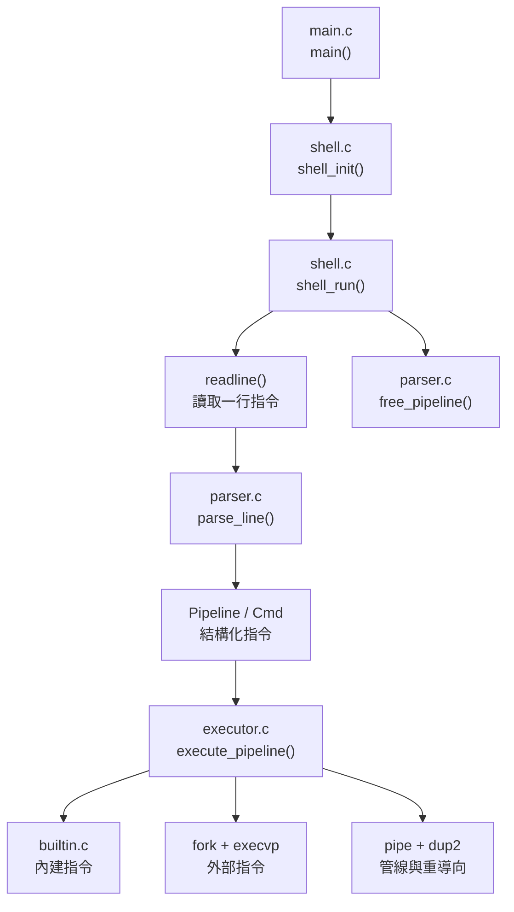
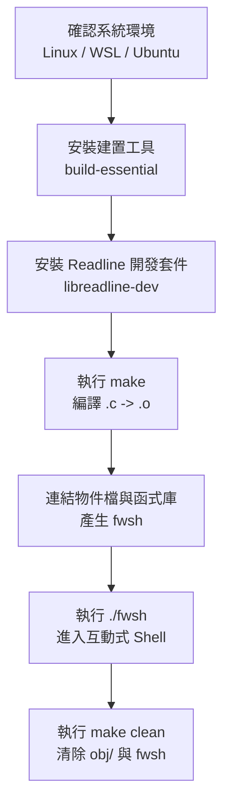
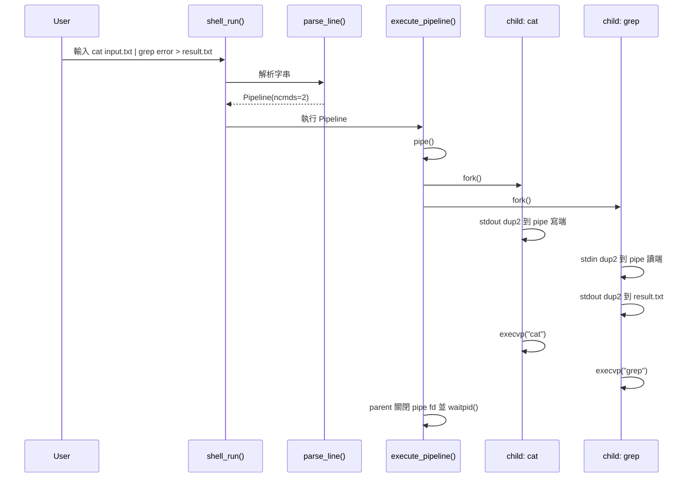

# fwsh (Firmware Mini Shell)

[](LICENSE)
[](https://www.linux.org/)
[](https://en.cppreference.com/w/c/11)

`fwsh` 是一個用 C 實作的 Linux 迷你 Shell。它的重點不是取代 `bash`，而是把 Shell 會用到的作業系統觀念拆開來實作：讀取指令、解析參數、建立子行程、串接管線、處理重導向，以及回收背景行程。

除了基本 Shell 功能，`fwsh` 也放入幾個偏韌體開發會用到的小工具，例如 `hexdump`、`crc32`、`memmap`。這些工具讓使用者可以直接在自己的 Shell 裡檢查二進位檔案、驗證 CRC-32 檢查碼，或觀察 Linux 的實體記憶體配置。

---

## 專案定位

`fwsh` 適合用來理解三件事：

1. Shell 如何把一行文字變成可執行的指令結構。
2. Linux userspace 程式如何使用 `fork()`、`execvp()`、`pipe()`、`dup2()`、`waitpid()`。
3. 韌體或底層系統開發常見的二進位檢查流程，例如 Hexdump 和 CRC-32。

本專案目前是互動式 Shell，不是完整 POSIX Shell。也就是說，它支援常見的管線與重導向語法，但尚未實作變數展開、萬用字元展開、腳本語法、完整工作控制等功能。

---

## 已驗證功能

| 功能 | 語法或指令 | 說明 |
|---|---|---|
| 一般外部指令 | `ls`, `cat`, `grep`, `wc` | 透過 `fork()` 建立子行程，再用 `execvp()` 執行。 |
| 管線 (Pipeline) | `printf abc \| wc -c` | 用 `pipe()` 建立資料通道，前一段的 stdout 接到下一段的 stdin。 |
| 輸入重導向 (Input Redirection) | `cat < file.txt` | 子行程用 `open()` 和 `dup2()` 把檔案接到 stdin。 |
| 輸出重導向 (Output Redirection) | `cmd > out.txt`, `cmd >> out.txt` | `>` 覆寫檔案，`>>` 追加到檔案結尾。 |
| 背景執行 (Background Execution) | `sleep 10 &` | Shell 不等待該指令結束，後續由 `SIGCHLD` handler 回收。 |
| 歷史紀錄 (History) | `history`, `Ctrl+R` | 同時使用 GNU Readline history 與 fwsh 自己的環形緩衝區。 |
| 韌體工具 | `hexdump`, `crc32`, `memmap` | 內建二進位檢視、CRC-32 計算、實體記憶體配置顯示。 |

注意：目前「單一前景內建指令」會直接在 Shell 行程中執行，因此 `cd` 和 `exit` 才能改變 Shell 狀態。不過這也表示 `pwd > out.txt` 這種「內建指令直接重導向」目前尚未接上 redirection 流程。若要輸出到檔案，可以改用外部指令，例如 `/bin/pwd > out.txt`。

---

## 關鍵字快速說明

| 關鍵字 | 英文 | 說明 |
|---|---|---|
| Shell | Shell | 介於使用者和作業系統之間的命令列介面。使用者輸入文字，Shell 解析後執行程式。 |
| REPL | Read-Eval-Print Loop | 讀取輸入、解析執行、輸出結果、回到下一輪。`fwsh` 的主迴圈就在 `shell_run()`。 |
| 行程 | Process | 作業系統執行中的程式實體。每個行程有自己的 PID、記憶體空間與檔案描述符。 |
| 子行程 | Child Process | 由父行程透過 `fork()` 建立的新行程。Shell 常用子行程執行外部指令。 |
| 管線 | Pipeline | 由 `|` 串接的多段指令，例如 `cat log | grep error | wc -l`。 |
| 匿名管線 | Anonymous Pipe | `pipe()` 建立的一對 fd，只能單向傳資料，常用於父子行程或兄弟子行程間通訊。 |
| 檔案描述符 | File Descriptor, FD | Linux 用整數代表開啟中的檔案或 I/O 端點。`0` 是 stdin，`1` 是 stdout，`2` 是 stderr。 |
| 重導向 | Redirection | 改變 stdin/stdout 的來源或目的地，例如從檔案讀入或輸出到檔案。 |
| 內建指令 | Built-in Command | 不透過外部程式，直接由 Shell 自己的 C 函式執行，例如 `cd`、`history`。 |
| 外部指令 | External Command | 系統上獨立存在的程式，例如 `/bin/ls`、`/usr/bin/grep`。 |
| 訊號 | Signal | Linux 通知行程事件的機制，例如 `SIGINT` 代表 Ctrl+C，`SIGCHLD` 代表子行程狀態改變。 |
| 殭屍行程 | Zombie Process | 子行程已結束，但父行程尚未 `wait()` 回收狀態，仍占用行程表項目。 |
| CRC-32 | Cyclic Redundancy Check 32-bit | 常用的資料完整性檢查碼。韌體更新、封包傳輸、映像檔驗證都常見。 |
| Hexdump | Hexadecimal Dump | 以十六進位和 ASCII 對照方式顯示二進位內容，方便觀察檔頭、字串、填充值。 |
| 實體記憶體圖 | Physical Memory Map | 系統實體位址空間配置。Linux 可從 `/proc/iomem` 觀察。 |
| 編譯器 | Compiler | 將 C 原始碼轉成機器可執行或可連結的目的碼。本專案使用 `gcc`。 |
| 連結器 | Linker | 將多個 `.o` 目的檔和外部函式庫合併成最終執行檔。 |
| 標頭檔 | Header File | `.h` 檔，放結構定義、巨集與函式宣告，讓不同 `.c` 檔能共用介面。 |
| 函式庫 | Library | 已寫好的功能集合。本專案連結 GNU Readline 來提供行編輯與歷史紀錄。 |
| Makefile | Makefile | 描述如何編譯、連結、清除與執行專案的建置腳本。 |
| 目標 | Target | Makefile 中可執行的工作名稱，例如 `all`、`clean`、`run`。 |
| 目的檔 | Object File | `.o` 檔，由 `.c` 編譯而來，還不是完整程式，需要再連結。 |
| 標準輸入 | Standard Input, stdin | 程式預設讀取資料的位置，檔案描述符是 `0`。 |
| 標準輸出 | Standard Output, stdout | 程式預設輸出資料的位置，檔案描述符是 `1`。 |
| 標準錯誤 | Standard Error, stderr | 程式輸出錯誤訊息的位置，檔案描述符是 `2`。 |
| 結束碼 | Exit Status | 指令結束後回傳給父行程的狀態碼。通常 `0` 表示成功，非 `0` 表示錯誤。 |

---

## 專案架構

```text
fwsh/
├── include/
│   ├── shell.h        # 共用資料結構、常數、Shell 狀態
│   ├── parser.h       # parse_line() 與 free_pipeline()
│   ├── executor.h     # execute_pipeline()
│   └── builtin.h      # is_builtin() 與 exec_builtin()
├── src/
│   ├── main.c         # 程式入口，只負責 init -> run -> cleanup
│   ├── shell.c        # REPL、提示字元、Readline、Signal handlers
│   ├── parser.c       # 將一行文字解析成 Pipeline / Cmd
│   ├── executor.c     # fork、exec、pipe、dup2、waitpid
│   └── builtin.c      # cd/pwd/help/history 與 hexdump/crc32/memmap
├── docs/
│   └── *.png          # 執行畫面與展示圖片
├── Makefile
├── README_fwsh.md
├── report_fwsh.md
└── report_fwsh_api.md
```

模組關係可以簡化成下圖：



---

## 建置與執行

這一段的目的，是讓使用者從一份乾淨的原始碼開始，確認環境、編譯出 `fwsh`、啟動 Shell，最後知道如何清掉建置產物。建置流程不是只為了「產生執行檔」，也用來驗證專案的檔案結構、標頭檔引用、外部函式庫連結是否正確。

建置流程總覽：



建置相關關鍵字：

| 關鍵字 | 英文 | 在本專案中的涵義 |
|---|---|---|
| 原始碼 | Source Code | `src/*.c` 和 `include/*.h`，是人可以閱讀與修改的 C 程式碼。 |
| 建置 | Build | 從原始碼產生可執行檔的完整流程，包含編譯和連結。 |
| 編譯 | Compile | `gcc` 將每個 `.c` 檔轉成 `.o` 目的檔。 |
| 連結 | Link | 將所有 `.o` 和 Readline 函式庫合併成 `fwsh` 執行檔。 |
| 依賴 | Dependency | 編譯或執行需要的外部套件，例如 `libreadline-dev`。 |
| 開發套件 | Development Package | 提供 header 和 linker 需要的檔案。只有 runtime library 通常不夠編譯。 |
| 目標檔 | Target File | Makefile 產生或操作的目標，例如 `fwsh`、`obj/*.o`。 |
| 清除 | Clean | 移除建置產物，讓下一次編譯從乾淨狀態開始。 |

建置前可以先確認目前位置：

```bash
pwd
ls
```

預期目前目錄會看到：

```text
Makefile
include/
src/
README_fwsh.md
report_fwsh.md
report_fwsh_api.md
```

若不在 `fwsh` 目錄，請先切到專案目錄：

```bash
cd /home/user/Linux-kernel/fwsh
```

### 1. 安裝依賴

Ubuntu / Debian 環境：

```bash
sudo apt update
sudo apt install -y build-essential libreadline-dev
```

這一步的目的：

- `build-essential`：安裝 `gcc`、`make` 等 C 專案常用工具。
- `libreadline-dev`：安裝 GNU Readline 的 header 和連結檔，讓 `#include <readline/readline.h>` 和 `-lreadline` 可以正常工作。

為什麼需要 Readline：

`fwsh` 是互動式 Shell，使用者會一直輸入指令。若只用一般 `fgets()`，需要自己處理上下鍵、游標移動、歷史紀錄和 Tab 補全。GNU Readline 已經提供這些功能，所以 `fwsh` 直接使用它。

`libreadline-dev` 提供 `readline/readline.h`、`readline/history.h` 與連結時需要的開發檔。若只安裝到 runtime library，編譯仍會失敗，常見錯誤如下：

```text
fatal error: readline/history.h: No such file or directory
```

這代表缺少開發套件，不是 `fwsh` 的 C 語法錯誤。安裝 `libreadline-dev` 後重新執行 `make` 即可。

可用以下方式檢查工具是否存在：

```bash
gcc --version
make --version
ls /usr/include/readline/readline.h
ls /usr/include/readline/history.h
```

若最後兩個 `ls` 找不到檔案，通常就是 `libreadline-dev` 尚未安裝。

### 2. 編譯

```bash
make
```

這一步的目的：

把 `src/` 底下的 C 原始碼編譯成目的檔，再連結成 `fwsh` 執行檔。Makefile 會自動收集 `src/*.c`，所以新增新的 `.c` 檔時通常不需要手動改編譯指令。

Makefile 的主要工作：

| 階段 | Makefile 內容 | 說明 |
|---|---|---|
| 收集來源 | `SRCS := $(wildcard $(SRC_DIR)/*.c)` | 找出 `src/` 底下所有 `.c`。 |
| 建立目的檔清單 | `OBJS := ...` | 將 `src/main.c` 對應成 `obj/main.o`。 |
| 編譯 | `$(CC) $(CFLAGS) -MMD -MP -c $< -o $@` | 每個 `.c` 產生一個 `.o`。 |
| 連結 | `$(CC) $^ -o $@ $(LDFLAGS)` | 將所有 `.o` 合成 `fwsh`。 |

成功時會產生執行檔：

```text
fwsh
```

成功時常見輸出：

```text
Compiling src/builtin.c...
Compiling src/executor.c...
Compiling src/main.c...
Compiling src/parser.c...
Compiling src/shell.c...
Linking fwsh...
✓ Build successful: fwsh
```

如果看到 warning，不一定代表建置失敗。要看最後是否有產生 `fwsh`，以及 `make` 是否以錯誤結束。若出現 `fatal error` 或 `make: ***`，通常代表編譯中斷，需要先修正。

編譯後可以確認執行檔是否存在：

```bash
ls -l fwsh
```

若有看到類似 `-rwxr-xr-x` 的權限，表示它是可執行檔。

### 3. 啟動

```bash
./fwsh
```

這一步的目的：

啟動剛剛編譯出的 Shell，進入 `fwsh` 自己的 REPL。前面的 `./` 表示「執行目前目錄下的 `fwsh`」，避免系統去 `$PATH` 其他位置找同名程式。

啟動後會看到提示字元：

```text
[fwsh user@hostname ~/path]$
```

提示字元欄位說明：

| 欄位 | 說明 |
|---|---|
| `fwsh` | 表示目前在 fwsh 裡，不是在一般 bash。 |
| `user` | 目前使用者名稱，來自環境變數 `USER`。 |
| `hostname` | 主機名稱，來自 `gethostname()`。 |
| `~/path` | 目前工作目錄，若位於家目錄下會用 `~` 縮寫。 |

離開方式：

```bash
exit
```

或按下：

```text
Ctrl+D
```

### 4. 清除建置產物

```bash
make clean
```

這一步的目的：

移除編譯過程產生的 `obj/` 目錄與 `fwsh` 執行檔，讓專案回到未建置狀態。這在重新測試建置流程、確認 Makefile 是否完整、或避免提交執行檔時很有用。

清除前後的差異：

| 時機 | 可能存在的檔案 |
|---|---|
| `make` 後 | `fwsh`、`obj/*.o`、`obj/*.d` |
| `make clean` 後 | 上述建置產物會被移除 |

常用建置指令整理：

| 指令 | 目的 | 什麼時候用 |
|---|---|---|
| `make` | 編譯專案。 | 第一次建置或修改程式後。 |
| `make run` | 編譯後直接執行。 | 想快速進入 fwsh 測試。 |
| `make clean` | 清除建置產物。 | 想重新乾淨建置，或避免留下執行檔。 |
| `make debug` | 使用 ASan/UBSan 除錯建置。 | 懷疑有記憶體錯誤或未定義行為。 |
| `make valgrind` | 用 Valgrind 檢查記憶體。 | 想追記憶體洩漏或未初始化讀取。 |
| `make info` | 顯示 Makefile 偵測結果。 | 想確認 Makefile 找到哪些 `.c` 和 `.o`。 |

---

## DEMO 流程總覽

這一段的目的，是用一套固定操作展示 `fwsh` 的主要功能。DEMO 不是隨便輸入幾個指令，而是依序驗證 Shell 的幾個核心能力：啟動、內建指令、外部指令、管線、重導向、韌體工具、背景執行、歷史紀錄和正常離開。

建議 DEMO 前先完成：

```bash
make
./fwsh
```

進入 `fwsh` 後，再依序輸入下列指令。

DEMO 流程表：

| 步驟 | 指令 | 目的 | 觀察重點 |
|---|---|---|---|
| 1 | `pwd` | 確認內建指令可執行。 | 不需要 fork 外部 `/bin/pwd`，直接由 `builtin_pwd()` 處理。 |
| 2 | `printf "abc" \| wc -c > /tmp/fwsh_count.txt` | 展示外部指令、管線與輸出重導向。 | `printf` 的 stdout 進入 pipe，`wc -c` 的 stdout 寫入檔案。 |
| 3 | `cat /tmp/fwsh_count.txt` | 檢查上一個重導向結果。 | 應看到 `3`。 |
| 4 | `hexdump src/main.c 0x40` | 展示二進位檢視工具。 | 看 offset、hex bytes、ASCII 三欄。 |
| 5 | `crc32 src/main.c` | 展示檔案完整性檢查。 | 看 CRC-32 是否印成 8 位十六進位。 |
| 6 | `memmap` | 展示系統記憶體資訊讀取。 | 讀 `/proc/iomem`，在 WSL 可能看到遮蔽後的位址。 |
| 7 | `sleep 10 &` | 展示背景執行。 | Shell 立即回到 prompt，並印出 background PID。 |
| 8 | `history` | 展示歷史紀錄。 | 可看到前面輸入過的指令。 |
| 9 | `exit` | 正常結束 fwsh。 | `g_shell.running` 變成 0，回到原本的系統 Shell。 |

DEMO 關鍵字說明：

| 關鍵字 | 英文 | DEMO 中的涵義 |
|---|---|---|
| 內建指令 | Built-in Command | `pwd`、`history`、`hexdump`、`crc32`、`memmap` 是 fwsh 自己實作的指令。 |
| 外部指令 | External Command | `printf`、`wc`、`cat`、`sleep` 是系統上已有的程式，由 `execvp()` 執行。 |
| 管線 | Pipeline | `|` 將前一個指令的 stdout 接到下一個指令的 stdin。 |
| 重導向 | Redirection | `>` 將 stdout 寫入檔案，不直接印在終端機。 |
| 背景執行 | Background Execution | `&` 讓 Shell 不等待該指令結束，直接回到 prompt。 |
| PID | Process ID | 背景執行時印出的數字，用來識別該子行程。 |
| EOF | End Of File | 管線寫端關閉後，讀端才知道資料結束。這也是 pipe fd 要正確關閉的原因。 |
| `/proc/iomem` | Kernel Memory Map Interface | Linux kernel 提供的實體記憶體配置資訊。 |

完整 DEMO 指令可直接照順序輸入：

```bash
pwd
printf "abc" | wc -c > /tmp/fwsh_count.txt
cat /tmp/fwsh_count.txt
hexdump src/main.c 0x40
crc32 src/main.c
memmap
sleep 10 &
history
exit
```

預期會觀察到：

- `pwd` 印出目前所在目錄。
- `/tmp/fwsh_count.txt` 內容是 `3`。
- `hexdump` 顯示 `src/main.c` 前 `0x40` bytes。
- `crc32` 顯示 `CRC32(...) = 0x????????` 格式。
- `memmap` 顯示 `/proc/iomem` 內容。
- `sleep 10 &` 會印出 `[background] <pid>`，且不會卡住 Shell。
- `history` 會列出剛剛輸入的 DEMO 指令。

DEMO 結束後可回到系統 Shell 清除建置產物：

```bash
make clean
```

---

## 快速操作範例

### 查看目前目錄

```bash
pwd
```

`pwd` 是內建指令，直接呼叫 `builtin_pwd()`，不需要 fork 外部程式。

### 管線與重導向

```bash
printf "abc" | wc -c > /tmp/fwsh_count.txt
cat /tmp/fwsh_count.txt
```

預期結果：

```text
3
```

這行指令做了三件事：

1. `printf "abc"` 輸出 3 個位元組。
2. `|` 把前一段 stdout 接給 `wc -c` 的 stdin。
3. `>` 把 `wc -c` 的 stdout 寫入 `/tmp/fwsh_count.txt`。

### Hexdump 檢查檔案內容

```bash
hexdump src/main.c 0x40
```

輸出會分成三欄：

```text
Offset    00 01 02 ... 0F  |ASCII|
00000000  2F 2A 0D ...     |/*.. |
```

欄位意義：

| 欄位 | 說明 |
|---|---|
| Offset | 目前這列資料在檔案中的偏移量。 |
| Hex bytes | 每個 byte 的十六進位值。 |
| ASCII | 可列印字元直接顯示，不可列印字元以 `.` 代替。 |

### 計算 CRC-32

```bash
crc32 src/main.c
```

輸出格式：

```text
CRC32(src/main.c) = 0x71BF3B59  (551 bytes, 0 KB)
```

CRC-32 常用來確認資料是否被改動。若兩份韌體映像檔內容完全相同，CRC-32 結果也應相同；若任一 byte 改變，結果通常會不同。

### 查看實體記憶體配置

```bash
memmap
```

`memmap` 會讀取 Linux 的 `/proc/iomem`。在 WSL、容器或虛擬化環境中，看到的位址可能被遮蔽成 `00000000-00000000`，這是環境限制，不代表 `memmap` 解析失敗。

### 背景執行

```bash
sleep 10 &
```

Shell 會印出背景行程 PID，例如：

```text
[background] 375534
```

背景行程結束後，`SIGCHLD` handler 會用 `waitpid(-1, WNOHANG)` 回收，避免殭屍行程殘留。

---

## 一行指令如何被執行

以這行為例：

```bash
cat input.txt | grep error > result.txt
```



---

## 目前限制

| 限制 | 說明 | 可行替代方式 |
|---|---|---|
| 尚未支援環境變數展開 | `echo $HOME` 不會把 `$HOME` 展開成路徑。 | 使用外部 `/bin/sh -c 'echo $HOME'`。 |
| 尚未支援萬用字元展開 | `*.c` 不會由 `fwsh` 展開成檔案清單。 | 使用外部 Shell 或直接輸入檔名。 |
| 尚未支援腳本模式 | 目前入口是互動式 REPL。 | 可用 here-doc 餵入指令做簡單驗證。 |
| 尚未支援完整 Job Control | 沒有 `jobs`、`fg`、`bg`。 | 目前只支援 `&` 背景執行與 SIGCHLD 回收。 |
| 內建指令重導向尚未完整接上 | `pwd > out.txt` 目前不會照外部指令那樣重導向。 | 使用 `/bin/pwd > out.txt`，或讓外部指令負責輸出重導向。 |

---

## 開發與除錯紀錄摘要

以下是開發或驗證時實際需要注意的問題，完整分析放在 `report_fwsh.md` 和 `report_fwsh_api.md`。

| 問題 | 發生原因 | 解法或處理方式 |
|---|---|---|
| 缺少 `readline/history.h` | 系統只有 Readline runtime，沒有 `libreadline-dev` header。 | 安裝 `libreadline-dev` 後重新 `make`。 |
| 管線最後一段卡住 | parent 或 child 沒有關閉不需要的 pipe 寫端，讀端收不到 EOF。 | `dup2()` 完成後，parent 和 child 都關閉所有不再使用的 pipe fd。 |
| `cd` 若在子行程執行不會改變 Shell 目錄 | 子行程的 cwd 改變不會回寫到父行程。 | 單一前景內建指令直接在 Shell 行程中執行。 |
| 背景行程可能變殭屍 | parent 沒有等待背景 child 結束狀態。 | 註冊 `SIGCHLD` handler，用 `waitpid(-1, WNOHANG)` 迴圈回收。 |
| 彩色提示字元讓游標位置錯亂 | Readline 會把 ANSI 色碼也算進顯示寬度。 | 用 `\001` 和 `\002` 包住不可見色碼。 |
| 建置警告 `src/*.c` | C 註解中的 `/*.c` 會被編譯器視為疑似巢狀註解開頭。 | 說明文字或程式註解中改寫為 `src/所有 .c`，或避開 `/*` 字樣。 |

---

## 建議閱讀順序

1. 先讀本 README，確認如何建置、如何執行、每個指令在做什麼。
2. 再讀 `report_fwsh.md`，理解架構、實作原理和除錯紀錄。
3. 最後讀 `report_fwsh_api.md`，追 API、資料結構、資源生命週期與風險分析。
