# fwsh 圖解導讀

這份檔案把 `fwsh` 的程式碼路線整理成一張地圖。先看圖，再回去看 `src/`，會比直接從 `fork()`、`pipe()`、`dup2()` 開始讀順很多。

fwsh 的主線很短：

```text
讀一行命令
  -> 解析成 Pipeline
  -> 判斷要不要內建指令
  -> 需要時 fork 子行程
  -> 接好 pipe / redirection
  -> 執行或等待
  -> 釋放本輪暫存資料
```

## 1. 一張圖先看懂

### 1.1 專案在做什麼

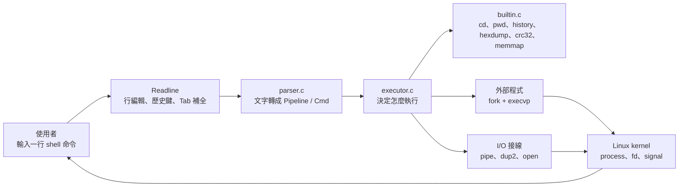

主線是：`shell.c` 管互動流程，`parser.c` 管拆命令，`executor.c` 管行程與 fd，`builtin.c` 管內建功能。

### 1.2 檔案責任分工

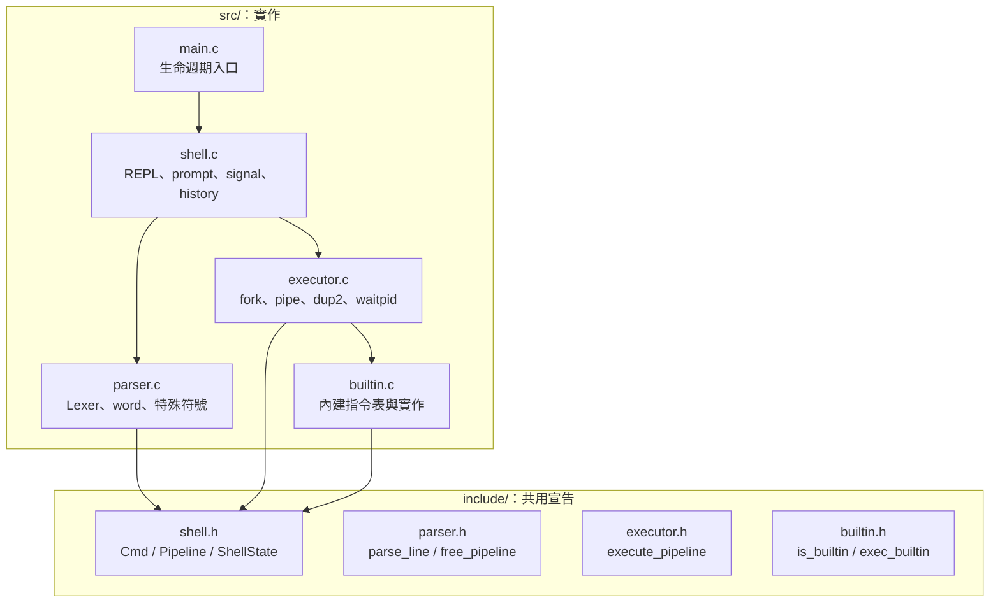

### 1.3 執行時的模組接力

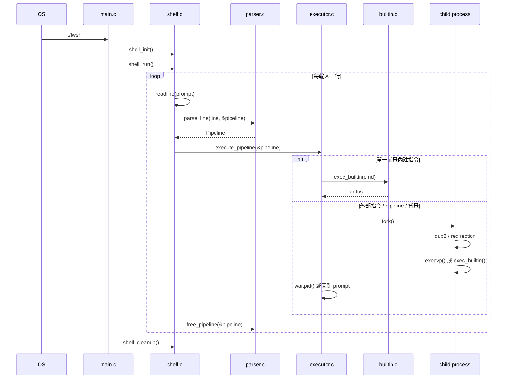

## 2. 建置與啟動

### 2.1 Makefile 建置流程

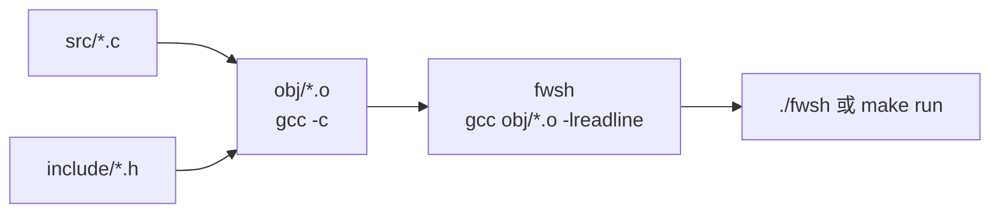

`Makefile` 用 `wildcard` 抓 `src/*.c`，再把每個 `.c` 編成 `obj/*.o`，最後連結成 `fwsh`。連結階段會帶 `-lreadline`，因為互動輸入靠 GNU Readline。

### 2.2 程式入口生命週期

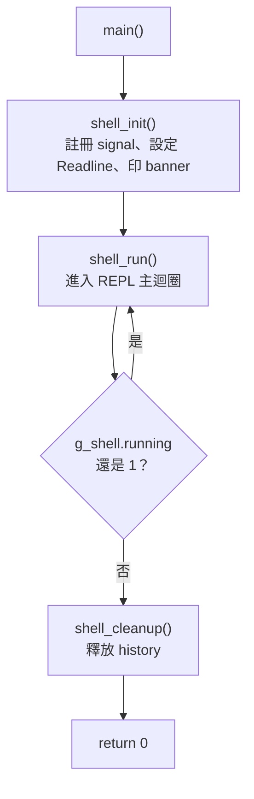

### 2.3 啟動初始化細節

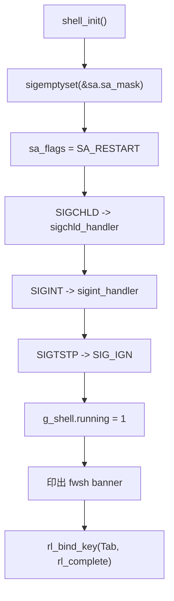

## 3. REPL 主迴圈

### 3.1 一輪命令的順序

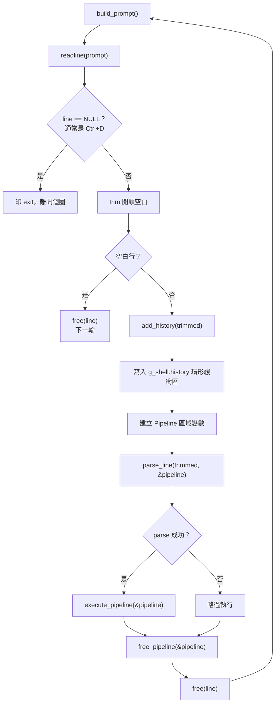

### 3.2 Readline 跟 fwsh history 是兩份

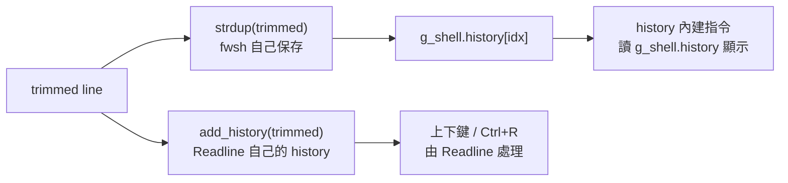

這裡容易混：上下鍵不是 fwsh 自己做的，是 Readline 做的。`history` 這個內建指令顯示的是 fwsh 自己保存的 50 筆。

### 3.3 Prompt 怎麼組出來

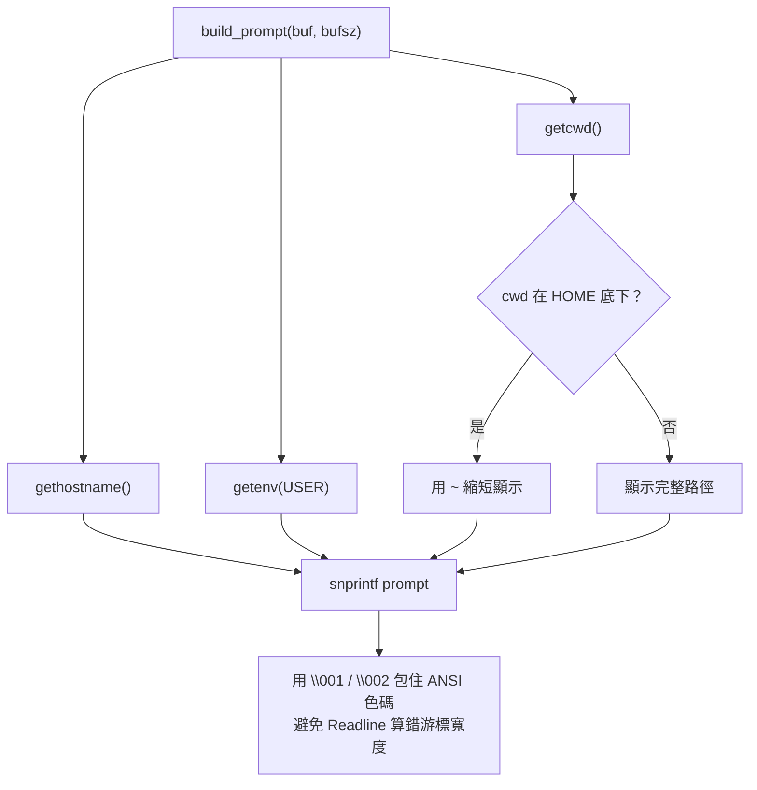

## 4. 核心資料結構

### 4.1 `Cmd`、`Pipeline`、`ShellState`

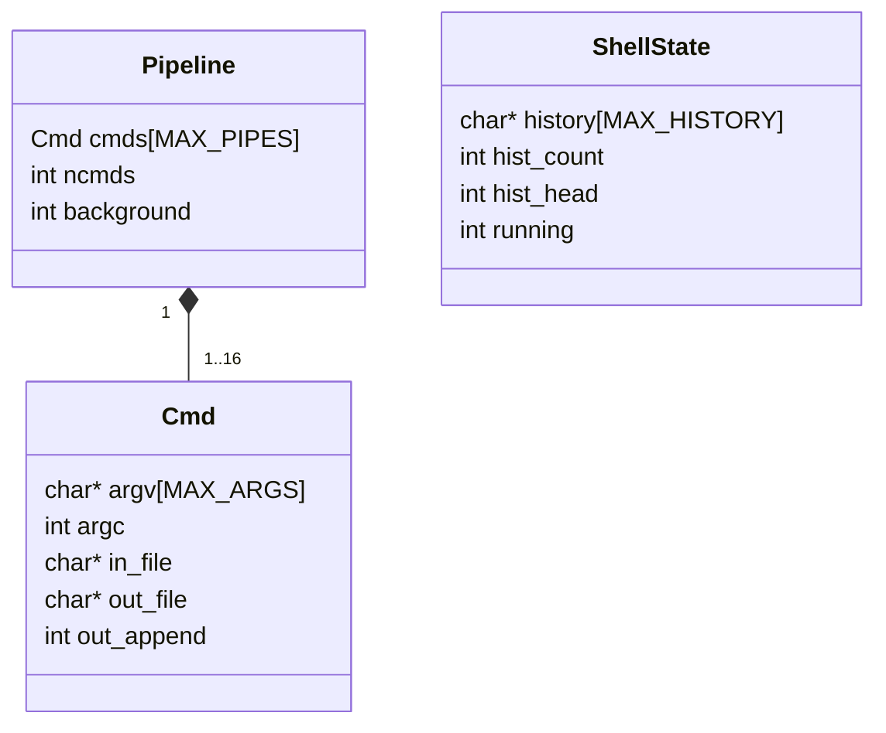

### 4.2 一行命令被放進資料結構

以這行為例：

```bash
cat firmware.bin | grep CRC >> result.txt &
```

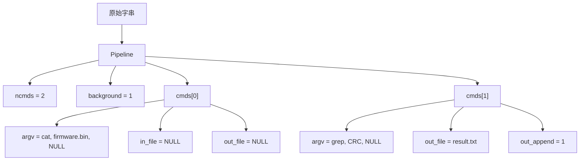

### 4.3 `Pipeline` 的記憶體歸屬

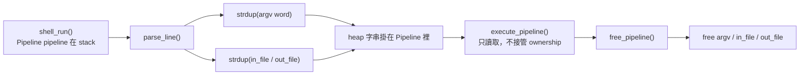

重點：`Pipeline` 本體是 stack 變數，但裡面的字串是 `strdup()` 來的 heap 記憶體，所以每輪一定要 `free_pipeline()`。

## 5. Parser 圖解

### 5.1 Parser 的角色邊界

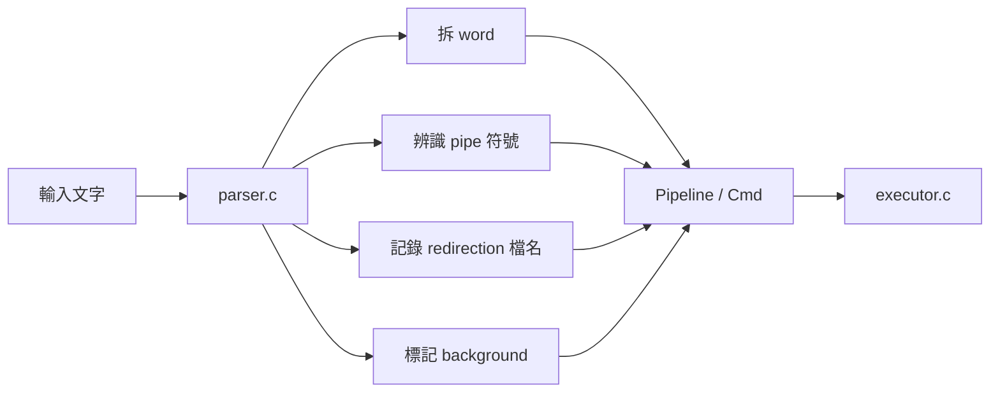

Parser 不開檔、不 fork、不執行指令。它只是把字串整理成 executor 看得懂的形狀。

### 5.2 Lexer 從左到右掃

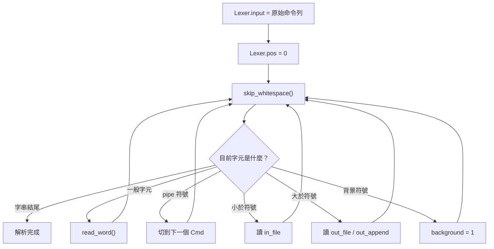

### 5.3 `read_word()` 停在哪裡

```mermaid
flowchart TD
    A["read_word() 開始"] --> B{"目前字元"}
    B -->|"空白、pipe、小於、大於、背景"| C["停下來<br/>交給主迴圈處理"]
    B -->|"單引號"| D["讀到下一個單引號<br/>內容原樣保留"]
    B -->|"雙引號"| E["讀到下一個雙引號<br/>只處理 \\\" 和 \\\\"]
    B -->|"一般字元"| F["加入 wordbuf"]
    D --> B
    E --> B
    F --> B
    C --> G["wordbuf 加上結尾 NUL"]
```

### 5.4 引號行為

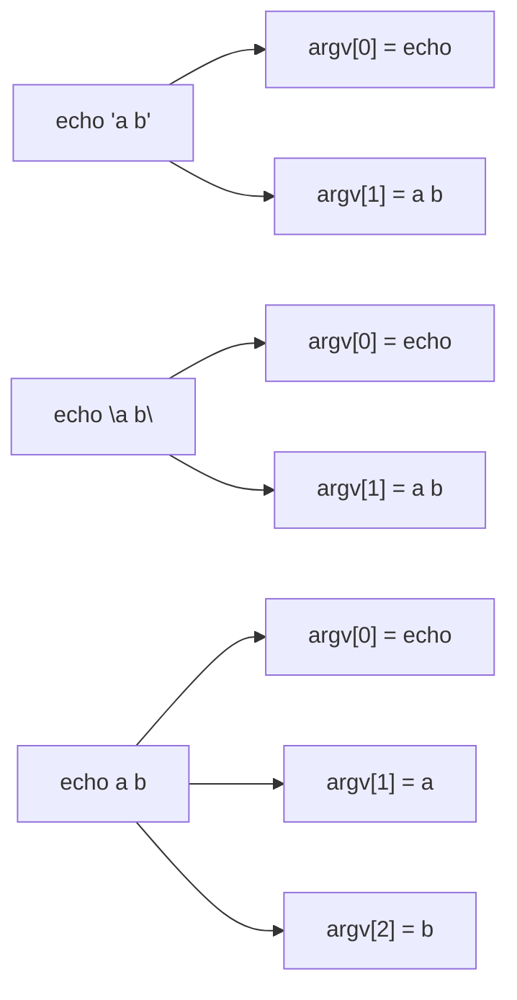

### 5.5 Parser 目前沒有做的事

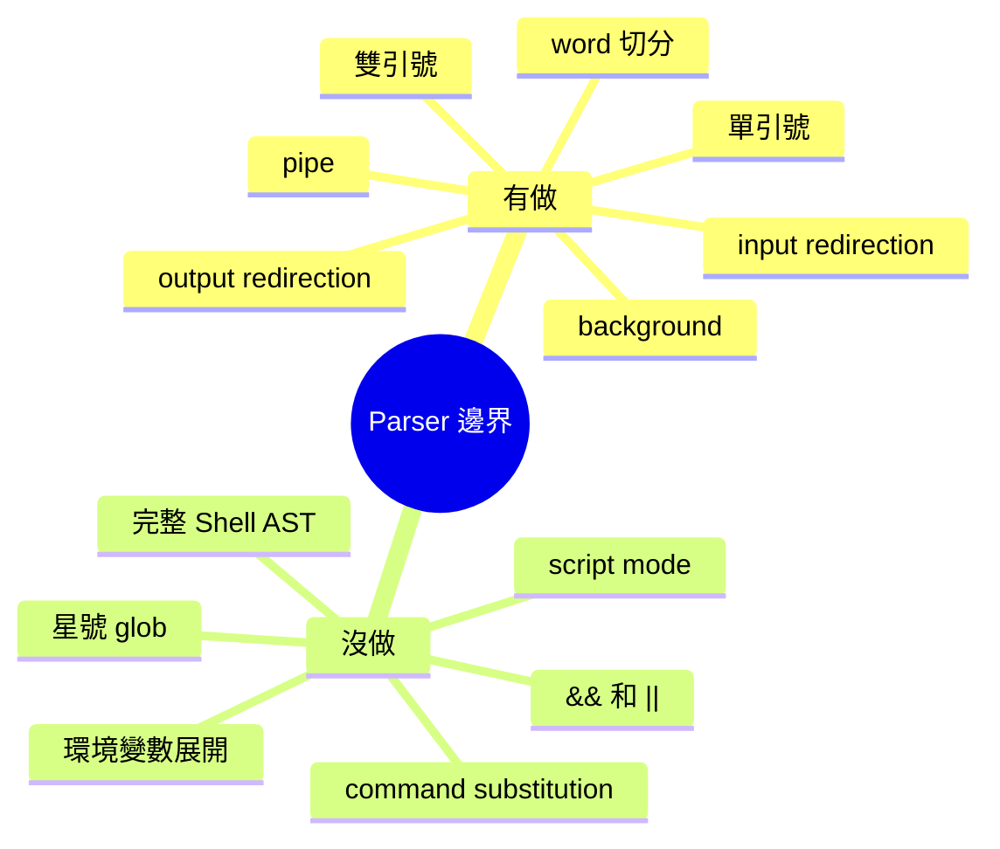

這個專案目前刻意做小。它是 mini shell，範圍比 bash 小很多。

## 6. Executor 圖解

### 6.1 Executor 的第一個分岔

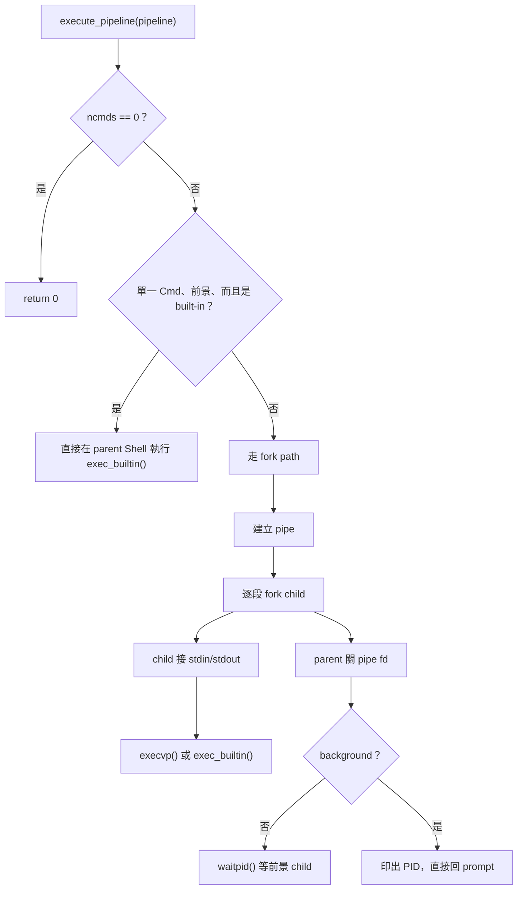

### 6.2 為什麼 `cd` 不能 fork 後才做

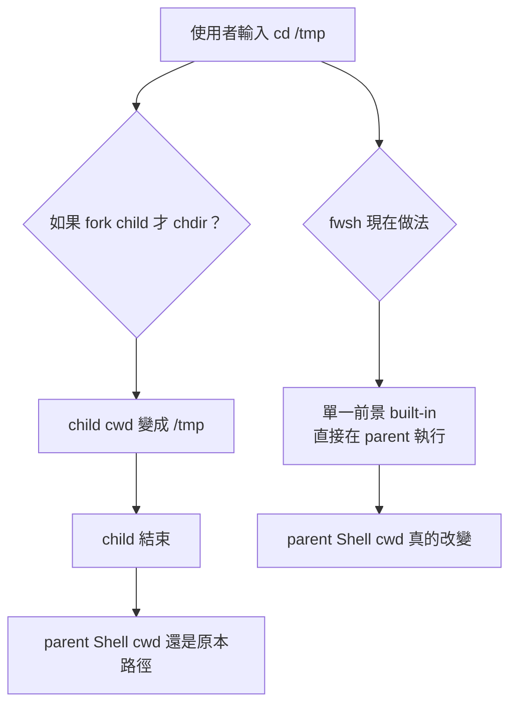

`exit` 也一樣，必須改到 `g_shell.running`，所以要在 parent Shell 裡跑。

### 6.3 單一外部指令

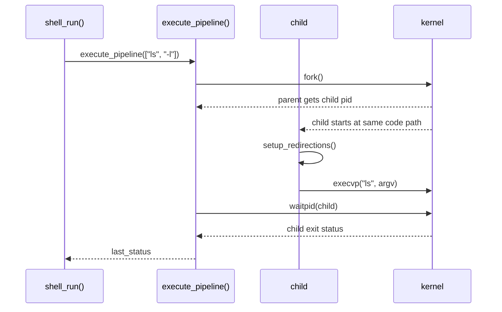

### 6.4 Pipeline 外部指令

以：

```bash
printf abc | wc -c
```

```mermaid
flowchart LR
    A["child 0<br/>printf abc"] -- "stdout" --> P0W["pipe[0][1]<br/>寫端"]
    P0W --> P0R["pipe[0][0]<br/>讀端"]
    P0R -- "stdin" --> B["child 1<br/>wc -c"]
    B --> T["terminal stdout"]
```

### 6.5 三段 Pipeline 的 fd 接線

以：

```bash
A | B | C
```

```mermaid
flowchart LR
    subgraph p0["pipe 0"]
        P0R["read fd<br/>pipes[0][0]"]
        P0W["write fd<br/>pipes[0][1]"]
    end
    subgraph p1["pipe 1"]
        P1R["read fd<br/>pipes[1][0]"]
        P1W["write fd<br/>pipes[1][1]"]
    end

    A["child A<br/>stdout fd 1"] --> P0W
    P0R --> B["child B<br/>stdin fd 0<br/>stdout fd 1"]
    B --> P1W
    P1R --> C["child C<br/>stdin fd 0"]
```

### 6.6 每個 child 怎麼接線

```mermaid
flowchart TD
    A["child i"] --> B{"i > 0？"}
    B -->|是| C["dup2(pipes[i-1][0], STDIN_FILENO)"]
    B -->|否| D["stdin 保持原樣"]
    C --> E{"i < npipes？"}
    D --> E
    E -->|是| F["dup2(pipes[i][1], STDOUT_FILENO)"]
    E -->|否| G["stdout 保持原樣"]
    F --> H["關閉所有 pipe fd"]
    G --> H
    H --> I{"cmd 是 built-in？"}
    I -->|是| J["_exit(exec_builtin(cmd))"]
    I -->|否| K["exec_external(cmd)"]
```

### 6.7 Parent 的 fd 收尾

```mermaid
flowchart TD
    A["parent 建完所有 child"] --> B["關閉所有 pipe read fd"]
    B --> C["關閉所有 pipe write fd"]
    C --> D{"前景？"}
    D -->|是| E["waitpid(pids[i])"]
    D -->|否| F["印 [background] PID"]
    E --> G["取得最後一段 command 的 status"]
    F --> H["立即回 prompt"]
```

Parent 不讀也不寫 pipeline。它如果忘了關 fd，後面的讀端可能會一直等 EOF。

## 7. Redirection 與檔案描述符

### 7.1 輸入重導向

```mermaid
flowchart TD
    A["cmd &lt; input.txt"] --> B["parser 設定 cmd.in_file"]
    B --> C["child 內 setup_redirections()"]
    C --> D["open(input.txt, O_RDONLY)"]
    D --> E["dup2(fd, STDIN_FILENO)"]
    E --> F["close(fd)"]
    F --> G["execvp(cmd)"]
    G --> H["程式讀 stdin<br/>其實是在讀 input.txt"]
```

### 7.2 輸出重導向

```mermaid
flowchart TD
    A["cmd &gt; out.txt"] --> B["out_append = 0"]
    C["cmd &gt;&gt; out.txt"] --> D["out_append = 1"]
    B --> E["open(out.txt, O_WRONLY | O_CREAT | O_TRUNC)"]
    D --> F["open(out.txt, O_WRONLY | O_CREAT | O_APPEND)"]
    E --> G["dup2(fd, STDOUT_FILENO)"]
    F --> G
    G --> H["close(fd)"]
    H --> I["execvp(cmd)"]
    I --> J["stdout 寫進檔案"]
```

### 7.3 `dup2()` 前後的 fd 表

```mermaid
flowchart LR
    subgraph before["dup2 前"]
        A0["fd 0<br/>terminal stdin"]
        A1["fd 1<br/>terminal stdout"]
        A4["fd 4<br/>out.txt"]
    end
    subgraph after["dup2(fd 4, fd 1) 後"]
        B0["fd 0<br/>terminal stdin"]
        B1["fd 1<br/>out.txt"]
        B4["fd 4<br/>out.txt<br/>準備 close"]
    end
    before --> after
```

### 7.4 目前版本的重導向邊界

```mermaid
flowchart TD
    A["有 redirection 的 Cmd"] --> B{"走 external path？"}
    B -->|是| C["setup_redirections()<br/>會處理 &lt;、&gt;、&gt;&gt;"]
    B -->|否：單一前景 built-in| D["直接 exec_builtin()<br/>目前不套 redirection"]
    B -->|否：pipeline 中的 built-in| E["有 pipe dup2<br/>但目前不套檔案 redirection"]
```

所以 `ls > out.txt` 會照預期，`pwd > out.txt` 目前不會照一般 shell 的直覺行為。若要修改這塊，會是在 executor 裡補「parent built-in redirection 套用後還原」的邏輯。

## 8. 內建指令

### 8.1 Built-in dispatch table

```mermaid
flowchart TD
    A["exec_builtin(cmd)"] --> B["走訪 builtins[]"]
    B --> C{"strcmp(argv[0], entry.name) == 0？"}
    C -->|否| B
    C -->|是| D["呼叫 entry.func(cmd)"]
    D --> E["回傳 status"]
    B --> F["遇到 name == NULL<br/>return -1"]
```

### 8.2 內建指令分類

```mermaid
mindmap
  root((builtins))
    一般 Shell
      cd
      pwd
      exit
      quit
      help
      history
      clear
    韌體檢查工具
      hexdump
      crc32
      memmap
```

### 8.3 `cd` 行為

```mermaid
flowchart TD
    A["builtin_cd(cmd)"] --> B{"argc < 2 或 argv[1] == ~？"}
    B -->|是| C["dir = getenv(HOME)"]
    B -->|否| D{"argv[1] == -？"}
    D -->|是| E["dir = getenv(OLDPWD)<br/>並印出路徑"]
    D -->|否| F["dir = argv[1]"]
    C --> G["getcwd(old)"]
    E --> G
    F --> G
    G --> H["setenv(OLDPWD, old, 1)"]
    H --> I["chdir(dir)"]
    I --> J{"成功？"}
    J -->|是| K["return 0"]
    J -->|否| L["印錯誤，return 1"]
```

### 8.4 `exit` 行為

```mermaid
stateDiagram-v2
    [*] --> Running: shell_init()
    Running --> Running: 一般命令
    Running --> Stopping: exit 或 quit
    Stopping --> Cleanup: g_shell.running = 0
    Cleanup --> [*]: shell_cleanup()
```

`exit [code]` 會把 `g_shell.running` 設成 0。真正離開是在 `shell_run()` 下一次檢查迴圈條件時發生。

### 8.5 `history` 環形緩衝區

```mermaid
flowchart LR
    A["hist_head"] --> B["idx = hist_head % MAX_HISTORY"]
    B --> C["free(history[idx])"]
    C --> D["history[idx] = strdup(trimmed)"]
    D --> E["hist_head++"]
    E --> F{"hist_count < MAX_HISTORY？"}
    F -->|是| G["hist_count++"]
    F -->|否| H["覆寫最舊那筆"]
```

## 9. 韌體檢查工具

### 9.1 `hexdump` 流程

```mermaid
flowchart TD
    A["hexdump file 0x40"] --> B{"argc < 2？"}
    B -->|是| U["印 Usage，return 1"]
    B -->|否| C["max_bytes 預設 256"]
    C --> D{"有第三個參數？"}
    D -->|是| E["strtol(arg, base=0)<br/>支援 64 / 0x40"]
    D -->|否| F["使用預設值"]
    E --> G["fopen(file, rb)"]
    F --> G
    G --> H["每次 fread 最多 16 bytes"]
    H --> I["印 offset"]
    I --> J["印 hex bytes"]
    J --> K["印 ASCII<br/>不可列印用點號"]
    K --> L{"EOF 或達到 max_bytes？"}
    L -->|否| H
    L -->|是| M["fclose(fp)，return 0"]
```

### 9.2 `hexdump` 輸出格式

```mermaid
flowchart LR
    A["檔案 bytes"] --> B["每 16 bytes 一列"]
    B --> C["Offset<br/>00000000"]
    B --> D["Hex 欄<br/>2F 2A 20 ..."]
    B --> E["ASCII 欄<br/>/* main.c ..."]
```

### 9.3 `crc32` 流程

```mermaid
flowchart TD
    A["crc32 file"] --> B["fopen(file, rb)"]
    B --> C{"crc32_table_ready？"}
    C -->|否| D["crc32_build_table()<br/>建立 256 筆查表"]
    C -->|是| E["沿用既有 table"]
    D --> F["crc = 0xFFFFFFFF"]
    E --> F
    F --> G["fread 4096 bytes chunk"]
    G --> H{"有讀到資料？"}
    H -->|是| I["逐 byte 更新 crc"]
    I --> G
    H -->|否| J["crc ^= 0xFFFFFFFF"]
    J --> K["印出 0x%08X"]
```

### 9.4 CRC 查表法

```mermaid
flowchart LR
    A["目前 crc"] --> B["與 byte XOR"]
    C["目前 byte"] --> B
    B --> D["取低 8 bit 當 index"]
    D --> E["crc32_table[index]"]
    A --> F["crc >> 8"]
    E --> G["XOR"]
    F --> G
    G --> H["新的 crc"]
```

### 9.5 `memmap` 流程

```mermaid
flowchart TD
    A["memmap"] --> B["fopen(/proc/iomem, r)"]
    B --> C{"開啟成功？"}
    C -->|否| D["印錯誤<br/>可能不是 Linux 或權限/環境限制"]
    C -->|是| E["逐行 fgets"]
    E --> F{"line 包含什麼關鍵字？"}
    F -->|"System RAM"| G["黃色印出"]
    F -->|"Kernel / kernel / initrd"| H["青色印出"]
    F -->|"ACPI / PCI / Reserved"| I["洋紅色印出"]
    F -->|"其他"| J["原樣印出"]
    G --> E
    H --> E
    I --> E
    J --> E
```

## 10. 訊號與背景行程

### 10.1 Signal 註冊表

```mermaid
flowchart LR
    A["SIGCHLD"] --> B["sigchld_handler()"]
    B --> C["waitpid(-1, NULL, WNOHANG)<br/>回收背景 child"]
    D["SIGINT<br/>Ctrl+C"] --> E["sigint_handler()"]
    E --> F["換行、清空 Readline 輸入、重畫 prompt"]
    G["SIGTSTP<br/>Ctrl+Z"] --> H["SIG_IGN"]
    H --> I["避免 fwsh 自己被暫停"]
```

### 10.2 `sleep 10 &` 時序圖

```mermaid
sequenceDiagram
    participant User as 使用者
    participant Shell as fwsh parent
    participant Child as child sleep
    participant Kernel as kernel

    User->>Shell: sleep 10 &
    Shell->>Child: fork()
    Child->>Kernel: execvp("sleep")
    Shell-->>User: [background] pid
    Shell-->>User: 回到 prompt
    Child-->>Kernel: sleep 結束
    Kernel-->>Shell: SIGCHLD
    Shell->>Kernel: waitpid(-1, NULL, WNOHANG)
    Kernel-->>Shell: 回收 child
```

### 10.3 Ctrl+C 在互動輸入時

```mermaid
sequenceDiagram
    participant User as 使用者
    participant Kernel as kernel
    participant Shell as fwsh
    participant RL as Readline

    User->>Kernel: 按 Ctrl+C
    Kernel-->>Shell: SIGINT
    Shell->>Shell: write("\\n")
    Shell->>RL: rl_on_new_line()
    Shell->>RL: rl_replace_line("", 0)
    Shell->>RL: rl_redisplay()
    RL-->>User: 顯示乾淨 prompt
```

### 10.4 前景 wait 與背景回收的差異

```mermaid
flowchart TD
    A["child 被 fork 出來"] --> B{"background？"}
    B -->|否| C["parent waitpid(pid, &status, 0)<br/>同步等待"]
    B -->|是| D["parent 不等<br/>立刻回 prompt"]
    D --> E["child 之後結束"]
    E --> F["kernel 送 SIGCHLD"]
    F --> G["handler 用 waitpid WNOHANG 回收"]
```

## 11. API 呼叫圖

### 11.1 Public API 關係

```mermaid
flowchart TD
    M["main()"] --> SI["shell_init()"]
    M --> SR["shell_run()"]
    M --> SC["shell_cleanup()"]

    SR --> PL["parse_line()"]
    SR --> EP["execute_pipeline()"]
    SR --> FP["free_pipeline()"]

    EP --> IB["is_builtin()"]
    EP --> EB["exec_builtin()"]
```

### 11.2 POSIX / C library API 分布

```mermaid
flowchart TD
    subgraph shellc["shell.c"]
        A["sigaction"]
        B["waitpid WNOHANG"]
        C["getcwd / gethostname / getenv"]
        D["readline / add_history"]
    end
    subgraph parserc["parser.c"]
        E["strdup"]
        F["free"]
        G["isspace"]
    end
    subgraph executorc["executor.c"]
        H["pipe"]
        I["fork"]
        J["dup2"]
        K["open / close"]
        L["execvp"]
        M["waitpid"]
    end
    subgraph builtinc["builtin.c"]
        N["chdir / setenv / getenv"]
        O["fopen / fread / fgets / fclose"]
        P["strtol"]
    end
```

### 11.3 外部命令 API 時序

```mermaid
sequenceDiagram
    participant Exec as executor.c
    participant Kernel as kernel
    participant Child as child

    Exec->>Kernel: pipe()，如果需要 pipeline
    Exec->>Kernel: fork()
    Kernel-->>Exec: parent: child pid
    Kernel-->>Child: child: 回到 fork 後位置
    Child->>Kernel: dup2() 接 stdin/stdout
    Child->>Kernel: close() 關不需要的 fd
    Child->>Kernel: open()，如果有 redirection
    Child->>Kernel: execvp()
    Exec->>Kernel: close() parent 端 pipe fd
    Exec->>Kernel: waitpid()，如果是前景
```

## 12. 資料流、控制流、訊號流

### 12.1 資料流總覽

```mermaid
flowchart LR
    A["鍵盤輸入"] --> B["readline 回傳 char* line"]
    B --> C["trimmed 指向 line 內部"]
    C --> D["parse_line 複製成 Pipeline 裡的字串"]
    D --> E["execute_pipeline 讀 Pipeline"]
    E --> F["built-in function 或 child process"]
    F --> G["stdout / stderr / 檔案 / pipe"]
    D --> H["free_pipeline 釋放 strdup 字串"]
    B --> I["free(line)"]
```

### 12.2 控制流總覽

```mermaid
flowchart TD
    A["main"] --> B["shell_init"]
    B --> C["shell_run loop"]
    C --> D["parse"]
    D --> E["execute"]
    E --> F{"命令要求退出？"}
    F -->|exit / quit| G["g_shell.running = 0"]
    F -->|其他| C
    G --> H["loop 結束"]
    H --> I["shell_cleanup"]
```

### 12.3 訊號流總覽

```mermaid
flowchart LR
    A["Ctrl+C"] --> B["kernel 送 SIGINT"]
    B --> C["fwsh 清空目前輸入"]
    D["背景 child 結束"] --> E["kernel 送 SIGCHLD"]
    E --> F["fwsh 回收 child"]
    G["Ctrl+Z"] --> H["kernel 送 SIGTSTP"]
    H --> I["fwsh 忽略"]
```

## 13. 具體命令走讀

### 13.1 `pwd`

```mermaid
flowchart TD
    A["pwd"] --> B["parse_line"]
    B --> C["Pipeline: ncmds=1, argv[0]=pwd"]
    C --> D["execute_pipeline"]
    D --> E{"單一前景 built-in？"}
    E -->|是| F["exec_builtin"]
    F --> G["builtin_pwd"]
    G --> H["getcwd"]
    H --> I["printf cwd"]
```

### 13.2 `printf abc | wc -c > /tmp/count.txt`

```mermaid
flowchart TD
    A["printf abc | wc -c &gt; /tmp/count.txt"] --> B["parse_line"]
    B --> C["cmd0: printf abc"]
    B --> D["cmd1: wc -c, out_file=/tmp/count.txt"]
    C --> E["executor 建 pipe0"]
    D --> E
    E --> F["fork child0"]
    F --> G["child0 stdout -> pipe0 write"]
    G --> H["execvp printf"]
    E --> I["fork child1"]
    I --> J["child1 stdin <- pipe0 read"]
    J --> K["open /tmp/count.txt"]
    K --> L["stdout -> count.txt"]
    L --> M["execvp wc"]
    E --> N["parent 關 pipe，wait 兩個 child"]
```

### 13.3 `hexdump src/main.c 0x40`

```mermaid
flowchart TD
    A["hexdump src/main.c 0x40"] --> B["parse_line"]
    B --> C["argv = hexdump, src/main.c, 0x40"]
    C --> D["single foreground built-in"]
    D --> E["builtin_hexdump"]
    E --> F["strtol 0x40 -> 64"]
    F --> G["fopen rb"]
    G --> H["fread 16 bytes 一列"]
    H --> I["印 Hex + ASCII"]
```

### 13.4 `sleep 1 &`

```mermaid
flowchart TD
    A["sleep 1 &"] --> B["parse_line"]
    B --> C["background = 1"]
    C --> D["execute_pipeline 走 fork path"]
    D --> E["child execvp sleep"]
    D --> F["parent 印 PID 後回 prompt"]
    E --> G["child 結束"]
    G --> H["SIGCHLD handler 回收"]
```

## 14. 常見卡點

### 14.1 看到 `fork()` 後要切成兩條線看

```mermaid
flowchart TD
    A["fork()"] --> B{"pid 回傳值"}
    B -->|"pid < 0"| C["fork 失敗<br/>parent 印錯誤"]
    B -->|"pid == 0"| D["child 分支<br/>接 fd、exec"]
    B -->|"pid > 0"| E["parent 分支<br/>記 pid、繼續 fork 或 wait"]
```

### 14.2 Pipe 卡住通常是 fd 沒關

```mermaid
flowchart TD
    A["讀端一直等不到 EOF"] --> B{"還有人持有 pipe 寫端？"}
    B -->|是| C["讀端會以為未來還可能有資料"]
    C --> D["程式看起來像卡住"]
    B -->|否| E["讀端收到 EOF<br/>pipeline 正常結束"]
    D --> F["檢查 parent 和所有 child 是否 close 不需要的 fd"]
```

### 14.3 Built-in 有兩種執行位置

```mermaid
flowchart TD
    A["built-in command"] --> B{"單一前景？"}
    B -->|是| C["parent Shell 裡執行<br/>cd、exit 才有效"]
    B -->|否| D["child 裡執行<br/>pipeline / background"]
    C --> E["會影響 Shell 狀態"]
    D --> F["不會改變 parent Shell 狀態"]
```

### 14.4 這個 shell 跟 bash 的差異

```mermaid
flowchart LR
    A["fwsh"] --> B["支援 pipe"]
    A --> C["支援 redirection"]
    A --> D["支援 background"]
    A --> E["支援簡單引號"]
    A --> F["有韌體工具"]
    G["bash 常見能力"] --> H["變數展開"]
    G --> I["glob"]
    G --> J["job control"]
    G --> K["script / if / loop"]
    G --> L["&& / ||"]
```

## 15. 改功能時怎麼找位置

### 15.1 新增一般內建指令

```mermaid
flowchart TD
    A["想新增 builtin，例如 version"] --> B["在 builtin.c 宣告 static int builtin_version(Cmd*)"]
    B --> C["實作 builtin_version"]
    C --> D["builtins[] 加一筆 name / func / desc"]
    D --> E["help 自動列出"]
    E --> F["is_builtin / exec_builtin 不用改"]
```

### 15.2 新增語法

```mermaid
flowchart TD
    A["想新增語法，例如 &&"] --> B["先改 parser.c"]
    B --> C["Pipeline / Cmd 可能要加欄位"]
    C --> D["include/shell.h 更新結構"]
    D --> E["executor.c 根據新欄位決定執行策略"]
    E --> F["補 free_pipeline 釋放新欄位"]
```

### 15.3 新增執行策略

```mermaid
flowchart TD
    A["想新增執行策略，例如 jobs"] --> B["executor.c 需要保存背景 job 狀態"]
    B --> C["shell.h 可能擴充 ShellState"]
    C --> D["SIGCHLD handler 不能只丟掉狀態"]
    D --> E["builtin.c 新增 jobs / fg / bg"]
```

## 16. 5 分鐘導讀版本

這章整理一條快速路線。照下面順序挑圖即可。

### 16.1 0:00 到 0:40：先看大局

看圖：`1.1 專案在做什麼`

摘要：

```text
fwsh 是一個迷你互動式 shell。使用者打一行命令後，
shell.c 先把字串拿到，parser.c 把字串整理成 Pipeline，
executor.c 決定要直接跑內建指令，還是 fork 子行程。
如果需要 pipe 或 redirection，就在 child 裡用 dup2 把 fd 接好。
```

這段先保留四個檔案各管哪一塊。

### 16.2 0:40 到 1:25：看一輪 REPL

看圖：`3.1 一輪命令的順序`

摘要：

```text
fwsh 每一輪都做同一件事：build prompt、readline 讀一行、
空白行就跳過，不然存 history，建立一個暫時 Pipeline，
parse 成功就 execute，最後一定 free_pipeline 跟 free(line)。
所以每一行命令都是一次乾淨的週期。
```

這裡順便提醒 `readline()` 回傳的 `line` 要 `free()`。

### 16.3 1:25 到 2:10：看資料結構

看圖：`4.1 Cmd、Pipeline、ShellState`、`4.2 一行命令被放進資料結構`

摘要：

```text
Pipeline 是整行命令，Cmd 是 pipeline 裡的一段。
Cmd 裡最重要的是 argv、in_file、out_file、out_append。
background 是整條 Pipeline 的屬性，不是單一 Cmd 的屬性。
ShellState 則是跨命令保留的東西，例如 history 和 running。
```

先把 `Pipeline` 跟 `Cmd` 分清楚，後面 executor 就不會迷路。

### 16.4 2:10 到 3:15：看 executor 分岔與 pipe

看圖：`6.1 Executor 的第一個分岔`、`6.5 三段 Pipeline 的 fd 接線`

摘要：

```text
executor 先看是不是單一前景 built-in。
如果是，就在 parent Shell 直接執行，這就是 cd 和 exit 有效的原因。
其他情況都走 fork path。pipeline 有 n 段就建立 n-1 條 pipe，
每個 child 只把自己需要的 stdin/stdout 接好，接完就關掉全部原始 pipe fd。
parent 自己不讀不寫 pipe，只負責關 fd 和 wait。
```

這段用 `A | B | C` 對照一次就好。

### 16.5 3:15 到 4:00：看 redirection 與背景行程

看圖：`7.2 輸出重導向`、`10.2 sleep 10 & 時序圖`

摘要：

```text
redirection 不是 parser 做的，parser 只記檔名。
真正開檔和 dup2 是 child 在 execvp 前做。
背景行程則是不 wait，parent 印 PID 後立刻回 prompt；
child 之後結束時，kernel 送 SIGCHLD，handler 用 WNOHANG 回收。
```

順手補一句目前版本的限制：內建指令的檔案 redirection 還沒完整支援。

### 16.6 4:00 到 4:40：看內建指令與韌體工具

看圖：`8.1 Built-in dispatch table`、`9.1 hexdump 流程`、`9.3 crc32 流程`

摘要：

```text
builtin.c 是一張表：名字對到函式。
新增內建指令不用改搜尋邏輯，只要加函式和表格項目。
一般 shell 指令像 cd、pwd、history 都在這裡；
專案比較有韌體味道的是 hexdump、crc32、memmap。
hexdump 是 16 bytes 一列，crc32 是查表法，memmap 讀 /proc/iomem。
```

### 16.7 4:40 到 5:00：整理改 code 路線

看圖：`15.1 新增一般內建指令`、`15.2 新增語法`

摘要：

```text
要加一個新內建指令，先去 builtin.c。
要加新 shell 語法，先去 parser.c，通常 shell.h 的結構也要改。
要動行程、pipe、redirection，就去 executor.c。
如果看到背景行程或 Ctrl+C，先看 shell.c 裡的 signal handler。
```

最後摘要：這個專案的好處是小，邊界清楚，照資料流追會比照檔案順序追更快。
