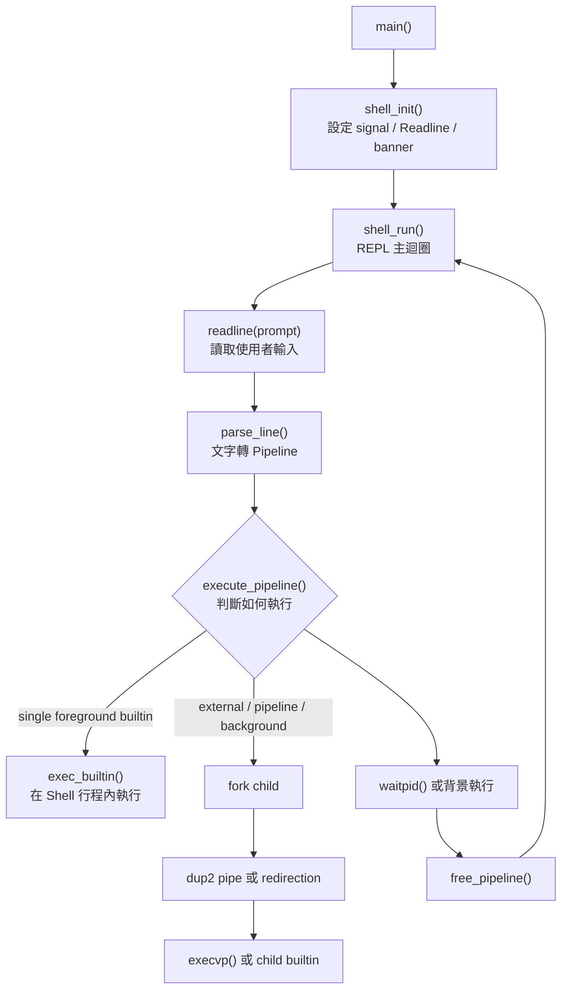

# fwsh (Firmware Mini Shell) 技術實作報告

本報告說明 `fwsh` 的實作方式。內容以目前程式碼為準，重點放在「為什麼需要這樣設計」、「每個模組負責什麼」、「開發時會遇到哪些問題，以及如何分析」。文字盡量用可驗證的行為說明，不把專案寫成過度包裝的介紹。

---

## 1. 專案概述

`fwsh` 是一個以 C11 實作的 Linux userspace mini shell。它具備互動式命令列介面，能執行外部程式，也能執行內建指令。專案的核心目標是把 Shell 背後常見的作業系統機制做出來：

- 讀取使用者輸入。
- 將文字解析成結構化指令。
- 使用 `fork()` 建立子行程。
- 使用 `execvp()` 執行外部程式。
- 使用 `pipe()` 和 `dup2()` 串接管線。
- 使用 `waitpid()` 等待前景行程或回收背景行程。
- 使用 signal handler 處理 `Ctrl+C` 和 child process 結束事件。

專案另外加入三個偏韌體開發的工具：

| 指令 | 用途 |
|---|---|
| `hexdump <file> [len]` | 用十六進位與 ASCII 對照顯示檔案內容，適合檢查 binary、映像檔、檔頭。 |
| `crc32 <file>` | 計算 IEEE 802.3 CRC-32，適合驗證檔案完整性。 |
| `memmap` | 讀取 `/proc/iomem`，觀察 Linux 實體記憶體配置。 |

---

## 2. 實際建置與執行確認

本次在 WSL Ubuntu 22.04 環境下驗證。專案可以建置並執行，但環境需要 GNU Readline 的開發套件。

### 2.1 正式建置方式

```bash
sudo apt update
sudo apt install -y build-essential libreadline-dev
make
./fwsh
```

### 2.2 本次驗證結果

已確認以下功能可執行：

```bash
pwd
printf "abc" | wc -c > /tmp/fwsh_count.txt
cat /tmp/fwsh_count.txt
hexdump src/main.c 0x40
crc32 src/main.c
memmap
sleep 1 &
history
exit
```

代表目前以下流程都有跑到：

- Readline 讀取輸入。
- Parser 解析一般指令、管線、重導向、背景執行符號。
- Executor 建立 pipe、fork 子行程、設定 fd、執行外部指令。
- Builtin dispatcher 執行 `pwd`、`hexdump`、`crc32`、`memmap`、`history`。
- `SIGCHLD` handler 回收背景行程。

### 2.3 建置時觀察到的警告

編譯可成功，但目前有幾個警告值得記錄：

| 警告 | 原因 | 影響 | 建議 |
|---|---|---|---|
| `warning: "/*" within comment` | `main.c` 註解中的 `src/*.c` 包含 `/*` 字樣，編譯器會提醒可能是註解起點。 | 不影響執行，但會讓建置輸出不乾淨。 | 將註解改成 `src/所有 .c` 或避開 `/*` 字樣。 |
| `ignoring return value of write` | `sigint_handler()` 呼叫 `write()` 後未檢查回傳值。 | 實務上只寫一個換行，風險低；但在嚴格編譯環境會被提醒。 | 用 `(void)!write(...)` 或明確處理失敗。 |
| `strncpy output may be truncated` | `build_prompt()` 複製 cwd 顯示字串時，目的緩衝區可能放不下完整路徑。 | 極長路徑下 prompt 可能被截斷。 | 改用 `snprintf()` 並保證 NUL 結尾，或統一寫一個 safe copy helper。 |

---

## 3. 關鍵字說明

| 關鍵字 | 英文 | 說明 |
|---|---|---|
| REPL | Read-Eval-Print Loop | Shell 的主迴圈。讀取一行輸入，解析並執行，再回到下一輪。 |
| 行程 | Process | 作業系統執行中的程式實體。Shell 自己是一個行程，外部指令通常在子行程中執行。 |
| 子行程 | Child Process | 由父行程 `fork()` 產生的新行程。子行程可用 `execvp()` 變成另一個程式。 |
| 管線 | Pipeline | 用 `|` 串接的多段指令。前一段 stdout 會變成下一段 stdin。 |
| 檔案描述符 | File Descriptor, FD | Linux 用整數表示 I/O 端點。`0` 是 stdin，`1` 是 stdout，`2` 是 stderr。 |
| 重導向 | Redirection | 將 stdin/stdout 改接到檔案，例如 `< input.txt`、`> out.txt`。 |
| 內建指令 | Built-in Command | Shell 內部 C 函式實作的指令，例如 `cd`、`history`、`crc32`。 |
| 外部指令 | External Command | 系統上的可執行檔，例如 `/bin/ls`、`/usr/bin/wc`。 |
| 訊號 | Signal | Linux 用來通知行程事件的機制，例如 `SIGINT`、`SIGCHLD`。 |
| 殭屍行程 | Zombie Process | 子行程已結束，但父行程尚未讀取它的 exit status。 |
| 函式指標表 | Function Pointer Dispatch Table | 用表格把指令名稱對應到函式，減少大量 `if/else`。 |
| 生命週期 | Lifecycle | 資源從建立、使用到釋放的完整流程。這份專案特別需要追 heap、fd、child process。 |

---

## 4. 軟體架構

`fwsh` 的程式碼分成五個主要模組：

| 模組 | 檔案 | 負責內容 |
|---|---|---|
| Entry point | `src/main.c` | 只呼叫 `shell_init()`、`shell_run()`、`shell_cleanup()`。 |
| Shell core | `src/shell.c` | REPL、提示字元、Readline、history、signal handlers。 |
| Parser | `src/parser.c` | 將文字輸入解析成 `Pipeline` 和 `Cmd`。 |
| Executor | `src/executor.c` | 決定內建或外部指令，處理 fork、pipe、dup2、waitpid。 |
| Builtins | `src/builtin.c` | 一般內建指令與韌體工具。 |

### 4.1 整體流程



### 4.2 為什麼要分模組

如果把所有邏輯寫在一個檔案，剛開始可能比較快，但後面會很難追問題。這個專案刻意拆開，原因如下：

- Parser 只負責「看懂輸入文字」，不負責 fork 或執行。
- Executor 只負責「把已解析的結構跑起來」，不需要再分析字串。
- Builtin 指令集中在 `builtin.c`，新增指令時不需要改 Shell 主迴圈。
- `shell.c` 保持在 REPL 和全域狀態，不混入 `pipe()` 細節。

這樣除錯時比較容易定位。例如管線卡住通常看 `executor.c`；引號解析錯誤通常看 `parser.c`；Ctrl+C 顯示異常通常看 `shell.c`。

---

## 5. 資料結構設計

### 5.1 `Cmd`

`Cmd` 代表 pipeline 中的一段指令。

```c
typedef struct {
  char* argv[MAX_ARGS];
  int argc;
  char* in_file;
  char* out_file;
  int out_append;
} Cmd;
```

以這行指令為例：

```bash
grep error < input.txt > result.txt
```

Parser 會填成：

```text
Cmd.argv       = ["grep", "error", NULL]
Cmd.argc       = 2
Cmd.in_file    = "input.txt"
Cmd.out_file   = "result.txt"
Cmd.out_append = 0
```

`argv` 必須以 `NULL` 結尾，因為 `execvp()` 需要這種格式。

### 5.2 `Pipeline`

`Pipeline` 代表一整行輸入。

```c
typedef struct {
  Cmd cmds[MAX_PIPES];
  int ncmds;
  int background;
} Pipeline;
```

以這行為例：

```bash
cat log.txt | grep error | wc -l &
```

Parser 會填成：

```text
Pipeline.ncmds      = 3
Pipeline.background = 1
cmds[0].argv        = ["cat", "log.txt", NULL]
cmds[1].argv        = ["grep", "error", NULL]
cmds[2].argv        = ["wc", "-l", NULL]
```

### 5.3 `ShellState`

`ShellState` 放 Shell 執行期間需要保留的狀態。

```c
typedef struct {
  char* history[MAX_HISTORY];
  int hist_count;
  int hist_head;
  int running;
} ShellState;
```

`running` 是 REPL 是否繼續的旗標。當使用者輸入 `exit`，`builtin_exit()` 會設定：

```c
g_shell.running = 0;
```

下一輪 `while (g_shell.running)` 就會停止。

---

## 6. Parser 設計

Parser 的工作是把一行字串變成 `Pipeline`。它不執行指令，也不檢查外部程式是否存在。

### 6.1 Lexer 的角色

`parser.c` 內部有一個 `Lexer`：

```c
typedef struct {
  const char* input;
  int pos;
} Lexer;
```

它只做一件事：記住目前讀到輸入字串的哪個位置。這比到處傳 `char*` 更容易控制，也讓 parser 的狀態集中。

### 6.2 支援的語法

| 語法 | Parser 行為 |
|---|---|
| 空白 | 分隔詞，例如 `ls -l` 變成兩個 argv。 |
| 單引號 | `'hello world'` 會被視為一個詞，內部不做跳脫。 |
| 雙引號 | `"hello world"` 會被視為一個詞，支援 `\"` 和 `\\`。 |
| `|` | 結束目前 `Cmd`，切到下一段。 |
| `< file` | 設定目前 `Cmd.in_file`。 |
| `> file` | 設定目前 `Cmd.out_file`，覆寫模式。 |
| `>> file` | 設定目前 `Cmd.out_file`，追加模式。 |
| `&` | 設定 `Pipeline.background = 1`。 |

### 6.3 實際解析例子

輸入：

```bash
cat "boot log.txt" | grep 'CRC OK' >> result.txt
```

解析結果：

```text
cmds[0].argv      = ["cat", "boot log.txt", NULL]
cmds[1].argv      = ["grep", "CRC OK", NULL]
cmds[1].out_file  = "result.txt"
cmds[1].out_append = 1
ncmds             = 2
background        = 0
```

這裡最重要的是：引號只負責把空白包在同一個參數內，不做 `$HOME` 展開、不做萬用字元展開，也不做 command substitution。

---

## 7. Executor 設計

Executor 的入口是：

```c
int execute_pipeline(Pipeline* pipeline);
```

它會根據 `Pipeline` 狀態決定兩條路：

1. 單一前景內建指令：直接在 Shell 行程中執行。
2. 外部指令、管線、背景執行：走 fork path。

### 7.1 為什麼 `cd` 不能 fork 後執行

`cd` 的目的，是改變 Shell 自己的工作目錄。如果先 `fork()`，再在 child 裡面 `chdir()`，改到的只是 child 的 cwd。child 結束後，parent Shell 的 cwd 不會變。

因此 executor 需要特別處理：

```text
if ncmds == 1 and not background and argv[0] is builtin:
    exec_builtin(cmd) in parent shell
else:
    fork child processes
```

這也是 `exit` 必須在 parent Shell 執行的原因。若 `exit` 在 child 執行，只會讓 child 結束，不會停止整個 Shell。

### 7.2 管線如何接起來

以：

```bash
A | B | C
```

為例，需要兩個 pipe：

```text
pipe[0]: A stdout -> B stdin
pipe[1]: B stdout -> C stdin
```

每段 child 的 fd 接法：

| 指令 | stdin | stdout |
|---|---|---|
| A | 原本 stdin | `pipe[0][1]` |
| B | `pipe[0][0]` | `pipe[1][1]` |
| C | `pipe[1][0]` | 原本 stdout |

程式用 `dup2()` 完成這件事：

```c
dup2(pipes[i - 1][0], STDIN_FILENO);
dup2(pipes[i][1], STDOUT_FILENO);
```

`dup2()` 的意思是：把某個 fd 複製到標準輸入或標準輸出的位置。之後程式讀 stdin 或寫 stdout，實際上就會讀寫 pipe。

### 7.3 為什麼一定要關閉 pipe fd

管線最容易出錯的地方是 fd 沒關。

如果 parent 還持有 pipe 寫端，即使真正寫資料的 child 已經結束，讀端仍會認為「可能還有資料會進來」，所以不會收到 EOF。結果就是最後一段指令卡住，例如：

```bash
printf "abc" | cat
```

若 `cat` 永遠等不到 EOF，Shell 就會像當機一樣停住。

目前 executor 的處理方式是：

- child 完成 `dup2()` 後，關閉所有 pipe fd。
- parent fork 完所有 child 後，也關閉所有 pipe fd。

這是 Shell pipeline 正常結束的關鍵。

---

## 8. Signal 設計

### 8.1 `SIGINT`：處理 Ctrl+C

一般程式收到 `SIGINT` 會結束，但互動式 Shell 不應該因為使用者按 Ctrl+C 就退出。`fwsh` 的行為是清掉目前輸入行，重新顯示 prompt。

相關函式：

```c
static void sigint_handler(int sig);
```

它會呼叫：

- `write(STDOUT_FILENO, "\n", 1)`
- `rl_on_new_line()`
- `rl_replace_line("", 0)`
- `rl_redisplay()`

注意：`write()` 是 async-signal-safe 的系統呼叫，但 Readline API 是否完全適合在 signal handler 裡呼叫，不能只從本專案程式碼保證。實務上這樣做能改善互動畫面，但若要更嚴謹，可以改成 handler 只設定旗標，再讓主迴圈處理畫面刷新。

### 8.2 `SIGCHLD`：回收背景行程

背景執行：

```bash
sleep 10 &
```

Shell 不會用 blocking `waitpid()` 等它結束。若完全不處理，`sleep` 結束後會變成 zombie process。

`fwsh` 註冊 `SIGCHLD` handler：

```c
while (waitpid(-1, NULL, WNOHANG) > 0);
```

這裡有兩個重點：

- `-1`：回收任意已結束的 child。
- `WNOHANG`：沒有 child 可回收時立即回傳，不阻塞 Shell。

使用 `while` 是因為多個 child 同時結束時，核心不保證每個 child 都各送一次獨立訊號。一次 signal 進來時要盡量把已結束 child 全部收掉。

---

## 9. Built-in 指令設計

`builtin.c` 使用 dispatch table：

```c
typedef struct {
  const char* name;
  int (*func)(Cmd*);
  const char* desc;
} BuiltinEntry;
```

`builtins[]` 裡每一筆都對應一個指令名稱和 C 函式。這樣新增指令時，只需要：

1. 實作新的 `static int builtin_xxx(Cmd* cmd)`。
2. 在 `builtins[]` 加入 `{ "xxx", builtin_xxx, "description" }`。

這樣就無需在 `is_builtin()` 或 `exec_builtin()` 裡一直增加 `if/else`。

### 9.1 一般內建指令

| 指令 | 實作重點 |
|---|---|
| `cd` | 支援 `cd`、`cd ~`、`cd -`，成功後更新 `OLDPWD`。 |
| `pwd` | 呼叫 `getcwd()` 印出目前工作目錄。 |
| `exit` / `quit` | 設定 `g_shell.running = 0`，讓 REPL 結束。 |
| `help` | 走訪 `builtins[]`，印出所有指令說明。 |
| `history` | 顯示 `ShellState.history` 中的環形緩衝區內容。 |
| `clear` | 輸出 ANSI escape code 清除終端機。 |

### 9.2 韌體工具

#### `hexdump`

`hexdump` 每次讀 16 bytes，輸出 offset、hex bytes、ASCII 三欄。

適用情境：

- 檢查檔頭 magic number。
- 確認 padding 是 `0x00` 還是 `0xFF`。
- 看 binary 裡是否含有可讀字串。

#### `crc32`

`crc32` 使用 table-driven CRC。第一次執行時先建立 256 筆查找表，後面對每個 byte 做：

```c
crc = crc32_table[(crc ^ byte) & 0xFF] ^ (crc >> 8);
```

這比逐 bit 計算更適合處理較大的 binary file。

#### `memmap`

`memmap` 讀 `/proc/iomem`，並用不同顏色標示：

- `System RAM`
- `Kernel`
- `initrd`
- `ACPI`
- `PCI`
- `Reserved`

在 WSL 或容器中，實體位址可能被遮蔽，這是執行環境的限制。

---

## 10. 開發過程中的 BUG、原因與解法

本節把問題拆成「現象、原因、解法、學到的點」。有些已在程式中處理，有些是目前仍可改善的限制。

### 10.1 建置失敗：找不到 `readline/history.h`

#### 現象

執行 `make` 時出現：

```text
fatal error: readline/history.h: No such file or directory
```

#### 原因

系統可能只有 Readline runtime library，例如 `libreadline.so.8`，但沒有 header。C 程式編譯時需要 header，連結時也需要開發套件提供的 linker 設定。

#### 解法

安裝開發套件：

```bash
sudo apt install -y libreadline-dev
```

#### 學到的點

Linux 套件常分成 runtime package 和 development package。能執行某個函式庫，不代表能編譯使用它的程式。

---

### 10.2 管線卡住：讀端收不到 EOF

#### 現象

在開發 pipeline 時，像下面的指令可能不會結束：

```bash
printf "abc" | cat
```

#### 原因

`cat` 會一直讀 stdin，直到收到 EOF。若 parent 或其他 child 還持有 pipe 的寫端 fd，核心會認為寫端仍然存在，因此不送 EOF。

#### 解法

在 child：

1. 先用 `dup2()` 把需要的 pipe fd 接到 stdin 或 stdout。
2. 接好後關閉所有 pipe fd。

在 parent：

1. fork 完所有 child。
2. 關閉 parent 持有的所有 pipe fd。
3. 再依前景或背景決定是否 `waitpid()`。

#### 學到的點

Pipe 不只看「有沒有資料」，也看「寫端是否全部關閉」。fd lifecycle 沒處理好，程式邏輯看起來正確也會卡住。

---

### 10.3 `cd` 無效：內建指令不能全部丟到 child

#### 現象

如果把 `cd` 當成一般外部指令一樣 fork 後執行，使用者輸入：

```bash
cd /tmp
pwd
```

`pwd` 仍可能顯示原本目錄。

#### 原因

`fork()` 會複製一份 child process。child 裡的 `chdir()` 只改 child 的 cwd，不會改 parent Shell 的 cwd。

#### 解法

Executor 對「單一、前景、內建指令」做特例處理：

```text
ncmds == 1 && background == 0 && is_builtin(argv[0])
```

符合條件時直接在 parent Shell 呼叫 `exec_builtin()`。

#### 學到的點

不是所有指令都適合 fork。會修改 Shell 自身狀態的指令，例如 `cd`、`exit`，必須在 parent process 執行。

---

### 10.4 背景行程變成 zombie process

#### 現象

執行：

```bash
sleep 10 &
```

若 Shell 不等待也不回收，`sleep` 結束後可能留下 zombie process。

#### 原因

子行程結束後，核心仍保留它的 exit status，等待 parent 讀取。parent 沒有 `wait()` 或 `waitpid()`，該 child 就會暫時以 zombie 狀態存在。

#### 解法

註冊 `SIGCHLD` handler：

```c
while (waitpid(-1, NULL, WNOHANG) > 0);
```

#### 學到的點

背景執行會讓主流程保持可用，同時仍在適當時間回收 child。

---

### 10.5 彩色 prompt 導致 Backspace 或游標位置錯亂

#### 現象

提示字元加入 ANSI color code 後，按方向鍵或 Backspace 時，游標位置可能不對，甚至刪到 prompt 的顯示範圍。

#### 原因

Readline 需要知道 prompt 實際佔幾個可見字元。ANSI color code 本身不會顯示在畫面上，但如果沒有標記，Readline 會把它們也算進寬度。

#### 解法

把不可見色碼包在 `\001` 和 `\002` 中：

```c
"\001" COLOR_GREEN "\002"
"[fwsh user@host path]$ "
"\001" COLOR_RESET "\002"
```

#### 學到的點

終端機畫面顯示不是單純 `printf()` 就結束。只要使用 Readline 或類似行編輯工具，就要注意「字串長度」和「畫面寬度」不是同一件事。

---

### 10.6 Parser early return 可能造成記憶體釋放不完整

#### 現象

若 parser 已經 `strdup()` 一些 argv，但後面遇到錯誤直接 `return -1`，清理流程可能漏掉已配置的字串。

例如：

```bash
echo a b c ...很多參數...
```

超過 `MAX_ARGS` 時，parser 會回傳錯誤。

#### 原因

`free_pipeline()` 目前依照 `pipeline->ncmds` 決定釋放幾段 Cmd。但 `parse_line()` 只有在解析結尾才設定 `ncmds`。若中途錯誤時 `ncmds` 還是 0，已配置的 argv 可能不會被 `free_pipeline()` 掃到。

#### 解法方向

可以選一種方式處理：

1. Parser 每建立一段 Cmd 就同步更新 `pipeline->ncmds`。
2. Parser 錯誤時呼叫內部 cleanup 函式清掉目前已配置的內容。
3. `free_pipeline()` 改成在錯誤路徑可掃描固定上限，但要避免 free 未初始化指標。

#### 學到的點

「錯誤路徑」和「成功路徑」一樣重要。C 沒有自動記憶體管理，任何 early return 都要檢查 ownership 是否已經轉移。

---

### 10.7 Built-in redirection 尚未完整支援

#### 現象

外部指令可以：

```bash
/bin/pwd > out.txt
```

但內建指令：

```bash
pwd > out.txt
```

目前不會照外部指令一樣處理 redirection。

#### 原因

`setup_redirections()` 目前只在 `exec_external()` 裡呼叫。單一前景 built-in 會直接 `exec_builtin(cmd)`，不會進入 `exec_external()`。

Pipeline 或 background 中的 built-in 雖然會 fork，但 child path 也是直接 `exec_builtin(cmd)`，仍沒有先套 redirection。

#### 解法方向

可以把 redirection 套用邏輯抽成通用函式：

1. 若是 parent shell 執行 built-in，先備份 stdin/stdout。
2. 套用 redirection。
3. 執行 built-in。
4. 還原 stdin/stdout。

但這要很小心，因為 `cd`、`exit` 等指令會改 parent 狀態，不能讓 fd 還原失敗。

#### 學到的點

內建指令和外部指令的執行位置不同，所以 I/O 處理也不能假設完全一樣。

---

### 10.8 `SIGCHLD` handler 和前景 `waitpid()` 的競爭風險

#### 現象

目前 `SIGCHLD` handler 使用：

```c
waitpid(-1, NULL, WNOHANG)
```

前景 executor 也會對特定 pid：

```c
waitpid(pids[i], &status, 0)
```

#### 可能原因

`waitpid(-1, ...)` 可能回收任意已結束 child。保守來看，如果 handler 先回收前景 child，executor 後續等待該 pid 時可能拿不到預期 status。

#### 解法方向

更完整的設計可以：

- 在執行前景指令期間暫時 block `SIGCHLD`。
- 或讓 handler 只回收背景 job table 中的 pid。
- 或讓 foreground wait path 檢查 `waitpid()` 回傳值與 `errno == ECHILD`。

#### 學到的點

Signal handler 和主流程共享 child process 狀態。只要兩邊都會呼叫 `waitpid()`，就要想清楚誰負責回收哪一類 child。

---

## 11. 測試案例

### 11.1 管線與重導向

```bash
printf "abc" | wc -c > /tmp/fwsh_count.txt
cat /tmp/fwsh_count.txt
```

預期：

```text
3
```

驗證重點：

- 第一段 child stdout 是否接到 pipe。
- 第二段 child stdin 是否接到 pipe。
- 第二段 child stdout 是否重導向到檔案。
- parent 是否有關閉 pipe fd，避免卡住。

### 11.2 內建指令

```bash
pwd
cd /tmp
pwd
cd -
history
```

驗證重點：

- `cd` 是否真的改變 parent Shell 的 cwd。
- `cd -` 是否使用 `OLDPWD`。
- `history` 是否記錄最近輸入。

### 11.3 韌體工具

```bash
hexdump src/main.c 0x40
crc32 src/main.c
memmap
```

驗證重點：

- `hexdump` 是否正確限制輸出長度。
- `crc32` 是否輸出 8 位十六進位值。
- `memmap` 是否能讀取 `/proc/iomem`，並處理環境限制。

### 11.4 背景執行

```bash
sleep 1 &
history
```

驗證重點：

- Shell 是否立即回到 prompt。
- 是否印出 background pid。
- child 結束後是否由 `SIGCHLD` handler 回收。

---

## 12. 延伸方向

以下功能適合後續擴充，但不是目前版本已完成的內容：

| 方向 | 說明 |
|---|---|
| 內建指令 redirection | 讓 `help > help.txt`、`pwd > pwd.txt` 正常輸出到檔案。 |
| Job Control | 實作 `jobs`、`fg`、`bg`，需要 process group 和 terminal control。 |
| 變數展開 | 支援 `$HOME`、`$PATH` 等環境變數展開。 |
| 萬用字元展開 | 支援 `*.c`、`src/*.h`。 |
| 腳本模式 | 支援 `./fwsh script.fws` 或讀檔執行一串命令。 |
| 更完整的錯誤清理 | 強化 parser early return、`dup2()` 檢查、foreground waitpid race handling。 |
| 韌體工具擴充 | 加入二進位檔案比對、搜尋 magic number、簡易 image header 解析。 |

---

## 13. 總結

`fwsh` 的核心價值在於把 Shell 背後的系統呼叫流程具體化。使用者輸入一行文字後，程式會經過 `readline()`、`parse_line()`、`execute_pipeline()`，最後走到 built-in C 函式或 `fork()` / `execvp()` 的外部程式流程。

本專案聚焦在 Shell 的核心資料流：Linux 行程、管線、檔案描述符、重導向、訊號處理和二進位資料檢查。檔案中列出的限制和 BUG 分析，也能作為後續重構與功能擴充的依據。
