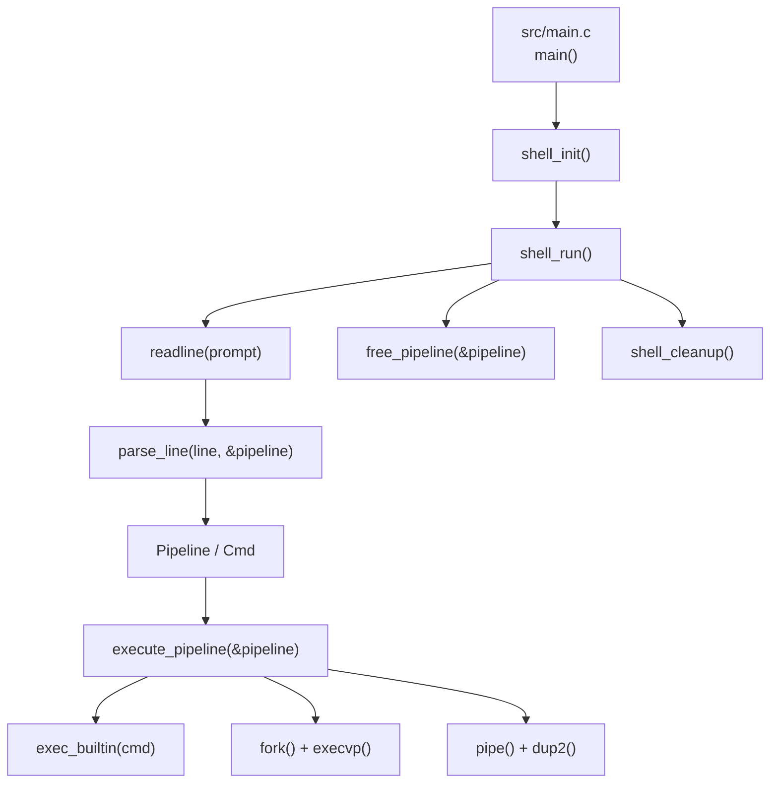
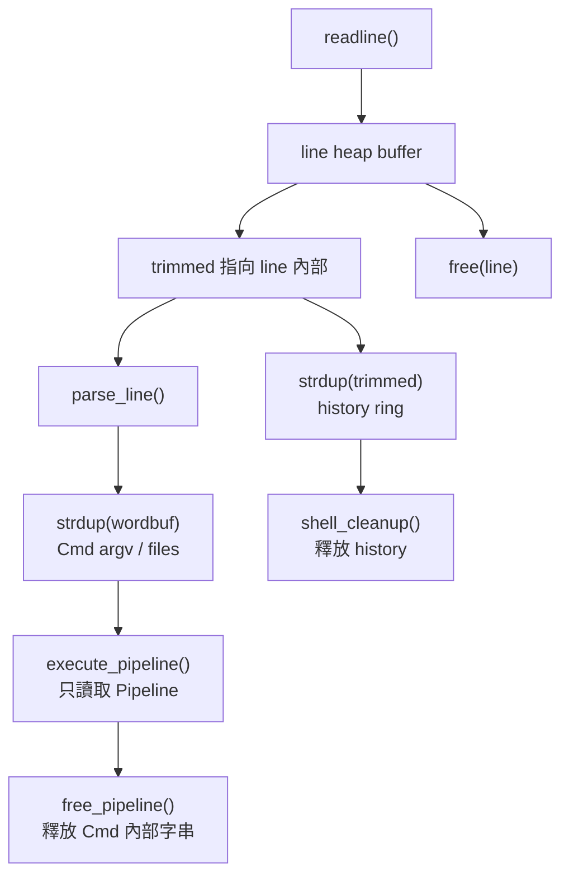
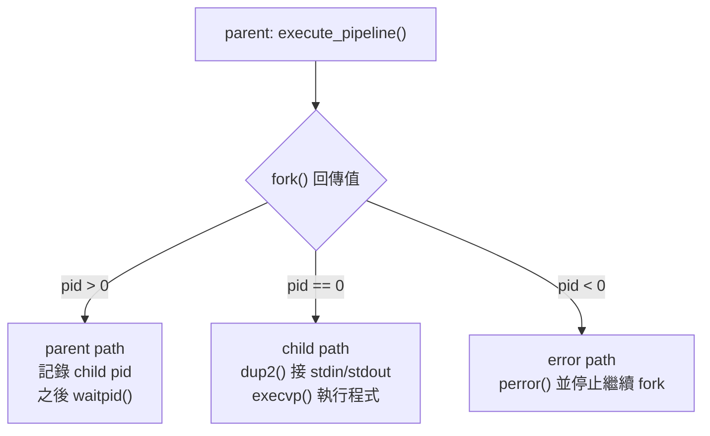
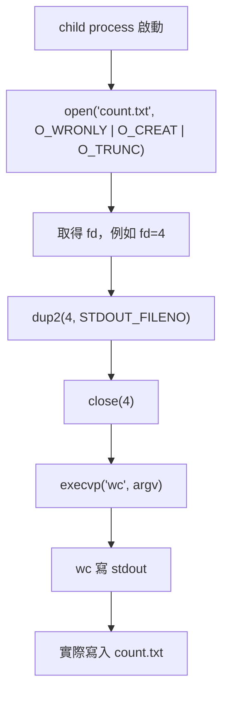
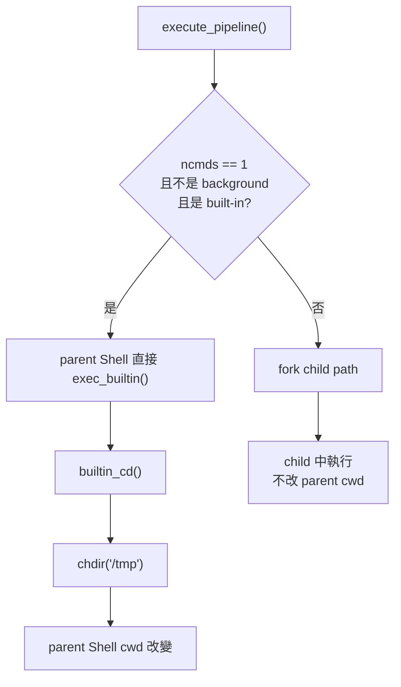
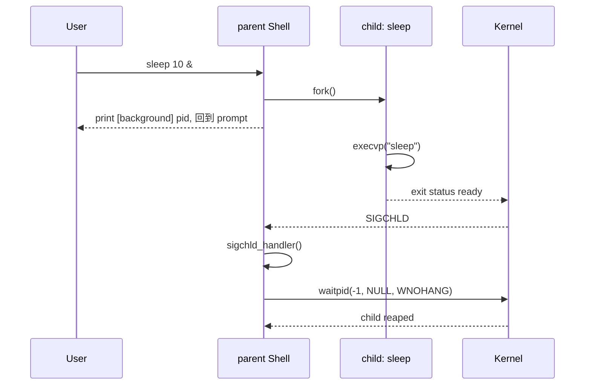
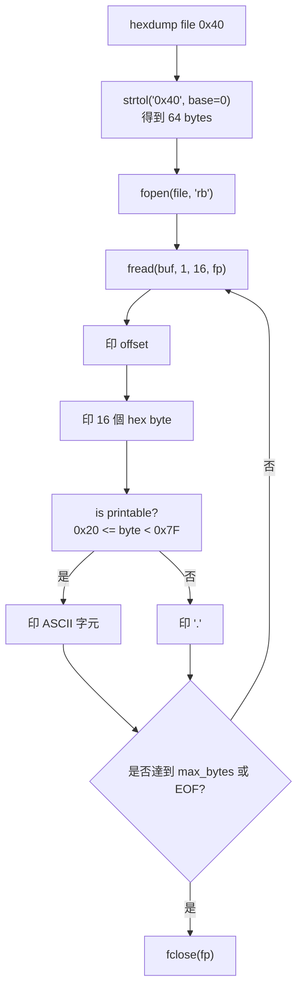
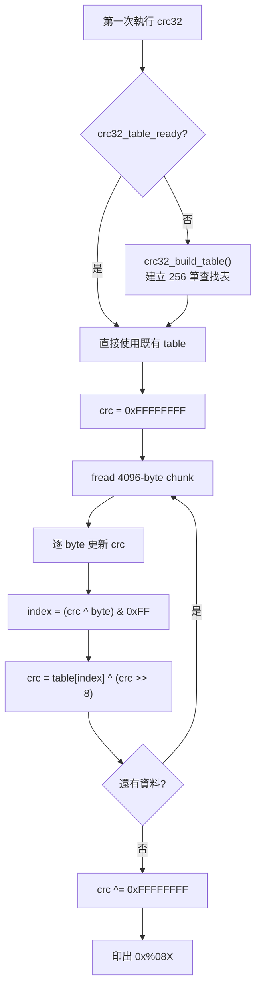

# fwsh (Firmware Mini Shell) API 技術分析報告

本報告只根據目前 `/fwsh` 目錄中的程式碼、標頭檔、Makefile 和實際執行結果整理。目標是把 API、資料結構、執行流程、資源生命週期和錯誤路徑說清楚，讓第一次讀這份專案的人能順著呼叫關係看懂程式。

報告分成兩段：

- **第一階段：Codebase Trace**
  先列出檔案、模組、函式、資料結構和可直接觀察到的行為。

- **第二階段：Architecture / API Technical Report**
  進一步說明 execution flow、callback chain、ownership、resource lifecycle、error path、BUG 分析和後續改善方向。

標示原則：

- **Direct Observation**：可從目前程式碼、Makefile 或本次實際執行直接驗證。
- **Conservative Inference**：根據目前呼叫關係或 POSIX 行為做出的保守推論，會明確標示。
- 若目前無法從程式碼確認，會寫「目前程式碼中未觀察到」。

---

## 第一階段：Codebase Trace

### 1. Project Structure

#### Direct Observation

| 類別 | 檔案 | 角色 |
|---|---|---|
| Source | `src/main.c` | 程式入口。依序呼叫 `shell_init()`、`shell_run()`、`shell_cleanup()`。 |
| Source | `src/shell.c` | Shell lifecycle、REPL、prompt、GNU Readline、history、signal handlers、全域 `g_shell`。 |
| Source | `src/parser.c` | 命令列 parser。將輸入字串解析成 `Pipeline` 和 `Cmd`。 |
| Source | `src/executor.c` | 執行引擎。處理 built-in direct execution、pipe、fork、dup2、redirection、execvp、waitpid、background。 |
| Source | `src/builtin.c` | 內建指令 dispatch table 與實作：`cd`、`pwd`、`exit`、`quit`、`help`、`history`、`clear`、`hexdump`、`crc32`、`memmap`。 |
| Header | `include/shell.h` | 共用 macro、`Cmd`、`Pipeline`、`ShellState`、shell lifecycle API。 |
| Header | `include/parser.h` | 宣告 `parse_line()`、`free_pipeline()`。 |
| Header | `include/executor.h` | 宣告 `execute_pipeline()`。 |
| Header | `include/builtin.h` | 宣告 `is_builtin()`、`exec_builtin()`。 |
| Build | `Makefile` | 使用 `gcc`、C11、`-Iinclude`、`-lreadline`，把 `src/*.c` 編成 `fwsh`。 |
| Docs | `docs/*.png` | Demo 圖片，本報告不依圖片推論程式行為。 |

#### Module Relationship



#### Execution Model Summary

```text
main()
  -> shell_init()
       -> 設定 SIGCHLD / SIGINT / SIGTSTP
       -> 設定 g_shell.running = 1
       -> 啟用 Readline Tab completion
  -> shell_run()
       -> readline()
       -> parse_line()
       -> execute_pipeline()
       -> free_pipeline()
  -> shell_cleanup()
```

---

### 2. Semantic Element Extraction

#### Public API

| API | 定義位置 | 宣告位置 | 功能 | 呼叫者 |
|---|---|---|---|---|
| `shell_init()` | `src/shell.c` | `include/shell.h` | 初始化 signal、Readline、Shell 狀態，印出 banner。 | `main()` |
| `shell_run()` | `src/shell.c` | `include/shell.h` | 進入 REPL 主迴圈。 | `main()` |
| `shell_cleanup()` | `src/shell.c` | `include/shell.h` | 釋放 history 和 Readline history。 | `main()` |
| `parse_line()` | `src/parser.c` | `include/parser.h` | 將一行字串解析成 `Pipeline`。 | `shell_run()` |
| `free_pipeline()` | `src/parser.c` | `include/parser.h` | 釋放 `Pipeline` 內部 `strdup()` 產生的字串。 | `shell_run()` |
| `execute_pipeline()` | `src/executor.c` | `include/executor.h` | 執行一個 `Pipeline`。 | `shell_run()` |
| `is_builtin()` | `src/builtin.c` | `include/builtin.h` | 判斷指令名稱是否為內建指令。 | `execute_pipeline()` |
| `exec_builtin()` | `src/builtin.c` | `include/builtin.h` | 執行內建指令。 | `execute_pipeline()` |

#### Important Internal Functions

| 函式 | 檔案 | 功能 |
|---|---|---|
| `sigchld_handler()` | `src/shell.c` | 使用 `waitpid(-1, NULL, WNOHANG)` 非阻塞回收 child。 |
| `sigint_handler()` | `src/shell.c` | 處理 Ctrl+C，清空目前輸入行並重繪 prompt。 |
| `build_prompt()` | `src/shell.c` | 組出 `[fwsh user@host path]$` prompt。 |
| `lexer_init()` | `src/parser.c` | 初始化 parser 內部 lexer。 |
| `skip_whitespace()` | `src/parser.c` | 跳過空白字元。 |
| `read_word()` | `src/parser.c` | 讀取一個 word，處理單引號與雙引號。 |
| `setup_redirections()` | `src/executor.c` | 在 child 中設定 `<`、`>`、`>>`。 |
| `exec_external()` | `src/executor.c` | 在 child 中執行外部指令。 |
| `crc32_build_table()` | `src/builtin.c` | 建立 CRC-32 查找表。 |

#### Macro / Constants

| 名稱 | 定義位置 | 說明 |
|---|---|---|
| `_POSIX_C_SOURCE 200809L` | `include/shell.h` | 啟用 POSIX API 宣告，例如 `strdup()`。 |
| `FWSH_VERSION` | `include/shell.h` | 版本字串，目前為 `1.0.0`。 |
| `MAX_INPUT` | `include/shell.h` | 單行輸入緩衝區上限，2048。 |
| `MAX_ARGS` | `include/shell.h` | 單一 command 最大 argv 數，128。 |
| `MAX_HISTORY` | `include/shell.h` | fwsh 自己保存的 history 筆數，50。 |
| `MAX_PIPES` | `include/shell.h` | Pipeline 最多 command 段數，16。 |
| `COLOR_*` | `include/shell.h` | ANSI 顏色 escape code。 |

#### API 關鍵字補充

| 關鍵字 | 英文 | 說明 | 在 `fwsh` 中的例子 |
|---|---|---|---|
| 行程識別碼 | Process ID, PID | 作業系統分配給每個 process 的整數編號。 | 背景執行時印出的 `[background] 375534`。 |
| 父行程 | Parent Process | 建立 child 的 process。 | `fwsh` 本身是外部指令的 parent。 |
| 子行程 | Child Process | 由 `fork()` 建立的新 process。 | `ls`、`grep`、`sleep` 會在 child 中執行。 |
| 行程映像 | Process Image | process 目前載入的程式碼、資料、堆疊等內容。 | `execvp()` 成功後，child 的 process image 變成外部程式。 |
| 結束狀態 | Exit Status | child 結束後留給 parent 讀取的狀態。 | parent 用 `waitpid()` 取得後，再用 `WEXITSTATUS()` 取 exit code。 |
| 檔案描述符 | File Descriptor, FD | process 內用來代表 I/O 資源的整數。 | `0` 是 stdin，`1` 是 stdout，`2` 是 stderr。 |
| 檔案描述符表 | File Descriptor Table | 每個 process 都有的 fd 對照表。 | `fork()` 後 child 會繼承 parent 當下開啟的 pipe fd。 |
| 開啟檔案描述 | Open File Description | kernel 內部真正記錄檔案狀態的位置，例如 offset 和 flags。 | `dup2()` 後兩個 fd 可指向同一個 open file description。 |
| 標準輸入 | Standard Input, stdin | 預設輸入來源，fd 是 0。 | `grep` 從 pipe 讀資料時，實際讀的是被 `dup2()` 改接後的 stdin。 |
| 標準輸出 | Standard Output, stdout | 預設輸出目的地，fd 是 1。 | `wc -c > out.txt` 會把 stdout 改接到檔案。 |
| 標準錯誤 | Standard Error, stderr | 錯誤輸出目的地，fd 是 2。 | `fprintf(stderr, ...)` 用來印 parser 或 executor 錯誤。 |
| 阻塞 | Blocking | 呼叫後如果條件未滿足，process 會等待。 | 前景 `waitpid(pid, &status, 0)` 會等 child 結束。 |
| 非阻塞 | Non-blocking | 呼叫後不等待，無結果也會立刻回來。 | `waitpid(-1, NULL, WNOHANG)` 用於背景行程回收。 |
| 檔案結尾 | End Of File, EOF | 讀取端確認沒有更多資料。 | pipe 寫端全部關閉後，讀端才會收到 EOF。 |
| 競爭條件 | Race Condition | 兩個流程存取同一狀態，結果取決於先後順序。 | `SIGCHLD` handler 和 foreground `waitpid()` 都可能回收 child。 |
| 可重入 | Reentrant | 函式不依賴共享可變狀態，可較安全地被重複進入。 | `parser.c` 用區域 `Lexer`，避免 parser 狀態放全域。 |
| Signal 安全 | Async-signal-safe | 可以在 signal handler 裡安全呼叫的函式。 | `write()` 通常安全；`printf()` 不適合在 handler 中呼叫。 |
| 緩衝區 | Buffer | 暫存資料的記憶體區塊。 | `hexdump` 每次用 `uint8_t buf[16]` 讀 16 bytes。 |
| 堆積區 | Heap | 動態配置記憶體所在區域，需要手動釋放。 | `strdup()` 建立的 argv 字串由 `free_pipeline()` 釋放。 |
| 堆疊區 | Stack | 函式區域變數常用的記憶體區域，離開函式後失效。 | `wordbuf[MAX_INPUT]` 是 parser 的暫存 buffer。 |
| 擁有權 | Ownership | 誰負責釋放或關閉某個資源。 | `Pipeline` 擁有 parser 複製出的字串。 |
| 哨兵值 | Sentinel | 用特定值表示資料結尾。 | `builtins[]` 最後一筆 `{NULL, NULL, NULL}`。 |

---

### 3. Data Structure Inventory

#### `Cmd`

`Cmd` 是一段可執行指令。

```c
typedef struct {
  char* argv[MAX_ARGS];
  int argc;
  char* in_file;
  char* out_file;
  int out_append;
} Cmd;
```

| 欄位 | 意義 | 由誰設定 | 由誰使用 | Ownership |
|---|---|---|---|---|
| `argv` | `execvp()` 格式的參數陣列，最後一格必須是 `NULL`。 | `parse_line()` | `is_builtin()`、`exec_builtin()`、`execvp()` | 字串由 `strdup()` 建立，`free_pipeline()` 釋放。 |
| `argc` | argv 實際參數數量。 | `parse_line()` | parser bounds check、executor、builtins | value，不需釋放。 |
| `in_file` | `< file` 的檔名。 | `parse_line()` | `setup_redirections()` | `strdup()` 建立，`free_pipeline()` 釋放。 |
| `out_file` | `>` 或 `>>` 的檔名。 | `parse_line()` | `setup_redirections()` | `strdup()` 建立，`free_pipeline()` 釋放。 |
| `out_append` | `1` 代表 `>>`，`0` 代表 `>`。 | `parse_line()` | `setup_redirections()` | value，不需釋放。 |

#### `Pipeline`

`Pipeline` 是一行輸入解析後的最高層結構。

```c
typedef struct {
  Cmd cmds[MAX_PIPES];
  int ncmds;
  int background;
} Pipeline;
```

| 欄位 | 意義 | 由誰設定 | 由誰使用 |
|---|---|---|---|
| `cmds` | pipeline 中所有 command。 | `parse_line()` | `execute_pipeline()`、`free_pipeline()` |
| `ncmds` | 有效 command 數量。 | `parse_line()` | executor fork 數量、cleanup 範圍 |
| `background` | 是否背景執行。 | `parse_line()` | executor 是否 wait |

#### `ShellState`

`ShellState` 是 Shell 全域狀態。

```c
typedef struct {
  char* history[MAX_HISTORY];
  int hist_count;
  int hist_head;
  int running;
} ShellState;
```

| 欄位 | 意義 | 使用位置 |
|---|---|---|
| `history` | fwsh 自己保存的 history ring buffer。 | `shell_run()`、`builtin_history()`、`shell_cleanup()` |
| `hist_count` | 目前可顯示的 history 筆數。 | `shell_run()`、`builtin_history()` |
| `hist_head` | 下一筆 history 寫入位置。 | `shell_run()`、`builtin_history()` |
| `running` | REPL 是否繼續。 | `shell_init()`、`shell_run()`、`builtin_exit()` |

---

### 4. API / Macro Inventory by Lifecycle

#### Initialization

| 名稱 | 類型 | 直接效果 | 重要性 |
|---|---|---|---|
| `main()` | Entry function | 呼叫 shell 三階段 lifecycle。 | 保持入口簡單，方便追流程。 |
| `shell_init()` | Public API | 設定 signal handler、banner、Readline completion、`running`。 | 決定 Shell 啟動後的互動行為。 |
| `sigaction()` | POSIX API | 註冊 `SIGCHLD`、`SIGINT`、忽略 `SIGTSTP`。 | 建立非同步事件處理流程。 |
| `rl_bind_key()` | Readline API | 將 Tab 綁到 `rl_complete`。 | 啟用 Tab 補全。 |

#### Runtime Input

| 名稱 | 類型 | 直接效果 | Resource |
|---|---|---|---|
| `readline()` | Readline API | 讀取一行使用者輸入。 | 回傳 heap 字串，由 `free(line)` 釋放。 |
| `add_history()` | Readline API | 加入 Readline 內部 history。 | Readline 管理，最後 `rl_clear_history()`。 |
| `strdup(trimmed)` | POSIX API | 複製一份輸入到 `g_shell.history`。 | `shell_cleanup()` 或覆寫 slot 前釋放。 |

#### Parsing

| 名稱 | 類型 | 直接效果 | Resource |
|---|---|---|---|
| `parse_line()` | Public API | 將 `line` 填入 `Pipeline`。 | 內部 `strdup()` 的字串由 caller 呼叫 `free_pipeline()` 釋放。 |
| `read_word()` | Internal helper | 讀出一個 word，支援 quote。 | 使用 caller 提供的 stack buffer。 |
| `free_pipeline()` | Public API | 釋放 `argv`、`in_file`、`out_file`。 | 只釋放內部字串，不釋放 `Pipeline` 本身。 |

#### Execution

| 名稱 | 類型 | 直接效果 | Resource |
|---|---|---|---|
| `execute_pipeline()` | Public API | 執行 `Pipeline`。 | 建立 pipe fd、fork child、等待 child。 |
| `is_builtin()` | Public API | 查 dispatch table。 | 不配置資源。 |
| `exec_builtin()` | Public API | 呼叫對應 built-in function pointer。 | 視 builtin 而定。 |
| `pipe()` | POSIX API | 建立讀端與寫端 fd。 | parent 和 child 都要 close。 |
| `fork()` | POSIX API | 建立 child process。 | parent 需 wait 或背景回收。 |
| `dup2()` | POSIX API | 改接 stdin/stdout。 | 原 fd 接好後可 close。 |
| `execvp()` | POSIX API | 用外部程式替換 child process image。 | 成功後不會回到原本的 child 程式碼。 |
| `waitpid()` | POSIX API | 等待或回收 child。 | 讀取 child exit status。 |

#### Cleanup

| 名稱 | 類型 | 直接效果 |
|---|---|---|
| `free_pipeline()` | Per-command cleanup | 每輪 command 後清掉 parser 配置的字串。 |
| `free(line)` | Per-command cleanup | 釋放 Readline 回傳的輸入字串。 |
| `shell_cleanup()` | Program cleanup | 釋放 Shell history、清除 Readline history。 |
| `close()` | FD cleanup | 關閉 pipe fd 或 redirection fd。 |
| `fclose()` | FILE cleanup | 關閉 built-in 工具開啟的檔案。 |

---

### 5. Built-in Command Table

#### Direct Observation

`builtin.c` 使用 `BuiltinEntry builtins[]`：

| Command | Function | 影響 Shell 狀態 | 說明 |
|---|---|---|---|
| `cd` | `builtin_cd()` | 是 | 使用 `chdir()` 改變 Shell cwd，成功前記錄 `OLDPWD`。 |
| `pwd` | `builtin_pwd()` | 否 | 使用 `getcwd()` 印出目前目錄。 |
| `exit` | `builtin_exit()` | 是 | 設定 `g_shell.running = 0`。 |
| `quit` | `builtin_exit()` | 是 | `exit` alias。 |
| `help` | `builtin_help()` | 否 | 走訪 `builtins[]` 印出指令說明。 |
| `history` | `builtin_history()` | 否 | 顯示 `g_shell.history`。 |
| `clear` | `builtin_clear()` | 否 | 輸出 ANSI 清畫面序列。 |
| `hexdump` | `builtin_hexdump()` | 否 | 開檔讀 binary，輸出 hex + ASCII。 |
| `crc32` | `builtin_crc32()` | 否 | 計算 CRC-32。 |
| `memmap` | `builtin_memmap()` | 否 | 讀取 `/proc/iomem`。 |

#### Dispatch Flow

```text
exec_builtin(cmd)
  for each entry in builtins[]
    if strcmp(cmd->argv[0], entry.name) == 0
      return entry.func(cmd)
  return -1
```

這種設計的好處是新增指令時集中在 table，不需要改很多分支判斷。

---

### 6. Parser Token Behavior

#### Direct Observation

| 輸入語法 | Parser 行為 | 後續 executor 行為 |
|---|---|---|
| `word` | 加入目前 `Cmd.argv`。 | built-in 或 `execvp()` 使用。 |
| `'text with space'` | 單引號內完整當作同一個 word。 | 不再做變數展開。 |
| `"text with space"` | 雙引號內完整當作同一個 word，支援 `\"` 和 `\\`。 | 不再做變數展開。 |
| `|` | 切到下一個 `Cmd`。 | 建立 pipe 串接 stdout/stdin。 |
| `< file` | 設定 `Cmd.in_file`。 | 外部指令 child 用 `open()` + `dup2()` 接到 stdin。 |
| `> file` | 設定 `Cmd.out_file`，`out_append = 0`。 | 外部指令 child 用 `O_TRUNC` 開檔。 |
| `>> file` | 設定 `Cmd.out_file`，`out_append = 1`。 | 外部指令 child 用 `O_APPEND` 開檔。 |
| `&` | 設定 `Pipeline.background = 1`。 | parent 不等待 child。 |

#### 目前程式碼中未觀察到

- 環境變數展開，例如 `$HOME`。
- 萬用字元展開，例如 `*.c`。
- Command substitution，例如 `$(pwd)`。
- Escape sequence 完整 Shell 相容性。
- AST tree 或 token array；目前 parser 直接填 `Pipeline`。

---

### 7. Call Graph

#### Startup Chain

```text
OS starts ./fwsh
  -> main()
  -> shell_init()
       -> sigemptyset()
       -> sigaction(SIGCHLD, sigchld_handler)
       -> sigaction(SIGINT, sigint_handler)
       -> sigaction(SIGTSTP, SIG_IGN)
       -> g_shell.running = 1
       -> printf banner
       -> rl_bind_key('\t', rl_complete)
  -> shell_run()
```

#### REPL Chain

```text
shell_run()
  while g_shell.running:
    build_prompt(prompt)
    line = readline(prompt)
    if line == NULL:
      print exit
      break
    trim leading whitespace
    if empty:
      free(line)
      continue
    add_history(trimmed)
    save to g_shell.history ring
    memset(&pipeline, 0, sizeof(pipeline))
    if parse_line(trimmed, &pipeline) == 0:
      execute_pipeline(&pipeline)
    free_pipeline(&pipeline)
    free(line)
```

#### Single Foreground Built-in Chain

```text
execute_pipeline(pipeline)
  if ncmds == 1 and background == 0:
    cmd = &cmds[0]
    if is_builtin(cmd->argv[0]):
      return exec_builtin(cmd)
```

這條路不 fork，因此 `cd` 和 `exit` 可以修改 parent Shell 狀態。

#### External / Pipeline Chain

```text
execute_pipeline(pipeline)
  create ncmds - 1 pipes
  for each command:
    pid = fork()
    child:
      if not first command:
        dup2(previous pipe read end, STDIN_FILENO)
      if not last command:
        dup2(current pipe write end, STDOUT_FILENO)
      close all pipe fds
      if builtin:
        _exit(exec_builtin(cmd))
      else:
        setup_redirections(cmd)
        execvp(cmd->argv[0], cmd->argv)
        _exit(127)
    parent:
      record pid
  parent closes all pipe fds
  if foreground:
    waitpid(each child)
  else:
    print background pids
```

---

## 第二階段：Architecture / API Technical Report

### 1. Entry Point 行為

#### Direct Observation

`main()` 沒有解析 command-line arguments，也沒有 script mode。它只負責 lifecycle：

```c
shell_init();
shell_run();
shell_cleanup();
return 0;
```

這讓專案入口很容易追。真正的行為都在 shell、parser、executor、builtin 四個模組。

#### 目前程式碼中未觀察到

- `fwsh script.fws`
- `fwsh -c "command"`
- batch mode
- command-line option parser

---

### 2. Callback Registration Chain

#### Signal Callback

`shell_init()` 使用 `sigaction()` 註冊：

| Signal | Handler | 行為 |
|---|---|---|
| `SIGCHLD` | `sigchld_handler` | 回收已結束 child。 |
| `SIGINT` | `sigint_handler` | Ctrl+C 時清除輸入行，不讓 Shell 直接退出。 |
| `SIGTSTP` | `SIG_IGN` | 忽略 Ctrl+Z，避免 Shell 自己被暫停。 |

`sa.sa_flags = SA_RESTART`，表示部分被 signal 中斷的 system call 會自動重試。

#### Built-in Callback

`builtins[]` 是靜態 dispatch table，每筆資料有：

```c
const char* name;
int (*func)(Cmd*);
const char* desc;
```

`exec_builtin()` 透過 function pointer 呼叫對應實作。

#### Readline Callback

`shell_init()` 呼叫：

```c
rl_bind_key('\t', rl_complete);
```

這把 Tab 綁到 GNU Readline 內建 completion function。目前程式碼中未觀察到自訂 completion callback。

---

### 3. Runtime Dispatch Flow

#### Single Foreground Built-in

執行：

```bash
cd /tmp
```

流程：

```text
parse_line -> Pipeline(ncmds=1)
execute_pipeline
  -> is_builtin("cd") == 1
  -> exec_builtin(cmd)
  -> builtin_cd()
  -> chdir("/tmp")
```

這條路沒有 `fork()`。原因是 `cd` 必須改 parent Shell 的 cwd。

#### External Command

執行：

```bash
ls -l
```

流程：

```text
parse_line -> Pipeline(ncmds=1)
execute_pipeline
  -> is_builtin("ls") == 0
  -> fork()
  -> child execvp("ls", argv)
  -> parent waitpid(child)
```

#### Pipeline

執行：

```bash
cat log.txt | grep error | wc -l
```

流程：

```text
parse_line -> Pipeline(ncmds=3)
execute_pipeline
  -> pipe[0], pipe[1]
  -> fork child 0: cat
  -> fork child 1: grep
  -> fork child 2: wc
  -> parent closes all pipe fds
  -> parent waitpid all children
```

#### Background

執行：

```bash
sleep 10 &
```

流程：

```text
parse_line -> background = 1
execute_pipeline
  -> fork child
  -> parent does not wait
  -> print [background] pid
child exits later
  -> kernel sends SIGCHLD
  -> sigchld_handler reaps child
```

---

### 4. Resource Lifecycle

#### Heap Resource

| Resource | 建立位置 | 擁有者 | 釋放位置 |
|---|---|---|---|
| `line` from `readline()` | `shell_run()` | `shell_run()` | 每輪最後 `free(line)`。 |
| `g_shell.history[idx]` | `shell_run()` 的 `strdup(trimmed)` | `g_shell` | 覆寫 slot 前 `free()`；結束時 `shell_cleanup()`。 |
| `Cmd.argv[j]` | `parse_line()` 的 `strdup(wordbuf)` | `Pipeline` | `free_pipeline()`。 |
| `Cmd.in_file` | `parse_line()` | `Pipeline` | `free_pipeline()`。 |
| `Cmd.out_file` | `parse_line()` | `Pipeline` | `free_pipeline()`。 |

#### File Descriptor Resource

| Resource | 建立位置 | 使用方式 | 釋放位置 |
|---|---|---|---|
| Pipe fd | `pipe(pipes[i])` | child 用 `dup2()` 接 stdin/stdout。 | child 和 parent 都 close。 |
| Input file fd | `open(in_file, O_RDONLY)` | `dup2(fd, STDIN_FILENO)`。 | `dup2()` 後 close。 |
| Output file fd | `open(out_file, flags, 0644)` | `dup2(fd, STDOUT_FILENO)`。 | `dup2()` 後 close。 |

#### Process Resource

| Resource | 建立位置 | 回收方式 |
|---|---|---|
| Foreground child | `fork()` | parent 在 executor 中 `waitpid(pid, &status, 0)`。 |
| Background child | `fork()` | `SIGCHLD` handler 使用 `waitpid(-1, NULL, WNOHANG)`。 |

#### FILE Resource

| Built-in | 建立 | 釋放 |
|---|---|---|
| `hexdump` | `fopen(file, "rb")` | `fclose(fp)` |
| `crc32` | `fopen(file, "rb")` | `fclose(fp)` |
| `memmap` | `fopen("/proc/iomem", "r")` | `fclose(fp)` |

---

### 5. Ownership / Lifecycle Diagram



重點：

- `trimmed` 只是指向 `line` 內部，不是新配置的字串。
- history 保存的是 `strdup(trimmed)`，所以 `line` 被 free 後 history 不會變成 dangling pointer。
- executor 不保存 `Pipeline` 指標到下一輪，所以每輪結束可以安全 `free_pipeline()`。

---

### 6. Error Propagation Path

#### Parser Error

| 錯誤 | 目前行為 | 回傳 |
|---|---|---|
| 管線段數超過 `MAX_PIPES` | 印出 `fwsh: too many pipes`。 | `-1` |
| `<` 後沒有檔名 | 印出 `fwsh: missing filename after '<'`。 | `-1` |
| `>` 或 `>>` 後沒有檔名 | 印出 `fwsh: missing filename after '>'`。 | `-1` |
| argv 超過上限 | 印出 `fwsh: too many arguments`。 | `-1` |

`shell_run()` 只有在 `parse_line()` 回傳 0 時才呼叫 `execute_pipeline()`。不論解析成功或失敗，最後都會呼叫 `free_pipeline()`。

#### Executor Error

| 錯誤 | 目前行為 |
|---|---|
| `pipe()` 失敗 | `perror("fwsh: pipe")`，關閉已建立 pipe，回傳 `-1`。 |
| `fork()` 失敗 | `perror("fwsh: fork")`，停止繼續 fork，等待已 fork child。 |
| `open()` input/output 失敗 | child 印出檔名與 `strerror(errno)`，用 `_exit(1)` 結束。 |
| `execvp()` 失敗 | child 印出錯誤，用 `_exit(127)` 結束。 |
| foreground child 非正常結束 | 最後一段 status 設為 `-1`。 |

#### Built-in Error

| Built-in | 錯誤情境 | 回傳 |
|---|---|---|
| `cd` | `HOME` 不存在、`OLDPWD` 不存在、`chdir()` 失敗。 | `1` |
| `hexdump` | 缺檔名、長度非法、`fopen()` 失敗。 | `1` |
| `crc32` | 缺檔名、`fopen()` 失敗。 | `1` |
| `memmap` | `/proc/iomem` 開啟失敗。 | `1` |
| `exec_builtin` | 找不到 command。 | `-1` |

---

### 7. Important Behavior Differences

#### Built-in vs External Command

| 項目 | Built-in | External |
|---|---|---|
| 執行位置 | 單一前景時在 parent Shell；pipeline/background 時在 child。 | child process。 |
| 查找方式 | `builtins[]` linear search。 | `execvp()` 依 `$PATH` 搜尋。 |
| 是否能改 Shell 狀態 | 單一前景 built-in 可以，例如 `cd`、`exit`。 | 不行，因為外部程式在 child 中。 |
| redirection 支援 | 目前不完整。 | 目前由 `setup_redirections()` 支援。 |

#### `>` vs `>>`

| 語法 | Parser 設定 | Executor open flags |
|---|---|---|
| `> file` | `out_append = 0` | `O_WRONLY | O_CREAT | O_TRUNC` |
| `>> file` | `out_append = 1` | `O_WRONLY | O_CREAT | O_APPEND` |

#### Parent Built-in vs Child Built-in

| 指令 | 執行位置 | 結果 |
|---|---|---|
| `cd /tmp` | parent Shell | Shell cwd 真的改變。 |
| `cd /tmp | pwd` | `cd` 在 child | parent Shell cwd 不改變。 |
| `exit` | parent Shell | `g_shell.running = 0`，Shell 結束。 |
| `exit &` | child | child 結束，parent Shell 繼續。 |

---

### 8. 相關 API 教學、比較與選擇依據

本節把 `fwsh` 用到的 API 放回同類 API 裡比較。讀 API 時不要只背函式名稱，應該要能回答三個問題：

1. 這個 API 解決什麼問題？
2. 和相似 API 差在哪裡？
3. 為什麼這個專案選它？

#### 8.1 行程建立：`fork()`、`vfork()`、`posix_spawn()`、`system()`

| API | 作用 | 優點 | 限制或風險 | `fwsh` 選擇依據 |
|---|---|---|---|---|
| `fork()` | 複製目前行程，建立 child process。 | 最彈性。child 可以先改 fd、設定 redirection、接 pipe，再 `execvp()`。 | 初學者容易忘記 parent 和 child 都會從 `fork()` 後繼續執行。 | `fwsh` 需要在 child 執行前調整 stdin/stdout，所以選 `fork()`。 |
| `vfork()` | 建立 child，但 child 暫時和 parent 共用位址空間，直到 exec 或 exit。 | 某些環境下比 `fork()` 輕量。 | 使用限制多，child 不能隨意改變記憶體或呼叫複雜函式，容易踩到未定義行為。 | 不適合教學版 Shell。`fwsh` 需要清楚、安全的流程。 |
| `posix_spawn()` | 建立新行程並執行程式，可設定部分 file actions。 | 比 `fork()+exec` 更像高階封裝，在大型程式或受限環境可能較有效率。 | 對初學者較抽象，複雜 pipeline 仍要處理 file actions。 | `fwsh` 主要想展示 Shell 原理，因此保留 `fork()+execvp()`。 |
| `system()` | 呼叫 `/bin/sh -c command` 執行一整串字串。 | 最簡單，一行就能跑外部命令。 | 會再交給別的 Shell 解析，安全性和可控性差，也看不到 parser/executor 細節。 | 不使用。`fwsh` 的目的就是自己實作解析和執行流程。 |

教學重點：

- `fork()` 回傳值有三種情況：child 看到 `0`，parent 看到 child pid，失敗看到 `< 0`。
- `fork()` 後 parent 和 child 是兩個不同 process，各自有自己的記憶體空間。
- child 繼承 parent 已開啟的 file descriptor，所以 pipe 和 redirection 才能在 `fork()` 後接線。



#### 8.2 程式載入：`execvp()`、`execv()`、`execve()`、`execlp()`

`exec` family 的共同概念是：在目前 process 內載入另一個程式。成功後，原本的程式碼不會繼續往下跑，因為 process image 已經被替換。

| API | PATH 搜尋 | 參數格式 | 環境變數來源 | 適合情境 | `fwsh` 選擇依據 |
|---|---|---|---|---|---|
| `execvp(file, argv)` | 會 | `char* argv[]` | 沿用目前 process environment | Shell 執行使用者輸入的指令，例如 `ls`、`grep`。 | `parser` 已產生 `argv[]`，也需要依 `$PATH` 找指令，所以最適合。 |
| `execv(path, argv)` | 不會 | `char* argv[]` | 沿用目前 process environment | 已經知道完整路徑，例如 `/bin/ls`。 | 不適合一般 Shell，因為使用者常輸入 `ls` 而不是 `/bin/ls`。 |
| `execve(path, argv, envp)` | 不會 | `char* argv[]` | 呼叫者自行提供 `envp` | 需要精準控制環境變數。 | 目前 `fwsh` 沒有自訂 environment，因此不需要。 |
| `execlp(file, arg0, ..., NULL)` | 會 | variadic argument list | 沿用目前 process environment | 參數數量在程式碼中固定時。 | Shell 的 argv 數量由使用者輸入決定，不適合 variadic 寫法。 |

使用 `execvp()` 時，`argv[0]` 通常是指令名稱本身：

```text
輸入：grep error log.txt
argv[0] = "grep"
argv[1] = "error"
argv[2] = "log.txt"
argv[3] = NULL
```

為什麼 `argv` 一定要 `NULL` 結尾：`execvp()` 不知道陣列長度，只能一路讀到 `NULL` 才停止。這也是 `parse_line()` 每加入一個 argv 後會維持 `cur->argv[cur->argc] = NULL` 的原因。

#### 8.3 行程等待：`wait()`、`waitpid()`、`waitid()`

| API | 可以指定 PID | 可以非阻塞 | 回傳資訊 | 適合情境 | `fwsh` 選擇依據 |
|---|---|---|---|---|---|
| `wait(&status)` | 否 | 否 | 基本 exit status | 只要回收任意 child。 | 前景 pipeline 需要等指定 child，不夠精準。 |
| `waitpid(pid, &status, options)` | 是 | 是，搭配 `WNOHANG` | 基本 exit status | Shell、server、需要管理多個 child 的程式。 | 同時適合 foreground wait 和 background reap。 |
| `waitid()` | 是 | 是 | 較細的 `siginfo_t` | 需要更完整 child 狀態。 | 目前功能不需要那麼細。 |

`fwsh` 有兩種等待情境：

| 情境 | 使用方式 | 原因 |
|---|---|---|
| 前景指令 | `waitpid(pids[i], &status, 0)` | Shell 要等使用者指令跑完，再回到 prompt。 |
| 背景指令 | `waitpid(-1, NULL, WNOHANG)` | Shell 不能卡住，要有 child 結束才回收。 |

關鍵字補充：

- `status`：不是單純的 exit code，而是包了更多狀態位元的整數。
- `WIFEXITED(status)`：判斷 child 是否正常用 `exit()` 或 `_exit()` 結束。
- `WEXITSTATUS(status)`：在 `WIFEXITED` 為真時，取出真正的 exit code。
- `WNOHANG`：沒有可回收 child 時立刻回傳，不阻塞目前 process。

#### 8.4 行程間通訊：`pipe()`、FIFO、`socketpair()`

| API | 通訊方向 | 是否有檔名 | 適合情境 | `fwsh` 選擇依據 |
|---|---|---|---|---|
| `pipe(fd)` | 單向 | 否 | parent/child 或同源 child 間傳資料，例如 Shell pipeline。 | `A | B` 是單向資料流，`pipe()` 最直接。 |
| FIFO / named pipe | 通常單向 | 是，存在檔案系統路徑 | 不相關 process 透過檔名溝通。 | Shell 每次 pipeline 都是臨時通道，不需要留下檔名。 |
| `socketpair()` | 雙向 | 否 | 需要雙向 IPC，例如 client/server 互傳資料。 | Shell pipeline 只需要 stdout 到 stdin，雙向能力用不到。 |

`pipe()` 建立兩個 fd：

```text
pipes[i][0] = read end
pipes[i][1] = write end
```

記憶方式：

- `0` 常聯想到 stdin，所以是讀端。
- `1` 常聯想到 stdout，所以是寫端。

#### 8.5 FD 複製：`dup()`、`dup2()`、`dup3()`、`fcntl(F_DUPFD)`

| API | 可指定新 fd 編號 | 可設定 close-on-exec | 常見用途 | `fwsh` 選擇依據 |
|---|---|---|---|---|
| `dup(oldfd)` | 否 | 否 | 複製到目前最小可用 fd。 | 不能保證變成 `STDIN_FILENO` 或 `STDOUT_FILENO`。 |
| `dup2(oldfd, newfd)` | 是 | 否 | 把檔案或 pipe 接到 stdin/stdout。 | `fwsh` 需要精準把 fd 接到 0 或 1，所以選它。 |
| `dup3(oldfd, newfd, flags)` | 是 | 是，可用 `O_CLOEXEC` | Linux-specific，更精細控制。 | 專案偏 POSIX 教學，`dup2()` 較通用。 |
| `fcntl(F_DUPFD)` | 可指定最小 fd | 可搭配其他 fcntl 操作 | 需要更細 fd 控制時。 | 對本專案過度複雜。 |

`dup2(fd, STDOUT_FILENO)` 的直覺圖：

```text
呼叫前：
  fd 1  -> terminal stdout
  fd 4  -> output.txt

dup2(4, 1) 後：
  fd 1  -> output.txt
  fd 4  -> output.txt

close(4) 後：
  fd 1  -> output.txt
```

為什麼 `dup2()` 後要 `close(fd)`：`fd` 和 `STDOUT_FILENO` 已經指向同一個 open file description。保留原 fd 沒必要，還可能造成 fd leak。

#### 8.6 Signal API：`signal()`、`sigaction()`、`sigprocmask()`

| API | 作用 | 優點 | 限制 | `fwsh` 選擇依據 |
|---|---|---|---|---|
| `signal(signum, handler)` | 設定簡單 signal handler。 | 寫法短。 | 不同系統語義可能不同，不能細部設定 flags。 | Shell 需要穩定 signal 行為，不選。 |
| `sigaction(signum, &sa, NULL)` | 設定完整 signal handler。 | 可設定 `SA_RESTART`、mask、handler。 | 寫法較長。 | `fwsh` 需要明確控制 `SIGCHLD` 和 `SIGINT`。 |
| `sigprocmask()` | 暫時阻擋或解除阻擋 signal。 | 可避免 signal 和主流程競爭。 | 使用錯誤會讓 signal 延遲或漏處理。 | 目前未使用，但可用來改善 foreground wait race。 |

`fwsh` 使用 `sigaction()` 的原因：

- `SIGCHLD`：child 結束時回收 zombie。
- `SIGINT`：Ctrl+C 清除輸入行，不終止 Shell。
- `SIGTSTP`：忽略 Ctrl+Z，避免 Shell 自己被暫停。
- `SA_RESTART`：讓部分被 signal 中斷的 system call 自動重試。

關鍵字補充：

- `handler`：signal 發生時被呼叫的函式。
- `async-signal-safe`：在 signal handler 中安全可呼叫的函式類型。`write()` 是，`printf()` 不是。
- `signal mask`：暫時阻擋某些 signal 的集合。
- `SA_RESTART`：讓部分 syscall 被 signal 中斷後自動重啟。

#### 8.7 輸入 API：`read()`、`fgets()`、`getline()`、`readline()`

| API | 行編輯 | History | 記憶體管理 | 適合情境 | `fwsh` 選擇依據 |
|---|---|---|---|---|---|
| `read()` | 無 | 無 | 呼叫者提供 buffer。 | 系統層級、socket、raw input。 | 太底層，要自己處理退格、方向鍵。 |
| `fgets()` | 無 | 無 | 呼叫者提供 buffer。 | 讀文字檔或簡單 stdin。 | 可用，但互動 Shell 體驗差。 |
| `getline()` | 無 | 無 | 可自動調整 buffer。 | 讀長文字行。 | 仍沒有行編輯和 history。 |
| `readline()` | 有 | 可搭配 `add_history()` | 回傳 heap 字串，caller 要 `free()`。 | 互動式 Shell。 | `fwsh` 需要 Tab、上下鍵、Ctrl+R，所以選 Readline。 |

使用 `readline()` 的代價是需要連結 `-lreadline`，並安裝 `libreadline-dev`。

#### 8.8 檔案 I/O：`open()`、`fopen()`、`read()`、`fread()`

`fwsh` 同時使用 POSIX fd API 和 C stdio API。兩者用途不同，不是誰一定比較好。

| API 類型 | 代表 API | 操作單位 | 適合情境 | `fwsh` 使用位置 |
|---|---|---|---|---|
| POSIX fd | `open()`、`close()`、`dup2()` | file descriptor | 需要接 stdin/stdout、控制 fd 編號。 | redirection。 |
| C stdio | `fopen()`、`fread()`、`fgets()`、`fclose()` | `FILE*` stream | 讀檔內容、逐行處理、緩衝 I/O。 | `hexdump`、`crc32`、`memmap`。 |

為什麼 redirection 用 `open()`，不是 `fopen()`：

- `dup2()` 需要的是 fd，不是 `FILE*`。
- `open()` 直接回傳 fd，能精準接到 `STDIN_FILENO` 或 `STDOUT_FILENO`。

為什麼 `hexdump` 和 `crc32` 用 `fopen()` / `fread()`：

- 它們只是讀檔內容，不需要改變 stdin/stdout。
- `fread()` 搭配固定大小 buffer 寫法簡潔，也有 stdio buffering。

#### 8.9 字串與數字轉換：`atoi()`、`strtol()`、`strtoul()`

| API | 錯誤檢查 | 支援進位 | 適合情境 | `fwsh` 選擇依據 |
|---|---|---|---|---|
| `atoi()` | 幾乎沒有 | 十進位 | 很簡單、不需要嚴格檢查的輸入。 | `exit [code]` 目前用 `atoi()`，但可改善。 |
| `strtol()` | 可用 `endptr` 檢查 | base=0 可支援 `0x`、`0`、十進位 | 使用者輸入數字，需要檢查格式。 | `hexdump` 長度要支援 `0x40`，所以用 `strtol()`。 |
| `strtoul()` | 可用 `endptr` 檢查 | 同上 | 無號整數，例如 size、address。 | 若後續支援位址或長度，可能比 `strtol()` 更合適。 |

`hexdump src/main.c 0x40` 可用，是因為：

```c
max_bytes = strtol(cmd->argv[2], &endptr, 0);
```

`base = 0` 代表 C library 會自動判斷：

- `0x40`：十六進位。
- `064`：八進位。
- `64`：十進位。

#### 8.10 記憶體字串：`strdup()`、`malloc()` + `strcpy()`、指標借用

| 方法 | 意義 | 優點 | 風險 | `fwsh` 選擇依據 |
|---|---|---|---|---|
| 指標借用 | 直接指向原本字串。 | 不配置記憶體。 | 原字串釋放後會 dangling pointer。 | 不適合 `Pipeline`，因為 `line` 每輪會 free。 |
| `malloc()` + `strcpy()` | 自行配置並複製。 | 可完全控制大小與錯誤處理。 | 寫法較長，容易算錯長度。 | 可行，但重複樣板多。 |
| `strdup()` | 配置新字串並複製內容。 | 簡潔，適合 argv 和檔名。 | 需要檢查 NULL，最後要 free。 | `fwsh` parser 用它保存 argv / redirection filename。 |

重要觀念：

- `trimmed` 指向 `line` 內部，所以不能直接存到 history。
- `parse_line()` 讀到的 `wordbuf` 是 stack buffer，離開函式後不能再用。
- 因此 history 和 `Pipeline` 都需要複製字串。

#### 8.11 目錄與環境：`getcwd()`、`chdir()`、`getenv()`、`setenv()`

| API | 作用 | `fwsh` 使用位置 |
|---|---|---|
| `getcwd(buf, size)` | 取得目前工作目錄。 | prompt、`pwd`、`cd` 更新 `OLDPWD`。 |
| `chdir(path)` | 改變目前 process 的 cwd。 | `cd`。 |
| `getenv("HOME")` | 讀環境變數。 | `cd` 無參數、prompt 顯示 `~`。 |
| `setenv("OLDPWD", old, 1)` | 設定環境變數。 | `cd -` 需要上一個目錄。 |

選擇依據：

- `cd` 必須改 parent Shell 的 cwd，所以要在 single foreground built-in path 執行。
- prompt 用 `getcwd()` 顯示目前目錄，讓使用者知道命令會在哪個路徑執行。
- `OLDPWD` 放環境變數是為了符合一般 Shell 使用習慣。

---

### 9. 重點功能圖解

本節用圖示把 `fwsh` 最重要的功能拆開看。圖中的箭頭代表「資料流」或「控制流程」，不是每一行 C 程式碼。

#### 9.1 Parser 如何把文字變成 `Pipeline`

輸入：

```bash
cat "boot log.txt" | grep 'CRC OK' >> result.txt &
```

```mermaid
flowchart LR
    A["raw line<br/>cat \"boot log.txt\" | grep 'CRC OK' >> result.txt &"] --> B["Lexer<br/>pos 從 0 往右掃"]
    B --> C["read_word()<br/>cat"]
    B --> D["read_word()<br/>boot log.txt"]
    B --> E["遇到 |<br/>切換到下一個 Cmd"]
    B --> F["read_word()<br/>grep"]
    B --> G["read_word()<br/>CRC OK"]
    B --> H["遇到 >><br/>out_append = 1"]
    B --> I["read_word()<br/>result.txt"]
    B --> J["遇到 &<br/>background = 1"]
    C --> K["cmds[0].argv"]
    D --> K
    F --> L["cmds[1].argv"]
    G --> L
    I --> M["cmds[1].out_file"]
    J --> N["Pipeline.background"]
```

解析後重點：

```text
ncmds = 2
background = 1
cmds[0].argv = ["cat", "boot log.txt", NULL]
cmds[1].argv = ["grep", "CRC OK", NULL]
cmds[1].out_file = "result.txt"
cmds[1].out_append = 1
```

設計選擇：

- 目前 parser 直接建立 `Pipeline`，沒有建立 AST。
- 這對 mini shell 來說簡單直接。
- 若未來要支援 `if`、`while`、`&&`、`||`，就可能需要 token array 或 AST。

#### 9.2 Pipeline 如何用 pipe fd 串起來

指令：

```bash
A | B | C
```


每個 child 的接線規則：

| child | `dup2()` 動作 |
|---|---|
| 第一段 `A` | `dup2(pipes[0][1], STDOUT_FILENO)` |
| 中間段 `B` | `dup2(pipes[0][0], STDIN_FILENO)` 與 `dup2(pipes[1][1], STDOUT_FILENO)` |
| 最後段 `C` | `dup2(pipes[1][0], STDIN_FILENO)` |

關鍵錯誤點：

- child 接線後要關閉所有 pipe fd。
- parent fork 完後也要關閉所有 pipe fd。
- 只要還有任何 process 持有寫端，讀端就可能等不到 EOF。

#### 9.3 Redirection 如何改變 stdout

指令：

```bash
wc -c > count.txt
```



重點：

- 程式本身仍以為自己在寫 stdout。
- Shell 在 exec 前把 stdout 改接到檔案。
- 這就是 redirection 的本質：不是改程式邏輯，而是改 fd 對應的目標。

#### 9.4 Single foreground built-in 為何不 fork

指令：

```bash
cd /tmp
```



選擇依據：

- `cd` 和 `exit` 會改 Shell 自己的狀態。
- 如果放在 child 執行，parent 不會被改到。
- 所以 executor 必須先判斷 single foreground built-in。

#### 9.5 Background job 如何回收

指令：

```bash
sleep 10 &
```



重點：

- 背景執行不是不管理 child。
- parent 只是「不阻塞等待」。
- child 結束後仍要回收，否則會形成 zombie process。

#### 9.6 `hexdump` 如何輸出 Hex + ASCII



重點：

- binary file 不能用文字行概念讀取，所以用 `"rb"`。
- 每列 16 bytes 是 hexdump 常見格式，方便對齊觀察。
- ASCII 欄位讓人快速看到 binary 裡是否藏有字串。

#### 9.7 `crc32` 查表法如何運作



為什麼用查表法：

- 逐 bit CRC 每個 byte 要跑 8 次 bit 運算。
- 查表法先把 0 到 255 的結果預算好。
- 實際計算每個 byte 只要 XOR、查表、右移，速度較穩定。

---

### 10. Actual Command Trace

#### Example 1: `printf "abc" | wc -c > /tmp/fwsh_count.txt`

Parser 結果：

```text
Pipeline.ncmds = 2
Pipeline.background = 0

cmds[0].argv = ["printf", "abc", NULL]
cmds[1].argv = ["wc", "-c", NULL]
cmds[1].out_file = "/tmp/fwsh_count.txt"
cmds[1].out_append = 0
```

Executor 流程：

```text
pipe[0]
fork child 0:
  stdout -> pipe[0][1]
  execvp("printf", ...)
fork child 1:
  stdin -> pipe[0][0]
  stdout -> open("/tmp/fwsh_count.txt")
  execvp("wc", ...)
parent:
  close pipe[0][0], pipe[0][1]
  waitpid(child 0)
  waitpid(child 1)
```

輸出檔內容：

```text
3
```

#### Example 2: `hexdump src/main.c 0x40`

Parser 結果：

```text
Pipeline.ncmds = 1
cmds[0].argv = ["hexdump", "src/main.c", "0x40", NULL]
```

Executor 流程：

```text
single foreground builtin
  -> exec_builtin()
  -> builtin_hexdump()
```

`hexdump` 內部流程：

```text
parse max_bytes by strtol(base=0)
fopen(file, "rb")
loop:
  fread up to 16 bytes
  print offset
  print hex bytes
  print ASCII preview
fclose(fp)
```

#### Example 3: `sleep 1 &`

Parser 結果：

```text
Pipeline.ncmds = 1
Pipeline.background = 1
cmds[0].argv = ["sleep", "1", NULL]
```

Executor 流程：

```text
fork child
child:
  execvp("sleep", ...)
parent:
  print [background] pid
  return prompt immediately
later:
  SIGCHLD handler reaps child
```

---

### 11. Debug / Risk Analysis

本節列出目前已觀察到的錯誤、風險與修正方向。

#### 11.1 缺少 Readline 開發套件

| 項目 | 說明 |
|---|---|
| 現象 | `fatal error: readline/history.h: No such file or directory` |
| 原因 | 系統缺少 `libreadline-dev`，只有 runtime library 不夠。 |
| 解法 | 安裝 `libreadline-dev`。 |
| 狀態 | 環境問題，非程式碼邏輯錯誤。 |

#### 11.2 Pipe fd 未關閉會導致 pipeline 卡住

| 項目 | 說明 |
|---|---|
| 現象 | 管線最後一段指令一直等待，例如 `printf abc | cat` 不結束。 |
| 原因 | parent 或 child 仍持有 pipe 寫端，讀端收不到 EOF。 |
| 目前處理 | child 在 `dup2()` 後關閉所有 pipe fd；parent fork 完後關閉所有 pipe fd。 |
| 狀態 | 目前程式碼已有處理。 |

#### 11.3 `cd` 在 child 中執行不會改 parent cwd

| 項目 | 說明 |
|---|---|
| 現象 | 若 `cd` 走 fork path，下一次 prompt 仍在原目錄。 |
| 原因 | child process 的 cwd 改變不會影響 parent Shell。 |
| 目前處理 | 單一前景 built-in 直接在 parent Shell 執行。 |
| 狀態 | 目前程式碼已有處理。 |

#### 11.4 背景行程 zombie risk

| 項目 | 說明 |
|---|---|
| 現象 | `sleep 10 &` 結束後可能殘留 zombie。 |
| 原因 | parent 不等待背景 child，又沒有其他回收機制。 |
| 目前處理 | `SIGCHLD` handler 用 `waitpid(-1, NULL, WNOHANG)` 回收。 |
| 狀態 | 目前程式碼已有處理，但 foreground wait race 仍需注意。 |

#### 11.5 Foreground wait 與 `SIGCHLD` handler 的競爭

| 項目 | 說明 |
|---|---|
| 現象 | handler 用 `waitpid(-1, ...)`，可能回收 foreground child。 |
| 原因 | `-1` 代表任意 child，不區分前景與背景。 |
| 風險 | executor 後續 `waitpid(pids[i], ...)` 可能遇到 `ECHILD`。 |
| 建議 | foreground 執行期間 block `SIGCHLD`，或建立 job table，或檢查 `waitpid()` 回傳值。 |
| 狀態 | 目前是風險點。 |

#### 11.6 Parser early error cleanup 風險

| 項目 | 說明 |
|---|---|
| 現象 | parser 中途錯誤時，已 `strdup()` 的字串可能未完整釋放。 |
| 原因 | `free_pipeline()` 依 `pipeline->ncmds` 釋放，但 `ncmds` 在成功結尾才設定。 |
| 建議 | parser 建立每段 Cmd 時即更新 `ncmds`，或錯誤時直接清掉已配置資源。 |
| 狀態 | 目前是記憶體管理風險。 |

#### 11.7 `strdup()` 回傳值未檢查

| 項目 | 說明 |
|---|---|
| 現象 | 記憶體不足時 `strdup()` 可能回傳 `NULL`。 |
| 原因 | 目前程式碼直接把結果放進 argv 或 history。 |
| 風險 | 後續 `execvp()`、`printf()` 或 cleanup 可能遇到 NULL pointer 行為。 |
| 建議 | 封裝 `xstrdup()`，失敗時印錯並清理目前 pipeline。 |
| 狀態 | 目前是低頻但應補的錯誤路徑。 |

#### 11.8 `dup2()` 回傳值未檢查

| 項目 | 說明 |
|---|---|
| 現象 | `dup2()` 若失敗，目前 child 仍可能繼續執行。 |
| 原因 | `setup_redirections()` 和 pipe 接線處沒有檢查 `dup2()` 回傳值。 |
| 風險 | 指令實際 I/O 方向和使用者預期不同。 |
| 建議 | 每次 `dup2()` 都檢查 `< 0`，失敗時印錯並 `_exit(1)`。 |
| 狀態 | 目前是 error handling gap。 |

#### 11.9 Built-in redirection 尚未實作完整

| 項目 | 說明 |
|---|---|
| 現象 | `pwd > out.txt` 不會走外部指令的 redirection path。 |
| 原因 | `setup_redirections()` 只在 `exec_external()` 內呼叫。 |
| 風險 | 使用者可能以為所有指令都支援同樣 redirection 語法。 |
| 建議 | 抽出通用 redirection apply/restore，parent built-in 需要備份並還原 fd。 |
| 狀態 | 目前是功能限制。 |

#### 11.10 彩色 prompt 寬度問題

| 項目 | 說明 |
|---|---|
| 現象 | 使用 ANSI color code 後，游標位置或 Backspace 顯示可能錯亂。 |
| 原因 | Readline 需要知道哪些字元不可見。 |
| 目前處理 | 用 `\001` 和 `\002` 包住不可見 color code。 |
| 狀態 | 目前程式碼已有處理。 |

#### 11.11 建置警告：`src/*.c` 在 C 註解內

| 項目 | 說明 |
|---|---|
| 現象 | `warning: "/*" within comment`。 |
| 原因 | C 註解中出現 `/*.c`，編譯器看到 `/*` 會提醒。 |
| 建議 | 改寫註解字串，避開 `/*`。 |
| 狀態 | 不影響執行，但影響建置乾淨度。 |

#### 11.12 `strncpy()` prompt 截斷警告

| 項目 | 說明 |
|---|---|
| 現象 | `warning: '__builtin_strncpy' output may be truncated`。 |
| 原因 | `display_cwd` 最多 512 bytes，極長路徑會被截斷。 |
| 風險 | prompt 顯示不完整。 |
| 建議 | 改用 `snprintf()` 或 safe copy helper，保證 NUL 結尾並清楚標示截斷。 |
| 狀態 | 不影響一般執行，是品質改善點。 |

---

### 12. API Usage Notes

#### `parse_line()`

呼叫者責任：

1. 提供已配置的 `Pipeline*`。
2. 確保使用前初始化或讓 `parse_line()` 內部 `memset()`。
3. 使用後呼叫 `free_pipeline()`。

典型用法：

```c
Pipeline pipeline;
memset(&pipeline, 0, sizeof(pipeline));

if (parse_line(line, &pipeline) == 0) {
  execute_pipeline(&pipeline);
}

free_pipeline(&pipeline);
```

重要注意：

- `parse_line()` 會配置 heap 字串。
- `Pipeline` 本身通常在 stack 上，不由 `free_pipeline()` 釋放。
- 錯誤路徑目前有 cleanup 風險，後續可改善。

#### `execute_pipeline()`

呼叫者責任：

1. 傳入已由 parser 填好的 `Pipeline`。
2. 不要在 executor 執行期間修改 `Pipeline`。
3. executor 回傳後再 `free_pipeline()`。

回傳值：

- `0` 通常代表成功。
- 外部指令前景執行時，回傳最後一段 command 的 exit status。
- 系統呼叫失敗可能回傳 `-1`。

重要注意：

- 單一前景 built-in 不 fork。
- pipeline/background built-in 會在 child 中執行。
- redirection 目前只完整套用在 external command path。

#### `exec_builtin()`

呼叫者責任：

1. 傳入 `Cmd*`，且 `cmd->argv[0]` 必須有效。
2. 通常先用 `is_builtin()` 判斷。

回傳值：

- built-in 自己定義的 exit status。
- 找不到指令時回傳 `-1`。

重要注意：

- `exec_builtin()` 不複製 `Cmd`。
- built-in 可讀取 `Cmd.argv`、`Cmd.argc`、redirection 欄位，但目前多數 built-in 不處理 redirection。

---

### 13. 目前未觀察到的能力

以下不是 bug，而是目前版本尚未實作：

| 能力 | 說明 |
|---|---|
| 環境變數展開 | `echo $HOME` 不會由 fwsh 自己展開。 |
| 萬用字元展開 | `*.c` 不會被 fwsh 展成檔案清單。 |
| Script mode | 無 `fwsh script.fws` 或 `fwsh -c`。 |
| Job table | 沒有保存 background job 狀態。 |
| `jobs` / `fg` / `bg` | 尚未實作完整工作控制。 |
| Process group / terminal control | 尚未使用 `setpgid()`、`tcsetpgrp()`。 |
| AST | Parser 直接填 `Pipeline`，沒有抽象語法樹。 |
| Threads | 程式中未使用 pthread。 |
| Network IPC | 未使用 socket。 |
| Plugin / dynamic loading | 未使用 `dlopen()` 或 plugin registry。 |

---

### 14. 建議修正順序

如果要繼續改善，建議依風險排序：

1. 檢查所有 `dup2()` 回傳值。
   這直接影響 I/O 正確性，修改範圍小。

2. 修 parser early error cleanup。
   這能讓錯誤路徑的記憶體管理更完整。

3. 檢查 `strdup()` 回傳值。
   記憶體不足不常見，但 C 程式應有明確錯誤路徑。

4. 改善 `SIGCHLD` 與 foreground wait 的競爭。
   這會碰到 signal mask 或 job table，範圍較大。

5. 補 built-in redirection。
   這會牽涉 parent fd 備份與還原，設計要小心。

6. 清掉建置警告。
   包含註解中的 `src/*.c`、`write()` 回傳值、`strncpy()` 截斷警告。

7. 再考慮 Job Control、變數展開、萬用字元展開、腳本模式。
   這些屬於功能擴充，不是目前核心穩定性的第一優先。

---

### 15. 總結

`fwsh` 目前的 API 和模組分工清楚：

- `shell.c` 管 lifecycle、REPL、signal 和 prompt。
- `parser.c` 把字串轉成 `Pipeline`。
- `executor.c` 把 `Pipeline` 轉成實際 process、pipe、fd 和 wait 行為。
- `builtin.c` 用 dispatch table 實作內建指令。

整體資料流是：

```text
terminal input
  -> readline line
  -> parse_line creates Pipeline
  -> execute_pipeline consumes Pipeline
  -> child process / builtin function
  -> free_pipeline releases parser-owned strings
  -> next REPL iteration
```

主要資源有四類：heap 字串、file descriptor、child process、`FILE*`。目前正常路徑大多有對應 cleanup，但錯誤路徑和部分邊界情境仍有改善空間，尤其是 parser early return、`dup2()` 檢查、`SIGCHLD` 和 foreground wait 的互動，以及 built-in redirection。

從學習角度看，這份專案已經涵蓋 Linux Shell 最重要的幾個底層概念；從工程角度看，下一步應先把錯誤處理和資源清理補齊，再往 Job Control 或腳本語法擴充。
