# Linux IPC Benchmark 圖解筆記

這份文件給第一次接手的人看。先用圖把整個專案串起來，再回頭看 `kernel/*.c`、`user/*.c` 會比較快進入狀況。

這個專案只比較三條 IPC 路徑：

1. MQ syscall：`/dev/mq_ipc`，用 `write()` / `read()` 打到 kernel `kfifo`。
2. SHM syscall：`/dev/shm_ipc`，一樣用 `write()` / `read()`，但 kernel 內部是 ring buffer。
3. SHM mmap：`/dev/shm_ipc`，先 `mmap()`，之後 producer / consumer 直接讀寫同一塊 mapped page。

訊號流在本文指的是同步與喚醒流程，例如 wait queue、mutex、spinlock、memory barrier，不是 Unix signal。

## 1. 專案一眼看完

### 圖 01：目錄跟責任切法

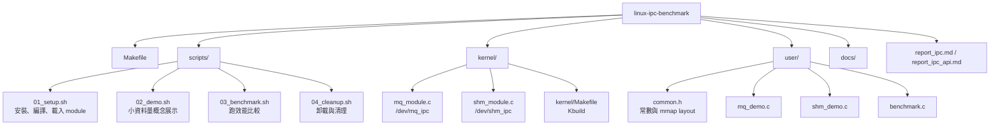

### 圖 02：執行時會出現哪些東西

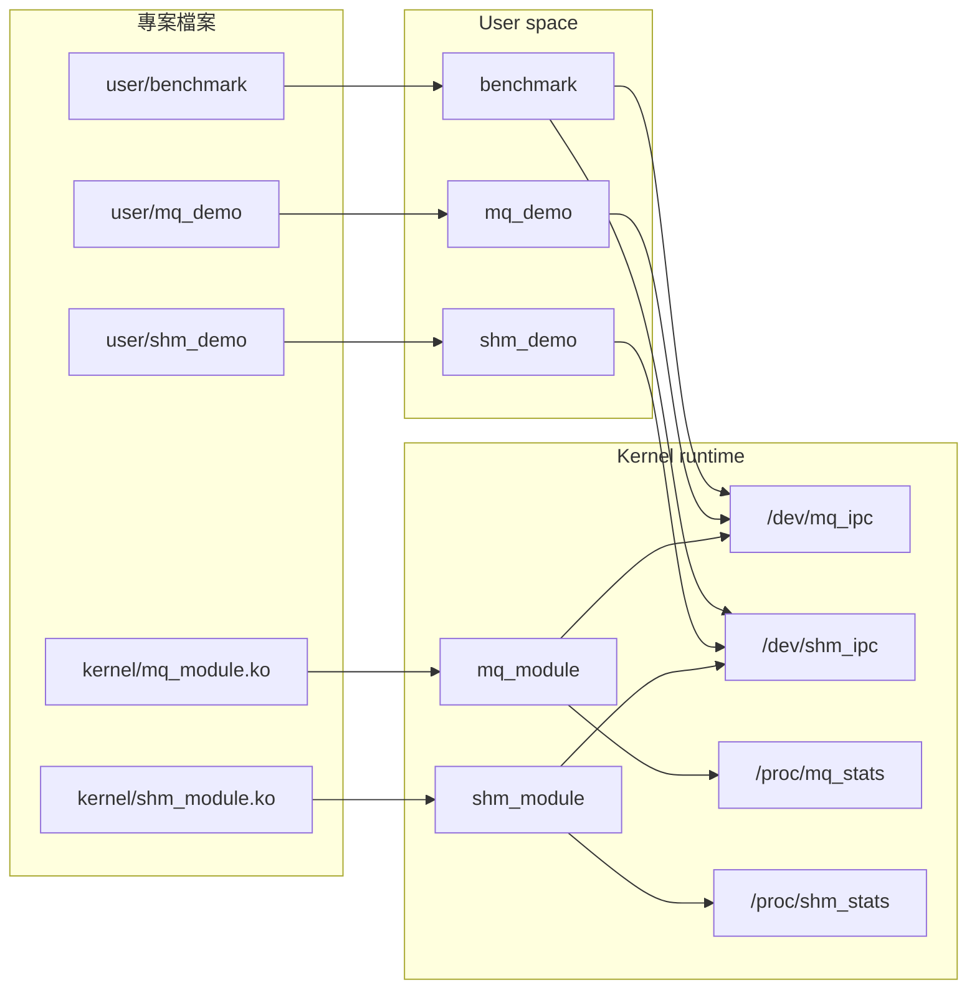

### 圖 03：最常見的使用路線

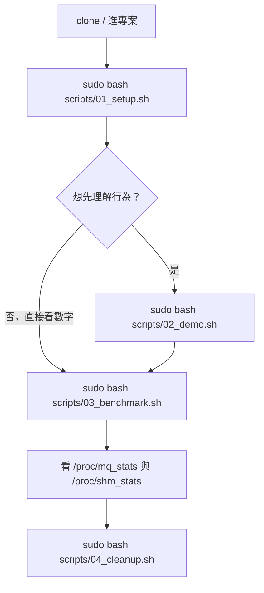

### 圖 04：這份專案真正比較的成本

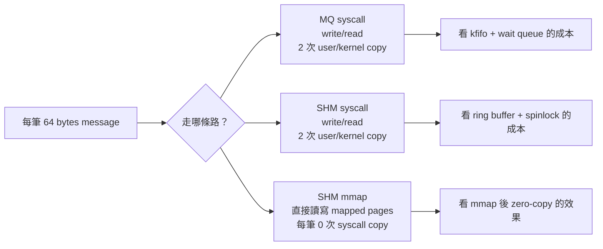

## 2. Build、載入、清理流程

### 圖 05：`01_setup.sh` 實際流程

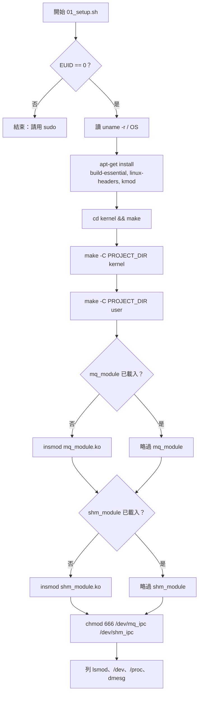

註：目前腳本裡 kernel module 會先在 `kernel/` 跑一次 `make`，接著又透過 top-level `Makefile` 跑一次 kernel build。這不是圖畫錯，是照程式碼畫。

### 圖 06：top-level Makefile 呼叫關係

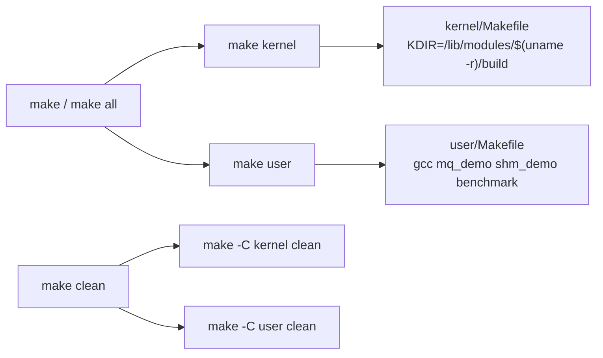

### 圖 07：kernel module 初始化生命週期

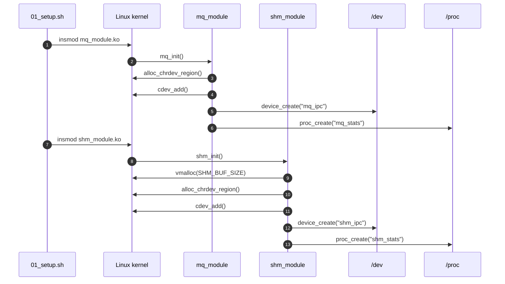

### 圖 08：清理流程

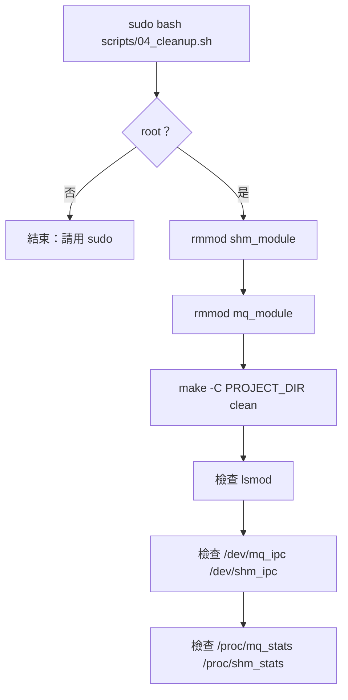

## 3. 系統架構圖

### 圖 09：分層架構

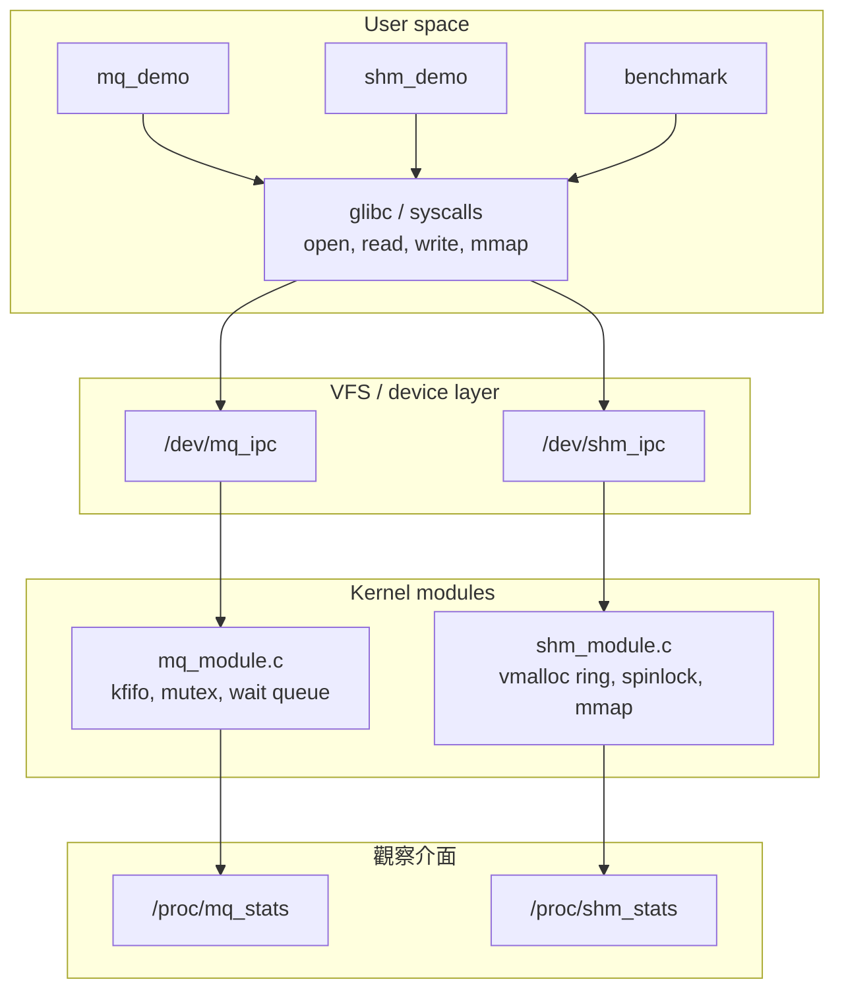

### 圖 10：兩個 device node 承接的 API

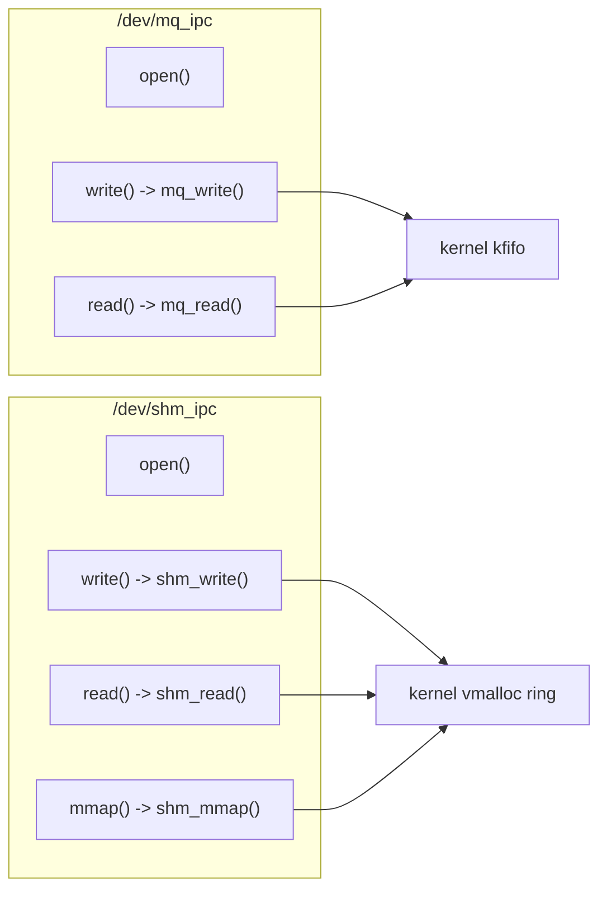

### 圖 11：三條 benchmark 路徑總覽

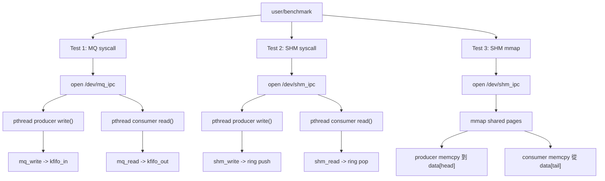

## 4. MQ syscall 路徑

### 圖 12：MQ module 內部結構

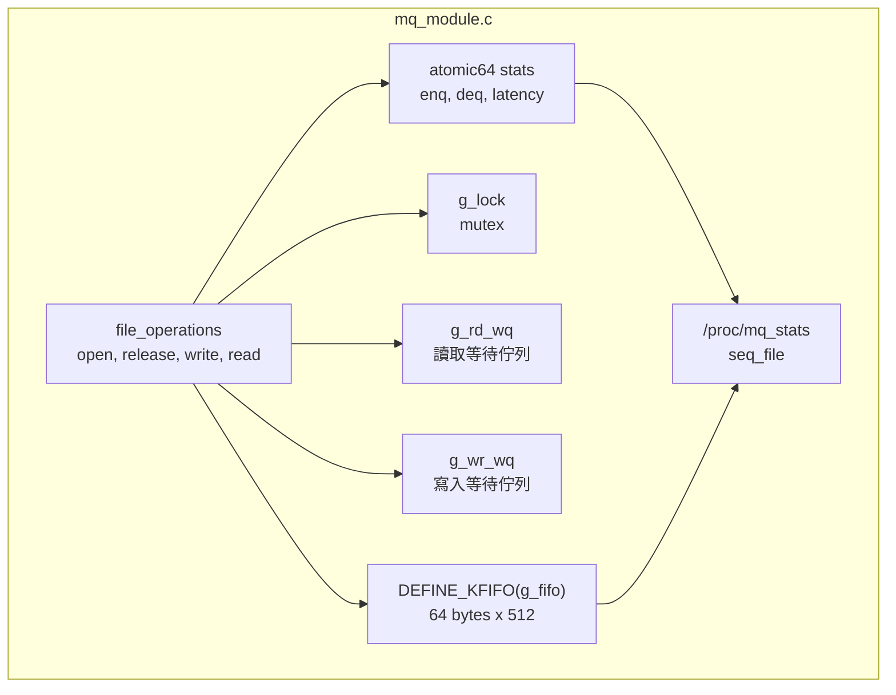

### 圖 13：MQ 資料流

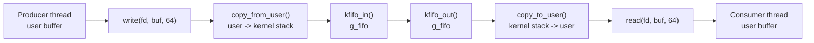

### 圖 14：MQ write/read 時序

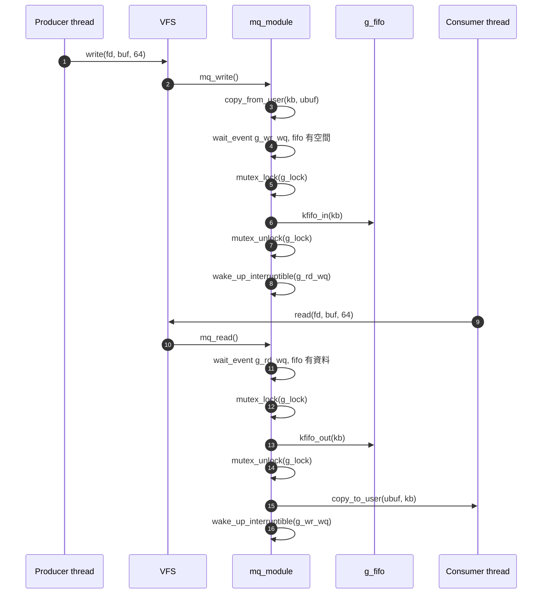

### 圖 15：MQ 同步訊號流

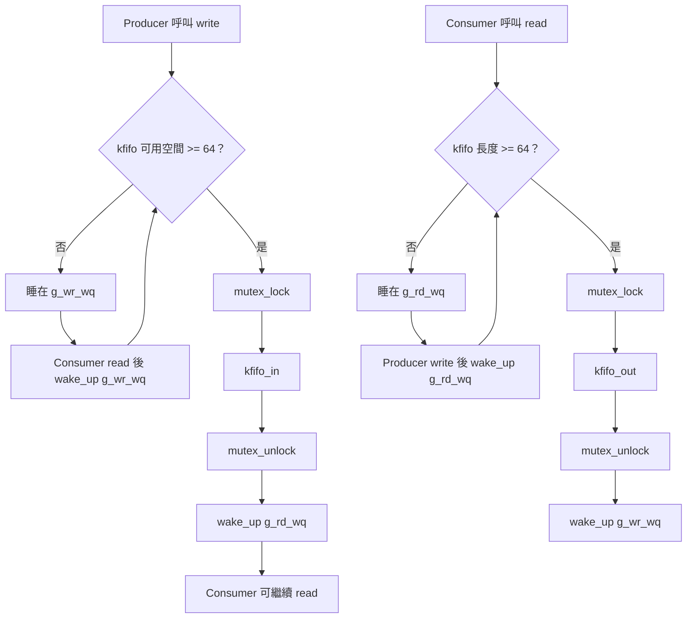

### 圖 16：MQ 成本圖

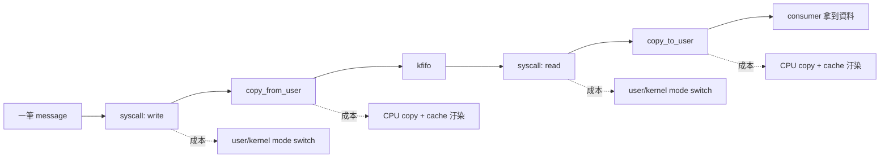

## 5. SHM syscall 路徑

### 圖 17：SHM module 內部結構

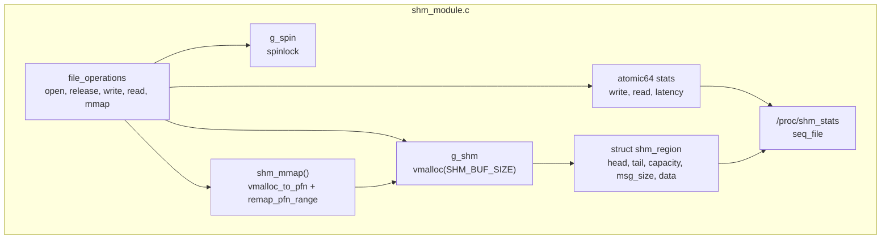

### 圖 18：SHM syscall 資料流

```mermaid
flowchart LR
    P["Producer thread\nuser buffer"] --> W["write(/dev/shm_ipc)"]
    W --> L1["spin_lock(g_spin)"]
    L1 --> CFU["copy_from_user()\n到 g_shm->data[head]"]
    CFU --> MB1["smp_wmb()"]
    MB1 --> H["head = next"]
    H --> U1["spin_unlock(g_spin)"]

    U1 --> R["read(/dev/shm_ipc)"]
    R --> L2["spin_lock(g_spin)"]
    L2 --> MB2["smp_rmb()"]
    MB2 --> TMP["memcpy data[tail] -> tmp"]
    TMP --> T["tail = tail + 1"]
    T --> U2["spin_unlock(g_spin)"]
    U2 --> CTU["copy_to_user()\n回 consumer buffer"]
```

### 圖 19：SHM syscall 時序

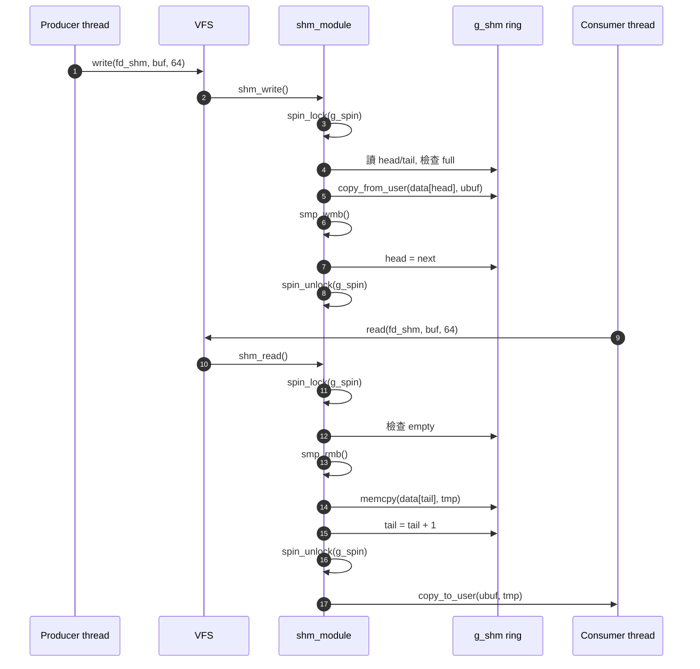

### 圖 20：SHM syscall 狀態轉移

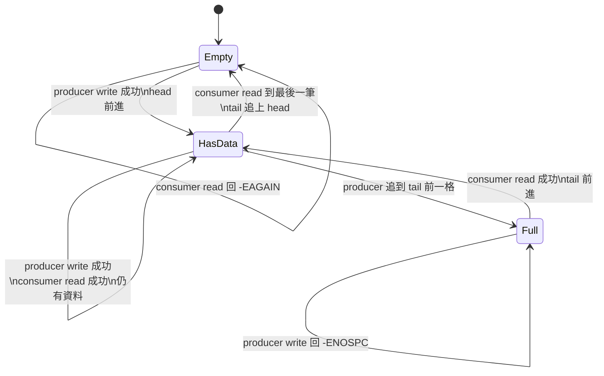

### 圖 21：SHM syscall 和 MQ syscall 差在哪

```mermaid
flowchart TB
    A["共同點\n每筆都走 write/read syscall\n每筆都有 copy_from_user + copy_to_user"] --> B{"差異在哪？"}
    B --> MQ["MQ\nkfifo\nmutex\nwait queue\n空佇列會睡眠等待"]
    B --> SHM["SHM syscall\n自管 ring\nspinlock\n滿或空直接回錯誤碼，user 端重試"]
```

## 6. SHM mmap 路徑

### 圖 22：mmap 建立映射流程

```mermaid
sequenceDiagram
    autonumber
    participant U as user program
    participant V as VFS
    participant S as shm_module
    participant K as kernel vmalloc pages
    participant M as user VMA

    U->>V: mmap(NULL, SHM_MAP_SIZE, PROT_READ|PROT_WRITE, MAP_SHARED, fd_shm, 0)
    V->>S: shm_mmap(file, vma)
    S->>S: 檢查 vm_sz <= SHM_BUF_SIZE
    S->>M: vm_flags_set(VM_DONTEXPAND | VM_DONTDUMP)
    loop 每一頁
        S->>K: vmalloc_to_pfn(g_shm + offset)
        S->>M: remap_pfn_range(user addr, pfn)
    end
    S-->>U: 回傳 user-space 指標
```

### 圖 23：mmap 後每筆 message 的資料流

```mermaid
flowchart LR
    P["Producer thread"] --> A["讀 shm->head.value"]
    A --> B{"next == tail？"}
    B -- "是，ring 滿" --> A
    B -- "否" --> C["memcpy 到 shm->data[head]"]
    C --> D["__sync_synchronize()"]
    D --> E["shm->head.value = next"]

    E --> F["Consumer thread 看到 head != tail"]
    F --> G["__sync_synchronize()"]
    G --> H["memcpy 從 shm->data[tail]"]
    H --> I["shm->tail.value = tail + 1"]
```

### 圖 24：mmap zero-copy 的重點

```mermaid
flowchart TB
    A["mmap 只在 setup 做一次"] --> B["user virtual address"]
    A --> C["kernel vmalloc pages"]
    B <-.同一批 physical pages.-> C

    D["每筆 message"] --> E["producer 寫 shared page"]
    E --> F["consumer 讀 shared page"]
    F --> G["沒有 per-message write/read syscall"]
    F --> H["沒有 copy_from_user / copy_to_user"]
```

### 圖 25：mmap 同步訊號流

```mermaid
flowchart TD
    P1["Producer 準備寫 slot"] --> P2["先寫 data[head]"]
    P2 --> P3["memory barrier\n確定 data 先可見"]
    P3 --> P4["發布 head = next"]

    P4 --> C1["Consumer 看到 head 改變"]
    C1 --> C2["memory barrier\n確定讀到的是 head 前的 data"]
    C2 --> C3["讀 data[tail]"]
    C3 --> C4["發布 tail = next"]
```

### 圖 26：mmap worker 行為圖

```mermaid
stateDiagram-v2
    [*] --> WaitBarrier
    WaitBarrier --> ProducerLoop: is_producer = 1
    WaitBarrier --> ConsumerLoop: is_producer = 0

    ProducerLoop --> CheckFull: 讀 head/tail
    CheckFull --> CheckFull: full，忙等
    CheckFull --> WriteSlot: 有空位
    WriteSlot --> PublishHead: memcpy + barrier
    PublishHead --> ProducerLoop: 下一筆

    ConsumerLoop --> CheckEmpty: 讀 tail/head
    CheckEmpty --> CheckEmpty: empty，忙等
    CheckEmpty --> ReadSlot: 有資料
    ReadSlot --> PublishTail: barrier + memcpy
    PublishTail --> ConsumerLoop: 下一筆
```

## 7. Ring buffer 圖解

### 圖 27：ring 的三個常見狀態

```mermaid
flowchart LR
    E["Empty\nhead == tail"] --> A["可寫入 head 指到的位置"]
    A --> N["Normal\nhead 在前，tail 在後"]
    N --> F["Full\n(head + 1) % cap == tail"]
    F --> R["必須等 consumer 推進 tail"]
    R --> N
```

### 圖 28：slot 循環

```mermaid
flowchart LR
    S0["slot 0"] --> S1["slot 1"]
    S1 --> S2["slot 2"]
    S2 --> S3["..."]
    S3 --> S511["slot 511"]
    S511 --> S0

    H["head\n下一個寫入點"] -.指向.-> S1
    T["tail\n下一個讀取點"] -.指向.-> S0
```

### 圖 29：保留一格判斷 full

```mermaid
flowchart TD
    A["為什麼 full 不是 head == tail？"] --> B["head == tail 已經拿來表示 empty"]
    B --> C["所以 full 用 next == tail"]
    C --> D["實際可用 slot 數 = RING_CAPACITY - 1"]
    D --> E["程式裡 ring_free_slots = capacity - 1 - used"]
```

### 圖 30：SHM layout 要小心看

```mermaid
flowchart TB
    subgraph KernelStruct["kernel/shm_module.c struct shm_region"]
        K0["offset 0\nhead"]
        K1["offset 64\ntail"]
        K2["offset 128\ncapacity"]
        K3["offset 132\nmsg_size"]
        K4["offset 136\ndata"]
    end

    subgraph UserStruct["user/common.h shm_region_t"]
        U0["offset 0\nhead.value"]
        U1["offset 64\ntail.value"]
        U2["offset 128\nmeta.capacity"]
        U3["offset 132\nmeta.msg_size"]
        U4["offset 192\ndata"]
    end

    K0 -.同 offset.-> U0
    K1 -.同 offset.-> U1
    K2 -.同 offset.-> U2
    K3 -.同 offset.-> U3
    K4 -.data offset 不同.-> U4
```

這張圖很重要。這份 benchmark 的 mmap 路徑只在 user space 讀寫資料，kernel 主要提供 backing pages 與 head/tail 統計；不要把 SHM syscall 路徑和 mmap 路徑當成可以任意混用的同一份 data ABI。它們共用的是裝置與 mapped pages，但資料路徑要分開看。

### 圖 31：`cacheline_u32_t` 的目的

```mermaid
flowchart LR
    A["head.value\nproducer 常寫"] --> P1["padding 到 64 bytes"]
    B["tail.value\nconsumer 常寫"] --> P2["padding 到 64 bytes"]
    P1 --> C["head 和 tail 不擠在同一條 cache line"]
    P2 --> C
    C --> D["降低 false sharing"]
```

## 8. Benchmark 程式架構

### 圖 32：`benchmark.c` 呼叫圖

```mermaid
flowchart TD
    main["main(argc, argv)"] --> openmq["open(MQ_DEVICE)"]
    main --> openshm["open(SHM_DEVICE)"]
    main --> dommap["mmap(SHM_DEVICE)"]

    main --> test1["run_test(fd_mq, use_mmap=0)"]
    main --> test2["run_test(fd_shm, use_mmap=0)"]
    main --> reset["shm->head.value = shm->tail.value = 0"]
    main --> test3["run_test(fd_shm, use_mmap=1)"]

    test1 --> sw1["syscall_worker producer"]
    test1 --> sw2["syscall_worker consumer"]
    test2 --> sw3["syscall_worker producer"]
    test2 --> sw4["syscall_worker consumer"]
    test3 --> mw1["mmap_worker producer"]
    test3 --> mw2["mmap_worker consumer"]

    main --> summary["印 throughput summary"]
    summary --> proc["system(cat /proc/*_stats)"]
```

### 圖 33：`run_test()` 內部時序

```mermaid
sequenceDiagram
    autonumber
    participant Main as main
    participant Run as run_test
    participant P as producer pthread
    participant C as consumer pthread

    Main->>Run: run_test(fd, count, use_mmap, shm)
    Run->>Run: pthread_barrier_init(2)
    Run->>P: pthread_create()
    Run->>C: pthread_create()
    P->>P: pthread_barrier_wait()
    C->>C: pthread_barrier_wait()
    P->>P: now_us(), loop count 次
    C->>C: now_us(), loop count 次
    P-->>Run: elapsed_us
    C-->>Run: elapsed_us
    Run->>Run: pthread_join(P/C)
    Run-->>Main: wall_end - wall_start
```

### 圖 34：三個測試的開始條件

```mermaid
flowchart TB
    A["main 開始"] --> B["open /dev/mq_ipc"]
    A --> C["open /dev/shm_ipc"]
    C --> D["mmap /dev/shm_ipc"]

    B --> T1["Test 1\nMQ syscall"]
    C --> T2["Test 2\nSHM syscall"]
    D --> R["reset head/tail"]
    R --> T3["Test 3\nSHM mmap"]
```

### 圖 35：worker loop 對照

```mermaid
flowchart LR
    subgraph Syscall["syscall_worker"]
        S0["barrier"] --> S1{"producer？"}
        S1 -- "是" --> S2["write(fd, buf, 64)\nEAGAIN/ENOSPC/EINTR 就重試"]
        S1 -- "否" --> S3["read(fd, buf, 64)\nEAGAIN/EINTR 就重試"]
    end

    subgraph Mmap["mmap_worker"]
        M0["barrier"] --> M1{"producer？"}
        M1 -- "是" --> M2["等 ring 有空位\nmemcpy data[head]\nbarrier\nhead = next"]
        M1 -- "否" --> M3["等 ring 有資料\nbarrier\nmemcpy data[tail]\ntail = next"]
    end
```

### 圖 36：wall time 與 worker time

```mermaid
sequenceDiagram
    participant Main as main thread
    participant P as producer
    participant C as consumer

    Main->>Main: wall_start = now_us()
    Main->>P: create
    Main->>C: create
    P->>P: producer elapsed start after barrier
    C->>C: consumer elapsed start after barrier
    P-->>Main: join
    C-->>Main: join
    Main->>Main: wall_end = now_us()
    Note over Main: wall 包含 create/join 與兩條 thread 完成時間
```

## 9. API 呼叫圖

### 圖 37：MQ API 對照

```mermaid
flowchart LR
    open1["open('/dev/mq_ipc', O_RDWR)"] --> fops1["mq_open"]
    write1["write(fd, buf, 64)"] --> fops2["mq_write"]
    read1["read(fd, buf, 64)"] --> fops3["mq_read"]
    close1["close(fd)"] --> fops4["mq_release"]

    fops2 --> cfu["copy_from_user"]
    fops2 --> kin["kfifo_in"]
    fops3 --> kout["kfifo_out"]
    fops3 --> ctu["copy_to_user"]
```

### 圖 38：SHM API 對照

```mermaid
flowchart LR
    open1["open('/dev/shm_ipc', O_RDWR)"] --> fops1["shm_open"]
    write1["write(fd, buf, 64)"] --> fops2["shm_write"]
    read1["read(fd, buf, 64)"] --> fops3["shm_read"]
    mmap1["mmap(..., fd, 0)"] --> fops4["shm_mmap"]
    close1["close(fd)"] --> fops5["shm_release"]

    fops2 --> cfu["copy_from_user"]
    fops2 --> wmb["smp_wmb"]
    fops3 --> rmb["smp_rmb"]
    fops3 --> ctu["copy_to_user"]
    fops4 --> pfn["vmalloc_to_pfn"]
    fops4 --> remap["remap_pfn_range"]
```

### 圖 39：procfs 呼叫圖

```mermaid
flowchart LR
    cat1["cat /proc/mq_stats"] --> po1["mq_proc_open"]
    po1 --> show1["mq_stats_show"]
    show1 --> seq1["seq_printf"]
    show1 --> stat1["atomic64_read + kfifo_len"]

    cat2["cat /proc/shm_stats"] --> po2["shm_proc_open"]
    po2 --> show2["shm_stats_show"]
    show2 --> seq2["seq_printf"]
    show2 --> stat2["atomic64_read + head/tail used slots"]
```

## 10. Demo 腳本在教什麼

### 圖 40：`02_demo.sh` 流程

```mermaid
flowchart TD
    A["sudo bash scripts/02_demo.sh"] --> B{"root 且 /dev 存在？"}
    B -- "否" --> X["結束：請先跑 01_setup.sh"]
    B -- "是" --> C["說明 MQ 概念"]
    C --> D["按 Enter"]
    D --> E["執行 user/mq_demo"]
    E --> F["cat /proc/mq_stats"]
    F --> G["說明 SHM mmap 概念"]
    G --> H["按 Enter"]
    H --> I["執行 user/shm_demo"]
    I --> J["cat /proc/shm_stats"]
```

### 圖 41：`mq_demo` 小流程

```mermaid
sequenceDiagram
    autonumber
    participant Demo as mq_demo
    participant Dev as /dev/mq_ipc
    participant Proc as /proc/mq_stats

    Demo->>Dev: open()
    loop 8 次
        Demo->>Dev: write("MQ-MSG[i]", 64)
    end
    loop 8 次
        Demo->>Dev: read(buf, 64)
    end
    Demo->>Proc: system("cat /proc/mq_stats")
    Demo->>Dev: close()
```

### 圖 42：`shm_demo` 小流程

```mermaid
sequenceDiagram
    autonumber
    participant Demo as shm_demo
    participant Dev as /dev/shm_ipc
    participant Mem as mapped shm_region_t
    participant Proc as /proc/shm_stats

    Demo->>Dev: open()
    Demo->>Dev: mmap()
    Demo->>Mem: head = 0, tail = 0
    loop 8 次
        Demo->>Mem: 寫 data[head], barrier, head = next
    end
    loop 8 次
        Demo->>Mem: barrier, 讀 data[tail], tail = next
    end
    Demo->>Proc: system("cat /proc/shm_stats")
    Demo->>Dev: munmap(), close()
```

## 11. 效能解讀用圖

### 圖 43：三條路的成本堆疊

```mermaid
flowchart TB
    MQ["MQ syscall"] --> MQ1["syscall write"]
    MQ1 --> MQ2["copy_from_user"]
    MQ2 --> MQ3["kfifo + mutex + wait queue"]
    MQ3 --> MQ4["syscall read"]
    MQ4 --> MQ5["copy_to_user"]

    SS["SHM syscall"] --> SS1["syscall write"]
    SS1 --> SS2["copy_from_user"]
    SS2 --> SS3["ring + spinlock"]
    SS3 --> SS4["syscall read"]
    SS4 --> SS5["copy_to_user"]

    MM["SHM mmap"] --> MM1["一次 mmap setup"]
    MM1 --> MM2["producer memcpy"]
    MM2 --> MM3["memory barrier"]
    MM3 --> MM4["consumer memcpy"]
```

### 圖 44：Test 1 vs Test 2 要看的東西

```mermaid
flowchart LR
    A["Test 1 MQ syscall"] --> C["同樣 2 次 copy"]
    B["Test 2 SHM syscall"] --> C
    C --> D["主要比較 kernel 內部資料結構和同步方式"]
    D --> E["kfifo + wait queue"]
    D --> F["ring + spinlock"]
```

### 圖 45：Test 2 vs Test 3 要看的東西

```mermaid
flowchart LR
    A["Test 2 SHM syscall"] --> C["同樣是 SHM ring 概念"]
    B["Test 3 SHM mmap"] --> C
    C --> D["主要比較 per-message syscall/copy 是否被拿掉"]
    D --> E["write/read + copy_from/to_user"]
    D --> F["mmap 後直接 user-space 讀寫"]
```

### 圖 46：benchmark 結果怎麼讀

```mermaid
flowchart TD
    A["benchmark 印出 producer / consumer / wall"] --> B["先看 wall msg/s"]
    B --> C["用 MQ 當 baseline"]
    C --> D["SHM syscall / MQ\n看 ring vs kfifo 差距"]
    C --> E["SHM mmap / MQ\n看 zero-copy 整體加速"]
    A --> F["再看 /proc stats"]
    F --> G["enqueue/dequeue 或 write/read 是否合理"]
    F --> H["ring/fifo 是否最後接近空"]
```

## 12. 常見踩雷點也畫出來

### 圖 47：裝置不存在

```mermaid
flowchart TD
    A["open('/dev/mq_ipc' 或 '/dev/shm_ipc') 失敗"] --> B{"module 有載入？"}
    B -- "否" --> C["跑 01_setup.sh 或 insmod"]
    B -- "是" --> D{"device node 有建立？"}
    D -- "否" --> E["看 dmesg / device_create"]
    D -- "是" --> F{"權限可讀寫？"}
    F -- "否" --> G["chmod 666 或 sudo"]
    F -- "是" --> H["再看程式參數與路徑"]
```

### 圖 48：ring 滿與空的重試

```mermaid
flowchart LR
    P["Producer write"] --> F{"full？"}
    F -- "是" --> ENOSPC["SHM syscall: -ENOSPC\nbenchmark 重試"]
    F -- "否" --> OKW["寫入成功"]

    C["Consumer read"] --> E{"empty？"}
    E -- "是" --> EAGAIN["SHM syscall: -EAGAIN\nbenchmark 重試"]
    E -- "否" --> OKR["讀取成功"]
```

### 圖 49：blocking 與 busy wait 差異

```mermaid
flowchart TB
    A{"沒有資料或沒有空位"} --> MQ["MQ syscall"]
    A --> SHMS["SHM syscall"]
    A --> SHMM["SHM mmap"]

    MQ --> B["wait queue 睡眠\n等 wake_up"]
    SHMS --> C["回 -EAGAIN 或 -ENOSPC\nuser loop 重試"]
    SHMM --> D["user-space while 忙等\n直到 head/tail 改變"]
```

### 圖 50：統計數字來源

```mermaid
flowchart LR
    mqw["mq_write"] --> enq["st_enq++"]
    mqr["mq_read"] --> deq["st_deq++"]
    mqr --> mqlat["st_lat_ns_total += now - last_enq"]
    enq --> mqproc["/proc/mq_stats"]
    deq --> mqproc
    mqlat --> mqproc

    shmw["shm_write"] --> wr["st_wr++"]
    shmr["shm_read"] --> rd["st_rd++"]
    shmr --> shmlat["st_lat_ns_total += now - last_wr"]
    wr --> shmproc["/proc/shm_stats"]
    rd --> shmproc
    shmlat --> shmproc
```

## 13. 五分鐘快速閱讀路線

下面這段是一條快速導讀路線。照這個順序走，通常五分鐘內就能定位主要程式入口。

### 圖 51：五分鐘導讀路線

```mermaid
flowchart LR
    A["0:00\n先看圖 01\n專案目錄"] --> B["0:40\n看圖 02 / 09\nruntime 架構"]
    B --> C["1:30\n看圖 11\n三條測試路徑"]
    C --> D["2:20\n看圖 13 / 18 / 23\n資料流"]
    D --> E["3:30\n看圖 15 / 25 / 49\n同步差異"]
    E --> F["4:20\n看圖 43 / 46\n效能怎麼解讀"]
    F --> G["5:00\n提醒圖 30\nSHM layout 不要混著看"]
```

### 五分鐘摘要

第一段先看範圍：本專案比較的是兩個自製 kernel module 的三條資料路徑。`mq_module` 建 `/dev/mq_ipc`，`shm_module` 建 `/dev/shm_ipc`，user 程式用一般檔案 API 打進去。先看圖 01、圖 02、圖 09。

第二段看三條路：MQ syscall、SHM syscall、SHM mmap。前兩條每筆 message 都有 `write()` / `read()`，也都有 `copy_from_user()` / `copy_to_user()`；第三條只有一開始 `mmap()`，之後每筆 message 不再進 kernel 做 copy。用圖 11 一次釐清。

第三段看資料怎麼走：MQ 是 user buffer 進 `write()`，kernel `copy_from_user()` 放進 `kfifo`，consumer `read()` 時再 `copy_to_user()` 回 user。SHM syscall 很像，但 kernel 裡面換成自己管理的 ring buffer。SHM mmap 則是 producer 和 consumer 直接在 mapped page 上搬資料。這裡對照圖 13、圖 18、圖 23。

第四段看同步：MQ 用 wait queue，沒資料或沒空位可以睡；SHM syscall 用 spinlock 保護 head/tail/data，滿或空時回錯誤碼讓 user 重試；SHM mmap 在 user space 忙等 head/tail，再用 memory barrier 確保先寫 data 再發布 head。這段對照圖 15、圖 25、圖 49。

第五段看 benchmark：先看 wall 的 msg/s，MQ 當 baseline。Test 1 跟 Test 2 主要看 kernel 內部佇列與同步方式差多少；Test 2 跟 Test 3 主要看拿掉 per-message syscall 和 user/kernel copy 後差多少。最後回到圖 30：`/dev/shm_ipc` 同時支援 syscall 與 mmap，但 data layout 在程式碼裡不是同一個 offset，所以要分兩條路看，避免混用同一個 ring 資料格式。

### 最短版摘要

```mermaid
flowchart TD
    A["這專案有兩個 kernel module"] --> B["MQ: kfifo + read/write"]
    A --> C["SHM: vmalloc ring + read/write + mmap"]
    B --> D["Benchmark 比三條路"]
    C --> D
    D --> E["MQ syscall\n有 syscall + 2 次 copy"]
    D --> F["SHM syscall\n有 syscall + 2 次 copy，但 queue 結構不同"]
    D --> G["SHM mmap\nsetup 後每筆不走 syscall copy"]
    G --> H["所以重點是：zero-copy 少掉的成本有多少"]
```

### 建議讀程式順序

```mermaid
flowchart TD
    A["先讀 user/common.h\n常數與 SHM layout"] --> B["讀 user/benchmark.c\n三個 test 怎麼跑"]
    B --> C["讀 kernel/mq_module.c\n看 read/write/kfifo/wait queue"]
    C --> D["讀 kernel/shm_module.c\n看 read/write/mmap/ring"]
    D --> E["最後讀 scripts/*.sh\n理解操作流程"]
```

到這裡就夠開始改程式了。真的要動效能數字時，再回去細看 `copy_from_user()`、`copy_to_user()`、`spin_lock()`、`wait_event_interruptible()`、`remap_pfn_range()` 這幾個點。
