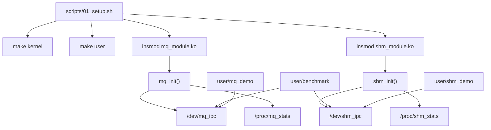
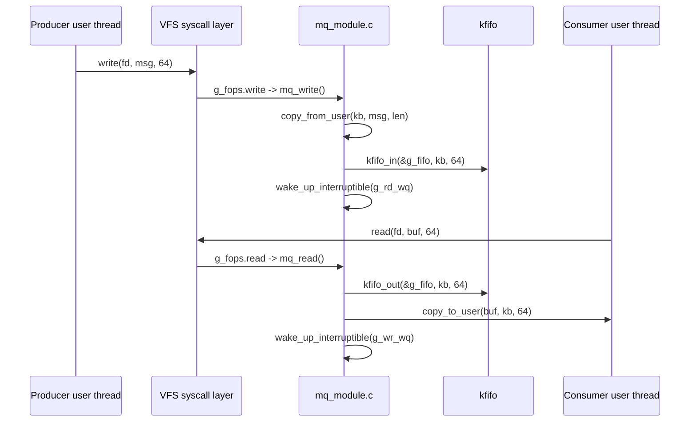
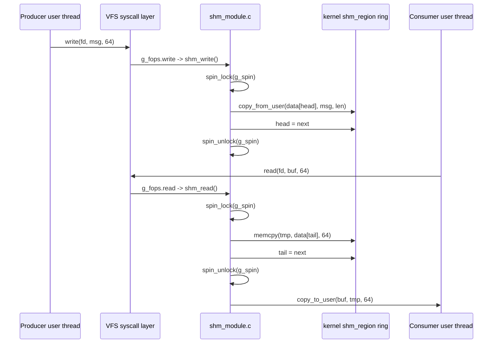
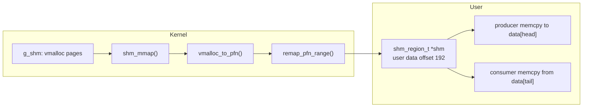

# Linux IPC Benchmark API / Architecture 技術分析報告

本報告聚焦在 `linux-ipc-benchmark` 的 API、callback chain、資料流與設計取捨。閱讀目標是：看完後可以知道每個 API 在哪裡被呼叫、為什麼選它、它和類似 API 差在哪裡，以及重點功能如何運作。

分析範圍：

- `kernel/mq_module.c`
- `kernel/shm_module.c`
- `user/benchmark.c`
- `user/mq_demo.c`
- `user/shm_demo.c`
- `user/common.h`
- `scripts/*.sh`

## 分析標記

- `# Direct Observation`：可從目前程式碼直接確認。
- `# Conservative Inference`：根據呼叫關係與 Linux API 語意做保守推論。
- `# Risk / TODO`：目前程式碼可觀察到的限制或待修項目。

---

## 第一階段：Codebase Trace

### 1. Project Structure

# Direct Observation

| 類別 | 檔案 | 角色 |
| --- | --- | --- |
| Kernel source | `kernel/mq_module.c` | 建立 `/dev/mq_ipc`，使用 `kfifo`、`mutex`、`wait_queue` 實作 Message Queue。 |
| Kernel source | `kernel/shm_module.c` | 建立 `/dev/shm_ipc`，使用 `vmalloc` ring buffer，提供 syscall 與 `mmap` 兩種路徑。 |
| Kernel build | `kernel/Makefile` | 產生 `mq_module.ko` 與 `shm_module.ko`。 |
| User source | `user/benchmark.c` | 建立 producer / consumer pthread，比較三條 IPC 路徑。 |
| User source | `user/mq_demo.c` | 示範 `/dev/mq_ipc` 的小量 `write()` / `read()`。 |
| User source | `user/shm_demo.c` | 示範 `/dev/shm_ipc` 的 `mmap()` 與 mapped region 操作。 |
| Header | `user/common.h` | 定義 user-space 共用常數、device path、`shm_region_t`、`now_us()`。 |
| Script | `scripts/01_setup.sh` | 安裝依賴、建置、載入 module、設定 device 權限。 |
| Script | `scripts/02_demo.sh` | 逐步執行 MQ 與 SHM mmap demo。 |
| Script | `scripts/03_benchmark.sh` | 執行吞吐量 benchmark。 |
| Script | `scripts/04_cleanup.sh` | 卸載 module 並清理 build artifacts。 |

### 2. Component Relationship

# Direct Observation



# Conservative Inference

專案的比較軸線不是「Linux 內建 MQ vs Linux 內建 SHM」，而是「同一個專案中自行實作的三條資料路徑」。因此報告中的效能解讀只應對應這份 codebase，不應直接推論所有 IPC API。

### 3. Benchmark 測試項目

# Direct Observation

`user/benchmark.c` 的正式測試共有三項：

| 編號 | benchmark 標籤 | worker | device/API | Kernel path | 每筆訊息資料搬移 |
| --- | --- | --- | --- | --- | --- |
| 1 | `Message Queue (kfifo + blocking syscall)` | `syscall_worker()` | `/dev/mq_ipc` + `write/read` | `mq_write()` / `mq_read()` + `kfifo` | `copy_from_user()` + `copy_to_user()` |
| 2 | `Shared Memory (ring-buf + syscall, spinlock)` | `syscall_worker()` | `/dev/shm_ipc` + `write/read` | `shm_write()` / `shm_read()` + kernel `struct shm_region` | `copy_from_user()` + `copy_to_user()` |
| 3 | `Shared Memory (ring-buf + mmap, ZERO-COPY)` | `mmap_worker()` | `/dev/shm_ipc` + `mmap` | `shm_mmap()` 建立 mapping；runtime 不進 kernel | 無 `copy_from_user()` / `copy_to_user()`；仍有 user-space `memcpy()` |

# Conservative Inference

第二項不是另一種 zero-copy shared memory，而是 syscall 對照組。它使用 `spinlock` 和 kernel 端 ring buffer，但每筆訊息仍進 kernel，也仍做 user/kernel copy。

---

## 第二階段：核心概念圖

### 1. MQ syscall path



重點：

- 每筆訊息至少一次 `write()`、一次 `read()`。
- 資料從 user 複製到 kernel，再從 kernel 複製回 user。
- queue full/empty 時由 kernel wait queue 處理等待。

### 2. SHM syscall path



重點：

- 底層 storage 是 kernel 端 `struct shm_region` ring，但 user 還是透過 syscall 存取。
- 此路徑仍有 user/kernel copy。
- ring full 回 `-ENOSPC`，ring empty 回 `-EAGAIN`。
- `copy_from_user()` 目前在 `spin_lock()` 之後執行，這是已知風險，不應描述成嚴謹的 production 同步設計。

### 3. SHM mmap path



```text
Ring state:

  head = next write slot
  tail = next read slot

  empty: head == tail
  full : (head + 1) % RING_CAPACITY == tail

  data[0] data[1] data[2] ... data[511]
     ^                       ^
    tail                    head
```

重點：

- `mmap()` 完成後，每筆訊息不再進 kernel。
- producer 與 consumer 直接讀寫 mapped pages，但資料仍會在 user space 用 `memcpy()` 放入或取出。
- 正確性依賴 `head/tail` 協定與 memory barrier。
- 目前 mmap path 使用 `user/common.h` 的 `shm_region_t` layout；它的 `data` offset 是 192，和 kernel `struct shm_region` 的 `data` offset 136 不一致。因此不要把 syscall path 和 mmap path 的資料 slot 混用。

---

## 第三階段：關鍵字與 API 速查

### 1. Kernel / VFS 相關

| 關鍵字 | English | 說明 | 本專案位置 |
| --- | --- | --- | --- |
| 虛擬檔案系統 | VFS, Virtual File System | Linux 將 `read()`、`write()` 等檔案操作轉派到不同檔案型態或裝置。 | `/dev/mq_ipc`、`/dev/shm_ipc` 的 syscall dispatch |
| 字元裝置 | Character Device | 以 byte stream 或自訂語意提供 `open/read/write/mmap` 的裝置介面。 | 兩個 kernel module |
| 裝置號 | Device Number, `dev_t` | kernel 用 major/minor 辨識裝置。 | `g_devno` |
| `cdev` | Character Device Structure | 把 device number 與 `file_operations` 綁定。 | `g_cdev` |
| `file_operations` | File Operation Table | VFS 呼叫 module callback 的 function pointer table。 | `g_fops` |
| procfs | Process Filesystem | 用文字檔形式暴露 kernel 狀態。 | `/proc/mq_stats`、`/proc/shm_stats` |
| seq_file | Sequential File Helper | 讓 procfs 輸出多行文字更穩定。 | `seq_printf()` |

### 2. 記憶體與同步相關

| 關鍵字 | English | 說明 | 本專案位置 |
| --- | --- | --- | --- |
| `kfifo` | Kernel FIFO | Linux kernel 提供的 FIFO helper。 | `mq_module.c` |
| `vmalloc` | Virtual Allocation | 配置連續 kernel 虛擬位址，但實體頁面可不連續。 | `shm_module.c` |
| VMA | Virtual Memory Area | user process 的一段虛擬記憶體區間。 | `shm_mmap()` |
| PFN | Page Frame Number | 實體頁框編號，用於建立 page mapping。 | `vmalloc_to_pfn()` |
| `remap_pfn_range` | Remap PFN Range | 把 PFN 映射進 user VMA。 | `shm_mmap()` |
| `copy_from_user` | Copy From User | 從 user pointer 安全複製資料到 kernel。 | `mq_write()`、`shm_write()` |
| `copy_to_user` | Copy To User | 從 kernel 複製資料到 user pointer。 | `mq_read()`、`shm_read()` |
| `wait_queue` | Wait Queue | 讓 task 睡眠，等待條件成立後被喚醒。 | MQ full/empty |
| `mutex` | Sleeping Lock | 可睡眠鎖，適合可能等待的 critical section。 | MQ `g_lock` |
| `spinlock` | Spin Lock | 不睡眠，忙等取得鎖，適合非常短的 critical section。 | SHM syscall `g_spin` |
| memory barrier | 記憶體屏障 | 控制讀寫順序，避免 CPU/編譯器重排。 | `smp_wmb()`、`smp_rmb()`、`__sync_synchronize()` |
| cache line | 快取行 | CPU cache 的基本一致性單位，常見 64 bytes。 | `head/tail` padding |
| false sharing | 快取偽共享 | 不同 CPU 修改同一 cache line 上不同資料，造成不必要同步成本。 | SHM ring layout |

---

## 第四階段：API Inventory 與選擇依據

### 1. Module lifecycle API

| API / Macro | 位置 | 功能 | 類似 API / 寫法 | 選擇與注意事項 |
| --- | --- | --- | --- | --- |
| `module_init(fn)` | `mq_module.c`、`shm_module.c` | module 載入時呼叫 init function。 | built-in driver 可能用不同 initcall level | Loadable module 標準入口。 |
| `module_exit(fn)` | `mq_module.c`、`shm_module.c` | module 卸載時呼叫 cleanup function。 | 無 cleanup 的 built-in driver 不一定需要 | 必須釋放 device、proc entry、memory。 |
| `MODULE_LICENSE("GPL")` | 兩個 module | 宣告授權，影響 kernel symbol 使用與 taint。 | Proprietary 字串 | 使用 GPL 避免部分 symbol 使用限制。 |
| `MODULE_DESCRIPTION()` | 兩個 module | module metadata。 | `MODULE_AUTHOR()`、`MODULE_VERSION()` | 方便 `modinfo` 查看。 |

### 2. Character device registration API

| API | 本專案呼叫位置 | 做什麼 | 類似 API | 選擇依據 |
| --- | --- | --- | --- | --- |
| `alloc_chrdev_region()` | `mq_init()`、`shm_init()` | 動態配置 major/minor。 | `register_chrdev_region()` | 不固定 major number，避免與系統既有裝置衝突。 |
| `cdev_init()` | `mq_init()`、`shm_init()` | 初始化 `struct cdev`，綁定 `file_operations`。 | `cdev_alloc()` | 本專案用 static/global `g_cdev`，所以直接 init。 |
| `cdev_add()` | `mq_init()`、`shm_init()` | 將 cdev 加入 kernel。 | `misc_register()` | `cdev` 展示完整 char device 流程；`miscdevice` 較簡潔但隱藏部分細節。 |
| `class_create()` | `mq_init()`、`shm_init()` | 建立 device class，供 udev 建立 `/dev/*`。 | 手動 `mknod` | 自動建立 `/dev/mq_ipc`、`/dev/shm_ipc` 較方便。 |
| `device_create()` | `mq_init()`、`shm_init()` | 建立 device node。 | `device_create_with_groups()` | 本專案不需要 sysfs attribute group。 |
| `device_destroy()` | `mq_exit()`、`shm_exit()` | 移除 device node。 | 無 | cleanup 必要步驟。 |
| `cdev_del()` | `mq_exit()`、`shm_exit()` | 移除 cdev。 | 無 | cleanup 必要步驟。 |
| `unregister_chrdev_region()` | `mq_exit()`、`shm_exit()` | 釋放 major/minor。 | 無 | cleanup 必要步驟。 |

教學重點：

```text
alloc_chrdev_region()
  -> cdev_init()
  -> cdev_add()
  -> class_create()
  -> device_create()
  -> user can open("/dev/xxx")
```

### 3. `file_operations` callback

| Callback | MQ | SHM | 被誰呼叫 | 說明 |
| --- | --- | --- | --- | --- |
| `.open` | `mq_open` | `shm_open` | `open("/dev/...")` | 目前只回 0，沒有 per-open state。 |
| `.release` | `mq_release` | `shm_release` | `close(fd)` | 目前只回 0。 |
| `.write` | `mq_write` | `shm_write` | `write(fd, buf, len)` | producer path。 |
| `.read` | `mq_read` | `shm_read` | `read(fd, buf, len)` | consumer path。 |
| `.mmap` | 無 | `shm_mmap` | `mmap(fd)` | 只有 SHM module 提供 mapped-page setup；zero-copy 在本專案限定指沒有每筆 user/kernel copy。 |

類似 API 比較：

| 介面 | 適合用途 | 本專案是否使用 |
| --- | --- | --- |
| `read/write` | byte stream、簡單 request/response、容易用 shell 工具測 | 有 |
| `ioctl` | 控制命令、設定參數、查詢 metadata | 無，目前不需要 command set |
| `mmap` | 大量資料共享、避免每筆 user/kernel copy、使用者直接操作 mapped page | 有，SHM mmap path 核心 |
| `poll/select/epoll` | 等待 fd 可讀可寫 | 無，MQ 用 kernel wait queue；SHM mmap 用 user polling |

### 4. Procfs / stats API

| API | 位置 | 功能 | 類似 API | 選擇依據 |
| --- | --- | --- | --- | --- |
| `proc_create()` | `mq_init()`、`shm_init()` | 建立 `/proc/mq_stats`、`/proc/shm_stats`。 | `debugfs_create_file()`、`sysfs_create_file()` | 這裡是教學用統計輸出，procfs 直覺、容易 `cat`。 |
| `single_open()` | `mq_proc_open()`、`shm_proc_open()` | 建立一次性 seq_file。 | 手寫 `.read` | 避免手動處理 offset 與 partial read。 |
| `seq_read()` | `g_proc_ops` | seq_file 標準 read。 | 手寫 read callback | 多行文字輸出較安全。 |
| `seq_printf()` | stats show function | 輸出 key/value 統計。 | `snprintf` 到 buffer | seq_file 已處理 buffer 管理。 |
| `remove_proc_entry()` | module exit | 移除 proc entry。 | `proc_remove()` | 目前程式使用 name-based remove。 |

注意：

- 目前 `proc_create()` 的 return value 沒有保存，也沒有檢查。
- 若 proc entry 建立失敗，module 仍可能載入，但 `/proc/*_stats` 不存在。
- 若要提高可靠性，應保存 `struct proc_dir_entry *`，失敗時走 cleanup。

### 5. MQ data path API

| API | 位置 | 功能 | 類似 API | 選擇依據 |
| --- | --- | --- | --- | --- |
| `DEFINE_KFIFO()` | `mq_module.c` global | 建立 static FIFO storage。 | `kfifo_alloc()`、手寫 ring | 固定大小、教學簡潔。 |
| `kfifo_in()` | `mq_write()` | 將 bytes 放進 FIFO。 | `kfifo_put()` | 本專案一次放 64 bytes，不是一個 C object。 |
| `kfifo_out()` | `mq_read()` | 從 FIFO 取出 bytes。 | `kfifo_get()` | 同上，一次取固定 bytes。 |
| `kfifo_len()` | `mq_read()`、stats | 查已使用 bytes。 | 自行維護 count | 使用 helper 降低錯誤。 |
| `kfifo_avail()` | `mq_write()`、stats | 查可用 bytes。 | 自行維護 free | 用於 full/backpressure 判斷。 |
| `wait_event_interruptible()` | `mq_write()`、`mq_read()` | 條件不成立時睡眠，可被 signal 中斷。 | `wait_event()`、busy polling | IPC queue full/empty 時不浪費 CPU。 |
| `wake_up_interruptible()` | `mq_write()`、`mq_read()` | 喚醒等待者。 | `wake_up()` | 搭配 interruptible wait。 |
| `mutex_lock()` / `mutex_unlock()` | `mq_write()`、`mq_read()` | 保護 FIFO 操作。 | `spin_lock()` | wait queue path 可睡眠，mutex 語意清楚。 |

選擇解釋：

- MQ path 要呈現「由 kernel 管理 queue 與等待」。
- `wait_queue` 比 busy polling 更適合一般 IPC queue，因為空或滿可能維持一段時間。
- `mutex` 可以睡眠；若 critical section 可能延伸，使用上比 spinlock 安全。

### 6. SHM memory mapping API

| API | 位置 | 功能 | 類似 API | 選擇依據 |
| --- | --- | --- | --- | --- |
| `vmalloc()` | `shm_init()` | 配置 kernel virtual contiguous buffer。 | `kmalloc()`、`alloc_pages()` | 不要求實體連續，大小也比單一小物件大。 |
| `vfree()` | `shm_exit()` | 釋放 `vmalloc` memory。 | `kfree()`、`free_pages()` | `vmalloc()` 必須搭配 `vfree()`。 |
| `PAGE_ALIGN()` | `SHM_BUF_SIZE` | 將 shared region size 對齊 page。 | 手動 `(size + PAGE_SIZE - 1) & ...` | kernel helper 語意清楚。 |
| `vmalloc_to_pfn()` | `shm_mmap()` | 把 vmalloc virtual address 轉 PFN。 | `virt_to_phys()` 不適合 vmalloc memory | `vmalloc` 實體頁不連續，必須逐頁轉。 |
| `remap_pfn_range()` | `shm_mmap()` | 把 PFN 映射進 user VMA。 | `remap_vmalloc_range()`、`vm_insert_page()` | 手動逐頁映射，最能展示 PFN/VMA 關係。 |
| `vm_flags_set()` | `shm_mmap()` | 設定 VMA flags。 | 直接改 `vma->vm_flags` | 新版 kernel 建議用 helper。 |

類似 API 比較：

| API | 適合情境 | 不選或可改用的原因 |
| --- | --- | --- |
| `kmalloc()` | 小型、需要實體連續或至少容易處理的 kernel buffer | 大 buffer 可能配置失敗；對 mmap 不一定方便。 |
| `alloc_pages()` | 需要頁面為單位、可控制 order 的配置 | 需要自己管理 page life cycle。 |
| `dma_alloc_coherent()` | 裝置 DMA coherent buffer | 本專案沒有硬體 DMA，不需要。 |
| `remap_vmalloc_range()` | 直接把 vmalloc area 映射到 VMA | 可簡化程式；本專案保留手動 PFN loop 以便教學。 |
| `vm_insert_page()` | 逐頁插入 `struct page` | 也可做 page-based mapping，但本專案已用 PFN path。 |

### 7. SHM synchronization API

| API | 位置 | 功能 | 類似 API | 選擇依據 |
| --- | --- | --- | --- | --- |
| `spin_lock()` / `spin_unlock()` | `shm_write()`、`shm_read()` | 保護 syscall path 的 ring state。 | `mutex`、rwlock | critical section 原本設計很短；但 user copy 放在 lock 內有風險。 |
| `smp_wmb()` | `shm_write()` | 確保資料寫入先於 `head` 更新。 | `smp_store_release()` | 目前用 barrier 呈現概念；release semantic 可更精準。 |
| `smp_rmb()` | `shm_read()` | 確保讀到 index 後再讀 slot data。 | `smp_load_acquire()` | acquire/release 會比裸 barrier 更容易維護。 |
| `__sync_synchronize()` | user mmap worker | user-space full memory barrier。 | C11 `atomic_thread_fence()` | 舊 GCC builtin，簡單但語意較粗。 |
| `volatile` | shared `head/tail` | 避免編譯器把值快取在暫存器。 | C11 `_Atomic` | `volatile` 不等於完整同步；若要嚴謹應用 atomic。 |

教學提醒：

- `volatile` 只能限制編譯器最佳化，不保證跨 CPU 的完整同步語意。
- 如果要把 mmap ring 做成更正式的 SPSC queue，建議使用 acquire/release atomic。
- 若要支援 MPMC，僅靠 `head/tail` 不夠，需要 CAS 或 per-slot state。

### 8. Userspace API

| API | 位置 | 功能 | 注意事項 |
| --- | --- | --- | --- |
| `open()` | demos、benchmark | 開啟 `/dev/mq_ipc`、`/dev/shm_ipc`。 | 失敗常見原因是 module 未載入或權限不足。 |
| `write()` | MQ/SHM syscall worker | producer 送出 64 bytes。 | 目前 module protocol 建議固定 `MSG_SIZE`。 |
| `read()` | MQ/SHM syscall worker | consumer 讀取 64 bytes。 | MQ 可 blocking；SHM syscall empty 回 `EAGAIN`。 |
| `mmap()` | `shm_demo.c`、`benchmark.c` | 取得 mapped region pointer，並以 `user/common.h` 的 `shm_region_t` 解讀。 | 需要 `MAP_SHARED`；目前 user/kernel `data` offset 不一致，不能把 syscall path 與 mmap path 的資料 slot 混用。 |
| `munmap()` | cleanup | 解除 user mapping。 | 不會釋放 kernel `g_shm`，kernel memory 由 module 管。 |
| `pthread_create()` | `benchmark.c` | 建立 producer / consumer。 | 目前 return value 未檢查。 |
| `pthread_barrier_wait()` | workers | 讓 producer/consumer 同步起跑。 | 減少 benchmark 起跑偏差。 |
| `clock_gettime()` | `now_us()` | 量測時間。 | 使用 `CLOCK_MONOTONIC`，避免系統時間調整影響。 |

---

## 第五階段：Runtime Chain

### 1. MQ write chain

# Direct Observation

```text
user write(fd_mq, buf, MSG_SIZE)
  -> VFS dispatch g_fops.write
  -> mq_write()
       -> len clamp to MSG_SIZE if larger
       -> copy_from_user(kb, ubuf, len)
       -> wait_event_interruptible(g_wr_wq, kfifo_avail >= MSG_SIZE)
       -> mutex_lock(g_lock)
       -> kfifo_in(g_fifo, kb, MSG_SIZE)
       -> mutex_unlock(g_lock)
       -> atomic64_inc(st_enq)
       -> WRITE_ONCE(st_last_enq_ts, ts)
       -> wake_up_interruptible(g_rd_wq)
       -> return MSG_SIZE
```

### 2. MQ read chain

# Direct Observation

```text
user read(fd_mq, buf, MSG_SIZE)
  -> VFS dispatch g_fops.read
  -> mq_read()
       -> if len < MSG_SIZE: -EINVAL
       -> if O_NONBLOCK and FIFO short: -EAGAIN
       -> otherwise wait_event_interruptible(g_rd_wq, kfifo_len >= MSG_SIZE)
       -> mutex_lock(g_lock)
       -> kfifo_out(g_fifo, kb, MSG_SIZE)
       -> mutex_unlock(g_lock)
       -> copy_to_user(ubuf, kb, MSG_SIZE)
       -> update dequeue/latency stats
       -> wake_up_interruptible(g_wr_wq)
       -> return MSG_SIZE
```

### 3. SHM syscall write chain

# Direct Observation

```text
user write(fd_shm, buf, MSG_SIZE)
  -> VFS dispatch g_fops.write
  -> shm_write()
       -> len clamp to MSG_SIZE if larger
       -> spin_lock(g_spin)
       -> read head, compute next
       -> if ring full: -ENOSPC
       -> copy_from_user(g_shm->data[head], ubuf, len)
       -> smp_wmb()
       -> g_shm->head = next
       -> spin_unlock(g_spin)
       -> update write stats
       -> return MSG_SIZE
```

# Risk / TODO

`copy_from_user()` 目前位於 `spin_lock()` 與 `spin_unlock()` 之間。若 user page fault，這個設計有風險。較安全的做法是先在 lock 外 copy 到 kernel 暫存 buffer，再進 lock 更新 ring。

### 4. SHM syscall read chain

# Direct Observation

```text
user read(fd_shm, buf, MSG_SIZE)
  -> VFS dispatch g_fops.read
  -> shm_read()
       -> if len < MSG_SIZE: -EINVAL
       -> spin_lock(g_spin)
       -> if ring empty: -EAGAIN
       -> tail = g_shm->tail
       -> smp_rmb()
       -> memcpy(tmp, g_shm->data[tail], MSG_SIZE)
       -> g_shm->tail = next
       -> spin_unlock(g_spin)
       -> copy_to_user(ubuf, tmp, MSG_SIZE)
       -> update read/latency stats
       -> return MSG_SIZE
```

### 5. SHM mmap chain

# Direct Observation

```text
user mmap(NULL, SHM_MAP_SIZE, PROT_READ|PROT_WRITE, MAP_SHARED, fd_shm, 0)
  -> VFS dispatch g_fops.mmap
  -> shm_mmap()
       -> check requested size <= SHM_BUF_SIZE
       -> vm_flags_set(vma, VM_DONTEXPAND | VM_DONTDUMP)
       -> for each page:
            pfn = vmalloc_to_pfn(kaddr)
            remap_pfn_range(vma, user_addr, pfn, PAGE_SIZE, prot)
       -> return 0

after mmap:
  producer:
    wait while ring full
    memcpy(shm->data[head], fill, MSG_SIZE)
    __sync_synchronize()
    shm->head.value = next

  consumer:
    wait while ring empty
    __sync_synchronize()
    memcpy(sink, shm->data[tail], MSG_SIZE)
    shm->tail.value = next
```

---

## 第六階段：資料結構與 ABI

### 1. MQ storage

# Direct Observation

```c
#define MSG_SIZE     64
#define QUEUE_DEPTH  512
#define FIFO_SIZE    (MSG_SIZE * QUEUE_DEPTH)

static DEFINE_KFIFO(g_fifo, char, FIFO_SIZE);
```

說明：

- FIFO 以 bytes 為單位。
- 程式邏輯把每 64 bytes 視為一筆 message。
- 若 caller 傳小於 64 bytes，目前仍會 commit 64 bytes，這是 protocol 風險。

### 2. SHM kernel layout

# Direct Observation

`kernel/shm_module.c`：

```text
struct shm_region
  offset 0    : head
  offset 4    : pad1[60]
  offset 64   : tail
  offset 68   : pad2[60]
  offset 128  : capacity
  offset 132  : msg_size
  offset 136  : data[...]
```

### 3. SHM user layout

# Direct Observation

`user/common.h`：

```text
shm_region_t
  offset 0    : head.value + padding
  offset 64   : tail.value + padding
  offset 128  : meta.capacity + meta.msg_size + padding
  offset 192  : data[...]
```

# Risk / TODO

目前 kernel 與 user 對 `data` 的 offset 不一致：

```text
kernel data offset = 136
user   data offset = 192
```

mmap demo 與 benchmark 的 mmap path 主要由 user producer 與 user consumer 同時依照 user layout 操作，因此不一定立刻失敗。但若未來要混用 syscall path 與 mmap path，或讓 kernel 解讀 user mmap 寫入的 data slot，就會有 ABI mismatch 風險。

建議修正：

```text
方案 A：kernel 也加入 64-byte meta padding，讓 data offset = 192
方案 B：user 移除 meta padding，讓 data offset = 136
方案 C：改成共用 layout header，並加入 BUILD_BUG_ON / static_assert 檢查 offsetof(data)
```

---

## 第七階段：錯誤碼與除錯方向

| 錯誤碼 | 來源 | 意思 | 除錯方向 |
| --- | --- | --- | --- |
| `-EFAULT` | `copy_from_user()` / `copy_to_user()` | user pointer 無法安全存取。 | 檢查 buffer 位址、長度、是否已 mmap。 |
| `-EINTR` | `wait_event_interruptible()` | 等待期間被 signal 中斷。 | user worker 可重試，目前 benchmark 有 retry。 |
| `-EAGAIN` | nonblock MQ empty、SHM ring empty | 暫時不能讀。 | syscall worker retry；正式程式可用 poll/backoff。 |
| `-ENOSPC` | SHM ring full | 暫時不能寫。 | producer retry 或設計 backpressure。 |
| `-EINVAL` | read len 太小、mmap size 過大 | 參數不符合 module protocol。 | 確認固定 64 bytes 與 `SHM_MAP_SIZE`。 |
| `-ENOMEM` | `vmalloc()` 或 `device_create()` | 記憶體或 device 建立失敗。 | 看 `dmesg`，確認資源狀態。 |

使用者空間常見錯誤：

| 現象 | 可能原因 | 檢查 |
| --- | --- | --- |
| `open /dev/mq_ipc: No such file or directory` | module 尚未載入。 | `lsmod | grep mq_module` |
| `Permission denied` | device 權限不足。 | `ls -lh /dev/mq_ipc /dev/shm_ipc` |
| `mmap: Invalid argument` | mapping size 大於 kernel 接受大小或 fd 不對。 | 檢查 `SHM_MAP_SIZE`、`/dev/shm_ipc` |
| `bc: command not found` | script 依賴缺少。 | `sudo apt install -y bc` |

---

## 第八階段：API 選擇總表

| 設計點 | 本專案選擇 | 為什麼 | 代價 |
| --- | --- | --- | --- |
| MQ storage | `kfifo` | 內建 FIFO helper，適合固定大小 byte queue。 | 缺少 per-message metadata，需要自己保證固定 64 bytes。 |
| MQ wait | `wait_queue` | 空/滿時讓 task 睡眠，CPU 使用率合理。 | wake/sleep 有排程成本。 |
| SHM allocation | `vmalloc` | 取得連續 kernel virtual address，容易當陣列操作。 | 實體不連續，mmap 需逐頁處理。 |
| SHM mapping | `vmalloc_to_pfn()` + `remap_pfn_range()` | 展示 page mapping 細節。 | 程式較長，需小心部分映射失敗。 |
| SHM syscall lock | `spinlock` | 目標是短 critical section。 | 不適合包住可能 sleep 的 user copy。 |
| SHM mmap sync | `head/tail` + `volatile` + `__sync_synchronize()` | SPSC ring 最小概念。 | 不是完整 C11 atomic queue，不支援 MPMC，busy polling 會耗 CPU。 |
| stats | `procfs` + `seq_file` | 容易 `cat`，輸出多行 key/value。 | 不適合作為穩定 production ABI。 |
| benchmark concurrency | `pthread` + barrier | 模擬 producer/consumer 並同步起跑。 | 目前 thread API 回傳值未檢查。 |

---

## 第九階段：開發 BUG 與修正紀錄

### 1. `class_create()` 參數版本差異

| 項目 | 說明 |
| --- | --- |
| 現象 | 新 kernel 編譯時，舊式 `class_create(THIS_MODULE, name)` 參數不符。 |
| 原因 | Linux 6.4 之後 `class_create()` 改成單參數。 |
| 解法 | 改成 `class_create(MQ_DEVICE "_class")`、`class_create(SHM_DEVICE "_class")`。 |
| 驗證 | `make -C kernel` 可通過，`/dev/mq_ipc` 與 `/dev/shm_ipc` 可建立。 |

### 2. `vm_flags` 直接寫入不適用新版 kernel

| 項目 | 說明 |
| --- | --- |
| 現象 | 舊寫法直接改 `vma->vm_flags` 在新版 kernel 可能無法編譯。 |
| 原因 | VMA flags 管理改用 helper。 |
| 解法 | 使用 `vm_flags_set(vma, VM_DONTEXPAND | VM_DONTDUMP)`。 |
| 驗證 | `shm_mmap()` 編譯通過，`mmap()` 成功回傳 user pointer。 |

### 3. `head/tail` false sharing

| 項目 | 說明 |
| --- | --- |
| 現象 | mmap path throughput 不穩，producer/consumer 雖然改不同欄位仍互相影響。 |
| 原因 | `head` 與 `tail` 若在同一條 cache line，兩個 CPU 會反覆讓對方 cache line 失效。 |
| 解法 | 用 padding 將 `head`、`tail` 放在不同 64-byte cache line。 |
| 驗證 | 觀察 benchmark 結果波動降低；也可用 `offsetof()` 確認 offset。 |

### 4. `alignas(64)` 在 kernel C 內不適合直接使用

| 項目 | 說明 |
| --- | --- |
| 現象 | 使用 `alignas(64)` 標欄位時，kernel build 環境可能因 C 標準或 header 差異出問題。 |
| 原因 | kernel C code 通常使用 GCC attribute 或 kernel macro，不假設一般 C11 user-space header 行為。 |
| 解法 | 改用 `struct __attribute__((aligned(64)))` 與明確 padding。 |
| 驗證 | kernel module 可正常編譯。 |

### 5. setup script 重複建置 kernel module

| 項目 | 說明 |
| --- | --- |
| 現象 | `scripts/01_setup.sh` 可能先 `cd kernel && make`，後面又 `make -C "${PROJECT_DIR}" kernel`。 |
| 原因 | 腳本演進時保留了兩條等價建置路徑。 |
| 解法 | 保留其中一條即可，建議使用 top-level Makefile：`make -C "${PROJECT_DIR}" kernel`。 |
| 驗證 | setup 輸出只出現一次 kernel build，產物仍有 `mq_module.ko`、`shm_module.ko`。 |

### 6. `bc` dependency 未明確安裝

| 項目 | 說明 |
| --- | --- |
| 現象 | `03_benchmark.sh` 顯示資料量時失敗：`bc: command not found`。 |
| 原因 | script 使用 `bc`，但 dependency 清單可能沒有安裝它。 |
| 解法 | setup dependency 加入 `bc`，或改用 `awk` 計算。 |
| 驗證 | `sudo bash scripts/03_benchmark.sh` 可完整輸出 benchmark header。 |

### 7. `copy_from_user()` 在 `spinlock` 內

| 項目 | 說明 |
| --- | --- |
| 現象 | 在 page fault 或特定 debug config 下，可能出現不可睡眠 context 的警告。 |
| 原因 | `copy_from_user()` 可能觸發 fault，不應包在 `spin_lock()` 區段中。 |
| 解法 | lock 外先 copy 到 kernel 暫存 buffer，lock 內只更新 ring。 |
| 驗證 | 用 fault injection 或 lockdep/debug kernel 檢查。 |

### 8. Fixed-size message 對 short write 沒有嚴格處理

| 項目 | 說明 |
| --- | --- |
| 現象 | caller 傳小於 64 bytes，module 仍可能 commit 64 bytes。 |
| 原因 | copy 長度用 `len`，commit 長度用固定 `MSG_SIZE`。 |
| 解法 | 嚴格要求 `len == MSG_SIZE`，否則回 `-EINVAL`；或先清零 buffer。 |
| 驗證 | 寫測試：`write(fd, "abc", 3)` 應回 `-EINVAL` 或讀回剩餘 bytes 為 0。 |

### 9. `benchmark.c` error path exit code

| 項目 | 說明 |
| --- | --- |
| 現象 | `mmap()` 失敗後可能仍回傳 0。 |
| 原因 | cleanup label 沒有保留錯誤狀態。 |
| 解法 | 加入 `int rc`，錯誤時設為 1，最後 `return rc`。 |
| 驗證 | 暫時讓 `/dev/shm_ipc` 不存在，確認 script 收到非 0 exit code。 |

---

## 第十階段：已知限制與後續改善

# Risk / TODO

| 限制 | 影響 | 改善方向 |
| --- | --- | --- |
| mmap ring 只適合 SPSC | 多 producer/consumer 可能覆寫或讀錯 slot。 | 加入 CAS、per-slot sequence number 或 mutex/futex。 |
| shared layout 手動維護 | kernel/user ABI 容易不同步。 | 共用 header、`offsetof()` 檢查、layout version。 |
| proc stats 非完整 tracing | mmap per-message 不會更新 kernel write/read count。 | user-space counter 或 tracepoint。 |
| busy polling 耗 CPU | ring empty/full 時會持續佔用 CPU。 | backoff、`sched_yield()`、futex。 |
| user copy 在 spinlock 內 | debug kernel 可能警告，語意不安全。 | lock 外 user copy，lock 內只操作 shared state。 |
| thread return value 未檢查 | benchmark error path 可能不明確。 | 檢查 `pthread_create()`、`pthread_join()`、barrier API 回傳值。 |

---

## 總結

`linux-ipc-benchmark` 透過兩個 char device kernel module，把 IPC 成本拆成三條可比較的 runtime path：

1. MQ syscall：`kfifo` + `mutex` + `wait_queue`，語意清楚，但每筆訊息有 syscall 與 user/kernel copy。
2. SHM syscall：`vmalloc` pages 上的 kernel `struct shm_region` ring + `spinlock`，每筆訊息仍透過 syscall 與 user/kernel copy。
3. SHM mmap：`vmalloc` pages 經 `remap_pfn_range()` 映射到 user，runtime 直接操作 `shm_region_t`，減少每筆 syscall 與 user/kernel copy；目前 user/kernel `data` offset 不一致，所以不能把兩條 SHM path 的資料 slot 混用。

API 選擇的核心取捨是：MQ 讓 kernel 管理等待與資料移交；mmap shared memory 讓 user space 取得速度，但同步、layout、錯誤處理也變成使用者與 module 必須共同維護的責任。
