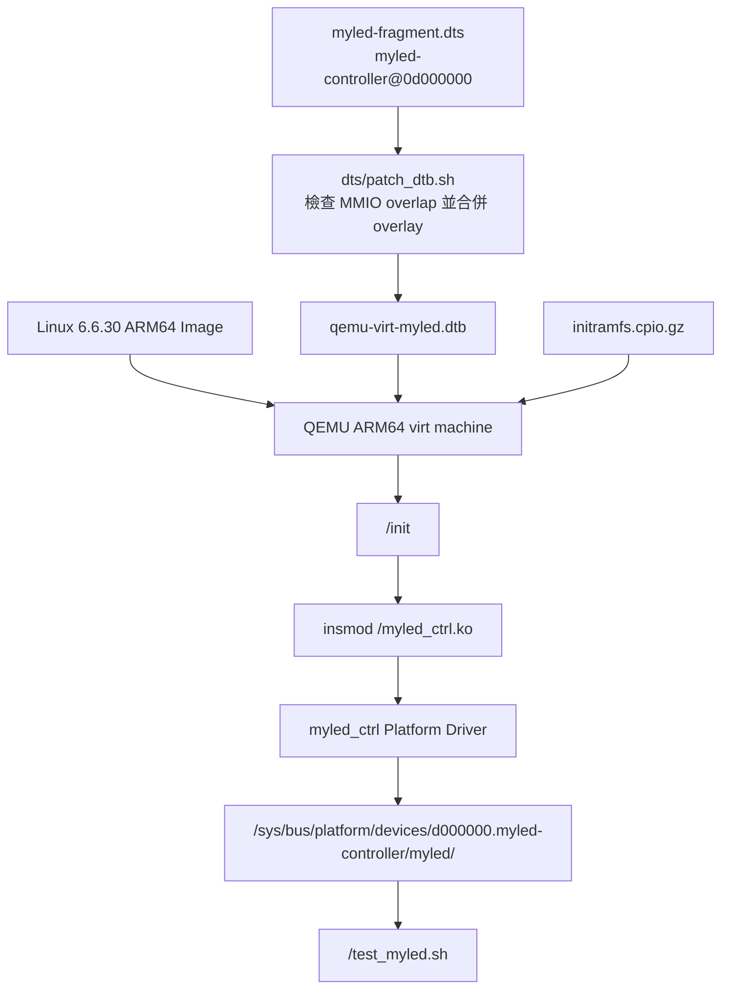

# QEMU ARM64 Platform Driver Demo: Virtual LED Controller

本專案是一個可在 QEMU ARM64 `virt` machine 上執行的 Linux Platform Driver 範例。專案會建立一個虛擬 LED 控制器，Device Tree 節點固定為 `myled-controller@0d000000`，MMIO 範圍固定為 `0x0d000000-0x0d000fff`，driver 會透過 sysfs 提供控制介面。

這份 README 的目標是讓第一次接觸 Linux driver 的人，也能照著流程完成建置、開機、驗證與除錯。

## 專案重點

- 建置 Linux 6.6.30 ARM64 kernel image。
- 從 QEMU dump base DTB，再合併本專案的 Device Tree overlay。
- 編譯 out-of-tree kernel module: `myled_ctrl.ko`。
- 用 BusyBox 建立 initramfs，讓 QEMU 開機後自動載入 driver 並執行測試。
- 保護固定 MMIO 位址 `0x0d000000`，避免與 QEMU 既有 device 的 `reg` 範圍衝突。
- Driver 支援 simulated mode，避免 QEMU 中沒有真 MMIO 硬體時誤碰不存在的裝置位址。

## 執行架構



## 關鍵字說明

| 關鍵字 | 英文 | 說明 |
|---|---|---|
| 平台驅動 | Platform Driver | Linux 用來處理「不能自動被匯流排掃描出來」的硬體，例如 SoC 內建控制器。 |
| 裝置樹 | Device Tree | 用資料描述硬體位置、相容字串與自訂屬性，讓 driver 不必把硬體資訊寫死在程式碼內。 |
| 裝置樹二進位檔 | Device Tree Blob, DTB | DTS 編譯後的二進位格式，kernel 開機時會讀它來知道有哪些硬體。 |
| 記憶體映射 I/O | Memory-Mapped I/O, MMIO | 把硬體暫存器放在記憶體位址空間，driver 用 `readl()` / `writel()` 存取。 |
| 使用者空間介面 | sysfs | Linux 把 device 屬性暴露在 `/sys`，使用者可以用 `cat` / `echo` 操作。 |
| 外部核心模組 | Out-of-tree Module | 不放在 kernel 原始碼樹內，而是用 kernel build system 另外編譯的 `.ko`。 |
| 初始根檔案系統 | initramfs | kernel 開機早期載入的小型根檔案系統，本專案用它放 BusyBox、driver 與測試腳本。 |
| 交叉編譯 | Cross Compilation | 在 x86-64 主機上編譯 ARM64 目標機器要執行的 kernel 或 module。 |
| 相容字串 | Compatible String | Device Tree 用來配對 driver 的字串，例如 `myvendor,myled-v1`。 |
| 位址宣告 | `reg` Property | Device Tree 中描述 MMIO base address 與 size 的屬性。Kernel 會把它轉成 driver 可取得的 resource。 |
| 探測函式 | `probe()` | Device Tree 與 driver 配對成功後，kernel 呼叫的初始化函式。 |
| 移除函式 | `remove()` | Driver 被卸載或 device unbind 時呼叫的清理函式。 |
| 資源 | Resource | Kernel 對 MMIO、IRQ 等硬體資源的描述。本專案使用的是 memory resource。 |
| 裝置託管資源 | Device-managed Resource, `devm_*` | 生命週期跟著 device 的資源管理 API，可減少 `probe()` 失敗時漏清理的問題。 |
| 影子暫存器 | Shadow Register | 用一般記憶體陣列模擬硬體暫存器。本專案在 simulated mode 使用 `sim_regs[]`。 |
| 讀改寫 | Read-Modify-Write, RMW | 先讀 register、改其中幾個 bit、再寫回。這段流程需要上鎖，避免不同寫入互相覆蓋。 |

## 專案結構

```text
qemu-platform-demo/
├── driver/
│   ├── myled_ctrl.c        # Platform driver 主程式
│   ├── myled_ctrl.h        # 暫存器、bit mask、private data 定義
│   └── Makefile            # out-of-tree module 建置規則
├── dts/
│   ├── myled-fragment.dts  # myled-controller@0d000000 overlay
│   └── patch_dtb.sh        # dump QEMU DTB、檢查位址、合併 overlay
├── rootfs/
│   └── overlay/
│       ├── init            # QEMU initramfs 的 /init
│       └── test_myled.sh   # QEMU 內的 sysfs 自動測試
├── scripts/
│   ├── 00_install_deps.sh
│   ├── 01_build_kernel.sh
│   ├── 02_patch_dtb.sh
│   ├── 03_build_driver.sh
│   ├── 04_build_rootfs.sh
│   ├── 05_run_qemu.sh
│   ├── 06_clean.sh
│   └── 0A_fix_busybox_arch.sh
├── README_platform.md
├── report_platform.md
└── report_platform_api.md
```

## 前置環境

建議使用 Ubuntu 22.04 或相容環境。需要的工具包含：

- `gcc-aarch64-linux-gnu`: ARM64 cross compiler。
- `qemu-system-aarch64`: 執行 ARM64 QEMU。
- `device-tree-compiler`: 編譯 DTS / DTB。
- `make`、`bc`、`bison`、`flex`、`libssl-dev`、`libelf-dev`: kernel build 需要。

可先執行：

```bash
bash scripts/00_install_deps.sh
```

## 建置與執行流程

請在專案根目錄依序執行。

### 1. 建置 ARM64 kernel

```bash
bash scripts/01_build_kernel.sh
```

產物：

```text
linux-6.6.30/arch/arm64/boot/Image
```

這個腳本會處理 WSL 或跨檔案系統常見的 future timestamp / clock skew 問題。若 make 偵測到檔案時間在未來，腳本會只修正未來時間的檔案並重新建置。

### 2. 產生含 myled 節點的 DTB

```bash
bash scripts/02_patch_dtb.sh
```

此步驟會做三件事：

1. 使用 QEMU dump 出 base DTB。
2. 檢查 `0x0d000000-0x0d000fff` 是否與 base DTB 內既有 device `reg` 重疊。
3. 合併 `dts/myled-fragment.dts`，產生：

```text
dts/qemu-virt-myled.dtb
```

預期可以看到：

```text
myled-controller@0d000000 {
    compatible = "myvendor,myled-v1";
    reg = <0x00 0xd000000 0x00 0x1000>;
}
```

### 3. 確認 BusyBox 是 ARM64

```bash
bash scripts/0A_fix_busybox_arch.sh
```

ARM64 kernel 不能執行 x86-64 BusyBox。這一步會準備或修正本專案需要的 ARM64 BusyBox。

### 4. 編譯 driver

```bash
bash scripts/03_build_driver.sh
```

產物會放入：

```text
rootfs/overlay/myled_ctrl.ko
```

### 5. 建立 initramfs

```bash
bash scripts/04_build_rootfs.sh
```

產物：

```text
rootfs/initramfs.cpio.gz
```

此腳本會檢查：

- BusyBox 是否存在。
- BusyBox 是否為 ARM64 binary。
- `rootfs/overlay/myled_ctrl.ko` 是否已產生。

### 6. 啟動 QEMU

```bash
bash scripts/05_run_qemu.sh
```

QEMU 會載入：

- kernel: `linux-6.6.30/arch/arm64/boot/Image`
- DTB: `dts/qemu-virt-myled.dtb`
- initramfs: `rootfs/initramfs.cpio.gz`

退出 QEMU：

```text
Ctrl-A，接著按 X
```

## 預期執行結果

開機後 `/init` 會自動載入 `myled_ctrl.ko`，再執行 `/test_myled.sh`。成功時會看到類似：

```text
[init] Module loaded OK
  [PASS] platform device name = d000000.myled-controller
  [PASS] of_node = myled-controller@0d000000
  [PASS] driver bound
  [PASS] sysfs directory ready
  [PASS] info exists
  [PASS] enable exists
  [PASS] brightness exists
  [PASS] color exists
  [PASS] blink exists
  [PASS] status exists
  [PASS] brightness write/readback = 200
  [PASS] color write/readback = ff3300
  [PASS] blink write/readback = 1
  [PASS] enable write/readback = 0
[PASS] myled sysfs test completed
[init] Demo script passed
```

Kernel log 中也會看到：

```text
myled_ctrl d000000.myled-controller: MMIO region: [0x0d000000 - 0x0d000fff]
myled_ctrl d000000.myled-controller: simulated mode requested by Device Tree
myled_ctrl d000000.myled-controller: HW init OK
myled_ctrl d000000.myled-controller: probe() succeeded
```

`loading out-of-tree module taints kernel` 是 Linux 對外部模組的標準提示，不代表本專案執行失敗。

## 手動 sysfs 操作

在 QEMU shell 內可以手動操作：

```sh
cd /sys/bus/platform/devices/d000000.myled-controller/myled

cat info
cat status

echo 1 > enable
cat enable

echo 200 > brightness
cat brightness

echo ff3300 > color
cat color

echo 1 > blink
cat blink
```

`brightness` 限制為 `0..255`。例如：

```sh
echo 300 > brightness
```

預期會被 driver 拒絕，因為超過 `MYLED_MAX_BRIGHTNESS`。

## 清理產物

只顯示會清理哪些檔案：

```bash
bash scripts/06_clean.sh --dry-run --soft
```

清理一般建置產物：

```bash
bash scripts/06_clean.sh
```

清理更多下載與產生物：

```bash
bash scripts/06_clean.sh --all
```

## 常見問題與已修正 BUG

### BUG 1: MMIO 位址可能撞到 QEMU 既有 device

症狀：

- Driver claim 到已被其他 device 使用的 resource。
- 或 QEMU/kernel 行為不穩定。

原因：

- Platform device 的 `reg` 是硬體位址宣告。如果隨意選 `0x09000000`，可能撞到 QEMU virt machine 的 UART 等既有裝置。

解法：

- 固定使用 `myled-controller@0d000000`。
- 固定 MMIO 範圍為 `0x0d000000-0x0d000fff`。
- `dts/patch_dtb.sh` 在合併 overlay 前會先掃描 base DTB 的 `reg` 範圍，若重疊就停止。
- Driver probe 也會檢查 resource base/size 必須等於 `0x0d000000/0x1000`。

### BUG 2: QEMU 中沒有真 LED MMIO 硬體

症狀：

- 若 driver 直接 `ioremap` 並存取不存在的硬體位址，可能得到不可預期結果。

原因：

- Device Tree 可以宣告一個 platform device，但 QEMU machine 不一定真的實作對應 MMIO device model。

解法：

- DTS 加上 `myvendor,simulated`。
- Driver 在 simulated mode 不做 `devm_ioremap_resource()`，改用 `sim_regs[]` shadow register。
- 所有 sysfs 操作仍走同一套 register helper，所以介面行為和真 MMIO 模式一致。

### BUG 3: ARM64 kernel 無法執行 x86-64 BusyBox

症狀：

- QEMU 開機後找不到可執行 `/init`。
- 或出現 exec format 類型錯誤。

原因：

- initramfs 內的 BusyBox 架構與 kernel 架構不同。

解法：

- `scripts/04_build_rootfs.sh` 會用 `file` 檢查 BusyBox 是否為 ARM64。
- 若不符合，腳本會要求先執行 `scripts/0A_fix_busybox_arch.sh`。

### BUG 4: platform device 名稱的 leading zero 會被 kernel 省略

症狀：

- Device Tree 節點是 `myled-controller@0d000000`。
- sysfs device 可能顯示成 `d000000.myled-controller`，測試腳本若只找 `0d000000.myled-controller` 會失敗。

原因：

- Linux platform device 名稱會依核心命名規則產生，位址字串的 leading zero 不一定保留。

解法：

- 測試腳本同時接受 `0d000000.myled-controller` 與 `d000000.myled-controller`。
- 另外檢查 `of_node` symlink 必須指回 `myled-controller@0d000000`，確保真正的 DT 節點沒有跑掉。

### BUG 5: WSL 或跨系統檔案時間造成 kernel build clock skew

症狀：

- `make` 顯示 `Clock skew detected` 或檔案修改時間在未來。

原因：

- Windows/WSL/檔案系統時間同步可能讓剛產生的檔案被判定為未來時間。

解法：

- `scripts/01_build_kernel.sh` 會偵測 clock skew。
- 若發現問題，只修正比目前時間新的檔案，再重新執行 build。

### BUG 6: QEMU shell 沒有 controlling TTY

症狀：

- BusyBox shell 出現 `can't access tty` 類似提示。

原因：

- initramfs 直接啟動 shell 時，尚未建立完整 controlling terminal。

解法：

- `/init` 使用 `setsid cttyhack sh` 進入 shell。
- 若環境沒有 tty，會保守退回一般 `sh`。

## 觀念整理

這個專案可以分成幾個觀念一起看：

- `Bring-up`：讓一個最小系統從「可以開機」走到「device 可以被 driver 綁定並操作」。在本專案中，流程包含 kernel image、DTB、kernel module、initramfs、QEMU boot 與 sysfs test。
- `Device Tree consistency`：DTS 內的 `myled-controller@0d000000`、`reg`，以及 driver 內的 `MYLED_MMIO_BASE` / `MYLED_MMIO_SIZE` 必須一致。任何一邊改錯，都應該在建置或 `probe()` 階段被擋下來。
- `devm_* resource management`：`devm_kzalloc()` 與 `devm_ioremap_resource()` 會把資源生命週期綁在 device 上，`probe()` 失敗時比較不容易漏掉清理。
- `sysfs error propagation`：使用者寫入不合法資料時，例如 `brightness` 超過 255，driver 會回傳錯誤，而不是假裝成功。
- `Simulated register bank`：目前 QEMU 沒有真正的 myled MMIO device model，所以 driver 用 `sim_regs[]` 模擬暫存器。這讓 platform driver、Device Tree、sysfs 與測試流程可以先跑通。
