# qemu-platform-demo 圖解導讀

這份文件只看目前專案裡的程式碼來整理，不另外假設硬體行為。重點是讓剛接手的人先看圖，知道每個檔案在整條流程裡站哪裡，然後再回頭讀 C、DTS、shell script。

這個專案做的事很單純：在 QEMU ARM64 `virt` machine 裡，用 Device Tree 生出一個 `myled-controller@0d000000` platform device，載入 `myled_ctrl.ko` 後由 Linux platform bus 呼叫 `probe()`，最後用 sysfs 檔案讓 shell 可以 `cat` / `echo` 控制虛擬 LED。

---

## 1. 一張圖先看懂整包

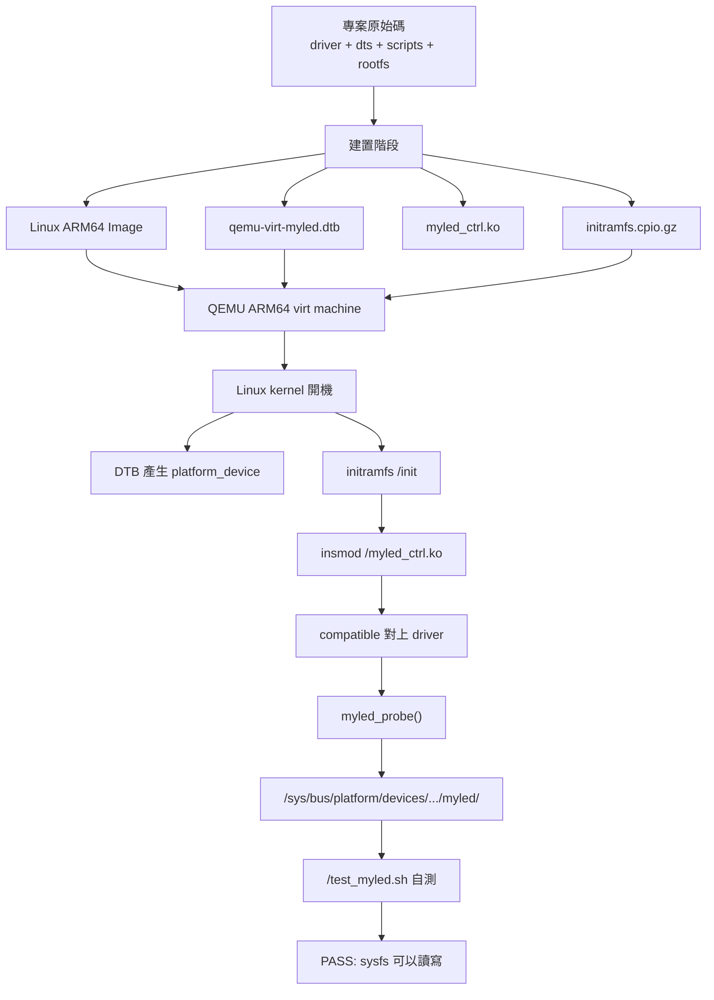

先抓住這句：

```text
DTS 描述裝置，driver 讀裝置，sysfs 操作 driver，QEMU 把整件事跑起來。
```

---

## 2. 專案檔案分工圖

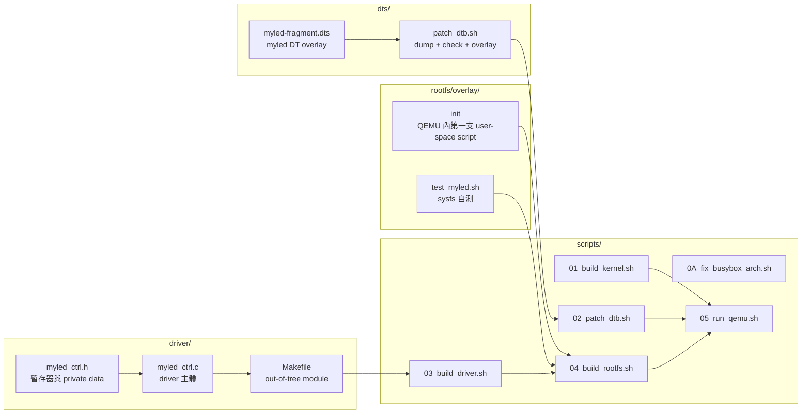

---

## 3. 建置順序圖

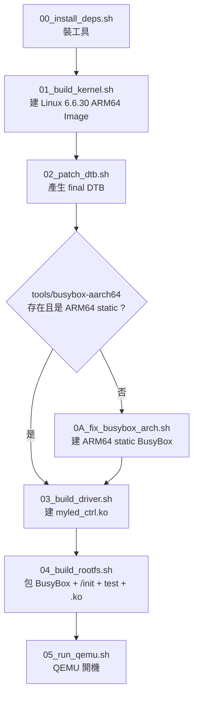

實務上 `0A_fix_busybox_arch.sh` 不是每次都要跑。只要 `tools/busybox-aarch64` 已經存在、可執行、而且 `file` 看起來是 ARM64 static binary，就可以直接進 `03` 或 `04`。

---

## 4. 建置產物相依圖

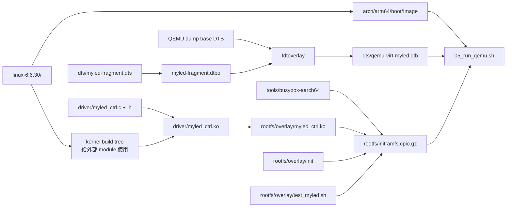

這張圖很適合 debug：QEMU 缺東西時，通常就是右邊 `RUN` 前面的三個必要檔案少了一個。

---

## 5. Device Tree overlay 做了什麼

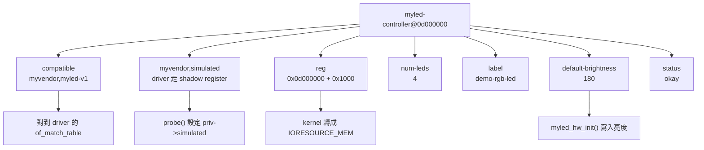

`dts/myled-fragment.dts` 不是在 QEMU 裡真的做出 LED 硬體。它是在 DTB 裡描述一個 platform device，讓 Linux kernel 知道有這個裝置，後面才有機會讓 driver bind 上去。

---

## 6. DTB 產生流程

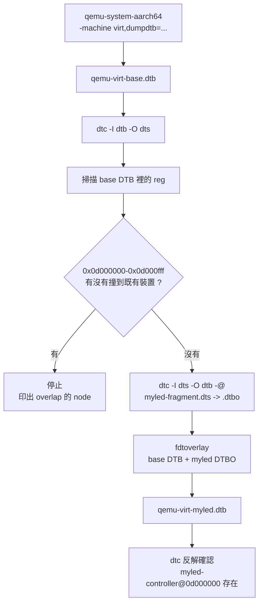

這裡有兩層防呆：

1. `dts/patch_dtb.sh` 在建置期先掃 QEMU base DTB，避免 `myled` MMIO 範圍撞到既有 device。
2. `myled_probe()` 在開機期再檢查 resource base/size 必須是 `0x0d000000/0x1000`。

---

## 7. QEMU 啟動時塞進去的三樣東西

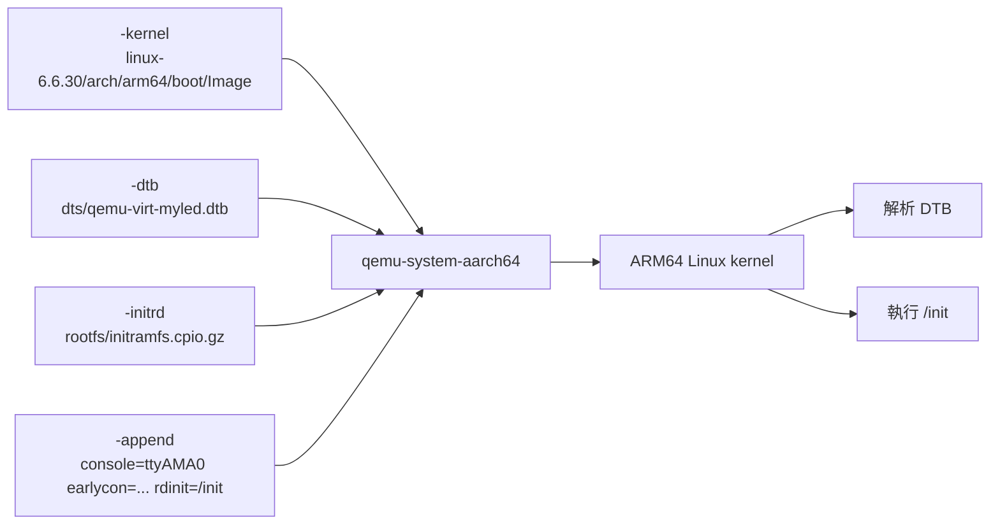

`05_run_qemu.sh` 的責任很薄：確認三個檔案都在，然後把它們交給 QEMU。真正有邏輯的是 kernel、DTB、initramfs 和 driver。

---

## 8. 開機時序圖

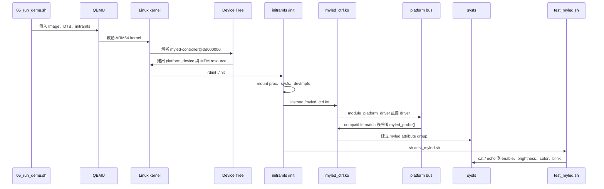

---

## 9. Platform device 跟 driver 怎麼配對

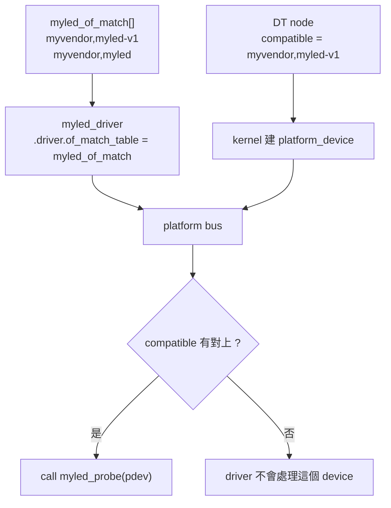

關鍵是 DT 裡的 `compatible` 跟 driver 的 `of_match_table` 對上。

---

## 10. Driver 生命週期狀態圖

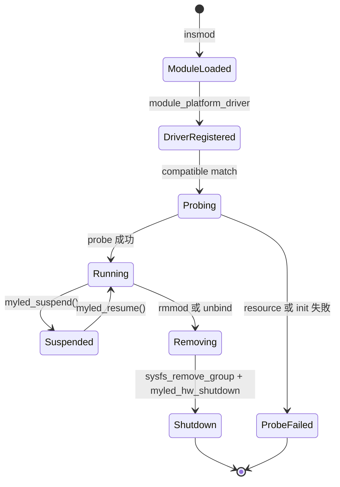

目前 rootfs 是用 `insmod` 載入，沒有做 `rmmod` 示範，但 driver 本身有 `remove()`、shutdown 與 PM callback。

---

## 11. `myled_probe()` 詳細流程圖

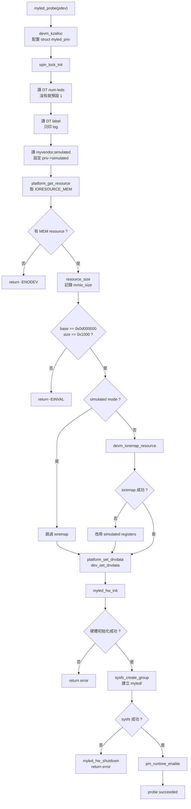

`probe()` 的精神是：先把 DT 給的資料檢查乾淨，再把 driver 狀態掛到 `drvdata`，最後才開 sysfs 給 user space 用。

---

## 12. `struct myled_priv` 結構圖

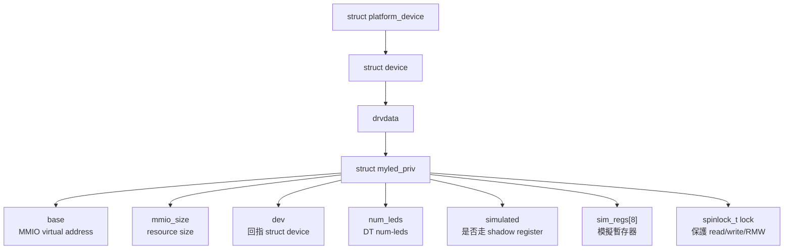

sysfs callback 會用 `dev_get_drvdata(dev)` 把 `priv` 拿回來，所以 `platform_set_drvdata()` / `dev_set_drvdata()` 一定要在 `sysfs_create_group()` 之前完成。

---

## 13. 暫存器地圖

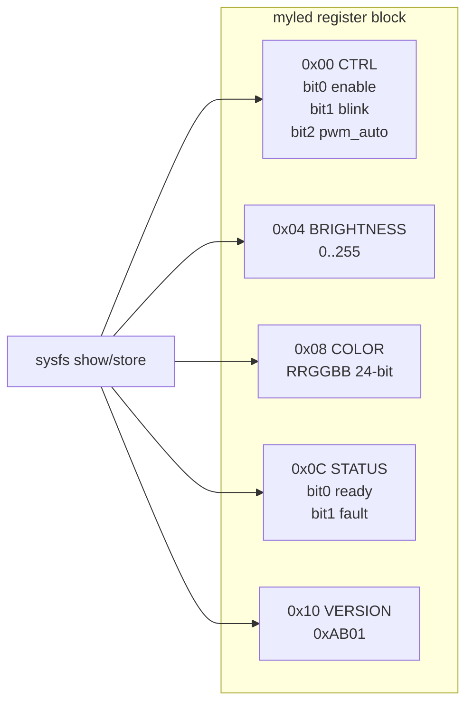

| Offset | 名稱 | sysfs 會碰到的地方 |
|---:|---|---|
| `0x00` | `CTRL` | `enable`、`blink`、`info`、suspend/resume |
| `0x04` | `BRIGHTNESS` | `brightness`、`info` |
| `0x08` | `COLOR` | `color`、`info` |
| `0x0c` | `STATUS` | `status` |
| `0x10` | `VERSION` | `info`、`myled_hw_init()` |

---

## 14. register helper 共用路徑

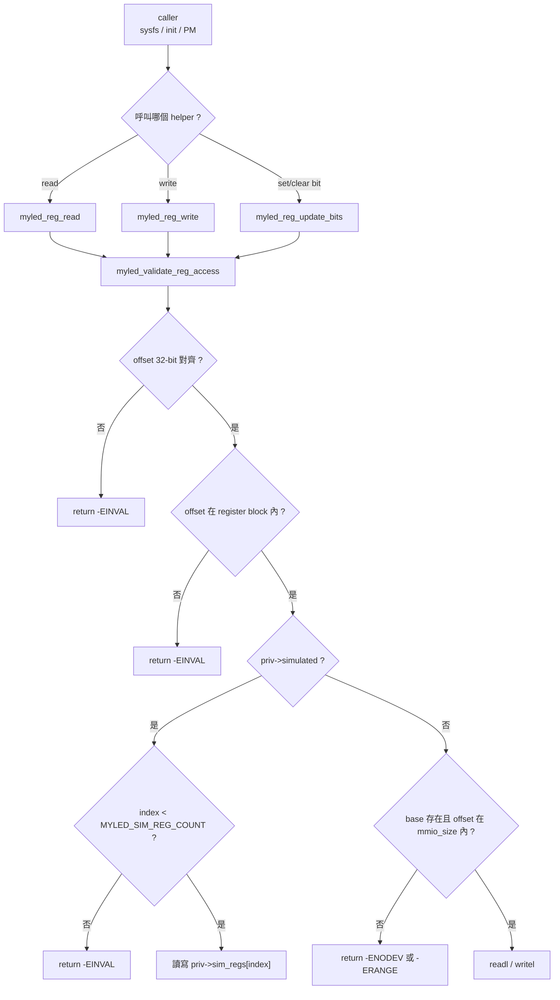

這樣寫的好處是 sysfs callback 不用每個地方都重複檢查 offset，錯誤也會集中在同一個 helper。

---

## 15. simulated mode 跟真 MMIO 的分岔

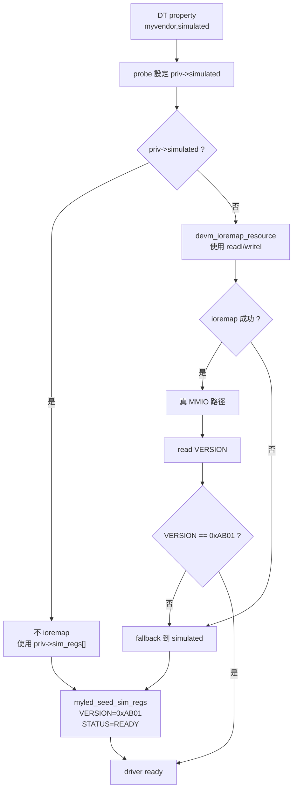

這個 demo 聚焦在 Linux driver 流程。DTS 明確加了 `myvendor,simulated`，讓 driver 用 `sim_regs[]` 當影子暫存器。

---

## 16. sysfs API 對應圖

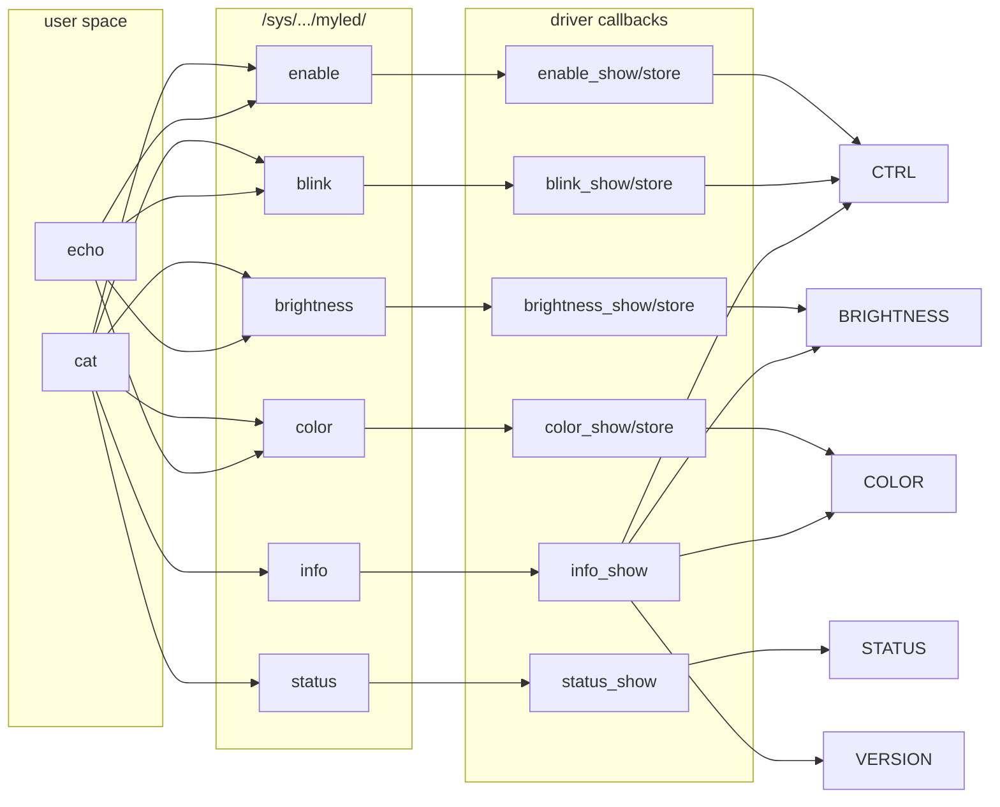

| sysfs 檔案 | 可讀 | 可寫 | 主要行為 |
|---|---:|---:|---|
| `enable` | 是 | 是 | 控制 `CTRL.ENABLE` |
| `brightness` | 是 | 是 | 寫入 `0..255` |
| `color` | 是 | 是 | 以 hex 寫入 `RRGGBB`，driver 只留 24 bits |
| `blink` | 是 | 是 | 控制 `CTRL.BLINK` |
| `status` | 是 | 否 | 顯示 ready/fault |
| `info` | 是 | 否 | 一次列出版本、LED 數量、mode、亮度、顏色 |

---

## 17. `echo 200 > brightness` 資料流

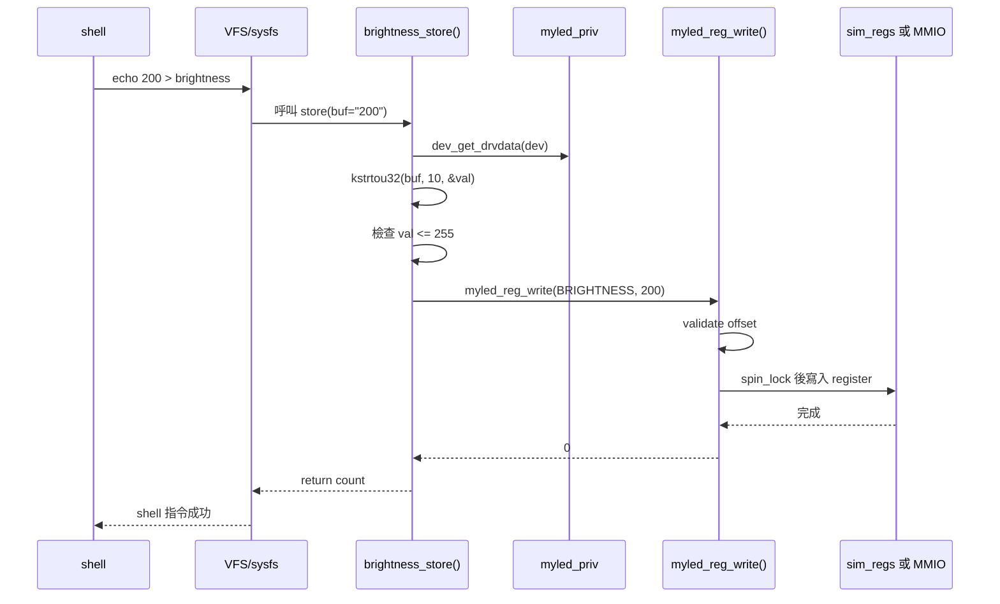

超過 255 會在 `brightness_store()` 直接回 `-EINVAL`，不會寫進暫存器。

---

## 18. `echo 1 > blink` 控制訊號流

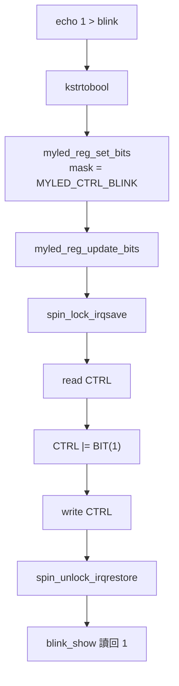

這份 driver 沒有 IRQ，也沒有硬體中斷線。這裡的「訊號流」比較像控制訊號：user space 寫 sysfs，最後變成 `CTRL` 裡的 bit。

---

## 19. `cat info` 讀取資料流

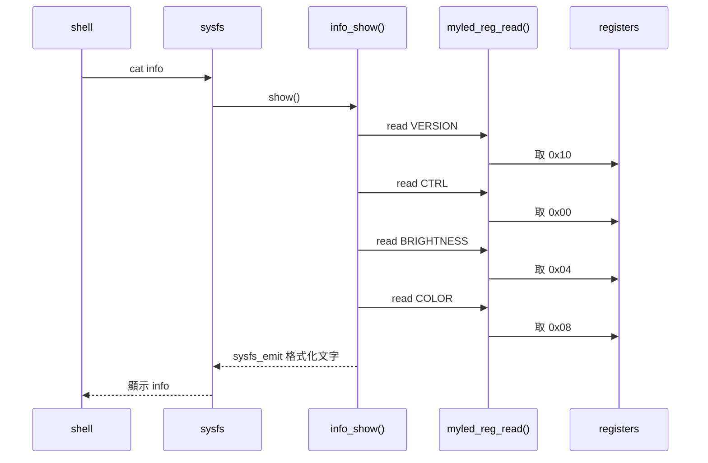

`info` 的價值是一次看完 driver 眼中的狀態，debug 時比一個一個 `cat` 快很多。

---

## 20. lock 保護範圍

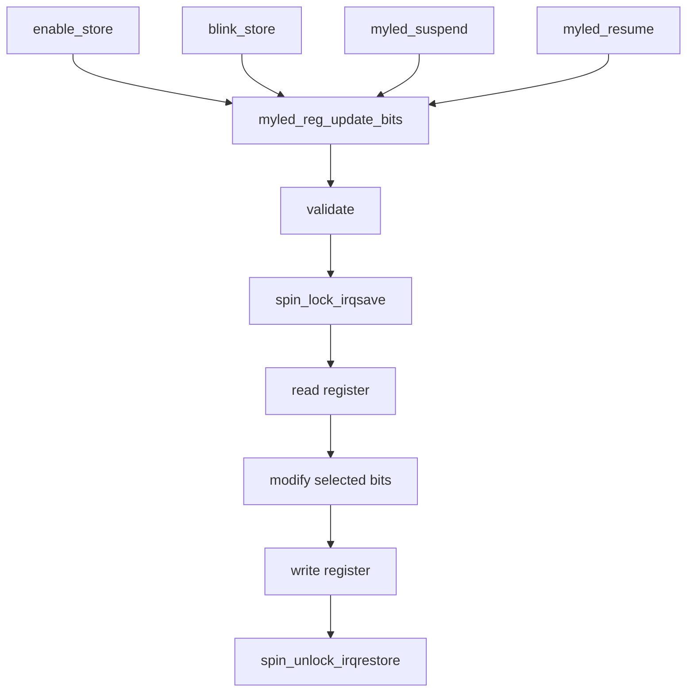

`enable`、`blink`、suspend、resume 都會改 `CTRL`。如果 read-modify-write 沒有包在同一把 lock 裡，就可能出現其中一個 bit 被另一條路徑蓋掉的問題。

---

## 21. module 載入到 probe 的 API 呼叫圖

```mermaid
flowchart TD
    INSMOD["insmod /myled_ctrl.ko"] --> MODINIT["module_platform_driver 產生 module init"]
    MODINIT --> REG["platform_driver_register(&myled_driver)"]
    REG --> BUS["platform bus 掃 device / driver"]
    BUS --> OFMATCH["of_match_table 比對 compatible"]
    OFMATCH --> PROBE["myled_probe(pdev)"]

    PROBE --> ALLOC["devm_kzalloc"]
    PROBE --> OFREAD["of_property_read_u32/string/bool"]
    PROBE --> GETRES["platform_get_resource"]
    PROBE --> SETDATA["platform_set_drvdata / dev_set_drvdata"]
    PROBE --> HWINIT["myled_hw_init"]
    PROBE --> MKFS["sysfs_create_group"]
    PROBE --> PM["pm_runtime_enable"]
```

這張圖可以直接拿去對 `driver/myled_ctrl.c` 搜尋函式名稱，順序會對得上。

---

## 22. sysfs callback API 呼叫圖

```mermaid
flowchart TD
    subgraph WritePath["寫入路徑"]
        W1["enable_store"] --> BOOL["kstrtobool"]
        W2["blink_store"] --> BOOL
        W3["brightness_store"] --> U32D["kstrtou32 base 10"]
        W4["color_store"] --> U32H["kstrtou32 base 16"]
        BOOL --> BITS["myled_reg_set_bits / clr_bits"]
        U32D --> WRITE["myled_reg_write"]
        U32H --> WRITE
        BITS --> UPDATE["myled_reg_update_bits"]
    end

    subgraph ReadPath["讀取路徑"]
        R1["enable_show"] --> READ["myled_reg_read"]
        R2["blink_show"] --> READ
        R3["brightness_show"] --> READ
        R4["color_show"] --> READ
        R5["status_show"] --> READ
        R6["info_show"] --> READ
        READ --> EMIT["sysfs_emit"]
    end
```

callback 的模式很一致：parse input、拿 `priv`、呼叫 register helper、最後回傳 `count` 或 `sysfs_emit()`。

---

## 23. `/init` 行為圖

```mermaid
flowchart TD
    BOOT["kernel 執行 /init"] --> MOUNT1["mount proc"]
    MOUNT1 --> MOUNT2["mount sysfs"]
    MOUNT2 --> MOUNT3["mount devtmpfs<br/>失敗就 mdev -s"]
    MOUNT3 --> LOAD["insmod /myled_ctrl.ko"]
    LOAD --> LOADOK{"module loaded ?"}
    LOADOK -->|"是"| DMESG["dmesg | grep -i myled"]
    LOADOK -->|"否"| DMESG
    DMESG --> TEST["sh /test_myled.sh"]
    TEST --> TTY{"stdin 是 TTY ?"}
    TTY -->|"是"| SHELL["setsid cttyhack sh"]
    TTY -->|"否"| LOOP["sleep loop<br/>維持系統活著"]
```

`/init` 不是一般發行版的 init system，它只是把 demo 需要的掛載、載入 module、自測、進 shell 串起來。

---

## 24. `/test_myled.sh` 自測流程

```mermaid
flowchart TD
    START["開始自測"] --> FIND["找 platform device"]
    FIND --> TRY1["試 0d000000.myled-controller"]
    FIND --> TRY2["試 d000000.myled-controller"]
    FIND --> SCAN["掃 /sys/bus/platform/devices/* modalias"]
    TRY1 --> FOUND{"compatible 符合 ?"}
    TRY2 --> FOUND
    SCAN --> FOUND
    FOUND -->|"否"| FAIL0["device not found<br/>exit 1"]
    FOUND -->|"是"| NAME["檢查 device name"]
    NAME --> OFNODE["檢查 of_node 指回 myled-controller@0d000000"]
    OFNODE --> DRIVER["檢查 driver symlink"]
    DRIVER --> DIR["檢查 myled/ sysfs 目錄"]
    DIR --> ATTR["檢查 info、enable、brightness、color、blink、status"]
    ATTR --> STATUS["讀 status"]
    STATUS --> W1["brightness 200 寫入再讀回"]
    W1 --> W2["color ff3300 寫入再讀回"]
    W2 --> W3["blink 1 寫入再讀回"]
    W3 --> W4["enable 0 寫入再讀回"]
    W4 --> INFO["讀 info 與 dmesg"]
    INFO --> PASSFAIL{"FAILS == 0 ?"}
    PASSFAIL -->|"是"| PASS["PASS"]
    PASSFAIL -->|"否"| FAIL["FAIL"]
```

它有處理 platform device 名稱前導零的差異，所以會同時接受 `0d000000.myled-controller` 和 `d000000.myled-controller`。

---

## 25. `remove()` 與 shutdown 路徑

```mermaid
flowchart TD
    RM["myled_remove(pdev)"] --> GET["platform_get_drvdata"]
    GET --> PMOFF["pm_runtime_disable"]
    PMOFF --> SYSRM["sysfs_remove_group"]
    SYSRM --> SHUT["myled_hw_shutdown"]
    SHUT --> CLR["clear CTRL enable/blink/pwm_auto"]
    CLR --> BR0["write BRIGHTNESS = 0"]
    BR0 --> DONE["remove complete"]
```

cleanup 的順序是先關掉 user-visible 的 sysfs，再收硬體狀態。這樣可以避免移除中還有人透過 sysfs callback 碰到 driver state。

---

## 26. suspend / resume 行為圖

```mermaid
flowchart LR
    RUN["Running"] -->|"myled_suspend()"| SUSP["clear CTRL.ENABLE"]
    SUSP --> OFF["Controller disabled"]
    OFF -->|"myled_resume()"| RES["set CTRL.ENABLE"]
    RES --> RUN
```

PM callback 只示範最小行為：suspend 關 enable，resume 再打開 enable。它沒有保存完整亮度或顏色，因為目前 register state 在 `sim_regs[]` 或 MMIO 裡還在。

---

## 27. 失敗路徑總覽

```mermaid
flowchart TD
    START["問題發生"] --> BUILD{"發生在建置期 ?"}
    BUILD -->|"是"| B1{"缺工具或 compiler ?"}
    B1 -->|"是"| DEP["跑 00_install_deps.sh"]
    B1 -->|"否"| B2{"BusyBox 架構錯 ?"}
    B2 -->|"是"| BUSY["跑 0A_fix_busybox_arch.sh"]
    B2 -->|"否"| B3{"DTB overlay 失敗 ?"}
    B3 -->|"是"| DTB["看 dts/patch_dtb.sh 的 overlap 或 dtc error"]
    B3 -->|"否"| MOD["看 driver build log"]

    BUILD -->|"否"| R1{"QEMU 缺 Image/DTB/initramfs ?"}
    R1 -->|"是"| ART["回頭補跑 01/02/04"]
    R1 -->|"否"| R2{"module load failed ?"}
    R2 -->|"是"| KO["確認 initramfs 裡有 myled_ctrl.ko"]
    R2 -->|"否"| R3{"probe failed ?"}
    R3 -->|"是"| PROBEERR["看 dmesg 的 MEM resource、base/size、HW init"]
    R3 -->|"否"| SYSERR["看 /test_myled.sh 哪個 sysfs check fail"]
```

debug 時先分層定位：建置、QEMU 啟動、module load、probe、sysfs。

---

## 28. 常見誤解圖

```mermaid
flowchart TD
    A["寫了 DT node"] --> B{"代表 QEMU 有真硬體嗎 ?"}
    B -->|"不是"| C["DT 只讓 kernel 看見 device"]
    C --> D["沒有 QEMU device model 時<br/>readl/writel 不一定有真回應"]
    D --> E["本專案用 myvendor,simulated<br/>讓 driver 走 sim_regs[]"]

    F["sysfs 可以 echo/cat"] --> G{"代表有使用者態 library 嗎 ?"}
    G -->|"不是"| H["sysfs 是 kernel 對 user space 開的檔案介面"]
    H --> I["callback 在 driver 裡執行"]

    J["myled_ctrl.ko 是 .ko"] --> K{"可以用 host kernel build 嗎 ?"}
    K -->|"不行"| L["要用 ARM64 kernel tree<br/>ARCH=arm64 CROSS_COMPILE=aarch64-linux-gnu-"]
```

這三個點最容易卡住：DT 不等於硬體模型、sysfs callback 在 kernel 裡、module 要跟目標 kernel 架構一致。

---

## 29. 用圖串起資料流、訊號流、控制流

```mermaid
flowchart LR
    subgraph DataFlow["資料流"]
        DTA["DTS property"] --> DTB["DTB"]
        DTB --> RES["platform resource"]
        RES --> PRIV["myled_priv"]
        PRIV --> INFO["cat info"]
    end

    subgraph SignalFlow["控制訊號流"]
        ECHO["echo 1 > enable"] --> STORE["enable_store"]
        STORE --> CTRL["CTRL.ENABLE bit"]
    end

    subgraph ControlFlow["程式控制流"]
        INIT["/init"] --> INSMOD["insmod"]
        INSMOD --> PROBE["probe"]
        PROBE --> SYSFS["sysfs ready"]
        SYSFS --> TEST["test_myled.sh"]
    end
```

這張圖把專案拆成三條線：資料從 DTS 進 driver，控制從 shell 進 sysfs，程式順序從 `/init` 推到自測。

---

## 30. 一頁式總複習

```mermaid
flowchart TD
    A["1. 建 kernel Image"] --> B["2. 產 DTB<br/>加入 myled-controller@0d000000"]
    B --> C["3. 建 myled_ctrl.ko"]
    C --> D["4. 包 initramfs<br/>BusyBox + /init + test + .ko"]
    D --> E["5. QEMU boot"]
    E --> F["6. kernel parse DTB"]
    F --> G["7. platform bus match driver"]
    G --> H["8. myled_probe"]
    H --> I["9. sysfs myled/ ready"]
    I --> J["10. test_myled.sh 讀寫 sysfs"]
    J --> K["11. PASS"]
```

---

# 最後一章：5 分鐘快速閱讀路線

下面整理一條快速導讀順序。照著上面的圖走，五分鐘內能看出整包在做什麼、卡住時要去哪裡看。

## 0:00 到 0:40：先看專案目的

用「第 1 張圖」開始：

> 這個 demo 是在 QEMU ARM64 裡跑一個 Linux platform driver。Device Tree 放一個 `myled-controller@0d000000`，kernel 看到後建立 platform device，`myled_ctrl.ko` bind 上去，最後用 `/sys/.../myled/` 這些檔案控制虛擬 LED。

這裡先確認終點是 sysfs 自測 PASS，再展開程式細節。

## 0:40 到 1:30：看建置期

看「第 3、4 張圖」：

> 建置有四個主要產物：kernel Image、final DTB、driver `.ko`、initramfs。QEMU 只負責把這三個大檔案啟動起來。`0A_fix_busybox_arch.sh` 是為了確保 initramfs 裡的 BusyBox 是 ARM64 static binary，不然 ARM64 kernel 進 user space 會直接跑不起來。

這一段順手提醒：缺檔時回頭看 `01/02/03/04` 哪一步沒產物。

## 1:30 到 2:20：看 Device Tree

看「第 5、6、9 張圖」：

> DTS 裡的 `compatible = "myvendor,myled-v1"` 是 driver match 的 key，`reg` 是 MMIO resource，`myvendor,simulated` 是這個 demo 的關鍵，因為 QEMU 沒有真的做 LED MMIO device model，所以 driver 會走 shadow register。`patch_dtb.sh` 先 dump QEMU base DTB，再 overlay 進 myled node，還會檢查 `0x0d000000-0x0d000fff` 沒撞到別的 device。

這一段要釐清：DT node 只描述裝置，不等於 QEMU 裡有真硬體。

## 2:20 到 3:20：看 driver probe

看「第 11、12、15 張圖」：

> `insmod` 後，`module_platform_driver()` 註冊 driver。platform bus 比對 `compatible` 成功，就呼叫 `myled_probe()`。probe 裡先配置 `myled_priv`，讀 DT property，拿 MEM resource，檢查 base/size，設定 simulated mode，初始化 register，再建立 sysfs group。

這段最重要的是 `myled_priv`：後面所有 sysfs callback 都靠 `dev_get_drvdata()` 找回這份狀態。

## 3:20 到 4:20：看 sysfs 與暫存器

看「第 13、16、17、18、19 張圖」：

> sysfs 有六個檔案：`enable`、`brightness`、`color`、`blink`、`status`、`info`。例如 `echo 200 > brightness` 會進 `brightness_store()`，parse 後寫 `BRIGHTNESS` register。`echo 1 > blink` 則是 read-modify-write `CTRL.BLINK` bit，而且 RMW 有 spinlock 保護。

這裡也要注意：本專案沒有 IRQ，所謂訊號流就是 shell 寫 sysfs 後改變 driver 裡的控制 bit。

## 4:20 到 5:00：看自測與 debug 入口

看「第 23、24、27、28 張圖」：

> `/init` 會 mount proc/sys/dev，`insmod /myled_ctrl.ko`，再跑 `/test_myled.sh`。測試會找 platform device、確認 of_node、確認 driver bind、檢查 sysfs 目錄與屬性，最後寫亮度、顏色、blink、enable 再讀回。卡住時先分層看：建置產物、QEMU 啟動、module load、probe、sysfs，自測輸出會告訴你停在哪一層。

收尾摘要：

> 本專案將 Linux platform driver bring-up 的基本路徑縮成一個可重跑的 QEMU demo：DTS 造 device，driver bind device，sysfs 驗證行為。
