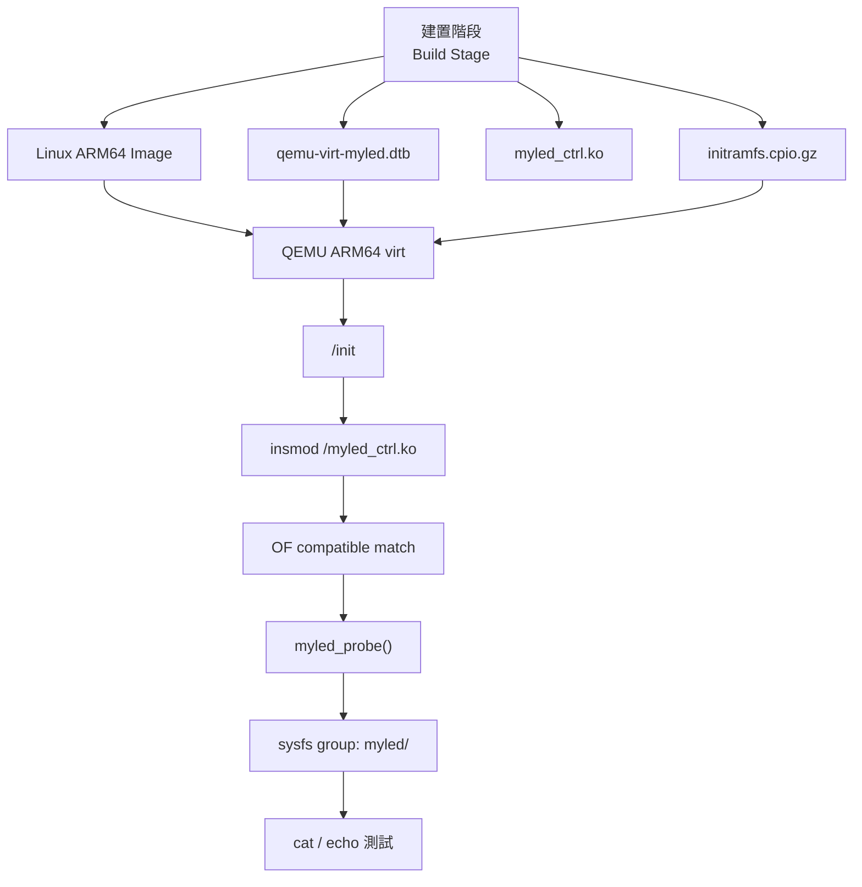
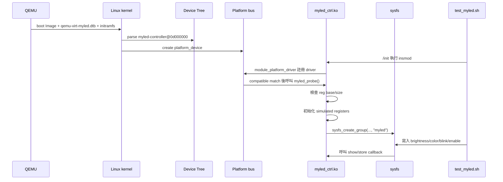

# QEMU ARM64 平台驅動開發技術報告

本報告說明 `qemu-platform-demo` 的整體架構、執行流程、關鍵 Linux kernel 概念，以及開發過程中遇到的 BUG、原因與解法。內容以目前專案內的程式碼、DTS、script 與實際執行結果為準。

本專案的核心目標是：在 QEMU ARM64 `virt` machine 中建立一個由 Device Tree 描述的 platform device，節點固定為 `myled-controller@0d000000`，再由 `myled_ctrl.ko` platform driver 綁定，最後透過 sysfs 完成使用者空間測試。

## 一、專案目標

### 1. 技術目標

- 建立可重現的 ARM64 kernel build 與 QEMU boot 流程。
- 使用 Device Tree overlay 加入虛擬 LED controller。
- 固定並驗證 MMIO 位址 `0x0d000000`，避免與 QEMU 既有 device address 重疊。
- 實作 Linux Platform Driver 的 `probe()`、`remove()`、OF match、PM callback 與 sysfs attributes。
- 在沒有真硬體 MMIO model 的 QEMU 環境中，以 simulated register bank 保持 demo 可執行。
- 在 rootfs 內自動驗證 driver 綁定、sysfs 節點與讀寫行為。

### 2. 學習範圍

本專案把 driver 會用到的幾個環節接在一起，不只停在 `.ko` 編譯：

```text
kernel build -> DTB patch -> driver build -> initramfs build -> QEMU boot -> sysfs validation
```

讀這份專案時，可以把重點放在幾件事：硬體如何被描述、driver 如何被配對、MMIO resource 如何檢查、開機腳本如何載入 module，以及測試腳本如何確認 sysfs 行為。

## 二、系統架構



### 1. 硬體描述層: Device Tree

檔案：`dts/myled-fragment.dts`

此層描述虛擬硬體，不直接寫 driver 邏輯。重要內容如下：

```dts
myled: myled-controller@0d000000 {
    compatible = "myvendor,myled-v1";
    myvendor,simulated;
    reg = <0x0 0x0d000000 0x0 0x1000>;
    num-leds = <4>;
    label = "demo-rgb-led";
    default-brightness = <180>;
    status = "okay";
};
```

重點：

- `compatible`: driver 用它做 OF match。
- `myvendor,simulated`: 告訴 driver 使用 shadow register，不要碰真 MMIO。
- `reg`: 宣告 MMIO base address 與 size。
- `default-brightness`: driver 初始化時讀取的預設亮度。

### 2. Driver 層: Platform Driver

檔案：`driver/myled_ctrl.c`、`driver/myled_ctrl.h`

Driver 負責：

- 註冊 `platform_driver`。
- 用 `of_match_table` 比對 `compatible`。
- 在 `probe()` 中取得 DT resource。
- 檢查 MMIO base/size 是否符合 `0x0d000000/0x1000`。
- 初始化 simulated registers。
- 建立 sysfs attributes: `enable`、`brightness`、`color`、`blink`、`status`、`info`。

### 3. Rootfs 層: initramfs

檔案：`rootfs/overlay/init`、`rootfs/overlay/test_myled.sh`

QEMU 開機後 `/init` 會：

1. mount `proc`、`sysfs`、`devtmpfs`。
2. 載入 `/myled_ctrl.ko`。
3. 執行 `/test_myled.sh`。
4. 進入 BusyBox shell。

### 4. 自動化層: scripts

| 腳本 | 角色 |
|---|---|
| `scripts/01_build_kernel.sh` | 下載與建置 Linux 6.6.30 ARM64 kernel。 |
| `scripts/02_patch_dtb.sh` | 呼叫 `dts/patch_dtb.sh`，產生合併後的 DTB。 |
| `scripts/03_build_driver.sh` | 編譯 `myled_ctrl.ko`。 |
| `scripts/04_build_rootfs.sh` | 建立 initramfs。 |
| `scripts/05_run_qemu.sh` | 啟動 QEMU。 |
| `scripts/06_clean.sh` | 清理建置產物。 |
| `scripts/0A_fix_busybox_arch.sh` | 準備 ARM64 BusyBox。 |

## 三、關鍵概念說明

### 1. Platform Driver

Platform Driver 是 Linux 用來處理 non-discoverable device 的機制。所謂 non-discoverable，是指硬體不會像 PCI 或 USB 一樣自己回報存在，因此 kernel 需要透過 Device Tree 或 board file 知道它在哪裡。

本專案中，`myled_ctrl` driver 不會自己掃描硬體，而是等 kernel 從 DTB 解析到 `myled-controller@0d000000` 後，由 platform bus 進行配對。

### 2. OF Match

OF 是 Open Firmware 的縮寫，在 Linux kernel 中常用來指 Device Tree 相關機制。

配對關係如下：

```text
DTS compatible = "myvendor,myled-v1"
        |
        v
driver of_match_table 內也有 "myvendor,myled-v1"
        |
        v
kernel 呼叫 myled_probe()
```

### 3. MMIO

MMIO 是 Memory-Mapped I/O。硬體暫存器被映射到 CPU 的位址空間，driver 透過讀寫記憶體位址操作硬體。

本專案宣告：

```text
base = 0x0d000000
size = 0x1000
range = 0x0d000000-0x0d000fff
```

Driver 端也定義：

```c
#define MYLED_MMIO_BASE 0x0d000000ULL
#define MYLED_MMIO_SIZE 0x1000U
```

這樣可以讓 DTS 與 driver 在執行期互相檢查，避免其中一邊被改掉但另一邊沒有同步。

### 4. sysfs

sysfs 是 kernel 對 user space 暴露 device 狀態的檔案介面。對本專案而言，使用者不需要寫 C 程式，只要用 `cat` 和 `echo` 就能操作虛擬 LED。

例子：

```sh
cd /sys/bus/platform/devices/d000000.myled-controller/myled
echo 1 > enable
echo 200 > brightness
echo ff3300 > color
cat info
```

### 5. devm Resource Management

`devm_*` API 會把資源生命週期綁在 `struct device` 上。若 `probe()` 中途失敗，kernel 會自動釋放已註冊的 managed resources。

本專案使用：

- `devm_kzalloc()`: 分配 `struct myled_priv`。
- `devm_ioremap_resource()`: 在非 simulated mode 時映射 MMIO resource。

## 四、執行流程追蹤



### `myled_probe()` 的主要步驟

1. 配置 `struct myled_priv`。
2. 初始化 spinlock。
3. 從 Device Tree 讀取 `num-leds`、`label`、`myvendor,simulated`。
4. 用 `platform_get_resource()` 取得 `reg` 轉換後的 memory resource。
5. 檢查 resource base 必須是 `0x0d000000`，size 必須是 `0x1000`。
6. simulated mode 下不執行 ioremap，改用 `sim_regs[]`。
7. 建立 sysfs 前先設定 drvdata，避免 callback 拿不到 private data。
8. 呼叫 `myled_hw_init()` 初始化暫存器。
9. 建立 sysfs group。
10. 啟用 runtime PM framework 狀態。

## 五、暫存器模型

| Offset | 名稱 | 方向 | 說明 |
|---:|---|---|---|
| `0x00` | `CTRL` | R/W | 控制 enable、blink、pwm bits。 |
| `0x04` | `BRIGHTNESS` | R/W | 亮度，合法範圍 `0..255`。 |
| `0x08` | `COLOR` | R/W | RGB 色碼，只保留低 24 bits，也就是 `RRGGBB`。 |
| `0x0c` | `STATUS` | R | 狀態 bit，目前包含 ready/fault。 |
| `0x10` | `VERSION` | R | 預期版本值 `0xAB01`。 |

`CTRL` bit 定義：

| Bit | Macro | 說明 |
|---:|---|---|
| 0 | `MYLED_CTRL_ENABLE` | 啟用 LED controller。 |
| 1 | `MYLED_CTRL_BLINK` | 啟用閃爍。 |
| 2 | `MYLED_CTRL_PWM_AUTO` | 保留給 PWM 自動模式。 |

## 六、開發過程中的 BUG、原因與解法

### BUG 1: MMIO address collision 風險

問題：

一開始若任意挑選 MMIO 位址，可能與 QEMU virt machine 已存在的 device 重疊。這類錯誤不一定會在編譯期出現，但開機或 driver bind 時可能造成 resource conflict，甚至造成測試結果不穩定。

原因：

Device Tree 的 `reg` 是 kernel 會轉成 resource 的真實硬體描述。兩個 platform device 宣告同一段 MMIO，就等於兩個 driver 都認為自己擁有同一段硬體暫存器。

解法：

- 本專案固定使用 `myled-controller@0d000000`。
- DTS 宣告 `reg = <0x0 0x0d000000 0x0 0x1000>`。
- `dts/patch_dtb.sh` 在 overlay 合併前掃描 QEMU base DTB 的 `reg`，確認沒有 overlap。
- Driver `probe()` 再次檢查 resource start 與 size，若不是預期值就回傳 `-EINVAL`。

補充：

`ranges` 是 bus address translation window，不等於某個 device 已經佔用的 `reg`。因此位址檢查只比對實際 device `reg` 範圍，避免把 bus window 誤判為衝突。

### BUG 2: Device Tree 有節點，不代表 QEMU 有真硬體

問題：

QEMU 可以讓 kernel 看到 DT node，但如果 QEMU 沒有實作對應的 MMIO device model，driver 直接對該位址 `readl()` / `writel()` 並不安全。

原因：

Device Tree 是硬體描述，不會自動創造 QEMU device model。也就是說，DTB 裡有 `myled-controller@0d000000`，只能讓 kernel 建立 platform device，不能保證背後有可回應的硬體。

解法：

- DTS 加入 `myvendor,simulated` boolean property。
- Driver 偵測到 simulated mode 時不做 `devm_ioremap_resource()`。
- Driver 使用 `sim_regs[]` 當 shadow register bank。
- sysfs、register helper、初始化流程仍共用同一套 API，降低真硬體模式與模擬模式分歧。

### BUG 3: sysfs callback 可能比預期更早被呼叫

問題：

若 sysfs group 建立時或建立後，使用者空間立即讀寫 attribute，而 driver 還沒把 `priv` 放入 drvdata，callback 會拿不到狀態資料。

原因：

sysfs callback 會透過 `dev_get_drvdata(dev)` 取回 private data。如果 `sysfs_create_group()` 之前沒有先 `platform_set_drvdata()` / `dev_set_drvdata()`，就有空窗期。

解法：

- 在 `sysfs_create_group()` 之前先設定 drvdata。
- show/store callback 只透過 drvdata 取狀態，不依賴全域變數。

### BUG 4: Read-modify-write 可能發生 lost update

問題：

`enable` 與 `blink` 都會修改 `CTRL` register。若 read 與 write 各自加鎖，但中間沒有包在同一個 critical section，兩個 sysfs 寫入交錯時可能覆蓋彼此的 bit。

原因：

Read-modify-write 不是單一動作。流程是：

```text
read CTRL -> 修改 bit -> write CTRL
```

如果兩個 writer 同時進入，後寫入的人可能用舊值覆蓋先寫入的人。

解法：

- 新增 `myled_reg_update_bits()`。
- 在同一把 spinlock 內完成 read、modify、write。
- `myled_reg_set_bits()` 與 `myled_reg_clr_bits()` 都改呼叫這個 helper。

### BUG 5: register offset 沒有完整防呆

問題：

底層 register helper 若沒有檢查 offset，未來新增 sysfs 或功能時可能不小心讀寫超出 register block。

原因：

MMIO 存取是低階操作，越界不一定會像一般 user space 程式一樣容易被偵測。

解法：

- 新增 `myled_validate_reg_access()`。
- 檢查 offset 必須 32-bit 對齊。
- 檢查 offset 必須落在 `MYLED_REG_SIZE` 內。
- simulated mode 也會確認 index 不超過 `MYLED_SIM_REG_COUNT`。
- 非 simulated mode 會確認 `base` 已映射且 offset 落在 `mmio_size` 內。

### BUG 6: BusyBox 架構錯誤

問題：

ARM64 kernel 開機後如果 initramfs 裡放的是 x86-64 BusyBox，`/init` 無法執行。

原因：

kernel 與 user space binary 架構必須相容。QEMU 模擬的是 ARM64 machine，因此 initramfs 內的 BusyBox 也必須是 ARM64 binary。

解法：

- `scripts/04_build_rootfs.sh` 檢查 BusyBox 是否可執行。
- 若系統有 `file` 指令，會檢查 binary 架構是否包含 ARM64/aarch64。
- 找不到或架構錯誤時，明確提示執行 `scripts/0A_fix_busybox_arch.sh`。

### BUG 7: kernel build 出現 clock skew

問題：

建置 kernel 時，`make` 可能回報 clock skew 或檔案修改時間在未來。

原因：

專案位於 WSL/Windows 交界環境時，檔案時間可能因主機與 guest 時鐘同步或掛載行為而偏移。

解法：

- `scripts/01_build_kernel.sh` 建置前先修正未來時間的檔案。
- 若 make log 中仍出現 clock skew，腳本會再次修正並重試。
- 只修正比目前時間新的檔案，避免每次都碰整棵 kernel tree 造成不必要重編。

### BUG 8: platform device 名稱不保留 leading zero

問題：

Device Tree 節點名稱是 `myled-controller@0d000000`，但 sysfs platform device 名稱實際可能是 `d000000.myled-controller`。

原因：

Linux platform device 名稱由核心根據位址與節點名稱生成，位址字串中的 leading zero 不一定保留。

解法：

- 測試腳本接受 `0d000000.myled-controller` 與 `d000000.myled-controller`。
- 同時檢查 `of_node` symlink 是否指回 `myled-controller@0d000000`，避免只用 sysfs 名稱判斷導致誤判。

### BUG 9: kernel-doc warning

問題：

`W=1` 編譯 driver 時，檔案頂部若用 `/** ... */` 但內容不是 kernel-doc 格式，可能被 kernel-doc 檢查當成文件註解而產生 warning。

原因：

Kernel build system 會把 `/**` 視為 kernel-doc 註解起點。

解法：

- 檔案頂部一般說明改用普通區塊註解 `/* ... */`。
- 保留真正需要描述資料結構的 kernel-doc 註解。

## 七、驗證結果

目前已完成下列驗證：

| 驗證項目 | 結果 |
|---|---|
| shell script syntax check | 通過 |
| kernel build | 通過 |
| DTB patch 與 merged node 檢查 | 通過 |
| driver `W=1` module build | 通過 |
| rootfs build | 通過 |
| QEMU boot | 通過 |
| `/test_myled.sh` sysfs 自動測試 | 通過 |
| `git diff --check` | 通過 |

實際 QEMU 測試重點輸出：

```text
[init] Module loaded OK
myled_ctrl d000000.myled-controller: MMIO region: [0x0d000000 - 0x0d000fff]
myled_ctrl d000000.myled-controller: simulated mode requested by Device Tree
myled_ctrl d000000.myled-controller: HW init OK
myled_ctrl d000000.myled-controller: probe() succeeded
[PASS] of_node = myled-controller@0d000000
[PASS] driver bound
[PASS] sysfs directory ready
[PASS] brightness write/readback = 200
[PASS] color write/readback = ff3300
[PASS] blink write/readback = 1
[PASS] enable write/readback = 0
[PASS] myled sysfs test completed
```

## 八、觀念整理

### 1. 為什麼用 Platform Driver

因為這類 SoC 內建控制器通常不是 PCI/USB 那種可自動枚舉的裝置，需要由 Device Tree 告訴 kernel 硬體在哪裡、叫什麼、有哪些 resource。

### 2. 為什麼要檢查 MMIO base/size

本專案把 device 位置固定在 `myled-controller@0d000000`。如果 DTS 或 driver 常數被改錯，driver 仍然 bind 可能會造成錯誤測試結果。因此 driver 在 `probe()` 做最後防線，確認實際 resource 與預期一致。

### 3. 為什麼要 simulated mode

QEMU 中有 DT node 不代表有真 device model。simulated mode 讓 driver 可以先走完 Device Tree 配對、`probe()`、sysfs 建立與讀寫流程，同時避免碰不存在的 MMIO。未來如果補上 QEMU device model 或接實體硬體，可以再把這層模擬拿掉或改成真 MMIO 存取。

### 4. 為什麼用 sysfs

sysfs 適合提供簡單 device 屬性，例如 enable、brightness、status。測試腳本可以直接用 shell 讀寫，不需要另外寫 user space 程式。

### 5. 讀完後應該能理解的流程

- Linux kernel module 如何用 cross compiler 建置。
- Device Tree 的 `compatible` 如何讓 platform bus 找到 driver。
- `reg` 如何變成 driver 看到的 memory resource。
- sysfs 的 show/store callback 如何連到 register helper。
- initramfs 如何在開機後載入 module 並執行測試。
- 遇到錯誤時，如何從 log、DTB、sysfs path 與 script 輸出往回找原因。

## 九、結論

本專案把 QEMU 開機、Device Tree overlay、driver 綁定、resource 檢查、sysfs 介面與 rootfs 測試接在同一個流程中。每一步都有明確的輸入與輸出，因此出錯時可以分段檢查。

固定節點 `myled-controller@0d000000` 與 MMIO `0x0d000000-0x0d000fff` 是本專案的核心約束。DTB overlap 檢查負責避免位址衝突，driver resource 驗證負責避免 DTS 與程式常數不一致，simulated register bank 則讓沒有真硬體的 QEMU 環境仍能完成 driver 流程測試。
