# QEMU Platform Driver API 技術分析報告

本報告分析 `qemu-platform-demo` 目前實際存在的程式碼、DTS、Makefile、rootfs script 與 build/run script。內容不假設未實作功能，也不把設計想像寫成事實。

報告分成兩種層級：

- Direct Observation：可直接從專案檔案或實際執行結果驗證。
- Conservative Inference：根據現有呼叫關係做保守推論，會明確標示。

## 0. 專案總覽

本專案說明 Linux Platform Driver 在 QEMU ARM64 `virt` machine 上的主要生命週期：

```text
DTS overlay
  -> DTB
  -> QEMU boot
  -> platform_device
  -> myled_ctrl platform_driver
  -> probe()
  -> sysfs attributes
  -> shell test
```

固定硬體描述：

| 項目 | 值 |
|---|---|
| Device Tree node | `myled-controller@0d000000` |
| MMIO base | `0x0d000000` |
| MMIO size | `0x1000` |
| MMIO range | `0x0d000000-0x0d000fff` |
| compatible | `myvendor,myled-v1` |
| driver module | `myled_ctrl.ko` |
| sysfs group | `myled` |

## 0A. API 關鍵字地圖

讀 Linux driver API 時，先把名詞所屬的層次分清楚。下面這張表把本專案會遇到的關鍵字放在同一張地圖裡。

| 關鍵字 | 英文 / API 名稱 | 所屬層級 | 在本專案中的位置 | 先理解什麼 |
|---|---|---|---|---|
| 平台匯流排 | Platform Bus | Linux driver model | kernel 內部機制 | 負責把 `platform_device` 和 `platform_driver` 配對。 |
| 平台裝置 | `struct platform_device` | Device model | 由 DTB 中的 `myled-controller@0d000000` 產生 | 代表「系統裡有這個硬體」。 |
| 平台驅動 | `struct platform_driver` | Driver model | `myled_driver` | 代表「這個 driver 會處理哪些 platform device」。 |
| 探測函式 | `probe()` | Driver lifecycle | `myled_probe()` | device 和 driver 配對成功後的初始化入口。 |
| 移除函式 | `remove()` | Driver lifecycle | `myled_remove()` | driver unbind 或 module remove 時的清理入口。 |
| 相容字串 | `compatible` | Device Tree | `myvendor,myled-v1` | DT node 與 driver 的配對 key。 |
| OF 配對表 | `of_device_id` | Device Tree match | `myled_of_match[]` | driver 宣告自己支援哪些 `compatible`。 |
| 模組別名表 | `MODULE_DEVICE_TABLE()` | Module metadata | `MODULE_DEVICE_TABLE(of, ...)` | 把 match table 資訊放進 module metadata。 |
| 位址宣告 | `reg` property | Device Tree resource | `<0x0 0x0d000000 0x0 0x1000>` | 描述 MMIO base 和 size。 |
| 資源 | `struct resource` | Kernel resource model | `platform_get_resource()` 回傳 | kernel 把 DT `reg` 轉成 driver 可讀的 resource。 |
| MMIO | Memory-Mapped I/O | Hardware access | `0x0d000000-0x0d000fff` | 硬體 register 出現在 CPU 位址空間。 |
| I/O 記憶體指標 | `void __iomem *` | Kernel type annotation | `priv->base` | 標示這不是一般 RAM，不能直接解參考。 |
| 暫存器讀寫 | `readl()` / `writel()` | MMIO accessor | register helper 內 | 讀寫 32-bit MMIO register。 |
| 託管資源 | `devm_*` | Resource management | `devm_kzalloc()`、`devm_ioremap_resource()` | 生命週期跟著 device，比手動清理簡單。 |
| 私有資料 | Driver private data | Driver state | `struct myled_priv` | 每個 device 一份狀態，不用全域變數。 |
| 驅動資料 | drvdata | Driver state binding | `platform_set_drvdata()`、`dev_get_drvdata()` | 讓 callback 找回 `priv`。 |
| 使用者空間介面 | sysfs | User interface | `/sys/bus/platform/devices/.../myled/` | 讓 user space 用檔案讀寫 device 屬性。 |
| 屬性檔案 | `device_attribute` | sysfs | `enable`、`brightness`、`status` | sysfs 中每個檔案對應一組 show/store callback。 |
| 讀改寫 | Read-Modify-Write, RMW | Register operation | `myled_reg_update_bits()` | 修改 register 某些 bit 時要避免覆蓋其他 bit。 |
| 自旋鎖 | `spinlock_t` | Synchronization | `priv->lock` | 保護短時間、不睡眠的 register 操作。 |
| 錯誤碼 | `-EINVAL`、`-ENODEV`、`-ENOMEM` | Error handling | 多個 probe/sysfs path | kernel API 常用負值回報錯誤原因。 |
| 初始根檔案系統 | initramfs | Boot runtime | `rootfs/initramfs.cpio.gz` | QEMU 開機後的最小 rootfs，負責載入 module 和測試。 |

### 從關鍵字串成流程

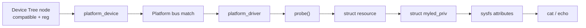

這張圖的讀法是：DTS 先讓 kernel 建立 `platform_device`，driver 用 `compatible` 配對後進入 `probe()`，`probe()` 再取得 resource、建立 private data，最後建立 sysfs 讓 user space 操作。

## 1. Project Structure

### Direct Observation

| 類別 | 檔案 | 角色 |
|---|---|---|
| Driver source | `driver/myled_ctrl.c` | Platform driver 主體，包含 register helper、probe/remove、sysfs、PM callback、OF match 與 module registration。 |
| Driver header | `driver/myled_ctrl.h` | 定義 register offset、bit mask、MMIO base/size、限制值與 `struct myled_priv`。 |
| Driver build | `driver/Makefile` | out-of-tree module build，產生 `myled_ctrl.ko`。 |
| Device Tree overlay | `dts/myled-fragment.dts` | 建立 `myled-controller@0d000000` 節點。 |
| DTB patch script | `dts/patch_dtb.sh` | dump QEMU base DTB、檢查 MMIO overlap、編譯 DTBO、合併 final DTB。 |
| Script wrapper | `scripts/02_patch_dtb.sh` | 從專案根目錄呼叫 DTB patch script。 |
| Kernel build script | `scripts/01_build_kernel.sh` | 下載並建置 Linux 6.6.30 ARM64 kernel。 |
| Driver build script | `scripts/03_build_driver.sh` | 呼叫 kernel build system 編譯 module。 |
| Rootfs build script | `scripts/04_build_rootfs.sh` | 建立 initramfs，檢查 BusyBox 架構與 `.ko` 是否存在。 |
| QEMU run script | `scripts/05_run_qemu.sh` | 使用 Image、DTB、initramfs 啟動 QEMU。 |
| Init script | `rootfs/overlay/init` | 掛載 proc/sys/dev，載入 module，執行測試，進入 shell。 |
| Test script | `rootfs/overlay/test_myled.sh` | 驗證 platform device、of_node、driver binding、sysfs attributes 與讀寫結果。 |

### Component Relationship

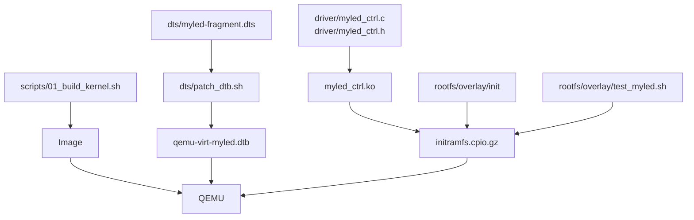

## 2. Device Tree Interface

### Direct Observation

`dts/myled-fragment.dts` 宣告：

| Property | 型態 | 值 | Driver 用途 |
|---|---|---|---|
| `compatible` | string | `myvendor,myled-v1` | 與 `myled_of_match[]` 配對，觸發 `probe()`。 |
| `myvendor,simulated` | boolean | present | 要求 driver 使用 simulated register bank。 |
| `reg` | address/size cells | `<0x0 0x0d000000 0x0 0x1000>` | 轉成 platform memory resource。 |
| `num-leds` | u32 | `<4>` | 存入 `priv->num_leds`，提供 `info` 輸出。 |
| `label` | string | `demo-rgb-led` | `probe()` 印出 log，方便確認節點。 |
| `default-brightness` | u32 | `<180>` | `myled_hw_init()` 初始化亮度。 |
| `status` | string | `okay` | 啟用節點。 |

### Address Cells

DTS 使用：

```dts
#address-cells = <2>;
#size-cells = <2>;
```

因此 `reg` 使用四個 cell 表示一組 64-bit address 與 64-bit size：

```text
<address-high address-low size-high size-low>
<0x0          0x0d000000 0x0       0x1000>
```

換算後：

```text
base = 0x000000000d000000
size = 0x0000000000001000
end  = 0x000000000d000fff
```

### MMIO Collision Check

`dts/patch_dtb.sh` 會在合併 overlay 前掃描 QEMU base DTB 的 `reg`。若 `myled` 目標範圍與既有 device 重疊，腳本會停止。

判斷邏輯：

```text
target_start <= existing_end && target_end >= existing_start
```

這是標準 interval overlap 檢查。

重要限制：

- 腳本檢查實際 device 的 `reg`。
- 不把 bus `ranges` 當成 device 已佔用範圍。

原因是 `ranges` 描述 bus address translation window，不等於某一個 driver 已經 claim 的 MMIO resource。

### MMIO 位址保護流程圖

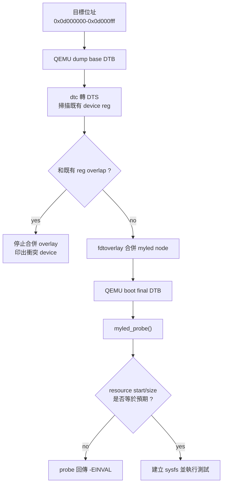

這裡有兩層檢查：

1. `dts/patch_dtb.sh` 在 build-time 檢查「會不會撞到 QEMU 既有 device」。
2. `myled_probe()` 在 run-time 檢查「driver 實際拿到的 resource 是否仍是 `0x0d000000/0x1000`」。

兩層都需要保留。第一層負責擋掉 address collision；第二層負責擋掉 DTS、driver 常數或測試腳本互相不一致。

## 2A. Device Tree 工具與 Overlay 選擇依據

這個專案沒有直接手改 QEMU 內建的整份 DTS，而是先 dump QEMU 產生的 base DTB，再用 overlay 合併 `myled` 節點。這樣做的重點是：base DTB 由實際 QEMU machine 產生，overlay 只負責加入本專案需要的 device。

### Device Tree 工具鏈圖

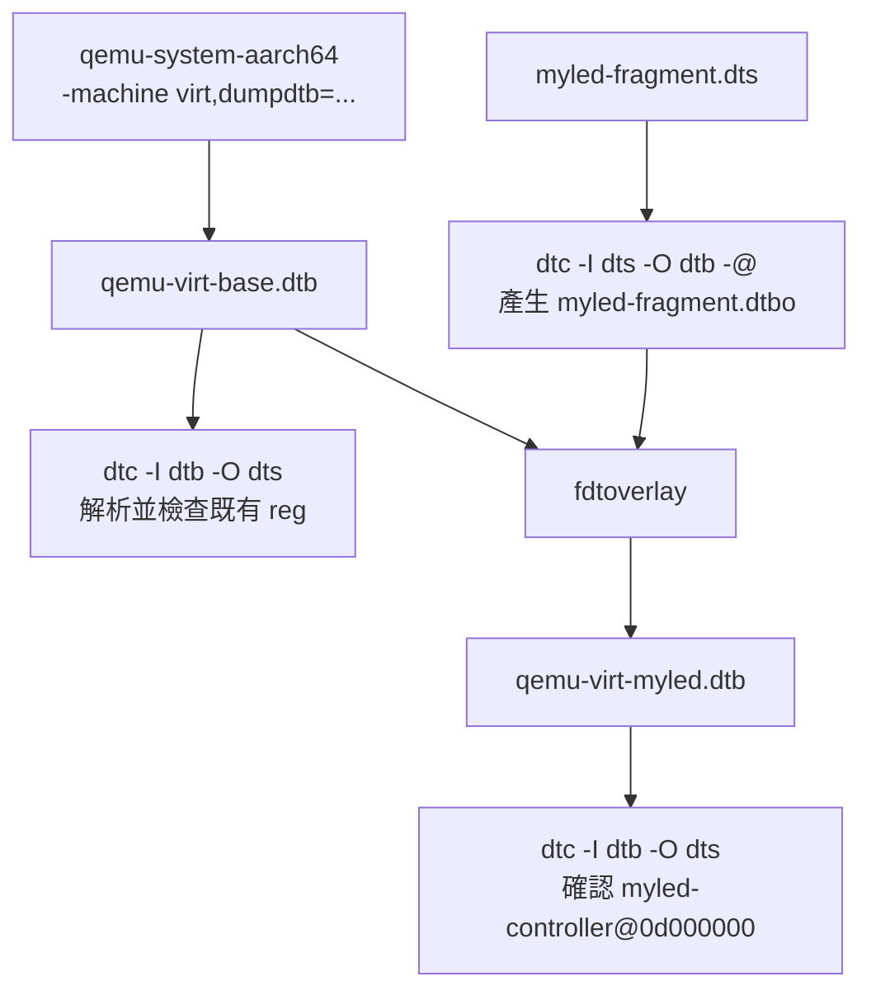

### `dtc`、`fdtoverlay`、直接改 DTS 怎麼選

| 作法 / 工具 | 用途 | 優點 | 限制 | 本專案選擇 |
|---|---|---|---|---|
| `qemu -machine virt,dumpdtb=...` | 讓 QEMU 輸出它實際會提供給 kernel 的 base DTB。 | 不需要猜 QEMU virt machine 目前有哪些 device。 | 輸出是 DTB，需要再用 `dtc` 轉成人可讀 DTS。 | 使用。 |
| `dtc -I dtb -O dts` | 把 DTB 反編譯成 DTS。 | 可掃描 `reg`，做位址重疊檢查。 | 反編譯結果適合檢查，不一定適合當手寫來源長期維護。 | 使用於檢查。 |
| `dtc -I dts -O dtb -@` | 把 overlay DTS 編成 DTBO，並保留 overlay 需要的符號資訊。 | 可把小片段 overlay 獨立管理。 | DTS 寫錯時會在這步失敗。 | 使用。 |
| `fdtoverlay` | 把 base DTB 和 DTBO 合併。 | 不必改整份 base DTS。 | overlay target 與格式要正確。 | 使用。 |
| 直接手改整份 base DTS | 把 QEMU base DTS 反編譯後手動插入 node 再編回 DTB。 | 直覺。 | 容易把 QEMU 產生的其他內容一起改壞，也不容易重現。 | 不使用。 |

### 為什麼用 Overlay

本專案只需要新增一個 `myled-controller@0d000000` 節點，沒有必要維護整份 QEMU base DTS。Overlay 的好處是變更範圍小，檢查點清楚：

```text
base DTB: QEMU 原本的硬體描述
overlay: 只描述 myled-controller
final DTB: base + myled
```

這樣如果 `myled` 出問題，範圍會集中在 overlay、位址檢查或 driver matching，不會和 QEMU base DTB 的其他內容混在一起。

## 3. Driver Constants and Register Map

### Direct Observation

`driver/myled_ctrl.h` 定義：

| Macro | 值 | 說明 |
|---|---:|---|
| `MYLED_REG_CTRL` | `0x00` | 控制暫存器 offset。 |
| `MYLED_REG_BRIGHTNESS` | `0x04` | 亮度暫存器 offset。 |
| `MYLED_REG_COLOR` | `0x08` | RGB 顏色暫存器 offset。 |
| `MYLED_REG_STATUS` | `0x0c` | 狀態暫存器 offset。 |
| `MYLED_REG_VERSION` | `0x10` | 版本暫存器 offset。 |
| `MYLED_MMIO_BASE` | `0x0d000000ULL` | 預期 MMIO base。 |
| `MYLED_MMIO_SIZE` | `0x1000U` | 預期 MMIO size。 |
| `MYLED_MAX_BRIGHTNESS` | `255U` | 亮度上限。 |
| `MYLED_HW_VERSION` | `0xAB01U` | 版本暫存器預期值。 |
| `MYLED_REG_SIZE` | `0x14U` | Driver 目前會使用的 register block 大小。 |
| `MYLED_SIM_REG_COUNT` | `8` | simulated register array 大小。 |

### Bit Fields

| Register | Bit macro | Bit | 說明 |
|---|---|---:|---|
| `CTRL` | `MYLED_CTRL_ENABLE` | 0 | 啟用 controller。 |
| `CTRL` | `MYLED_CTRL_BLINK` | 1 | 啟用 blink。 |
| `CTRL` | `MYLED_CTRL_PWM_AUTO` | 2 | 保留的 PWM auto bit。 |
| `STATUS` | `MYLED_STATUS_READY` | 0 | controller ready。 |
| `STATUS` | `MYLED_STATUS_FAULT` | 1 | fault 狀態。 |

### Register Access Model

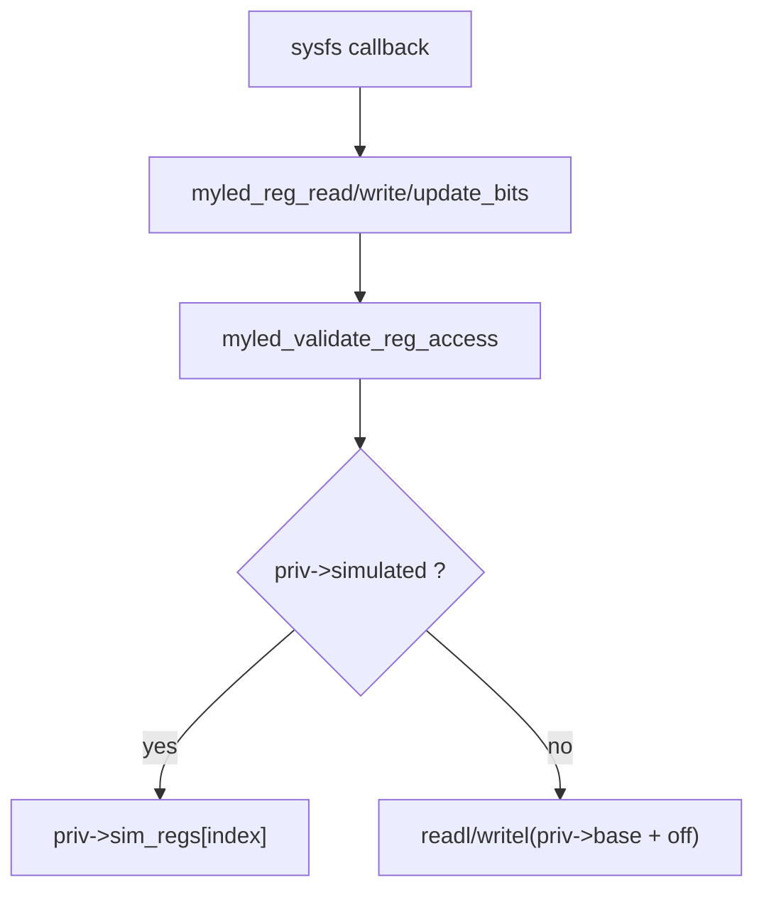

## 4. Main Data Structure

### Direct Observation

`struct myled_priv` 是每個 platform device 專用的 private data。

| 欄位 | 型態 | 用途 |
|---|---|---|
| `base` | `void __iomem *` | 非 simulated mode 的 MMIO virtual base。 |
| `mmio_size` | `resource_size_t` | DT `reg` 轉換後的 resource size。 |
| `dev` | `struct device *` | 對應 Linux device，用於 log 與 OF property 存取。 |
| `num_leds` | `u32` | 從 DT `num-leds` 讀到的 LED 數量。 |
| `simulated` | `bool` | 是否使用 shadow register bank。 |
| `sim_regs` | `u32[]` | simulated mode 的 register array。 |
| `lock` | `spinlock_t` | 保護 register read/write/update。 |

### Ownership

```text
platform_device
  -> struct device
      -> drvdata points to struct myled_priv
```

Driver 在 `probe()` 中呼叫：

```c
platform_set_drvdata(pdev, priv);
dev_set_drvdata(dev, priv);
```

sysfs callback 再用：

```c
dev_get_drvdata(dev);
```

取回同一份 `priv`。

## 5. Driver Registration API

### Direct Observation

| API / Macro | 類型 | 位置 | 功能 |
|---|---|---|---|
| `module_platform_driver(myled_driver)` | module helper macro | `driver/myled_ctrl.c` | 產生 module init/exit glue，註冊 platform driver。 |
| `struct platform_driver myled_driver` | dispatch table | `driver/myled_ctrl.c` | 指定 `.probe`、`.remove`、`.driver.name`、`.of_match_table`、`.pm`。 |
| `struct of_device_id myled_of_match[]` | OF match table | `driver/myled_ctrl.c` | 宣告支援的 `compatible` 字串。 |
| `MODULE_DEVICE_TABLE(of, myled_of_match)` | module metadata | `driver/myled_ctrl.c` | 匯出 OF module alias metadata。 |
| `MODULE_AUTHOR` | metadata | `driver/myled_ctrl.c` | module 作者資訊。 |
| `MODULE_DESCRIPTION` | metadata | `driver/myled_ctrl.c` | module 描述。 |
| `MODULE_LICENSE` | metadata | `driver/myled_ctrl.c` | license。 |
| `MODULE_VERSION` | metadata | `driver/myled_ctrl.c` | module 版本。 |

### Registration Flow

```text
insmod /myled_ctrl.ko
  -> module_platform_driver generated init
  -> platform_driver_register(&myled_driver)
  -> platform bus compares OF compatible
  -> myled_probe(pdev)
```

### `module_platform_driver()` 與手寫 `module_init()` / `module_exit()` 怎麼選

| 作法 | 寫法概念 | 適合情境 | 本專案選擇 |
|---|---|---|---|
| `module_platform_driver(myled_driver)` | macro 自動產生 init/exit，內容就是註冊與反註冊 platform driver。 | module 載入時只需要註冊一個 `platform_driver`。 | 本專案使用。 |
| `module_init()` + `module_exit()` | 自己寫 init/exit function。 | module 載入時還要做額外初始化，例如註冊多種 bus driver、配置全域資源。 | 本專案不需要。 |

本專案選 `module_platform_driver()` 的原因很單純：module 載入時只有一件事，就是把 `myled_driver` 註冊給 platform bus。若手寫 `module_init()`，程式碼會變長，但不會讓流程更清楚。

概念上它等同於：

```text
module init:
  platform_driver_register(&myled_driver)

module exit:
  platform_driver_unregister(&myled_driver)
```

## 5A. Driver Matching API 與選擇依據

Platform driver 的配對方式不只一種。這個專案使用 Device Tree 的 `compatible`，但要理解為什麼這樣選，需要把幾種常見配對方式放在一起看。

### Device 與 Driver 配對流程圖

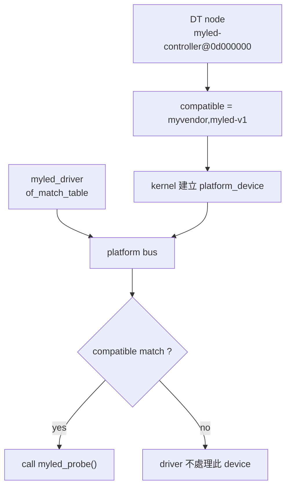

### `of_match_table`、`id_table`、driver `.name` 怎麼選

| 配對方式 | 主要欄位 | 適合情境 | 優點 | 限制 | 本專案選擇 |
|---|---|---|---|---|---|
| Device Tree match | `.driver.of_match_table` + `compatible` | 由 DTB 描述硬體的 ARM/SoC 平台。 | 硬體資訊留在 DTS，driver 不需要寫死 board 細節。 | 需要有正確 DT node。 | 使用。 |
| Platform ID match | `.id_table` + `platform_device_id` | 非 DT 平台，或舊式 board code 建立 platform device。 | 可支援沒有 DT 的平台。 | 本專案 device 由 DTS overlay 建立，不需要。 | 不使用。 |
| Driver name match | `.driver.name` | 非常簡單或舊式 platform device 名稱配對。 | 最少資料。 | 容易和硬體版本、vendor 資訊混在一起，不利於描述硬體差異。 | 不依賴。 |

選擇依據：

- 本專案的硬體來源是 `dts/myled-fragment.dts`，所以用 `compatible` 最直接。
- `compatible = "myvendor,myled-v1"` 可以表達 vendor 與硬體版本，比只靠 `.driver.name = "myled_ctrl"` 清楚。
- 未來如果硬體有 v2，可以在 `of_match_table` 加 `"myvendor,myled-v2"`，再依 match data 做差異處理。

### `MODULE_DEVICE_TABLE()` 的作用

`MODULE_DEVICE_TABLE(of, myled_of_match)` 不是用來執行配對的主邏輯；真正的配對由 driver core 讀 `.of_match_table` 完成。這個 macro 的作用是把 match table 資訊輸出到 module metadata。

| 寫法 | 結果 |
|---|---|
| 有 `MODULE_DEVICE_TABLE(of, ...)` | module 會帶 OF alias metadata，外部 module loader 比較容易根據 device alias 找到模組。 |
| 沒有 `MODULE_DEVICE_TABLE(of, ...)` | 手動 `insmod` 仍可能成功，但少了可供自動載入使用的 alias metadata。 |

本專案 rootfs 是手動 `insmod /myled_ctrl.ko`，所以即使沒有自動載入機制也能跑。不過保留 `MODULE_DEVICE_TABLE()` 是比較完整的 driver 寫法，也讓 module metadata 和 OF match table 保持一致。

## 6. Probe Path API Inventory

### Direct Observation

| API | 類型 | 在本專案中的用途 | 錯誤處理 |
|---|---|---|---|
| `devm_kzalloc()` | managed allocation | 配置並清零 `struct myled_priv`。 | 失敗回傳 `-ENOMEM`，`probe()` 中止。 |
| `spin_lock_init()` | lock init | 初始化 `priv->lock`。 | 無回傳值。 |
| `of_property_read_u32()` | OF property read | 讀取 `num-leds` 與 `default-brightness`。 | `num-leds` 缺失時預設 1；`default-brightness` 缺失時預設 128。 |
| `of_property_read_string()` | OF property read | 讀取 `label` 供 log 使用。 | 缺失不影響 probe。 |
| `of_property_read_bool()` | OF property read | 讀取 `myvendor,simulated`。 | boolean property，不存在即 false。 |
| `platform_get_resource()` | platform resource | 取得 memory resource。 | 缺失回傳 `-ENODEV`。 |
| `resource_size()` | resource helper | 計算 MMIO size。 | 無直接錯誤碼。 |
| `devm_ioremap_resource()` | managed MMIO map | 非 simulated mode 時映射 MMIO。 | 失敗時改用 simulated mode。 |
| `platform_set_drvdata()` | state binding | 將 `priv` 綁到 `pdev`。 | 無回傳值。 |
| `dev_set_drvdata()` | state binding | 將 `priv` 綁到 `dev`。 | 無回傳值。 |
| `sysfs_create_group()` | sysfs registration | 建立 `myled/` attribute group。 | 失敗會呼叫 `myled_hw_shutdown()` 並回傳錯誤。 |
| `pm_runtime_enable()` | PM framework | 啟用 runtime PM 狀態。 | 無回傳值。 |

### Probe Error Policy

本專案的 `probe()` 對錯誤分成兩類：

| 類型 | 例子 | 處理方式 |
|---|---|---|
| Fatal error | 缺少 MEM resource、MMIO base/size 不符合預期、sysfs 建立失敗 | 直接回傳錯誤，driver 不完成 bind。 |
| Non-fatal fallback | `num-leds` 缺失、`default-brightness` 缺失、非 simulated mode ioremap 失敗 | 使用預設值或切換 simulated mode。 |

## 6A. Probe Path API 與選擇依據

`probe()` 是 driver 最重要的初始化入口。可以把它想成「kernel 已經找到可能相容的 device，現在 driver 要確認資源能不能用，並把自己的狀態建立起來」。

### Probe 重點流程圖

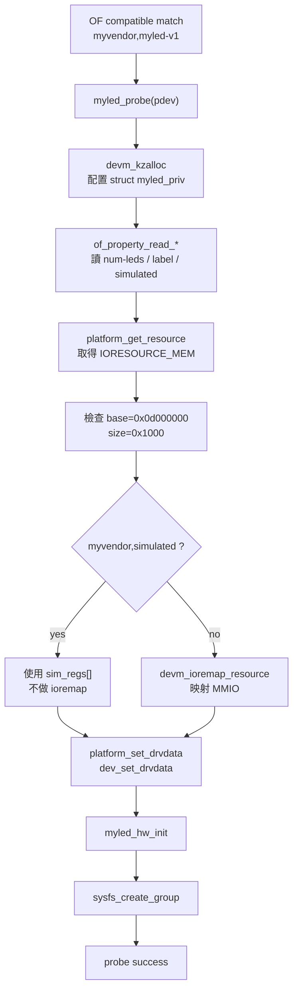

### `devm_kzalloc()`、`kzalloc()`、`kmalloc()` 怎麼選

| API | 會清零 | 生命週期 | 適合情境 | 本專案是否適合 |
|---|---|---|---|---|
| `kmalloc()` | 否 | 手動 `kfree()` | 需要自己初始化每個欄位，或資料不需要清零。 | 不優先，因為 `struct myled_priv` 有 bool、指標、register array，清零比較安全。 |
| `kzalloc()` | 是 | 手動 `kfree()` | 一般 kernel 配置，需要自己控制釋放時機。 | 可用，但 `probe()` 失敗路徑要自己清。 |
| `devm_kzalloc()` | 是 | 跟著 `struct device` | driver private data、resource 與 device 生命週期一致。 | 本專案選它，因為 `priv` 本來就屬於這個 platform device。 |

選擇依據：

- `struct myled_priv` 的生命週期和 device 相同。
- `probe()` 中途可能因為 resource、sysfs、初始化失敗而回傳錯誤。
- 用 `devm_kzalloc()` 可以減少「某個錯誤分支忘記 `kfree()`」的風險。

### `platform_get_resource()` 與相關 API

| API | 取得的資源 | 常見用途 | 本專案選擇原因 |
|---|---|---|---|
| `platform_get_resource(pdev, IORESOURCE_MEM, 0)` | MMIO memory resource | 從 DT `reg` 取得硬體位址範圍。 | 需要先拿到 `res->start` 與 `resource_size(res)`，確認固定位址沒有漂移。 |
| `platform_get_irq(pdev, 0)` | IRQ number | 從 DT `interrupts` 取得中斷號。 | 本專案目前沒有 IRQ，所以不使用。 |
| `platform_get_resource_byname()` | 有名稱的 resource | DTS 或 platform data 有多組 resource，需要靠名字區分。 | 本專案只有一組 MEM resource，不需要用 name。 |

選擇依據：

- 本專案最重視的是 `reg` 是否真的等於 `0x0d000000/0x1000`。
- `platform_get_resource()` 會先把 resource 取出來，driver 才能在映射前做 base/size 檢查。
- 若未來有多段 MMIO，例如 `ctrl` 與 `pwm` 分開，才比較需要 `platform_get_resource_byname()`。

### `devm_ioremap_resource()`、`devm_platform_ioremap_resource()`、`ioremap()` 怎麼選

| API | 做了什麼 | 優點 | 限制或成本 | 本專案選擇 |
|---|---|---|---|---|
| `ioremap()` | 只把 physical address 映射成 kernel virtual address | 彈性高。 | 需要自己 request region、檢查錯誤、在清理時 `iounmap()`。 | 不選，因為 demo driver 不需要手動管理這些細節。 |
| `devm_ioremap_resource()` | 檢查 resource、request region、ioremap，並用 devm 管理 | 適合 driver probe path，錯誤處理較集中。 | 需要先自己取得 `struct resource *`。 | 本專案選它，因為要先檢查 base/size，且只在非 simulated mode 使用。 |
| `devm_platform_ioremap_resource()` | 取 resource 與 ioremap 合在一起 | 程式碼較短。 | 不方便在 ioremap 前檢查 `res->start` 與 size，也不適合本專案 simulated mode 的分支。 | 本專案不選，因為位址驗證是必要步驟。 |

本專案的順序故意拆開：

```text
platform_get_resource()
  -> resource_size()
  -> 檢查 start/size
  -> simulated ? skip ioremap : devm_ioremap_resource()
```

這樣寫比較長，但錯誤比較早被擋下來，也比較容易從 log 看出是哪一段出問題。

### `of_property_read_*()` 與 `device_property_read_*()` 怎麼選

| API | 面向 | 適合情境 | 本專案選擇 |
|---|---|---|---|
| `of_property_read_u32/string/bool()` | Device Tree / Open Firmware | driver 明確依賴 DT `of_node`。 | 本專案使用，因為 device 由 DTS overlay 建立。 |
| `device_property_read_u32/string/bool()` | Firmware property abstraction | 同一個 driver 想同時支援 OF、ACPI 或 software node。 | 本專案暫時不需要，因為目標環境固定是 QEMU + DTB。 |

選擇依據：

- 本專案的硬體描述來源就是 `dts/myled-fragment.dts`。
- `compatible`、`reg`、`myvendor,simulated` 都是 Device Tree 語境。
- 使用 `of_property_read_*()` 可讓讀者直接對回 DTS 屬性。

### `platform_set_drvdata()`、`dev_set_drvdata()`、`dev_get_drvdata()` 怎麼看

這組 API 的核心概念是：不要用全域變數記錄 device 狀態，而是把 `priv` 掛在 device 上。

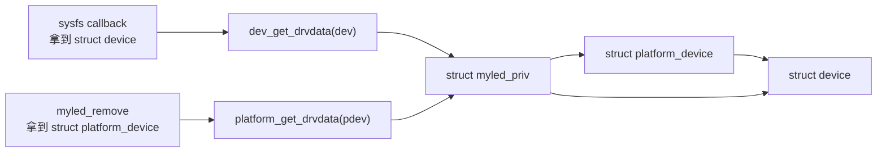

| API | 使用位置 | 原因 |
|---|---|---|
| `platform_set_drvdata(pdev, priv)` | `probe()` | 讓 `remove()` 可以用 `platform_get_drvdata()` 找回 `priv`。 |
| `dev_set_drvdata(dev, priv)` | `probe()` | 讓 sysfs callback 可以用 `dev_get_drvdata()` 找回 `priv`。 |
| `dev_get_drvdata(dev)` | sysfs show/store | sysfs callback 參數是 `struct device *`，不是 `struct platform_device *`。 |

## 7. Register Helper API

### Direct Observation

| Helper | 功能 | 防呆 |
|---|---|---|
| `myled_validate_reg_access()` | 檢查 register offset 是否可存取。 | 檢查 `priv`、32-bit 對齊、register block 範圍、sim array 範圍、MMIO mapping 與 mapped size。 |
| `myled_reg_read()` | 讀 register。 | 先 validate，再以 spinlock 保護讀取。 |
| `myled_reg_write()` | 寫 register。 | 先 validate，再以 spinlock 保護寫入。 |
| `myled_reg_update_bits()` | 在同一個 lock 內完成 read-modify-write。 | 避免 `enable` 與 `blink` 等 bit 操作互相覆蓋。 |
| `myled_reg_set_bits()` | 設定 bit。 | 呼叫 `myled_reg_update_bits(..., true)`。 |
| `myled_reg_clr_bits()` | 清除 bit。 | 呼叫 `myled_reg_update_bits(..., false)`。 |

### Why `myled_reg_update_bits()` Matters

錯誤範例概念：

```text
Thread A: read CTRL = 0
Thread B: read CTRL = 0
Thread A: set ENABLE, write CTRL = 1
Thread B: set BLINK,  write CTRL = 2
```

最後 `ENABLE` 被蓋掉，這就是 lost update。

修正後：

```text
lock
  read CTRL
  modify bit
  write CTRL
unlock
```

因此同一時間只有一個 writer 可以完成整個 read-modify-write。

### `readl()` / `writel()`、`ioread32()` / `iowrite32()`、直接解參考怎麼選

| 作法 | 說明 | 優點 | 風險 | 本專案選擇 |
|---|---|---|---|---|
| 直接讀寫指標，例如 `*(u32 *)addr` | 把 MMIO 當一般記憶體 | 看起來簡單 | 不符合 kernel MMIO 存取習慣，可能缺少必要順序保證，也容易被編譯器最佳化影響。 | 不使用。 |
| `readl()` / `writel()` | 常見 MMIO 32-bit register accessor | 語意明確，適合 `void __iomem *` base + offset。 | 需要先正確 ioremap。 | 本專案非 simulated mode 使用這組。 |
| `ioread32()` / `iowrite32()` | 較通用的 I/O accessor | 可用於更抽象的 I/O memory 或 port I/O 情境。 | 對本專案單純 MMIO register block 來說沒有明顯必要。 | 不使用。 |

選擇依據：

- `priv->base` 型態是 `void __iomem *`，代表它不是一般 RAM 指標。
- 本專案 register 都是 32-bit offset，因此 `readl()` / `writel()` 語意剛好對應。
- simulated mode 不呼叫 `readl()` / `writel()`，而是讀寫 `sim_regs[]`，避免碰 QEMU 中不存在的硬體。

### Register Update 功能圖

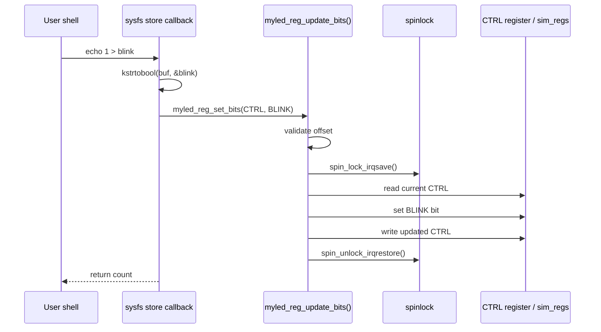

## 8. sysfs API Inventory

### Direct Observation

| Attribute | Macro | 權限語意 | show/store | 對應 register |
|---|---|---|---|---|
| `enable` | `DEVICE_ATTR_RW(enable)` | read/write | `enable_show()` / `enable_store()` | `CTRL` bit 0 |
| `brightness` | `DEVICE_ATTR_RW(brightness)` | read/write | `brightness_show()` / `brightness_store()` | `BRIGHTNESS` |
| `color` | `DEVICE_ATTR_RW(color)` | read/write | `color_show()` / `color_store()` | `COLOR` |
| `blink` | `DEVICE_ATTR_RW(blink)` | read/write | `blink_show()` / `blink_store()` | `CTRL` bit 1 |
| `status` | `DEVICE_ATTR_RO(status)` | read only | `status_show()` | `STATUS` |
| `info` | `DEVICE_ATTR_RO(info)` | read only | `info_show()` | 多個 register |

`myled_attr_group` 設定：

```c
static const struct attribute_group myled_attr_group = {
    .name = "myled",
    .attrs = myled_attrs,
};
```

因此 sysfs path 是：

```text
/sys/bus/platform/devices/<device-name>/myled/
```

在目前 QEMU 執行結果中，device name 是：

```text
d000000.myled-controller
```

完整 path：

```text
/sys/bus/platform/devices/d000000.myled-controller/myled/
```

### Input Parsing

| Attribute | Parser | Base | 合法值 |
|---|---|---:|---|
| `enable` | `kstrtobool()` | boolean | `0/1`、`true/false` 等 kernel bool parser 支援格式。 |
| `brightness` | `kstrtou32()` | 10 | `0..255`。 |
| `color` | `kstrtou32()` | 16 | 十六進位，driver 只保留低 24 bits。 |
| `blink` | `kstrtobool()` | boolean | `0/1`、`true/false` 等 kernel bool parser 支援格式。 |

### Runtime Example

```sh
cd /sys/bus/platform/devices/d000000.myled-controller/myled

echo 1 > enable
cat enable

echo 200 > brightness
cat brightness

echo ff3300 > color
cat color

echo 1 > blink
cat blink

cat status
cat info
```

## 8A. sysfs API 與選擇依據

sysfs 的設計重點是「一個檔案代表一個簡單屬性」。本專案的 `enable`、`brightness`、`color`、`blink`、`status`、`info` 都符合這個模型。

### sysfs 寫入如何運作

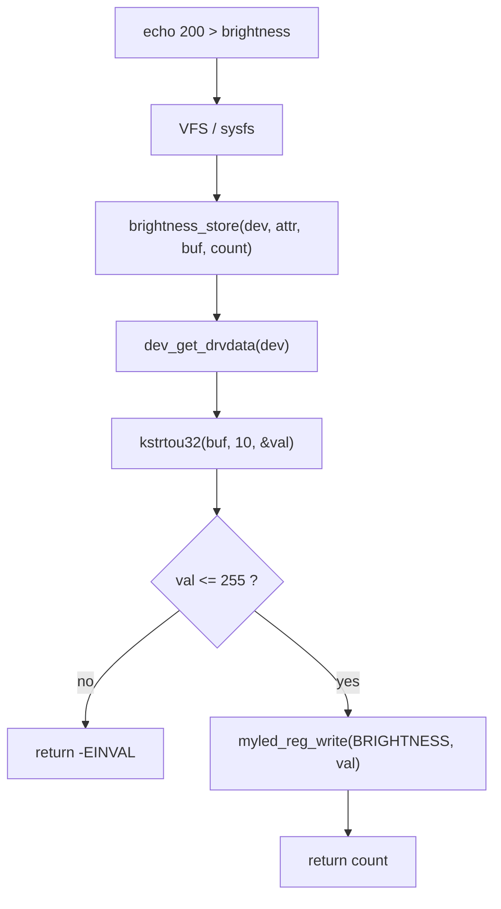

### `DEVICE_ATTR_RW()`、`DEVICE_ATTR_RO()`、`DEVICE_ATTR()` 怎麼選

| Macro | 會產生什麼 | 適合情境 | 本專案使用 |
|---|---|---|---|
| `DEVICE_ATTR_RW(name)` | `name_show()` 與 `name_store()`，read/write attribute | 檔名、show/store 函式名稱都照固定慣例。 | `enable`、`brightness`、`color`、`blink`。 |
| `DEVICE_ATTR_RO(name)` | `name_show()`，read-only attribute | 狀態只允許讀，不允許 user space 寫。 | `status`、`info`。 |
| `DEVICE_ATTR_WO(name)` | `name_store()`，write-only attribute | 觸發型控制，例如 reset、clear fault。 | 本專案沒有 write-only 行為。 |
| `DEVICE_ATTR(name, mode, show, store)` | 自訂權限與函式名稱 | 需要特殊 permission 或函式不照命名慣例。 | 本專案不需要。 |

選擇依據：

- 本專案 attribute 命名簡單，使用 `DEVICE_ATTR_RW()` / `DEVICE_ATTR_RO()` 可減少重複樣板。
- `status` 與 `info` 是查詢資訊，不應讓 user space 寫入，所以用 RO。
- `enable`、`brightness`、`color`、`blink` 是控制項，需要 readback，所以用 RW。

### `sysfs_create_group()` 與 `device_create_file()` 怎麼選

| API | 建立方式 | 優點 | 本專案選擇 |
|---|---|---|---|
| `device_create_file()` | 一次建立一個 attribute | 少量單一檔案時簡單。 | 不選，因為本專案有多個相關 attribute。 |
| `sysfs_create_group()` | 一次建立一組 attribute，可放在子目錄 | `enable`、`brightness` 等檔案可以集中在 `myled/` 下。 | 本專案選它。 |
| `debugfs_create_*()` | 建立 debugfs 節點 | 適合除錯，不適合穩定 user-facing 介面。 | 不選，因為測試腳本需要穩定 sysfs path。 |
| `miscdevice` / char device | 建立 `/dev/...` 節點 | 適合大量資料、ioctl、poll、mmap 等需求。 | 不選，因為本專案只是簡單屬性控制。 |

本專案使用 group 後，路徑會比較清楚：

```text
/sys/bus/platform/devices/d000000.myled-controller/myled/enable
/sys/bus/platform/devices/d000000.myled-controller/myled/brightness
/sys/bus/platform/devices/d000000.myled-controller/myled/color
```

### `sysfs_emit()`、`sprintf()`、`snprintf()` 怎麼選

| API | 說明 | 在 sysfs show 中的選擇 |
|---|---|---|
| `sprintf()` | 不知道 buffer 剩餘大小，容易寫過頭。 | 不建議。 |
| `snprintf()` | 可限制長度，但每個 sysfs show 都要自己管理 size。 | 可用，但不是最貼近 sysfs 的寫法。 |
| `sysfs_emit()` | 專為 sysfs show callback 準備。 | 本專案使用。 |

選擇依據：

- sysfs show callback 收到的 `buf` 有固定語境。
- `sysfs_emit()` 讓輸出格式更符合 sysfs 的預期。
- `info_show()` 會輸出多行狀態，更適合用 `sysfs_emit()` 集中格式化。

### `kstrtou32()`、`kstrtobool()` 與其他 parsing 寫法

| API / 作法 | 適合輸入 | 優點 | 本專案使用 |
|---|---|---|---|
| `kstrtobool()` | boolean | 接受常見 bool 表示，錯誤時回傳錯誤碼。 | `enable`、`blink`。 |
| `kstrtou32()` | unsigned 32-bit integer | 可指定 base，能檢查轉換錯誤。 | `brightness`、`color`。 |
| `simple_strtoul()` | 舊式數字解析 | 寫法短。 | 不使用，錯誤處理不如 `kstrto*` 清楚。 |
| `sscanf()` | 複雜格式 | 適合多欄位輸入。 | 不使用，本專案每個 attribute 只收單一值。 |

選擇依據：

- sysfs store callback 要能把錯誤回傳給 user space。
- `brightness` 用 10 進位，因為人類操作亮度時通常輸入 `0..255`。
- `color` 用 16 進位，因為 RGB 常用 `RRGGBB` 表示。

## 9. Lifecycle and Cleanup

### Direct Observation

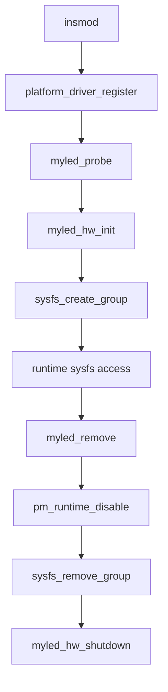

### `myled_hw_init()`

主要工作：

1. simulated mode 時呼叫 `myled_seed_sim_regs()`。
2. 讀取 `VERSION` register。
3. 若非 simulated mode 讀不到正確版本，切換 simulated mode。
4. 讀取 `default-brightness`，缺失時使用 128。
5. 將 brightness clamp 到 `0..255`。
6. 寫入 `BRIGHTNESS`。
7. 設定 `CTRL.ENABLE`。
8. 印出初始化完成 log。

### `myled_hw_shutdown()`

主要工作：

1. 清除 `CTRL.ENABLE`、`CTRL.BLINK`、`CTRL.PWM_AUTO`。
2. 將 `BRIGHTNESS` 寫成 0。
3. 若 register helper 回傳錯誤，印出 warning。

### `myled_remove()`

清理順序：

1. `pm_runtime_disable(dev)`。
2. `sysfs_remove_group(&dev->kobj, &myled_attr_group)`。
3. `myled_hw_shutdown(priv)`。

## 10. Power Management API

### Direct Observation

| API / Macro | 用途 |
|---|---|
| `pm_runtime_enable()` | 在 `probe()` 成功後啟用 runtime PM framework 狀態。 |
| `pm_runtime_disable()` | 在 `remove()` 時關閉 runtime PM framework 狀態。 |
| `SET_SYSTEM_SLEEP_PM_OPS(myled_suspend, myled_resume)` | 註冊 system sleep suspend/resume callback。 |
| `__maybe_unused` | 避免特定 kernel config 下 callback 未使用造成 warning。 |

### System Sleep Callbacks

| Callback | 行為 |
|---|---|
| `myled_suspend()` | 清除 `CTRL.ENABLE`。 |
| `myled_resume()` | 設定 `CTRL.ENABLE`。 |

### Conservative Inference

目前程式碼沒有實作 `.runtime_suspend` 或 `.runtime_resume`。因此 `pm_runtime_enable()` 目前主要保留 runtime PM 的整合點，還不是完整的 runtime suspend/resume 實作。

若未來要完整支援 runtime PM，應補上：

- `runtime_suspend`
- `runtime_resume`
- usage count 管理
- idle policy

## 10A. PM API 與選擇依據

Power Management 容易混淆，因為 Linux kernel 裡至少有兩種常見層級：system sleep 與 runtime PM。

### System Sleep 與 Runtime PM 差異

| 類型 | 觸發時機 | 常見 callback | 本專案狀態 |
|---|---|---|---|
| System sleep PM | 整個系統要 suspend/resume，例如休眠。 | `suspend()`、`resume()` | 有實作，透過 `SET_SYSTEM_SLEEP_PM_OPS()` 註冊。 |
| Runtime PM | 單一 device 閒置時省電，不必等整台機器休眠。 | `runtime_suspend()`、`runtime_resume()`、`runtime_idle()` | 尚未實作 callback，目前只有 `pm_runtime_enable()` / `pm_runtime_disable()`。 |

### PM 流程圖

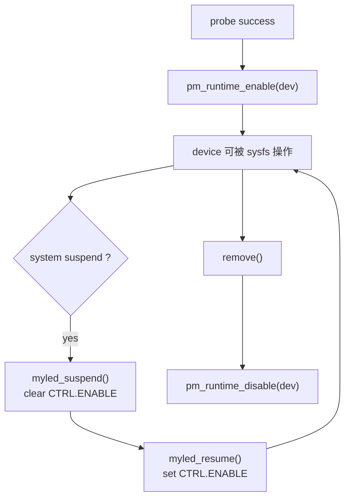

### `SET_SYSTEM_SLEEP_PM_OPS()` 與手寫 `dev_pm_ops` 怎麼看

| 作法 | 說明 | 適合情境 | 本專案選擇 |
|---|---|---|---|
| `SET_SYSTEM_SLEEP_PM_OPS(suspend, resume)` | 用 macro 填入 system sleep callback。 | 只需要 system suspend/resume。 | 本專案使用。 |
| 手動填 `.suspend` / `.resume` / `.freeze` 等欄位 | 可細分更多 sleep state。 | 需要支援 freeze、thaw、poweroff、restore 等進階狀態。 | 本專案不需要。 |
| runtime PM callbacks | `.runtime_suspend` / `.runtime_resume` | device 閒置時自動省電。 | 尚未實作。 |

選擇依據：

- 本專案目前的 PM 行為很小：suspend 時關閉 enable bit，resume 時打開。
- 這個行為符合 system sleep callback，不需要更複雜的 sleep state。
- runtime PM 要處理 usage count 與 idle policy；目前 sysfs demo 還沒有這個需求。

### `__maybe_unused` 為什麼會出現

某些 kernel config 沒有啟用對應 PM 選項時，PM callback 可能不會被 macro 使用。`__maybe_unused` 的作用是告訴編譯器：這個函式在某些 config 下沒有被引用是可接受的。

| 作法 | 結果 |
|---|---|
| 加 `__maybe_unused` | 減少不同 config 下的 unused warning。 |
| 不加 | 在某些 config 組合下可能出現未使用函式 warning。 |

## 11. Build and Boot Scripts API

### `scripts/01_build_kernel.sh`

Direct Observation：

- 設定 `ARCH=arm64`。
- 設定 `CROSS_COMPILE=aarch64-linux-gnu-`。
- 下載 Linux 6.6.30。
- 執行 `make defconfig`。
- 執行 `make -j$(nproc) Image modules`。
- 偵測並處理 clock skew。

關鍵 robustness：

| 機制 | 目的 |
|---|---|
| `set -euo pipefail` | 遇到未處理錯誤時停止。 |
| `normalize_future_timestamps()` | 修正未來時間檔案，避免 make clock skew。 |
| `run_make_checked()` | make 失敗時印出完整 log；clock skew 時重試。 |

### `dts/patch_dtb.sh`

Direct Observation：

- 用 `qemu-system-aarch64 -machine virt,dumpdtb=...` 產生 base DTB。
- 用 `dtc` 解析 base DTB。
- 檢查 myled 目標 MMIO range 是否與既有 `reg` 重疊。
- 用 `dtc -@` 編譯 overlay。
- 用 `fdtoverlay` 合併 final DTB。
- 用 `grep` 驗證 final DTB 中存在 `myled-controller@0d000000`。

### `scripts/04_build_rootfs.sh`

Direct Observation：

- 檢查 ARM64 BusyBox。
- 檢查 `rootfs/overlay/myled_ctrl.ko` 存在。
- 建立必要目錄。
- 建立 BusyBox applet symlink。
- 複製 `/init`、`/test_myled.sh`、`/myled_ctrl.ko`。
- 用 `cpio --quiet -H newc -o | gzip -9` 打包 initramfs。

### `scripts/05_run_qemu.sh`

Direct Observation：

- 啟動 `qemu-system-aarch64`。
- 使用 ARM64 `virt` machine。
- 載入 kernel Image、DTB、initramfs。
- kernel command line 使用 `console=ttyAMA0`，讓輸出走 QEMU serial console。

## 12. Rootfs Runtime Scripts

### `/init`

Direct Observation：

開機後 `/init` 會：

1. 掛載 `proc`。
2. 掛載 `sysfs`。
3. 掛載 `devtmpfs`。
4. 載入 `/myled_ctrl.ko`。
5. 執行 `/test_myled.sh`。
6. 進入 shell。

TTY robustness：

- 優先使用 `setsid cttyhack sh`。
- 如果環境不支援，再退回一般 shell。

### `/test_myled.sh`

Direct Observation：

測試內容：

| 檢查 | 目的 |
|---|---|
| 搜尋 modalias 含 `myvendor,myled-v1` 的 platform device | 確認 compatible match 的 device 存在。 |
| 接受 `0d000000.myled-controller` 與 `d000000.myled-controller` | 避免 leading zero 命名差異造成誤判。 |
| 檢查 `of_node` 指向 `myled-controller@0d000000` | 確認真實 DT node 名稱正確。 |
| 檢查 `driver` symlink | 確認 driver 已 bind。 |
| 檢查 `myled/` sysfs directory | 確認 sysfs group 建立成功。 |
| 檢查 `info enable brightness color blink status` | 確認 attributes 存在。 |
| 寫入再讀回 `brightness`、`color`、`blink`、`enable` | 確認 store/show path 正常。 |

## 13. Error Handling Map

### Driver Error Handling

| 位置 | 條件 | 回傳 / 行為 | 意義 |
|---|---|---|---|
| `devm_kzalloc()` | 配置失敗 | `-ENOMEM` | 無 private data，不能繼續。 |
| `of_property_read_u32(num-leds)` | property 缺失 | default `1` | 非致命，使用保守預設值。 |
| `platform_get_resource()` | 找不到 MEM resource | `-ENODEV` | 沒有 MMIO resource，driver 不應 bind。 |
| resource base/size check | 不符合 `0x0d000000/0x1000` | `-EINVAL` | 防止 DTS 與 driver 預期不一致。 |
| `devm_ioremap_resource()` | 映射失敗 | fallback simulated mode | 非 simulated mode 可退回 shadow register。 |
| `myled_hw_init()` | register init 失敗 | 回傳錯誤 | probe 中止。 |
| `sysfs_create_group()` | 建立失敗 | shutdown 後回傳錯誤 | 避免半初始化 device 留在系統中。 |
| sysfs parser | 使用者輸入非法 | 回傳 parser 錯誤或 `-EINVAL` | user space 可感知失敗。 |

### Script Error Handling

| Script | 防呆 |
|---|---|
| `01_build_kernel.sh` | clock skew 偵測、make 失敗印 log。 |
| `02_patch_dtb.sh` | 檢查 kernel image、呼叫 DTB patch script。 |
| `dts/patch_dtb.sh` | base DTB 必須產生成功、MMIO 不可 overlap、merged node 必須存在。 |
| `03_build_driver.sh` | 使用 kernel build system，失敗即停止。 |
| `04_build_rootfs.sh` | BusyBox 架構檢查、`.ko` 檔案檢查。 |
| `05_run_qemu.sh` | 啟動前檢查 kernel、DTB、initramfs 是否存在。 |
| `06_clean.sh` | 支援 dry-run，降低誤刪風險。 |

## 13A. 錯誤碼與 Logging API

Kernel driver 通常不會用 exception，而是用負的 error code 回報失敗。log 則用 `dev_*()` 系列，因為它會自動帶出 device 名稱，比單純 `pr_info()` 更容易追到是哪個 device 出事。

### 常見錯誤碼怎麼選

| 錯誤碼 | 常見意義 | 本專案使用情境 | 選擇依據 |
|---|---|---|---|
| `-ENOMEM` | 記憶體配置失敗 | `devm_kzalloc()` 失敗 | 沒有 private data，driver 無法繼續初始化。 |
| `-ENODEV` | 裝置不存在或缺必要裝置資訊 | 找不到 MEM resource | 沒有 `reg` 轉成的 resource，就不能代表這個 device 可被 driver 控制。 |
| `-EINVAL` | 參數或資料不合法 | MMIO base/size 不符、brightness 超過 255 | 有資料，但內容不符合 driver 要求。 |
| `-ERANGE` | 數值超出可接受範圍 | register offset 超出 mapped MMIO resource | 和 `-EINVAL` 接近，但更明確表示範圍問題。 |

### `IS_ERR()`、`PTR_ERR()`、`IS_ERR_OR_NULL()` 怎麼看

有些 kernel API 失敗時會回傳 encoded error pointer。

| API / Macro | 用途 | 適合情境 | 本專案關係 |
|---|---|---|---|
| `IS_ERR(ptr)` | 判斷 pointer 是否是 error pointer。 | API 文件說明失敗會回傳 `ERR_PTR(...)`。 | `devm_ioremap_resource()` 後使用。 |
| `PTR_ERR(ptr)` | 從 error pointer 取出負錯誤碼。 | 需要把錯誤原因記錄或回傳。 | ioremap 失敗時取出 `ret`。 |
| `IS_ERR_OR_NULL(ptr)` | 同時接受 error pointer 與 NULL。 | API 可能回傳 NULL 或 ERR_PTR。 | 本專案沒有需要，因為 `devm_ioremap_resource()` 的失敗語意是 ERR_PTR。 |

### Logging API 比較

| API | 會帶 device context | 適合情境 | 本專案使用方式 |
|---|---|---|---|
| `dev_err(dev, ...)` | 是 | 會造成 probe 失敗或功能不可用的錯誤。 | 缺 MEM resource、MMIO 不符合預期、sysfs 建立失敗。 |
| `dev_warn(dev, ...)` | 是 | 可 fallback，但需要提醒的狀況。 | `num-leds` 缺失時使用預設值、shutdown 失敗警告。 |
| `dev_info(dev, ...)` | 是 | 重要狀態，例如 probe 成功、MMIO range、simulated mode。 | 開機 log 方便確認流程。 |
| `dev_dbg(dev, ...)` | 是 | 開發除錯訊息，通常需要 debug config 或 dynamic debug 才明顯。 | sysfs 寫入成功時的細節。 |
| `pr_info(...)` | 否 | 和特定 device 無關的全域訊息。 | 本 driver 主要和 device 有關，所以不優先用。 |

### Logging 選擇圖

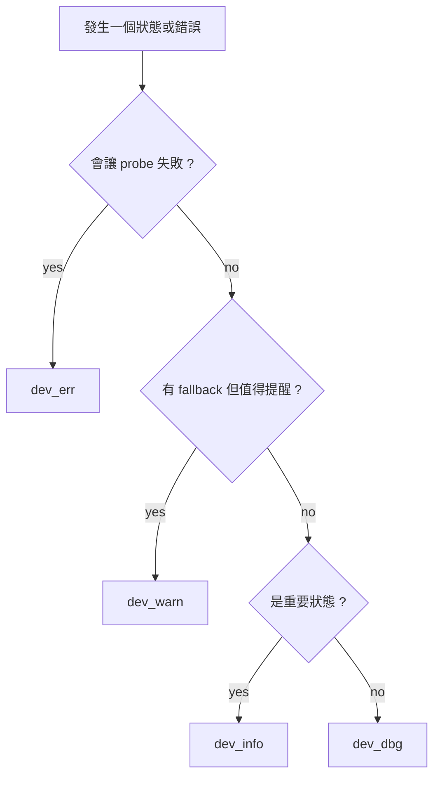

本專案的 log 原則是：開機流程中必須看得到的狀態用 `dev_info()`，會停止流程的錯誤用 `dev_err()`，可恢復但不應被忽略的狀況用 `dev_warn()`。

## 14. Bug Analysis

### Summary Table

| BUG | 症狀 | Root Cause | Fix | Verification |
|---|---|---|---|---|
| MMIO address collision | resource 可能撞到 QEMU 既有 device | `reg` 位址任意選可能重疊 | 固定 `0x0d000000`，patch script 掃 base DTB `reg`，driver 再驗 base/size | `scripts/02_patch_dtb.sh` 通過，QEMU log 顯示正確 MMIO range |
| DT node 不等於真硬體 | 直接碰不存在 MMIO 風險高 | QEMU 沒有 myled device model | DTS 加 `myvendor,simulated`，driver 用 `sim_regs[]` | QEMU log 顯示 simulated mode，sysfs test 通過 |
| sysfs drvdata 空窗 | callback 可能拿不到 `priv` | sysfs 建立前未先綁 drvdata 會有風險 | `sysfs_create_group()` 前先 `platform_set_drvdata()` / `dev_set_drvdata()` | sysfs 讀寫全部通過 |
| RMW lost update | enable/blink 可能互相覆蓋 | read 與 write 若分開 lock，不是 atomic RMW | `myled_reg_update_bits()` 在單一 lock 內完成 RMW | `blink`、`enable` 讀寫回讀通過 |
| register offset 越界 | 未來新增功能可能誤讀寫 | 底層 helper 若不檢查 offset，風險集中在 MMIO | `myled_validate_reg_access()` | `W=1` build 通過，sysfs 正常 |
| BusyBox 架構錯誤 | `/init` 無法執行 | initramfs 內 binary 不是 ARM64 | rootfs build 檢查 binary architecture | rootfs build 與 QEMU boot 通過 |
| kernel build clock skew | make warning 或失敗 | WSL/檔案時間偏移 | 只 touch 未來時間檔案並重試 | kernel build 通過 |
| platform device leading zero | 測試找錯 sysfs path | kernel device name 不保證保留 leading zero | test script 同時接受兩種名稱，並檢查 `of_node` | test output 顯示 `d000000.myled-controller` 且 of_node 正確 |
| kernel-doc warning | `W=1` build warning | 一般註解誤用 `/**` | 改普通 block comment | `W=1` module build 無 warning |
| QEMU no controlling tty | shell 提示 can't access tty | initramfs shell 未建立 controlling terminal | 使用 `setsid cttyhack sh` fallback | QEMU 可進 shell |

### Detailed Example: MMIO Collision

錯誤風險：

```text
device A reg = 0x09000000-0x09000fff
myled    reg = 0x09000000-0x09000fff
```

這代表兩個 driver 會認為自己控制同一段硬體。即使 driver 能編譯成功，runtime 也可能錯。

本專案防線：

```text
防線 1: DTS 固定 reg = 0x0d000000/0x1000
防線 2: patch_dtb.sh 合併前掃 base DTB reg overlap
防線 3: myled_probe() 檢查 resource start/size
防線 4: test_myled.sh 檢查 of_node 必須是 myled-controller@0d000000
```

## 15. Call Graph

### Build-time Call Graph

```text
scripts/01_build_kernel.sh
  -> make defconfig
  -> make Image modules

scripts/02_patch_dtb.sh
  -> dts/patch_dtb.sh
      -> qemu-system-aarch64 -machine virt,dumpdtb=...
      -> dtc -I dtb -O dts
      -> dtc -I dts -O dtb -@
      -> fdtoverlay

scripts/03_build_driver.sh
  -> make -C linux-6.6.30 M=driver ARCH=arm64 CROSS_COMPILE=aarch64-linux-gnu- modules

scripts/04_build_rootfs.sh
  -> copy BusyBox/init/test/module
  -> cpio + gzip
```

### Boot-time Call Graph

```text
scripts/05_run_qemu.sh
  -> qemu-system-aarch64
      -> Linux kernel parses DTB
      -> creates platform_device for myled-controller@0d000000
      -> initramfs /init
          -> insmod /myled_ctrl.ko
              -> module_platform_driver generated init
              -> platform_driver_register
              -> OF match
              -> myled_probe
                  -> devm_kzalloc
                  -> of_property_read_u32/string/bool
                  -> platform_get_resource
                  -> resource_size
                  -> resource base/size validation
                  -> platform_set_drvdata / dev_set_drvdata
                  -> myled_hw_init
                  -> sysfs_create_group
                  -> pm_runtime_enable
          -> /test_myled.sh
              -> write/read sysfs attributes
```

### sysfs Write Call Graph

```text
echo 200 > brightness
  -> VFS sysfs write
  -> brightness_store(dev, attr, buf, count)
      -> dev_get_drvdata(dev)
      -> kstrtou32(buf, 10, &val)
      -> if val > 255 return -EINVAL
      -> myled_reg_write(priv, MYLED_REG_BRIGHTNESS, val)
          -> myled_validate_reg_access
          -> spin_lock_irqsave
          -> simulated ? sim_regs[index] = val : writel(val, base + off)
          -> spin_unlock_irqrestore
      -> return count
```

### sysfs Read Call Graph

```text
cat info
  -> VFS sysfs read
  -> info_show(dev, attr, buf)
      -> dev_get_drvdata(dev)
      -> myled_reg_read VERSION
      -> myled_reg_read CTRL
      -> myled_reg_read BRIGHTNESS
      -> myled_reg_read COLOR
      -> sysfs_emit formatted status
```

## 16. Synchronization Analysis

### Direct Observation

Register access 使用 `spin_lock_irqsave()` 與 `spin_unlock_irqrestore()`。

適用原因：

- sysfs callback 可能被不同 process 同時觸發。
- suspend/resume callback 也會修改 `CTRL`。
- `CTRL` 的 bit 更新需要 read-modify-write 原子性。

目前保護範圍：

| Path | 是否上鎖 | 說明 |
|---|---|---|
| `myled_reg_read()` | 是 | 讀取 simulated array 或 MMIO。 |
| `myled_reg_write()` | 是 | 寫入 simulated array 或 MMIO。 |
| `myled_reg_update_bits()` | 是 | 在同一個 lock 內完成 RMW。 |

### Conservative Inference

目前沒有 IRQ handler、workqueue 或 timer，因此 synchronization 主要面對 sysfs 並行與 PM callback。若未來加入 IRQ 或 background worker，應重新檢查 lock ordering 與是否可能在 atomic context 呼叫會睡眠的 API。

## 16A. 同步 API 與選擇依據

同步機制的選擇要看兩件事：保護的資料是什麼，以及 critical section 內會不會睡眠。這個專案保護的是 register access path，操作很短，內容是讀寫 `sim_regs[]` 或 `readl()` / `writel()`。

### `spinlock`、`mutex`、`atomic_t` 怎麼選

| API / 機制 | 可否睡眠 | 適合情境 | 本專案是否適合 |
|---|---|---|---|
| `spinlock_t` | 不可睡眠 | 很短的 critical section、register bit update、可能被不同 context 共用。 | 本專案使用。 |
| `mutex` | 可以睡眠 | 保護較長流程，或 critical section 內會呼叫可能睡眠的 API。 | sysfs-only 情境可考慮，但本專案 register helper 很短，不需要 mutex。 |
| `atomic_t` / `atomic_long_t` | 不可睡眠 | 單一整數計數或簡單狀態。 | 不適合，因為 RMW 要保護的是整個 register 值與多個 bit。 |
| 無鎖 | 無 | 單一 writer 或資料競爭不影響結果。 | 不適合，因為 `enable` 與 `blink` 都會改 `CTRL`。 |

選擇依據：

- `CTRL` register 有多個 bit，`enable` 與 `blink` 會寫同一個 register。
- `myled_reg_update_bits()` 必須保護整段 read-modify-write，而不是只保護單次 read 或 write。
- critical section 內沒有會睡眠的 API，所以可以用 spinlock。

### `spin_lock_irqsave()` 與 `spin_lock()` 怎麼選

| API | 行為 | 適合情境 | 本專案選擇 |
|---|---|---|---|
| `spin_lock()` | 只拿 lock，不保存 interrupt state。 | 確定不會和 interrupt context 共用同一把 lock。 | 可用，但保守性較低。 |
| `spin_lock_irqsave()` | 拿 lock，並保存/關閉本 CPU interrupt state。 | low-level helper 未來可能被 IRQ 或更複雜 context 共用。 | 本專案使用。 |

目前專案沒有 IRQ handler，因此 `spin_lock()` 在現階段也能運作。不過 register helper 是底層共用函式，未來若加入 IRQ 或其他 context，`spin_lock_irqsave()` 比較不容易因呼叫來源變多而踩到同一把 lock 的中斷重入問題。

### 同步保護範圍圖

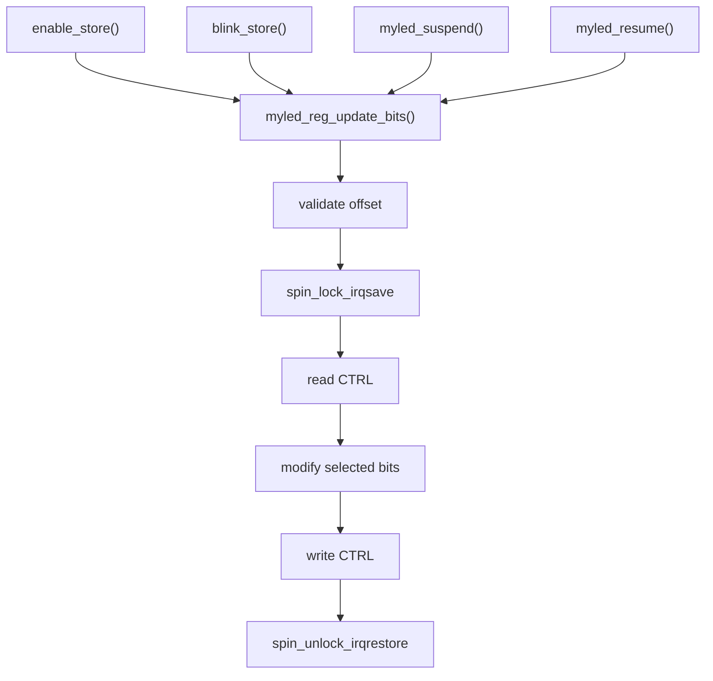

圖中的重點是：多個入口都會走到同一個 update helper，所以 lock 應該放在 helper 裡，而不是散在每個 caller 裡。這樣未來新增新的 sysfs attribute 時，也比較不容易忘記上鎖。

## 17. Memory and Resource Ownership

### Direct Observation

| Resource | Owner | Acquisition | Release |
|---|---|---|---|
| `struct myled_priv` | device-managed | `devm_kzalloc()` | device release 或 probe failure 自動釋放 |
| MMIO mapping | device-managed | `devm_ioremap_resource()` | device release 或 probe failure 自動釋放 |
| sysfs group | driver manual | `sysfs_create_group()` | `sysfs_remove_group()` |
| runtime PM state | driver manual | `pm_runtime_enable()` | `pm_runtime_disable()` |
| simulated registers | inside `priv` | `devm_kzalloc()` 包含 | 跟 `priv` 一起釋放 |

### Why sysfs Is Manual

`sysfs_create_group()` 不是 `devm_` API。本專案在 `remove()` 中明確呼叫 `sysfs_remove_group()`，避免 module remove 或 device unbind 後 sysfs 檔案仍存在。

## 17A. 資源生命週期 API

Driver 的資源管理可以分成兩類：device-managed resource 和 manual resource。兩者的差異在於生命週期。

### 資源清理流程圖

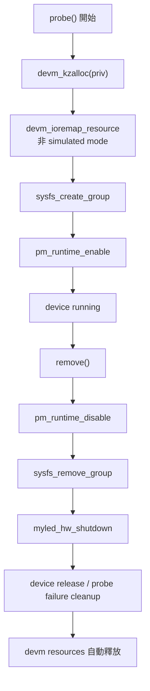

### `devm_*` 與手動清理怎麼分

| 類型 | 例子 | 清理方式 | 選擇依據 |
|---|---|---|---|
| device-managed | `devm_kzalloc()`、`devm_ioremap_resource()` | device detach 或 probe 失敗時自動清理。 | 資源完全屬於 device，沒有特別的關閉順序需求。 |
| manual cleanup | `sysfs_create_group()` | `sysfs_remove_group()` | sysfs 是 user-visible 介面，remove 時要明確先拆掉入口，避免之後 callback 被呼叫。 |
| manual state | `pm_runtime_enable()` | `pm_runtime_disable()` | enable/disable 是狀態切換，不只是記憶體釋放。 |
| hardware state | controller enable / brightness | `myled_hw_shutdown()` | driver remove 時要把 device 狀態收乾淨。 |

### 為什麼不全部都用 devm

`devm_*` 很方便，但不是每個動作都適合交給 devm 自動處理。以本專案為例：

- `priv` 和 MMIO mapping 沒有 user space 入口，適合 devm。
- sysfs 檔案會讓 user space 進入 driver callback，remove 時應該主動先移除。
- PM runtime 是狀態開關，應該和 `probe()` / `remove()` 對稱處理。
- hardware shutdown 有順序要求，應放在 driver 可控的位置執行。

### Probe 失敗時的資源狀態

| 失敗位置 | 已建立資源 | 清理方式 |
|---|---|---|
| `devm_kzalloc()` 失敗 | 無 | 直接回傳。 |
| resource 檢查失敗 | `priv` | devm 自動釋放。 |
| `myled_hw_init()` 失敗 | `priv`，可能有 MMIO mapping | devm 自動釋放；sysfs 尚未建立。 |
| `sysfs_create_group()` 失敗 | `priv`，已初始化硬體狀態 | 手動 `myled_hw_shutdown()`，devm 資源自動釋放。 |

## 18. User-visible API Contract

### sysfs Contract

| File | Read output | Write input | Error behavior |
|---|---|---|---|
| `enable` | `0` 或 `1` | boolean | parse 失敗回傳錯誤。 |
| `brightness` | decimal number | decimal `0..255` | 超過 255 回傳 `-EINVAL`。 |
| `color` | `rrggbb` lowercase hex | hex value | 只保留低 24 bits。 |
| `blink` | `0` 或 `1` | boolean | parse 失敗回傳錯誤。 |
| `status` | `ready=<n> fault=<n>` | 不可寫 | read-only。 |
| `info` | 多行狀態 | 不可寫 | read-only。 |

### Example

```sh
echo 200 > brightness
cat brightness
# 200

echo ff3300 > color
cat color
# ff3300

echo 1 > blink
cat blink
# 1
```

## 19. Verified Execution Result

### Direct Observation

目前已確認：

| 驗證 | 結果 |
|---|---|
| `bash -n` script syntax | pass |
| kernel build | pass |
| DTB patch | pass |
| driver `W=1` build | pass |
| rootfs build | pass |
| QEMU boot | pass |
| `/test_myled.sh` | pass |
| `git diff --check` | pass |

QEMU 中的重要輸出：

```text
[init] Module loaded OK
myled_ctrl d000000.myled-controller: MMIO region: [0x0d000000 - 0x0d000fff]
myled_ctrl d000000.myled-controller: simulated mode requested by Device Tree
myled_ctrl d000000.myled-controller: HW init OK
myled_ctrl d000000.myled-controller: probe() succeeded
[PASS] platform device name = d000000.myled-controller
[PASS] of_node = myled-controller@0d000000
[PASS] driver bound
[PASS] sysfs directory ready
[PASS] brightness write/readback = 200
[PASS] color write/readback = ff3300
[PASS] blink write/readback = 1
[PASS] enable write/readback = 0
[PASS] myled sysfs test completed
```

備註：

```text
myled_ctrl: loading out-of-tree module taints kernel
```

這是外部 kernel module 的標準提示，不是本專案錯誤。

## 20. Conservative Risk Analysis

以下是未來擴充時需要注意的風險。

| 擴充方向 | 風險 | 建議 |
|---|---|---|
| 加入真 QEMU MMIO device model | DT 與 QEMU device model 位址必須一致 | 保留 driver base/size check，並加入 QEMU device regression test。 |
| 加入 IRQ | interrupt spec、handler context、locking 會更複雜 | 使用 `devm_request_irq()`，確認 handler 不呼叫會睡眠 API。 |
| 加入 runtime PM callbacks | usage count 與 sysfs 操作可能交錯 | 定義明確的 active/idle policy，必要時在 sysfs store 前 resume device。 |
| 多個 myled instance | 現在 driver 常數固定 base/size | 若要多實例，需改成允許多個 base，測試也要以 compatible/of_node 辨識。 |
| 改成 char device | ioctl ABI 需要長期維護 | 先定義清楚 userspace ABI，再加 self-test。 |

## 21. 常見觀念問答

### Q1: 為什麼這個專案適合用 Platform Driver？

因為 `myled-controller` 是 Device Tree 描述的 non-discoverable device。它不像 PCI/USB 能被硬體匯流排自動枚舉，所以要透過 `compatible` 與 platform bus 讓 kernel 找到對應 driver。

### Q2: `compatible` 的作用是什麼？

`compatible` 是 device 與 driver 的配對 key。DTS 寫 `myvendor,myled-v1`，driver 的 `of_match_table` 也支援 `myvendor,myled-v1`，kernel 才會呼叫 `myled_probe()`。

### Q3: 為什麼要固定 `myled-controller@0d000000`？

因為這個 device 的位置需要穩定，不能撞到 QEMU 既有 device address。固定 node name 與 MMIO base 後，script、driver、test 都能用同一個位址做驗證。

### Q4: 為什麼 Device Tree 裡有節點，driver 還要 simulated mode？

Device Tree 只描述硬體，不會自動讓 QEMU 產生硬體。若 QEMU 沒有實作該 MMIO device model，直接存取 MMIO 可能不安全。simulated mode 用 shadow register 跑完 driver 流程，同時避免碰不存在的硬體。

### Q5: 為什麼 `probe()` 要檢查 resource base/size？

這是 runtime 防線。即使 DTS 被改錯，只要 driver bind 到不符合 `0x0d000000/0x1000` 的 resource，就會回傳 `-EINVAL`，避免錯誤繼續擴大。

### Q6: 為什麼不用全域變數保存狀態？

Platform driver 可能有多個 device instance。用 `struct myled_priv` 搭配 drvdata，可以讓每個 device 有自己的狀態，也比較符合 Linux driver model。

### Q7: 為什麼 sysfs callback 要回傳錯誤？

因為 user space 需要知道寫入是否成功。例如 `brightness > 255` 應該回傳 `-EINVAL`，讓測試或操作人員知道輸入不合法，而不是靜默忽略。

### Q8: 這份專案最重要的 BUG 修正是哪個？

需要優先處理的是 MMIO 位址衝突防護與 simulated mode。前者避免撞到 QEMU 既有 device，後者讓沒有真硬體的情況下仍能安全跑完 driver 流程。這兩個問題如果沒有先處理，後面的 sysfs 測試即使通過，也可能只是碰巧沒有踩到錯誤。

## 22. Final Checklist

| 項目 | 狀態 |
|---|---|
| Device Tree node 固定為 `myled-controller@0d000000` | 完成 |
| MMIO fixed at `0x0d000000/0x1000` | 完成 |
| DTB overlay 前做 overlap check | 完成 |
| Driver probe 做 base/size validation | 完成 |
| simulated mode 避免不存在 MMIO | 完成 |
| sysfs callbacks 有輸入檢查 | 完成 |
| RMW 在同一個 lock 內完成 | 完成 |
| rootfs 檢查 ARM64 BusyBox | 完成 |
| QEMU boot 自動測試 | 完成 |
| 文件與目前程式行為一致 | 完成 |
