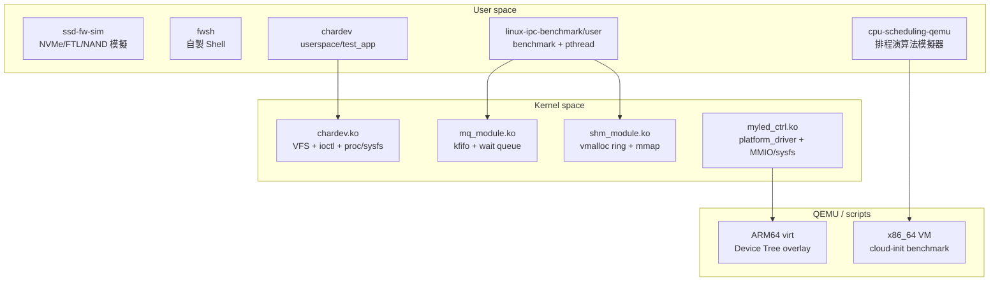
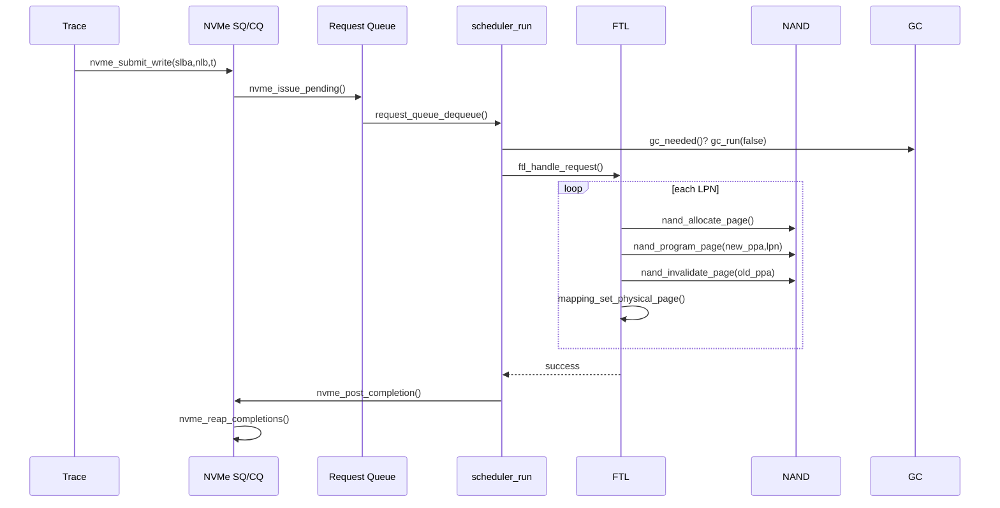
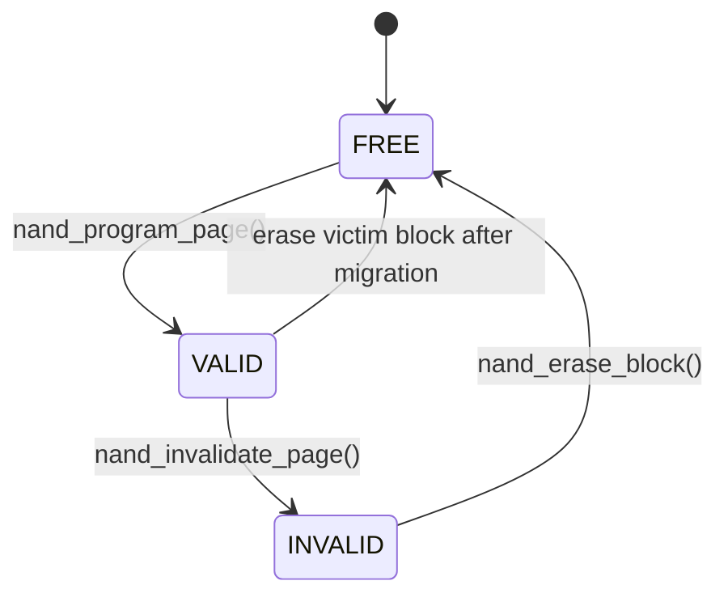
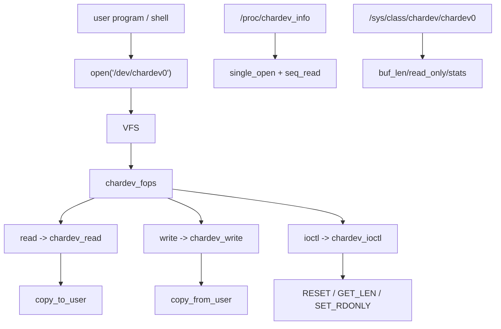
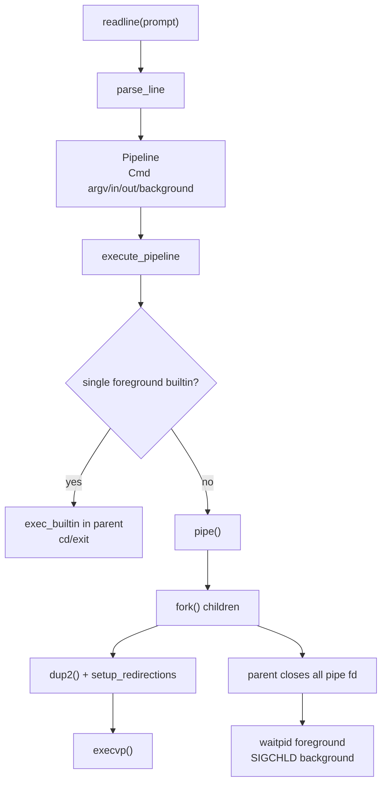
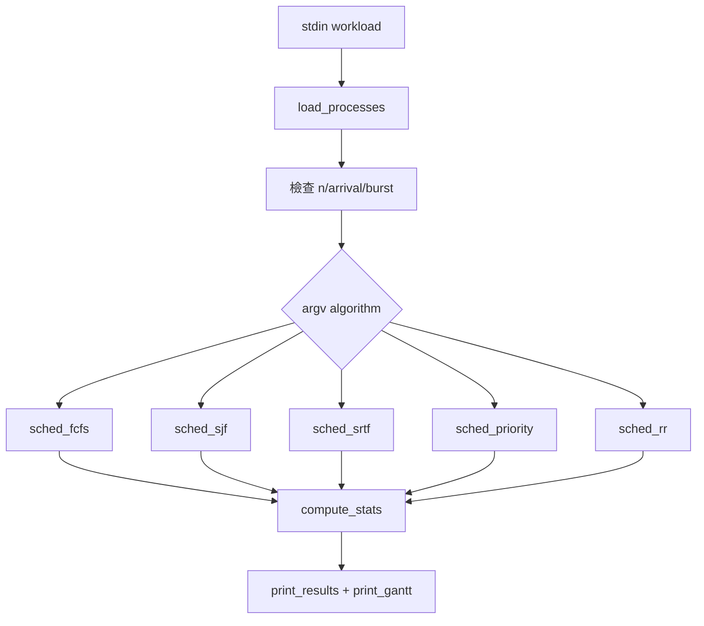

# Linux Kernel & Firmware Engineering Portfolio — 技術報告

本報告將 [`README.md`](README.md) 的快速導覽延伸成完整技術文件，並整合專案介紹、開發挑戰、問答與術語內容。重點是交代每個子專案的功能如何實作、關鍵 API 長什麼樣、API 的作用與限制、和相似 API 的差別，以及本專案為什麼採用這些設計。

本文以目前原始碼為準，只描述已實作的功能。例如：`cpu-scheduling-qemu` 是 user-space 排程模擬器；`qemu-platform-demo` 目前是 QEMU Platform Driver/sysfs demo，沒有真實 IRQ handler 或 DMA engine。

---

## 1. 全域架構

六個子專案在原始碼層互相獨立，沒有跨目錄 `#include`。它們共同組成一個由 user space 工具、kernel module、QEMU demo、韌體模擬器構成的系統程式練習集。



| 子專案 | 核心檔案 | 主要抽象 | 實作重點 |
|--------|----------|----------|----------|
| `ssd-fw-sim` | `main.c`, `nvme.c`, `scheduler.c`, `ftl.c`, `gc.c`, `nand.c` | NVMe queue、FTL、NAND state、GC | 將 trace 寫入轉成 NAND page program 與延遲統計 |
| `chardev-driver` | `driver/chardev.c`, `driver/chardev.h` | `file_operations`、ioctl、procfs、sysfs | 說明 char device 註冊流程與 user/kernel copy |
| `linux-ipc-benchmark` | `mq_module.c`, `shm_module.c`, `benchmark.c` | kfifo、vmalloc ring、mmap | 比較 copy、syscall、zero-copy 成本 |
| `fwsh` | `parser.c`, `executor.c`, `builtin.c`, `shell.c` | REPL、pipeline、builtin table | 用 POSIX process/fd API 實作 shell |
| `qemu-platform-demo` | `myled_ctrl.c`, `myled-fragment.dts` | Device Tree、platform_driver、MMIO、sysfs | 在 QEMU 中示範 platform device bring-up |
| `cpu-scheduling-qemu` | `src/scheduler.c` | 離散時間排程模擬 | 實作 FCFS/SJF/SRTF/Priority/RR 與 Gantt chart |

---

## 2. 子專案一：`ssd-fw-sim`

### 2.1 功能與實作概念

`ssd-fw-sim` 是一個 user-space SSD 寫入路徑模擬器。輸入 trace 檔只解析 `WRITE <lba> <size_in_pages>`，每筆 request 走過：

1. Host 將命令放進 NVMe Submission Queue。
2. Controller 將 SQ entry 轉成內部 `request_t`。
3. Request queue 交給 storage scheduler。
4. FTL 做 out-of-place update。
5. NAND page 從 `FREE` 變成 `VALID`，舊頁變成 `INVALID`。
6. 空間不足時 GC 搬 valid page、erase block、回收 free block。
7. 完成後寫入 NVMe Completion Queue 並統計 latency。



### 2.2 核心資料結構

| 結構 | 角色 | 輔助說明 |
|------|------|----------|
| `nvme_controller_t` | 保存 SQ/CQ、head/tail/count、command id | 像 host 與裝置之間的收件匣/回覆匣 |
| `request_queue_t` | 裝置內部待處理 request ring | 把 NVMe 命令轉成韌體內部工作 |
| `ftl_context_t g_ftl` | FTL 全域狀態 | 保存 mapping table、NAND、free block pool、統計 |
| `mapping_entry_t` | LPN -> PPA | 讓同一個 logical page 可以指向最新 physical page |
| `nand_block_t` / `nand_page_t` | NAND 區塊與頁狀態 | 模擬 `FREE/VALID/INVALID` 與 erase count |
| `free_block_pool_t` | 可寫入 block queue | 寫滿目前 block 時取下一個 free block |

### 2.3 關鍵 API 與選型

| API | 格式 | 作用 | 與類似 API 的區別 | 選擇依據 |
|-----|------|------|-------------------|----------|
| `int nvme_submit_write(nvme_controller_t *c, uint64_t slba, uint32_t nlb, uint64_t ts)` | 回 `0` 成功，SQ 滿回 `-1` | host 端提交 write command | 不等於實際寫 NAND，只是把命令放入 SQ | 保留 NVMe 階層，讓 SQ 滿時可模擬背壓 |
| `uint32_t nvme_issue_pending(nvme_controller_t *c, request_queue_t *rq)` | 回實際發行數 | 將 SQ entry 轉成 `request_t` 丟進 RQ | `request_queue_enqueue` 只處理內部 queue；此函式多了 SQ opcode 轉換 | 分離協定層與韌體內部 request |
| `bool scheduler_run(ftl_context_t *ftl, request_queue_t *rq, nvme_controller_t *c)` | 成功回 true | 從 RQ dispatch 到 FTL，更新 latency，送 CQ | storage request dispatcher | 集中處理 queue latency、service latency 與 completion |
| `bool ftl_handle_request(ftl_context_t *ftl, const request_t *req)` | 目前只接受 WRITE | request type 分派入口 | `ftl_handle_write` 是 private static path | 預留 READ/TRIM 擴充 |
| `bool mapping_get_physical_page(table,lpn,&ppa)` | 查詢 LPN 是否已有 PPA | 覆寫前找舊頁、GC 後驗證 mapping | 直接讀 `table[lpn]` 會分散 valid bit 判斷 | 讓 L2P 查詢規則集中 |
| `void mapping_set_physical_page(table,lpn,ppa)` | 更新 L2P | 讓 LPN 指向新 PPA | 不處理 NAND 狀態，只改 mapping | 保持 FTL metadata 單一責任 |
| `bool gc_needed(const ftl_context_t *ftl)` | 檢查 free block pool 是否低於門檻 | 決定是否觸發 GC | 不掃整個 NAND，只看 pool count | 快速判斷，符合模擬器成本 |
| `bool gc_run(ftl_context_t *ftl, bool foreground)` | 搬 valid pages、erase victim、push free pool | 執行垃圾回收 | `foreground=true` 代表 request 已被空間不足卡住 | 分開統計背景/前景 GC 與長尾延遲 |
| `bool nand_allocate_page(...)` | 取得下一個可寫 PPA | 管理 write pointer 與切 block | 不會 program，只分配位置 | 清楚分開 allocate 與 program |
| `void nand_program_page(nand,ppa,lpn)` | 將 page 標成 VALID | 模擬 NAND program 動作 | 不像 DRAM 可原地覆寫 | 將 page 狀態變化留在 NAND layer |
| `int stats_export_csv(stats,path)` | 輸出 CSV | 讓結果給試算表或腳本分析 | `stats_print()` 偏人類閱讀 | benchmark 後續比較需要機器可讀格式 |
| `int ssd_config_load_file(path,config)` | 讀 `key=value` 設定 | 覆寫預設 NAND 幾何與 latency | hard-code 常數不利比較 | 讓同一份程式可跑不同設定 |

### 2.4 NAND 狀態圖



重點是 NAND 不能原地覆寫。當同一個 LPN 再次寫入時，FTL 會：

1. 配置新 PPA。
2. 將新資料 program 到 NAND。
3. 舊 PPA 標成 invalid。
4. L2P 指到新 PPA。

這就是 out-of-place update。選擇這個模型是因為它符合 NAND 「page 可寫、block 才能 erase」的物理限制。

### 2.5 已知限制與後續方向

| 限制 | 原因 | 可擴充方向 |
|------|------|------------|
| 只支援 WRITE | `ftl_handle_request` 目前只有 WRITE case | 加 READ/TRIM trace |
| 單執行緒 | `g_ftl` 是全域狀態，沒有鎖 | 加 host 多 queue / 多執行緒 |
| GC victim 使用 greedy max-invalid | 簡單且容易觀察 WA | 加 wear leveling、hot/cold 分離 |
| CQ phase 只設定未驗證 | 簡化 host completion 模型 | 加 host poll phase check |

---

## 3. 子專案二：`chardev-driver`

### 3.1 功能與實作概念

這個子專案實作一個字元裝置 `/dev/chardev0`。使用者程式可以像操作一般檔案一樣 `open/read/write/ioctl`，核心端透過 `struct file_operations` 將 VFS 呼叫導向 driver function。



### 3.2 初始化流程

```text
chardev_init
  -> kzalloc(BUF_SIZE)
  -> mutex_init + atomic_set
  -> alloc_chrdev_region
  -> cdev_init + cdev_add
  -> class_create
  -> class dev_groups = chardev_groups
  -> device_create("chardev0")
  -> proc_create("chardev_info")
```

清理順序必須反過來：

```text
proc_remove -> device_destroy -> class_destroy -> cdev_del
-> unregister_chrdev_region -> kfree
```

### 3.3 關鍵 API 與選型

| API / 巨集 | 格式 | 作用 | 和類似 API 的差別 | 選擇依據 |
|------------|------|------|-------------------|----------|
| `alloc_chrdev_region(&devno, 0, 1, DRIVER_NAME)` | 動態申請 major/minor | 取得字元裝置編號 | `register_chrdev_region` 需手動指定 devno | 動態分配較不易撞號 |
| `cdev_init(&cdev, &fops)` / `cdev_add(&cdev, devno, 1)` | 註冊 VFS dispatch | 讓 `/dev/chardev0` 的 read/write/ioctl 找到 callback | `miscdevice` 更省事但較少展示完整流程 | 這裡要教完整 char device 生命週期 |
| `copy_from_user(dst, ubuf, count)` | 回未複製 byte 數 | 從 user buffer 複製到 kernel | 不能用 `memcpy`，user pointer 可能 page fault 或無效 | 跨 user/kernel 邊界必用 |
| `copy_to_user(ubuf, src, count)` | 回未複製 byte 數 | 從 kernel 複製回 user | 同上 | 避免非法 user pointer 造成核心錯誤 |
| `_IO(type,nr)` | 定義無 payload ioctl | 例如 reset buffer | 無資料方向 | 適合單純命令 |
| `_IOR(type,nr,type)` | kernel -> user | `IOCTL_GET_LEN` | 需要 `copy_to_user` | 適合讀狀態 |
| `_IOW(type,nr,type)` | user -> kernel | `IOCTL_SET_RDONLY` | 需要 `copy_from_user` | 適合設定參數 |
| `single_open(file, proc_show, NULL)` | procfs 一次性輸出 | 搭配 `seq_read` 處理 offset | 比手刻 proc read 不容易出錯 | 適合 `/proc/chardev_info` |
| `DEVICE_ATTR_RO/RW` + `sysfs_emit` | sysfs show/store | 建立屬性檔案 | sysfs 適合單一小屬性，不適合大 dump | 給 shell `cat/echo` 操作 |
| `mutex_lock` / `mutex_unlock` | 可睡眠鎖 | 保護 buffer 與 `buf_len` | `spinlock` 不能包可能睡眠的操作 | read/write 可能碰 user page fault |
| `atomic_inc` | 原子遞增 | open/read/write 計數 | 不保護複合狀態 | 計數器不需要 mutex 成本 |

### 3.4 ioctl、sysfs、proc 怎麼分工

| 介面 | 本專案用途 | 適合情境 | 不適合情境 |
|------|------------|----------|------------|
| read/write | 傳 buffer 資料 | 資料面，像一般檔案 | 設定複雜控制命令 |
| ioctl | reset、get length、set read-only | 結構化控制、需固定 ABI | shell 操作不直覺 |
| sysfs | `buf_len`, `read_only`, `stats` | 單一屬性、低頻設定、shell 友善 | 大量資料或 binary payload |
| procfs | `chardev_info` | debug dump、狀態總覽 | 穩定使用者 ABI |

### 3.5 重要風險

目前 `chardev_write` 在 mutex 外檢查 `drv.read_only`，而 ioctl/sysfs 修改 `read_only` 也沒有與 buffer lock 完全一致。這裡暴露出一個同步風險：單一布林值看似簡單，但若它會影響資料寫入行為，最好與被保護的資料使用同一把鎖，避免 race。

---

## 4. 子專案三：`linux-ipc-benchmark`

### 4.1 功能與實作概念

這個專案建立兩個 kernel module：

- `mq_module.ko`：使用 `kfifo` 與 wait queue，提供 `/dev/mq_ipc`。
- `shm_module.ko`：使用 `vmalloc` 建立 shared ring，提供 `/dev/shm_ipc` 的 `read/write/mmap`。

使用者程式 `benchmark.c` 建立 producer/consumer threads，比較三條路徑。

```mermaid
flowchart TB
    subgraph T1["Test 1: MQ syscall"]
        A1["producer write"] --> B1["copy_from_user"]
        B1 --> C1["kfifo_in"]
        C1 --> D1["kfifo_out"]
        D1 --> E1["copy_to_user"]
        E1 --> F1["consumer read"]
    end

    subgraph T2["Test 2: SHM syscall"]
        A2["producer write"] --> B2["copy_from_user"]
        B2 --> C2["vmalloc ring slot"]
        C2 --> D2["copy_to_user"]
        D2 --> E2["consumer read"]
    end

    subgraph T3["Test 3: SHM mmap"]
        A3["mmap shared pages"] --> B3["producer memcpy into ring"]
        B3 --> C3["head/tail protocol"]
        C3 --> D3["consumer memcpy from ring"]
    end
```



### 4.2 Ring buffer 規則

```text
Empty: head == tail
Full : (head + 1) % RING_CAPACITY == tail
```

這種做法會犧牲一個 slot，但能清楚區分空與滿。`common.h` 用 cacheline padding 讓 `head` 與 `tail` 分開，降低 false sharing。

### 4.3 關鍵 API 與選型

| API | 格式 | 作用 | 和類似 API 的差別 | 選擇依據 |
|-----|------|------|-------------------|----------|
| `DEFINE_KFIFO(g_fifo, char, FIFO_SIZE)` | 靜態建立 kfifo | 核心端 FIFO buffer | `DECLARE_KFIFO` 可宣告後再 init；這裡直接定義 | 固定容量、demo 簡潔 |
| `kfifo_in/out(&g_fifo, buf, MSG_SIZE)` | 寫入/讀出 FIFO | MQ 資料面 | 不自帶阻塞，需要 wait queue 搭配 | 分離資料結構與等待語意 |
| `wait_event_interruptible(wq, condition)` | 條件不滿足就睡眠 | 等 FIFO 有資料或空間 | `wait_event` 不可被 signal 中斷；busy spin 會吃 CPU | MQ 需要阻塞式背壓 |
| `vmalloc(SHM_BUF_SIZE)` | 配置虛擬連續核心記憶體 | 建立大 shared ring | `kmalloc` 需要實體連續，較容易失敗 | mmap buffer 較大時更合適 |
| `vmalloc_to_pfn(page)` | vmalloc 虛擬頁 -> PFN | mmap 每頁映射 | `virt_to_phys` 不適用 vmalloc | vmalloc 實體頁不連續 |
| `remap_pfn_range(vma,uaddr,pfn,PAGE_SIZE,prot)` | PFN 映射到 user VMA | 建立 zero-copy shared memory | `copy_to_user` 是每次複製；mmap 是建立頁表 | 高頻 IPC 避免 per-message syscall/copy |
| `vm_flags_set(vma, VM_DONTEXPAND | VM_DONTDUMP)` | 設定 VMA flags | 避免 VMA 被擴展或進 core dump | 直接改 `vma->vm_flags` 在新版 kernel 不建議 | 配合 kernel 6.3+ API |
| `smp_wmb()` / `smp_rmb()` | memory barrier | 確保資料先於 head/tail 被看見 | `volatile` 只限制編譯器，不保證 CPU ordering | ring buffer publication 必要 |
| `pthread_barrier_wait()` | threads 同步起跑 | benchmark 公平量測 | 不影響 kernel，只是 user 測試控制 | producer/consumer 同步開始 |

### 4.4 三條路徑比較

| 路徑 | copy 次數 | syscall 次數 | 同步方式 | 適用情境 |
|------|-----------|--------------|----------|----------|
| MQ kfifo | 每筆概念上 user->kernel、kernel->user | 每筆 write/read | mutex + wait queue | 需要阻塞、穩定背壓、簡單可靠 |
| SHM syscall | 每筆仍有 copy | 每筆 write/read | spinlock | 比較 ring 和 kfifo 的成本 |
| SHM mmap | 無 per-message user/kernel copy；仍有 user-space `memcpy()` | 只有建立 mmap 時進 kernel | user-side busy spin + barrier | 高頻低延遲 benchmark；production 需更完整同步 |

### 4.5 限制與風險

| 限制 | 說明 |
|------|------|
| mmap 路徑假設 SPSC | 多 producer/consumer 會 race |
| 目前 SHM syscall 與 mmap 的 `data` layout 不一致 | 兩條路徑共用 `/dev/shm_ipc` 和 backing pages，但 kernel `struct shm_region` 與 user `shm_region_t` 的 `data` offset 不同，不應混用資料 slot |
| `/proc/*_stats` latency 是粗略指標 | 適合 demo，不代表完整 per-message latency |
| busy-spin 會吃 CPU | benchmark 可接受，正式系統要考慮 futex/eventfd 等通知 |

---

## 5. 子專案四：`fwsh`

### 5.1 功能與實作概念

`fwsh` 是一個自製 Shell。整體分成四層：

1. `shell.c`：Readline REPL、prompt、signal。
2. `parser.c`：把一行文字解析成 `Pipeline` / `Cmd`。
3. `executor.c`：建立 pipe、fork child、dup2 接線、exec。
4. `builtin.c`：內建命令表與實作。



### 5.2 關鍵 API 與選型

| API | 格式 | 作用 | 和類似 API 的差別 | 選擇依據 |
|-----|------|------|-------------------|----------|
| `readline(prompt)` | 回傳 malloc 字串或 NULL | 讀互動式命令列 | `fgets` 沒有歷史、編輯、補全 | Shell 使用體驗更完整 |
| `add_history(line)` | 加入 readline history | 支援上下鍵與 Ctrl-R | fwsh 另存 history 給 builtin 顯示 | 分開外部 library 與內建命令需求 |
| `fork()` | parent 回 child pid，child 回 0 | 建立子行程 | `posix_spawn` 更輕但不利教 pipe/fd 細節 | 展示 POSIX process 模型 |
| `execvp(file, argv)` | 成功後不回傳 | 在 child 載入外部程式 | `execv` 不搜尋 PATH；`system` 不易控制 pipe | Shell 命令執行標準做法 |
| `pipe(int fd[2])` | `fd[0]` read end，`fd[1]` write end | 建立 pipeline channel | socketpair 是雙向；pipe 更符合 shell 單向管線 | `cmd1 | cmd2` 只需單向 |
| `dup2(oldfd, STDIN_FILENO)` | 將 fd 接到標準輸入/輸出 | 實作 redirect 與 pipeline | 手動 read/write 會破壞程式原本 stdio 行為 | 讓子程式自然讀 stdin、寫 stdout |
| `getcwd(buf,size)` / `chdir(path)` | 取得與切換 cwd | 實作 prompt、`pwd`、`cd`、`OLDPWD` | 外部 `/bin/pwd` 只能印 child cwd；外部 `cd` 改不到 parent | Shell 自身狀態必須在 parent 更新 |
| `waitpid(pid,&status,0)` | 等 child 結束 | 前景命令同步等待 | 背景命令不能等，否則 shell 卡住 | 前景/背景語意分離 |
| `sigaction(SIGCHLD,...)` | 註冊 signal handler | 回收背景行程 | `signal()` 行為較不一致 | 較符合現代 POSIX 寫法 |
| `rl_replace_line`, `rl_redisplay` | 重畫 readline | Ctrl-C 後清輸入列 | 直接 printf 會讓游標錯亂 | 互動 shell 必要 |

### 5.3 為什麼 `cd` 必須是 builtin

`chdir()` 改的是目前行程的工作目錄。如果 `cd` 透過 fork 後在 child 執行，child 結束後 parent shell 的 cwd 不會改變。因此 `execute_pipeline` 對「單一、前景、builtin」直接在 parent 執行，讓 `cd`、`exit` 這類改 shell 自身狀態的命令生效。

### 5.4 FD 關閉是 pipeline 的核心

對 `A | B | C`，parent 會建立兩條 pipe。每個 child `dup2()` 後要關閉原始 pipe fd；parent fork 完後也要關閉全部 pipe fd。只要還有任何行程持有寫端，讀端就可能永遠等不到 EOF，造成 `grep`、`wc` 等指令卡住。

---

## 6. 子專案五：`qemu-platform-demo`

### 6.1 功能與實作概念

這個子專案示範 Linux Platform Driver。Device Tree fragment 宣告一個 `myled-controller@0d000000`，driver 透過 `compatible = "myvendor,myled-v1"` 被配對，`probe()` 取得 MMIO resource 後建立 sysfs 介面。

```mermaid
flowchart LR
    DTS["DTS fragment\ncompatible/reg/num-leds"] --> DTBO["dtc -> DTBO"]
    DTBO --> DTB["fdtoverlay -> final DTB"]
    DTB --> QEMU["QEMU virt boot"]
    QEMU --> CORE["driver core\nOF match"]
    CORE --> PROBE["myled_probe"]
    PROBE --> RES["platform_get_resource"]
    RES --> MAP["devm_ioremap_resource\nor simulated"]
    MAP --> INIT["myled_hw_init"]
    INIT --> SYSFS["sysfs /myled"]
```



### 6.2 Probe 流程

```text
myled_probe
  -> devm_kzalloc(priv)
  -> spin_lock_init
  -> of_property_read_u32("num-leds")
  -> of_property_read_bool("myvendor,simulated")
  -> platform_get_resource(IORESOURCE_MEM)
  -> 驗證 base=0x0d000000, size=0x1000
  -> devm_ioremap_resource 或 simulated shadow register
  -> platform_set_drvdata / dev_set_drvdata
  -> myled_hw_init
  -> sysfs_create_group("myled")
  -> pm_runtime_enable
```

### 6.3 關鍵 API 與選型

| API | 格式 | 作用 | 和類似 API 的差別 | 選擇依據 |
|-----|------|------|-------------------|----------|
| `myled_of_match` / `.driver.of_match_table` | `.compatible = "myvendor,myled-v1"` | 定義 DT match key | 字串必須與 DTS 完全一致 | 非 discoverable 裝置靠 DT 配對 |
| `MODULE_DEVICE_TABLE(of, table)` | 匯出 module alias | 讓自動載入工具知道此 driver 支援哪些 compatible | 沒寫可能仍可手動 insmod，但自動配對資訊不足 | 符合 kernel driver 慣例 |
| `module_platform_driver(driver)` | 產生 module init/exit | 註冊 platform driver | 手寫 `module_init` 也可以，但樣板較多 | 簡化標準 platform driver |
| `platform_get_resource(pdev, IORESOURCE_MEM, 0)` | 取得 MMIO resource | 從 DT `reg` 轉成 kernel resource | 不硬編 base pointer | 讓 DT 負責硬體描述 |
| `devm_kzalloc(dev, size, GFP_KERNEL)` | device-managed 配置 | 隨 device lifecycle 自動釋放 | `kzalloc` 需手動 kfree | probe 多步驟失敗時減少 leak |
| `devm_ioremap_resource(dev, res)` | request + ioremap resource | 建立 MMIO mapping | `ioremap` 少了 resource 管理與衝突檢查 | 驅動開發較安全 |
| `readl(base+off)` / `writel(val, base+off)` | MMIO 存取 | 讀寫硬體暫存器 | 一般 `*ptr` 不保證 I/O ordering | kernel MMIO 標準 API |
| `spin_lock_irqsave(&lock, flags)` | 關中斷保存 flags 並上鎖 | 保護 register read-modify-write | `mutex` 會睡眠，不適合可能的 atomic context | 暫存器操作短且不可睡眠 |
| `sysfs_create_group(&dev->kobj, &group)` | 建立一組屬性檔 | `enable/brightness/color/blink/status/info` | 單個 `device_create_file` 較零散 | group 讓清理與結構更清楚 |
| `kstrtobool`, `kstrtou32` | 解析 sysfs 文字輸入 | 把 `echo 1 > enable` 轉成 bool/u32 | `atoi` 無法可靠回報錯誤 | sysfs store callback 應處理錯誤 |

### 6.4 sysfs 屬性

| 屬性 | 方向 | 作用 |
|------|------|------|
| `enable` | RW | 設定/讀取 `CTRL.ENABLE` |
| `brightness` | RW | 0..255，超出回 `-EINVAL` |
| `color` | RW | RRGGBB 十六進位，保留低 24 bits |
| `blink` | RW | 設定/讀取 `CTRL.BLINK` |
| `status` | RO | 回報 ready/fault |
| `info` | RO | 一次輸出 version、num_leds、simulated、ctrl、brightness、color |

### 6.5 simulated mode

QEMU `virt` 沒有真實 myled 硬體 model。DTS 有 `myvendor,simulated` 時，driver 不直接碰 MMIO，而是使用 `priv->sim_regs[]` 當 shadow register bank。這讓上層 sysfs 操作與 driver 流程仍可示範，不被硬體模型缺失卡住。

---

## 7. 子專案六：`cpu-scheduling-qemu`

### 7.1 功能與實作概念

`scheduler.c` 從 stdin 讀 workload，依 argv 選演算法，輸出各行程的 start/finish/waiting/turnaround/response，以及 Gantt chart 與 `BENCHMARK` 固定格式。



### 7.2 演算法比較

| 演算法 | 函式 | 是否搶佔 | 選擇規則 | 優點 | 風險 |
|--------|------|----------|----------|------|------|
| FCFS | `sched_fcfs()` | 否 | arrival 先到先跑 | 最簡單 baseline | 短工作可能被長工作卡住 |
| SJF | `sched_sjf()` | 否 | 已到達中 burst 最短 | 平均等待時間常較低 | 需要知道 burst |
| SRTF | `sched_srtf()` | 是 | 每 tick 選 remaining 最短 | 可讓短工作快速回應 | 模擬成本高，真系統需切換成本 |
| Priority | `sched_priority()` | 否 | priority 數字越小越高 | 適合重要工作優先 | 低優先權可能飢餓 |
| Round Robin | `sched_rr(q)` | 是 | 每個 ready process 跑最多 q | 公平、互動性佳 | quantum 太小切換頻繁，太大退化成 FCFS |

### 7.3 關鍵函式與選型

| 函式 | 格式與作用 | 跟類似函式的差別 | 選擇依據 |
|------|------------|-------------------|----------|
| `load_processes()` | 用 `scanf()` 從 stdin 讀 `pid arrival burst priority` | 不讀檔名，交給 shell redirect | workload 格式固定，腳本可簡單使用 `< workload.txt` |
| `gantt_push(pid,start,end)` | 合併連續同 PID 區間 | SRTF 每 tick 執行，但輸出不必每 tick 一格 | 讓圖更容易讀 |
| `compute_stats()` | `turnaround=finish-arrival`，`waiting=turnaround-burst` | 與演算法分離 | 避免每個演算法重複統計公式 |
| `parse_quantum(text)` | `strtol` 檢查 RR quantum | 比 `atoi` 可檢查空字串/溢位/非法字元 | CLI 參數安全 |
| `snprintf(label,sizeof(label),...)` | 產生 `RoundRobin_Q%d` label | 比 `sprintf()` 多了長度限制 | 避免 label buffer overflow |
| `qsort(..., cmp_arrival)` | FCFS / RR 起始排序 | SJF/Priority 不能只全域排序，需每輪看 ready set | 演算法語意不同 |

### 7.4 與 QEMU 腳本的關係

QEMU 腳本主要用來建立可重現環境與自動跑 benchmark。排程核心仍是 user-space `scheduler` binary，透過 cloud-init 放進 VM，再由 `qemu-system-x86_64` 啟動 Ubuntu VM 執行。這點在報告或展示時要說清楚，避免被誤解成修改 Linux kernel scheduler。

---

## 8. API 橫向比較與選型依據

### 8.1 user/kernel 資料交換

| 介面 | 出現位置 | 資料格式 | 適合 | 不適合 |
|------|----------|----------|------|--------|
| `read/write` | chardev、MQ、SHM syscall | byte stream | 資料面，直覺、可用 shell 測 | 複雜控制命令 |
| `ioctl` | chardev | command number + optional pointer | 結構化控制、binary ABI | shell 直接操作不方便 |
| `sysfs` | chardev、myled | 單一文字屬性 | 低頻設定、狀態讀取 | 大量資料、複雜結構 |
| `procfs` | chardev、ipc stats | 人類可讀文字 | debug/status dump | 穩定 ABI 或寫入控制 |
| `mmap` | SHM IPC | shared memory page | 高頻資料交換、zero-copy | 需要自行處理同步與 memory ordering |

### 8.2 記憶體配置 API

| API | 空間 | 特性 | 本專案用途 | 何時不要用 |
|-----|------|------|------------|------------|
| `kzalloc` | kernel | 實體大多連續、清零 | chardev 4KB buffer | 很大 buffer 可能失敗 |
| `vmalloc` | kernel | 虛擬連續、實體不連續 | IPC shared ring | 需要 DMA 實體連續時 |
| `devm_kzalloc` | kernel/device | 生命週期綁 device | myled private state | 非 device lifecycle 的全域資源 |
| `calloc` | user | 配置並清零 | SSD mapping/NAND/SQ/CQ | kernel space 不可用 |
| `malloc/strdup/free` | user | 一般 heap | fwsh parser argv | 需手動釋放，避免 leak |

### 8.3 同步 API

| API | 是否可睡眠 | 本專案用途 | 選擇原因 |
|-----|------------|------------|----------|
| `mutex` | 可 | chardev buffer、MQ kfifo | 臨界區可能呼叫 copy_to/from_user，可能 page fault |
| `spinlock` | 不可 | SHM syscall ring | 保護很短的 head/tail/data 區段 |
| `spin_lock_irqsave` | 不可，且保存 IRQ 狀態 | myled register RMW | 暫存器操作短，預留避免 IRQ 同鎖風險 |
| `wait_queue` | wait 時睡眠 | MQ 空/滿等待 | 背壓不浪費 CPU |
| `atomic_t/atomic64_t` | N/A | 計數器 | 單一計數不用 mutex |
| `smp_wmb/smp_rmb` | N/A | SHM publication ordering | 保證資料與 head/tail 可見順序 |

### 8.4 佇列與背壓策略

| 佇列 | 滿時行為 | 空時行為 | 設計重點 |
|------|----------|----------|----------|
| NVMe SQ | `nvme_submit_write` 回 `-1`，上層 drain pipeline | 不 issue | 同步模擬背壓 |
| Request queue | enqueue false | scheduler 不跑 | 裝置內部 queue |
| NVMe CQ | post completion false | reap 無事可做 | completion 回覆路徑 |
| kfifo MQ | producer 睡眠 | consumer 睡眠或 nonblock `-EAGAIN` | wait queue |
| SHM syscall ring | `-ENOSPC` | `-EAGAIN` | caller retry |
| SHM mmap ring | busy-spin | busy-spin | benchmark 低延遲但吃 CPU |
| RR ready queue | 工作量固定，不設物理滿 | 空時 clock 跳到下個 arrival | 排程演算法語意 |

### 8.5 錯誤回傳風格

| 場景 | 回傳 | 說明 |
|------|------|------|
| Kernel driver syscall | `-EFAULT`, `-EINVAL`, `-ENOTTY`, `-EACCES` | 轉成 user errno |
| SHM/MQ retry | `-EAGAIN`, `-ENOSPC`, `-EINTR` | user benchmark loop 重試 |
| SSD 模擬器內部 | `bool`, `0/-1` | 再轉 completion status 或程式 exit code |
| CLI 解析 | `exit(1)` / return 1 | 腳本可判斷失敗 |

---

## 9. 開發挑戰與除錯重點

本章整合先前整理的挑戰內容，並改寫成與目前原始碼一致的版本。

### 9.1 Device Tree match 失敗

**現象**：載入 `myled_ctrl.ko` 後 `probe()` 沒有被呼叫。

**常見原因**：

- DTS 的 `compatible` 與 `myled_of_match[]` 不一致。
- QEMU 實際載入的是舊 DTB。
- 忘記 `MODULE_DEVICE_TABLE(of, myled_of_match)`，自動載入資訊不足。

**排查**：

```bash
dtc -I fs -O dts /proc/device-tree | grep -A20 myled
dmesg | grep myled
find /sys -name '*myled*' 2>/dev/null
```

### 9.2 devm API 與手動回滾

`chardev-driver` 使用手動 `goto err_*` 回滾，很適合學驅動資源釋放順序。`qemu-platform-demo` 使用 `devm_kzalloc` / `devm_ioremap_resource`，讓資源綁在 `struct device` 上，probe 失敗或 remove 時由核心處理。

| 寫法 | 優點 | 缺點 |
|------|------|------|
| 手動回滾 | 完整理解資源生命週期 | 容易漏清理 |
| `devm_*` | probe 流程乾淨、少 leak | 只適合 device lifecycle 相關資源 |

### 9.3 IPC false sharing

`linux-ipc-benchmark/user/common.h` 將 `head` 與 `tail` 分別放在 cacheline-sized 結構中。原因是 producer 常改 `head`，consumer 常改 `tail`；如果兩者在同一個 cache line，多核心下會互相 invalidate，吞吐量下降。

### 9.4 Memory barrier 與 volatile 的差別

`volatile` 只能告訴編譯器不要省略讀寫，不保證 CPU 與其他核心看到的順序。SHM ring 需要的是：

```text
producer: 寫 data -> memory barrier -> 更新 head
consumer: 看到 head -> memory barrier -> 讀 data
```

kernel syscall path 用 `smp_wmb()` / `smp_rmb()`；user mmap path 用 `__sync_synchronize()`。若未來要正式化，建議改成 C11 atomic release/acquire。

### 9.5 `vmalloc` mmap 為什麼要逐頁

`vmalloc` 只保證 kernel virtual address 連續，不保證 physical page 連續。因此不能用一次 `remap_pfn_range` 映射整塊連續實體範圍，而要：

```text
for each page:
  pfn = vmalloc_to_pfn(kaddr)
  remap_pfn_range(vma, uaddr, pfn, PAGE_SIZE, prot)
```

### 9.6 Pipeline 卡住通常是 FD 沒關

Shell pipeline 的 EOF 取決於所有寫端 fd 都被關掉。`fwsh` 在 child `dup2()` 後關閉所有 pipe fd，parent fork 完也關閉所有 pipe fd。少關任何一端，都可能造成 `grep`、`wc` 之類的指令等待 EOF 而卡住。

### 9.7 SIGCHLD 為什麼要 while waitpid

多個 background child 幾乎同時結束時，SIGCHLD 可能合併成一次。handler 中必須：

```c
while (waitpid(-1, NULL, WNOHANG) > 0)
    ;
```

才能一次收完所有 zombie。

### 9.8 VFS read 一定要處理 `*ppos`

`cat` 會重複呼叫 `read()`，直到回傳 0 表示 EOF。如果 driver 忘記更新 `*ppos`，可能造成無限重複輸出。`chardev_read` 的正確模式是：

1. 若 `*ppos >= buf_len`，回 0。
2. 計算剩餘可讀長度。
3. `copy_to_user`。
4. `*ppos += 成功複製長度`。

### 9.9 Round Robin 的同時間事件

RR 中「時間片用完」與「新行程到達」若同時發生，入隊順序會影響結果。目前 `sched_rr` 先把新到達行程入隊，再把未完成的目前行程排回隊尾，讓新工作不用再多等一輪。

### 9.10 SSD GC 長尾延遲

當 free block pool 低於門檻，GC 會搬 valid pages 並 erase block。搬移也會增加 `nand_write_count`，因此會提高 WA。這正是 SSD 韌體中效能、空間、壽命的核心折衷。

### 9.11 說法校準

如果拿這份作品集做 demo 說明，建議把重點放在「程式碼實際支援的行為」。

| 子專案 | 可採用說法 |
|--------|------------|
| `chardev-driver` | 實作 `/dev/chardev0`，從 VFS callback 追到 `read()` / `write()` / `ioctl()`、procfs、sysfs 與 user/kernel copy。 |
| `linux-ipc-benchmark` | 用 MQ syscall、SHM syscall、SHM mmap 三條路徑比較 syscall、資料複製、ring buffer、mmap 與同步成本。 |
| `fwsh` | 用 `readline()`、`fork()`、`execvp()`、`pipe()`、`dup2()` 做互動式 mini shell，並加入幾個系統診斷 builtin。 |
| `qemu-platform-demo` | 在 QEMU ARM64 `virt` 上加入 Device Tree node，讓 platform driver 經由 sysfs 操作 simulated register bank。 |
| `cpu-scheduling-qemu` | 用 user-space C 模擬 FCFS、SJF、SRTF、Priority、Round Robin；QEMU 只提供可重現執行環境。 |
| `ssd-fw-sim` | 模擬 WRITE request 經過 NVMe queue、firmware request queue、FTL、NAND、GC 與 latency 統計。 |

| 不建議說法 | 建議改法 |
|------------|----------|
| 「SSD 韌體都已做完」 | 「模擬 SSD write path 的核心流程」 |
| 「完整 lock-free queue」 | 「目前是 SPSC benchmark，用 barrier 和 busy polling 展示 mmap path」 |
| 「效能提升 40%」 | 「padding 可降低 false sharing 風險；實際提升需看測試環境」 |
| 「QEMU 有真實 LED 硬體」 | 「QEMU 有 Device Tree node，driver 走 simulated register bank」 |
| 「CPU scheduler 修改 Linux kernel」 | 「user-space scheduling simulator，QEMU 只提供可重現環境」 |
| 「支援掉電保護」 | 「目前沒有 power-loss recovery，後續可加入 journal/checkpoint」 |

---

## 10. 常見 Q&A

**Q：為什麼 `chardev` 用 `mutex`，`myled` 用 `spin_lock_irqsave`？**
`chardev` 會呼叫 `copy_from_user/copy_to_user`，可能因 page fault 睡眠，所以不能用 spinlock 包住。`myled` 的 register read/write 很短，且是硬體暫存器 RMW 類操作，使用 spinlock 類 API 比較適合。

**Q：為什麼 `mmap` 比 `read/write` 快？**
`read/write` 每筆都要進 kernel 並 copy user/kernel 資料；`mmap` 先建立頁表映射，之後 user 直接操作 mapped pages，省掉 per-message syscall 與 user/kernel copy。不過它仍有 user-space `memcpy()`、cache、barrier 與 busy polling 成本，所以不能說完全沒有資料搬移。

**Q：`copy_to_user()` 回傳 0 代表什麼？**
代表要求複製的 bytes 都成功複製。若回傳大於 0，代表還有多少 bytes 沒複製成功；driver 通常要把這種情況轉成 `-EFAULT` 或只回報實際成功的長度，不能把它當成一般 `memcpy()` 使用。

**Q：`ioctl`、sysfs、proc 怎麼選？**
資料傳輸用 read/write；結構化控制用 ioctl；單一低頻設定用 sysfs；debug dump 或統計快照用 proc。

**Q：為什麼 NAND 不能直接覆寫？**
NAND 寫入以 page 為單位，但 erase 以 block 為單位。已寫過的 page 不能直接改寫，只能寫到新 page，再把舊 page 標 invalid。

**Q：`devm_kzalloc` 是否永遠比 `kzalloc` 好？**
不是。`devm_*` 適合生命週期跟 device 綁定的資源。若資源生命週期不是跟 `struct device` 一起，或需要更早釋放，手動管理更清楚。

**Q：`volatile` 可以解決多核心同步嗎？**
不行。`volatile` 主要限制編譯器最佳化，不等於 CPU memory barrier。跨核心 publication 應使用 atomic 或 memory barrier。

**Q：`cpu-scheduling-qemu` 是否修改 Linux scheduler？**
沒有。它是 user-space C 程式，演算法模擬 FCFS/SJF/SRTF/Priority/RR，QEMU 腳本只負責提供可重現環境。

---

## 11. 關鍵術語表

| 術語 | 英文 | 說明 |
|------|------|------|
| VFS | Virtual File System | Linux 抽象檔案操作的核心層，將 `read/write/ioctl` dispatch 到 driver |
| ioctl | Input/Output Control | 傳送非標準裝置控制命令的系統呼叫 |
| sysfs | sysfs | `/sys` 下的 device/model 屬性介面，常用 `cat/echo` 操作 |
| procfs | procfs | `/proc` 下的行程與診斷資訊介面 |
| MMIO | Memory-Mapped I/O | 將硬體暫存器映射進記憶體位址空間 |
| Device Tree | DT | 描述硬體節點、位址、屬性的資料結構 |
| PFN | Page Frame Number | 實體記憶體分頁框號，mmap 映射常用 |
| Zero-copy | Zero-copy | 避免 user/kernel 間重複搬移資料 |
| Memory barrier | Memory barrier | 約束 CPU 或編譯器的記憶體操作順序 |
| False sharing | False sharing | 多核心改同一 cache line 中不同變數導致效能下降 |
| FTL | Flash Translation Layer | SSD 韌體中負責 LPN/PPA 映射、GC、磨損管理的層 |
| L2P | Logical-to-Physical Mapping | 邏輯頁到實體頁的映射表 |
| GC | Garbage Collection | 搬移有效頁、抹除 victim block、回收空間 |
| WA | Write Amplification | NAND 實際寫入量 / host 要求寫入量 |
| Preemption | 搶佔 | 排程器中斷目前工作，改讓其他工作執行 |
| Gantt chart | 甘特圖 | 顯示各時間區間由哪個 PID 執行 |

---

## 12. 總結


1. 分清楚資料面、控制面與觀測面。
2. 尊重 user/kernel 邊界，不能把 user pointer 當一般指標。
3. 依臨界區特性選同步 API，讓鎖的範圍和資料一致性需求對齊。
4. 以狀態機思考 NAND、佇列、排程器與 pipeline。
5. 讓程式可觀測：`dmesg`、procfs、sysfs、stats、Gantt chart、CSV 都是除錯工具。

建議主軸是：**從 user-space 工具到 kernel driver，再到 QEMU 與 SSD 韌體模擬，逐層說明資料如何流動、API 為何這樣選，以及錯誤路徑如何收斂。**
