# ssd-fw-sim 圖解導讀

這份文件把 `ssd-fw-sim` 的資料路徑攤開來看。主線可以視為一條精簡的韌體產線：host 把 `WRITE <LBA> <SIZE>` 丟進來，程式把它轉成 request，排程器交給 FTL，FTL 決定要寫到哪個 NAND page，必要時叫 GC 清空間，最後回 completion 並累積統計。

下面每張圖都盡量對到實際程式碼名稱，讀的時候可以一邊開 `src/*.c` 和 `include/*.h` 對照。

## 0. 專案一句話

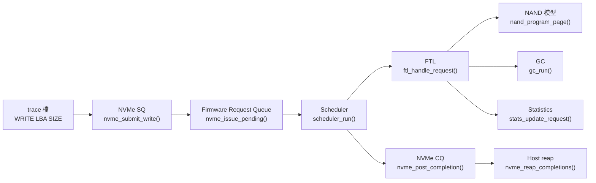

本專案把 write path、L2P mapping、out-of-place update、GC、latency 統計這幾件事串起來。

## 1. 先看目錄分工

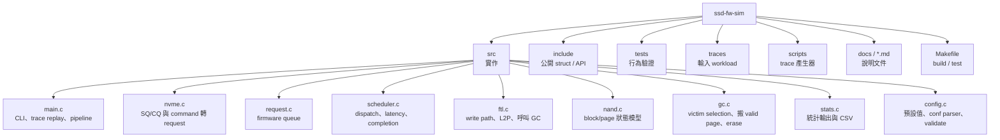

第一輪先抓住 `main -> nvme -> scheduler -> ftl -> nand/gc -> stats` 這條主線。

## 2. Build 與執行入口

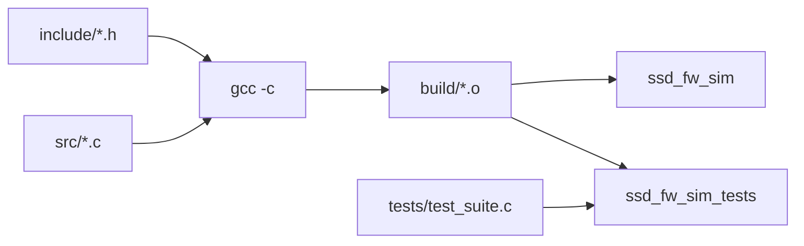

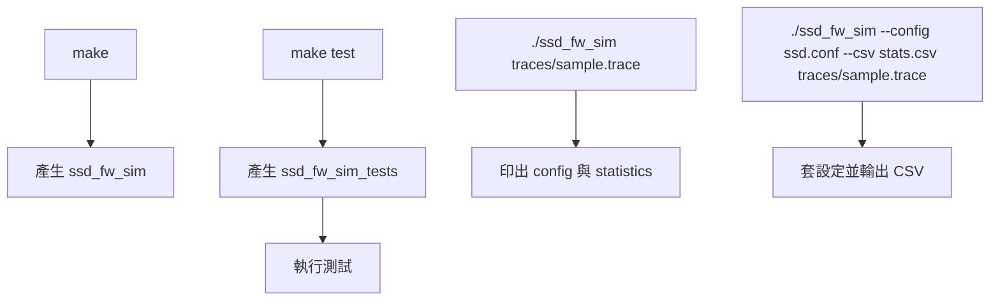

## 3. 程式啟動順序

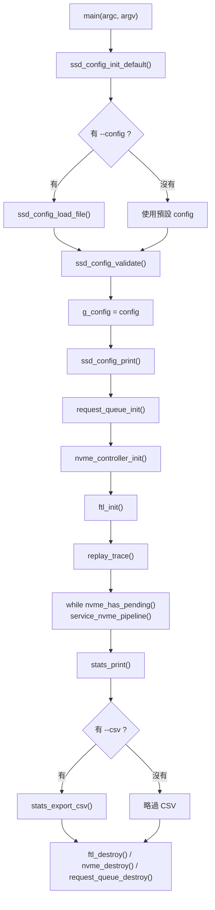

這張圖可以直接拿來看 `main.c`。初始化失敗就一路釋放已經配置好的資源，成功才進 trace replay。

## 4. Config 的生命週期

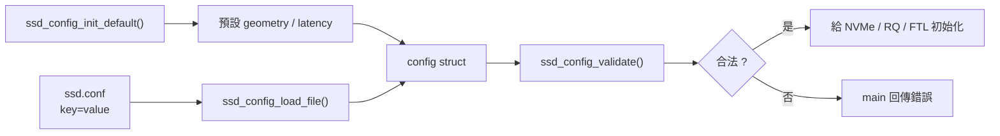

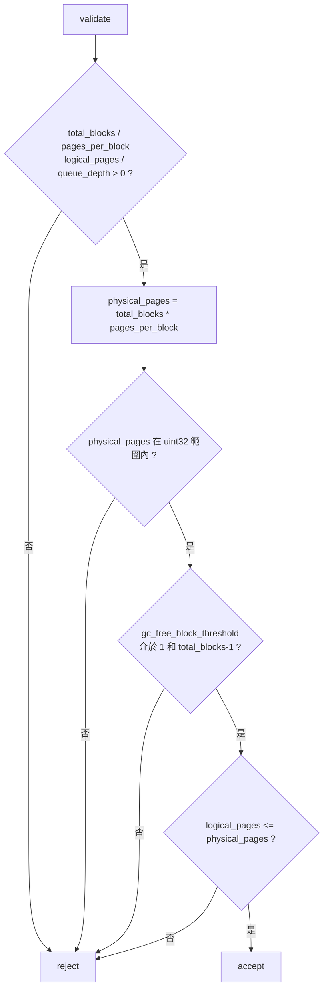

`logical_pages` 不能大於實體 page 數，這不是形式檢查，是避免 L2P 後面指到不存在的 NAND。

## 5. 執行時的大架構

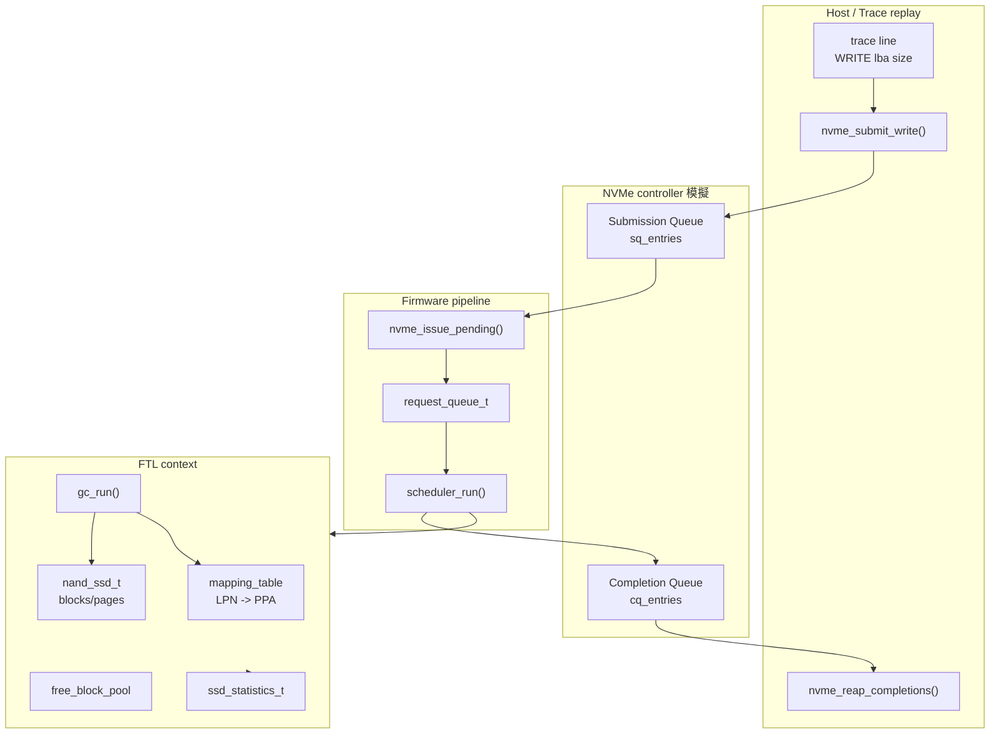

這個專案沒有 thread、interrupt、DMA，也沒有 read path。所有 request 都在單一模擬時間軸 `current_time_us` 上跑完。

## 6. 一次 pipeline 做三件事

`service_nvme_pipeline()` 在 `main.c` 裡很短，但它是整個 runtime 節奏的核心。

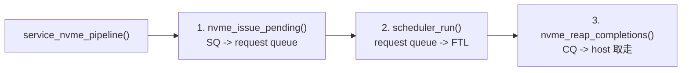

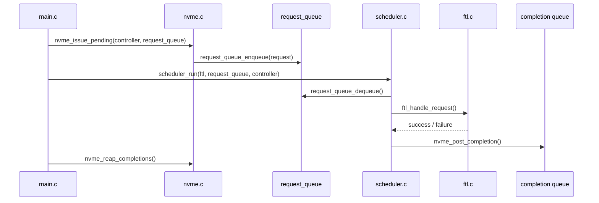

## 7. Trace replay 的資料流

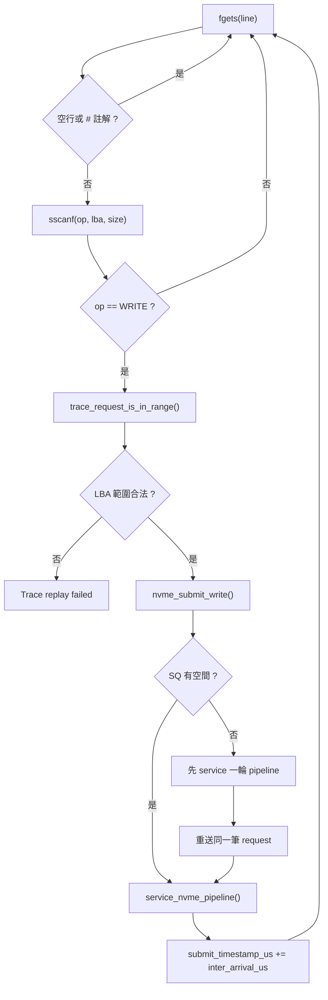

`trace_inter_arrival_us` 是模擬 host 每筆 request 抵達時間差，不是 NAND latency。

## 8. WRITE command 如何變成 request

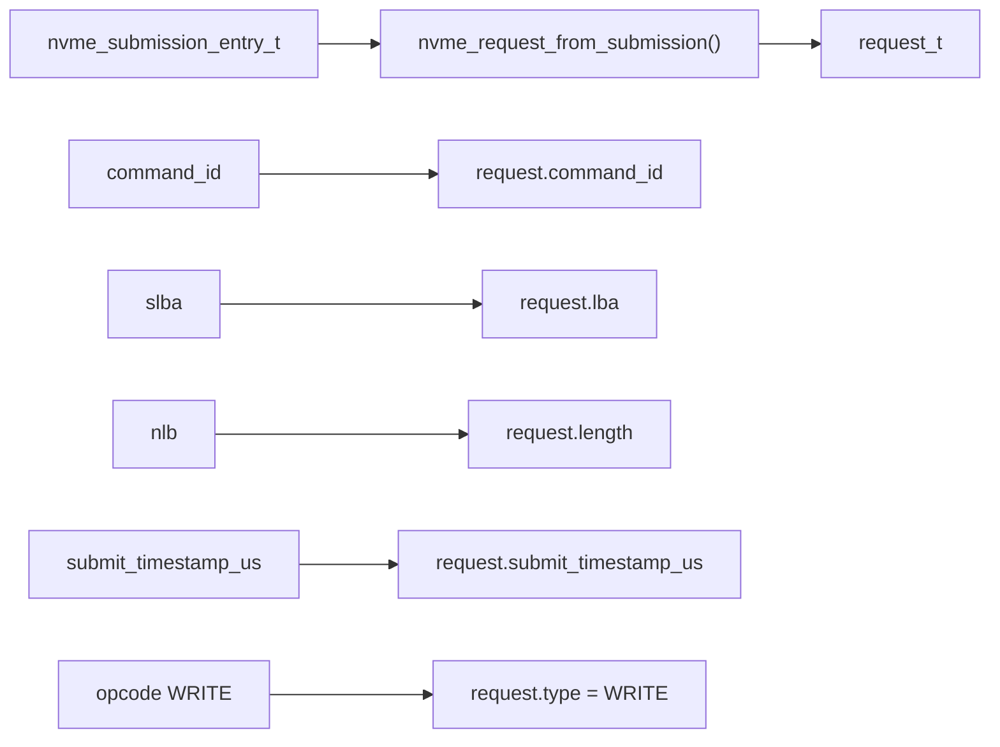

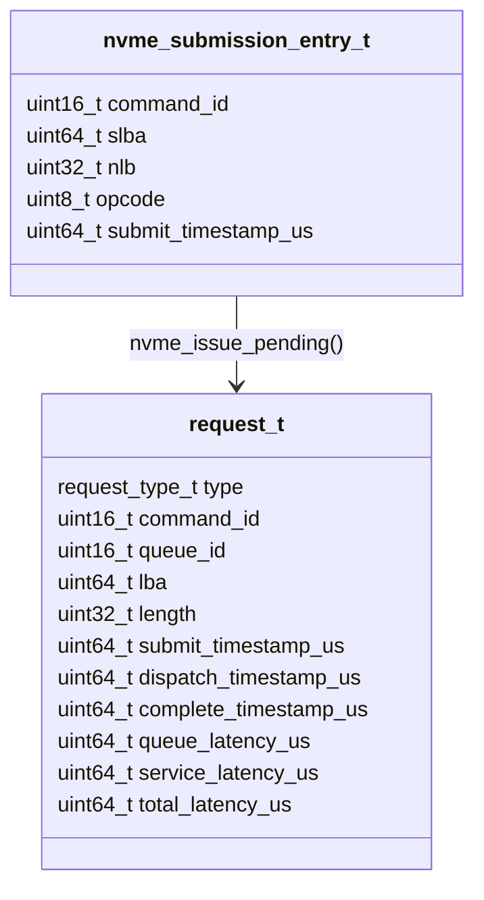

SQ entry 比較像協定層 command；`request_t` 才是韌體內部拿來排程、算 latency 的物件。

## 9. 三個 ring queue

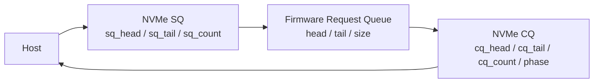

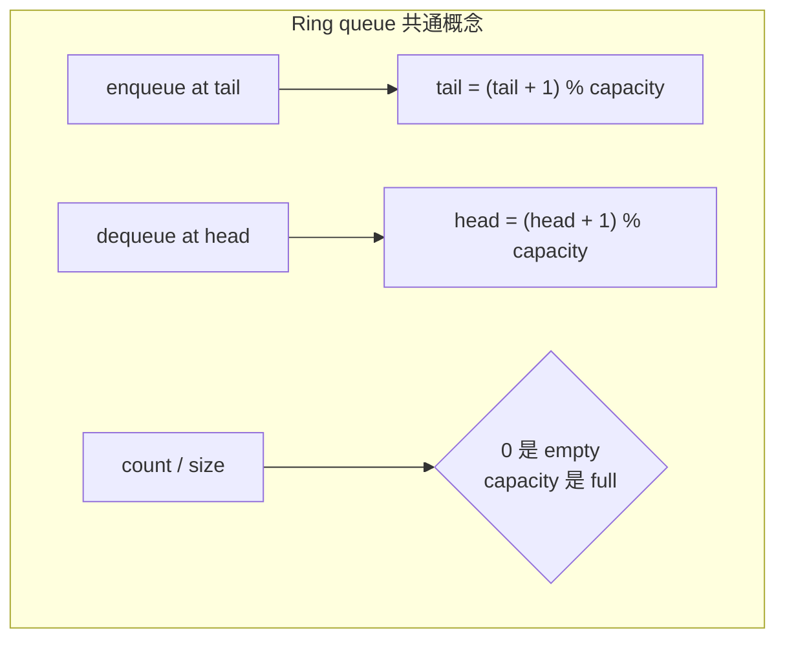

NVMe SQ、NVMe CQ、firmware request queue 都是環形佇列，只是欄位名稱略有不同。

## 10. NVMe SQ / CQ 行為

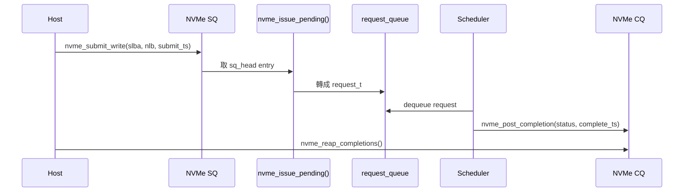

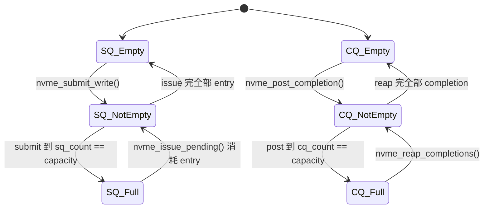

CQ 的 `phase` 只有在 tail 回繞時翻轉，用來模擬 NVMe 判斷 entry 新舊的機制。

## 11. Scheduler 做的事

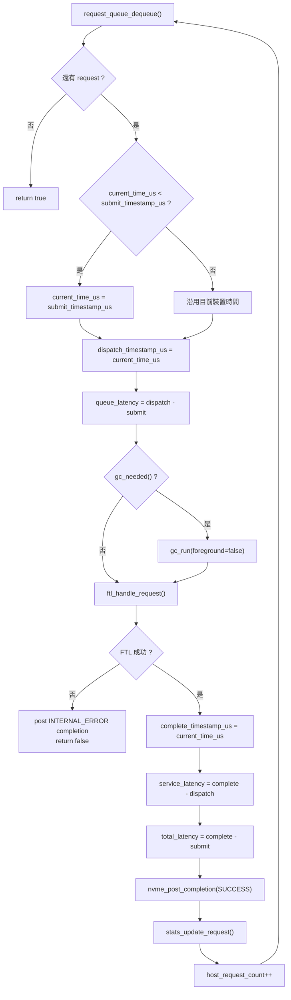

Scheduler 不決定 PPA，也不直接碰 NAND。它的職責是排 request、算 request 層 latency、發 completion。

## 12. FTL context 的結構

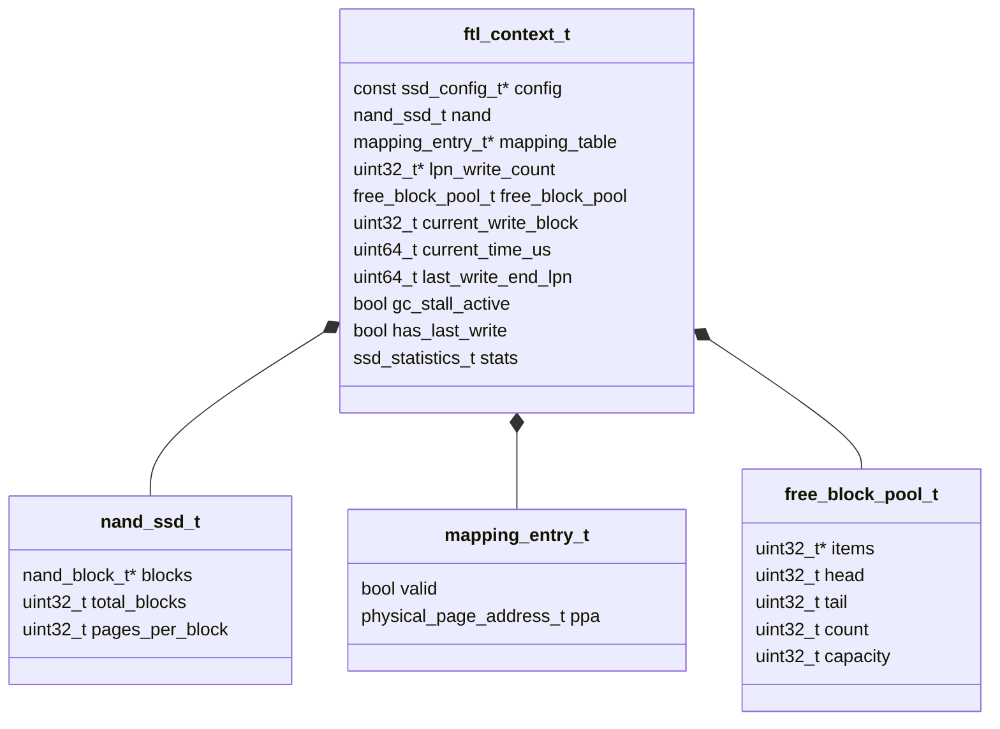

`g_ftl` 是全域唯一的 FTL instance。這個專案用單一 context 把資料面和統計都收在一起，流程集中，也方便追狀態。

## 13. FTL 初始化配置圖

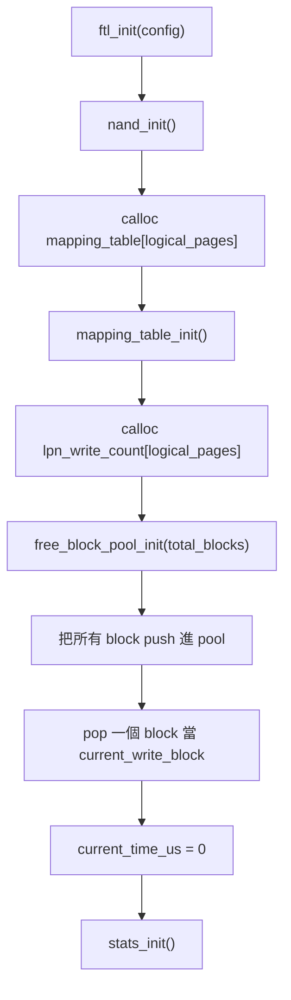

```mermaid
flowchart LR
    A["全部 block 初始 free"] --> B["free_block_pool"]
    B --> C["pop block 0"]
    C --> D["current_write_block"]
    B --> E["剩下 block 留著給後續切換或 GC 搬移"]
```

初始化時並沒有預先建立任何 mapping；L2P entry 會在第一次寫某個 LPN 時才變成 valid。

## 14. NAND 的階層

```mermaid
flowchart TB
    SSD["nand_ssd_t"]
    SSD --> B0["block 0"]
    SSD --> B1["block 1"]
    SSD --> BN["block N"]
    B0 --> P00["page 0"]
    B0 --> P01["page 1"]
    B0 --> P02["..."]
    B1 --> P10["page 0"]
    B1 --> P11["page 1"]

    B0 --> C0["valid/free/invalid counters<br/>erase_count<br/>write_pointer"]
```

```mermaid
classDiagram
    class nand_page_t {
        nand_page_state_t state
        uint32_t logical_page_number
        bool has_logical_page
    }

    class nand_block_t {
        nand_page_t* pages
        uint32_t valid_page_count
        uint32_t invalid_page_count
        uint32_t free_page_count
        uint32_t erase_count
        uint32_t write_pointer
    }

    class physical_page_address_t {
        uint32_t block_index
        uint32_t page_index
    }

    nand_block_t *-- nand_page_t
    physical_page_address_t --> nand_page_t : 指到某個實體 page
```

Page 的 `logical_page_number` 是模擬 OOB metadata；GC 搬 valid page 時靠它知道這頁是哪個 LPN。

## 15. NAND page 狀態機

```mermaid
stateDiagram-v2
    [*] --> FREE
    FREE --> VALID: nand_program_page()
    VALID --> INVALID: nand_invalidate_page()
    INVALID --> FREE: nand_erase_block()
    VALID --> FREE: nand_erase_block()
    FREE --> FREE: nand_erase_block()
```

NAND 不能原地覆寫。舊資料要失效，只能等新 page 寫好後把舊 page 標成 `INVALID`，最後靠 block erase 回到 `FREE`。

## 16. L2P mapping 的角色

```mermaid
flowchart LR
    LPN0["LPN 0"] --> M0["mapping_table[0]"]
    M0 --> PPA0["PPA<br/>block 3, page 12"]
    PPA0 --> NAND0["NAND page<br/>state=VALID<br/>logical_page_number=0"]

    LPN1["LPN 1"] --> M1["mapping_table[1]"]
    M1 --> PPA1["valid=false<br/>尚未寫入"]
```

```mermaid
sequenceDiagram
    participant FTL
    participant MAP as mapping_table
    participant NAND

    FTL->>MAP: mapping_get_physical_page(lpn)
    alt 這個 LPN 寫過
        MAP-->>FTL: old_ppa
    else 第一次寫
        MAP-->>FTL: no mapping
    end
    FTL->>NAND: allocate + program new_ppa
    FTL->>NAND: invalidate old_ppa (如果存在)
    FTL->>MAP: mapping_set_physical_page(lpn, new_ppa)
```

正確性最重要的一句話：L2P 必須永遠指向最新、而且仍然 `VALID` 的 physical page。

## 17. 一筆 write 在 FTL 裡怎麼跑

```mermaid
flowchart TD
    A["ftl_handle_request()"] --> B{"request.type"}
    B -- WRITE --> C["ftl_handle_write()"]
    B -- 其他 --> X["return false"]
    C --> D["ftl_request_range_is_valid()"]
    D --> E{"length == 0 ?"}
    E -- 是 --> Z["no-op 成功"]
    E -- 否 --> F["for lpn = start_lpn .. end_lpn-1"]
    F --> G["mapping_get_physical_page(lpn)"]
    G --> H{"gc_needed() ?"}
    H -- 是 --> I["gc_run(foreground=false)"]
    H -- 否 --> J["nand_allocate_page()"]
    I --> J
    J --> K{"allocate 成功 ?"}
    K -- 否 --> L["gc_run(foreground=true)"]
    L --> M["再 allocate 一次"]
    K -- 是 --> N["nand_program_page(new_ppa, lpn)"]
    M --> N
    N --> O["current_time_us += program_latency_us"]
    O --> P{"has_old ?"}
    P -- 是 --> Q["nand_invalidate_page(old_ppa)"]
    P -- 否 --> R["略過 invalidation"]
    Q --> S["mapping_set_physical_page(lpn, new_ppa)"]
    R --> S
    S --> T["host_page_count++<br/>nand_write_count++<br/>lpn_write_count[lpn]++"]
    T --> F
    F --> U["更新 sequential/random 統計"]
```

這裡特別注意兩個 GC 點：scheduler dispatch 前可能跑一次，FTL 每寫一個 page 前也會看一次。第二個是為了避免長 request 把 GC 搬 valid page 的空間吃光。

## 18. Out-of-place update

第一次寫 `LPN 0`：

```mermaid
flowchart LR
    A["LPN 0"] --> B["mapping_table[0]<br/>valid=false"]
    B --> C["allocate PPA A"]
    C --> D["program PPA A<br/>VALID, OOB LPN=0"]
    D --> E["mapping_table[0] = PPA A"]
```

再次寫 `LPN 0`：

```mermaid
flowchart LR
    A["mapping_table[0] = PPA A"] --> B["allocate PPA B"]
    B --> C["program PPA B<br/>VALID, OOB LPN=0"]
    C --> D["invalidate PPA A<br/>VALID -> INVALID"]
    D --> E["mapping_table[0] = PPA B"]
```

這就是 SSD 常見的 out-of-place update。它讓 write 可以快，但會製造 invalid page，後面就需要 GC。

## 19. Write pointer 與 free block pool

```mermaid
flowchart TD
    A["nand_allocate_page()"] --> B["拿 current_write_block"]
    B --> C{"write_pointer >= pages_per_block ?"}
    C -- 否 --> D["PPA = current block + write_pointer"]
    D --> E["write_pointer++"]
    C -- 是 --> F["free_block_pool_pop()"]
    F --> G{"pop 成功 ?"}
    G -- 是 --> H["切換 current_write_block"]
    H --> D
    G -- 否 --> I["allocate failed"]
```

```mermaid
flowchart LR
    B0["current_write_block<br/>write_pointer=0"] --> P0["page 0"]
    B0 --> P1["page 1"]
    B0 --> P2["page 2"]
    B0 --> P3["..."]
    P0 --> A["第一次 allocate"]
    P1 --> C["第二次 allocate"]
    P2 --> D["第三次 allocate"]
```

Allocate 只保留位置，真正把 page 變 `VALID` 是 `nand_program_page()`。

## 20. GC 觸發條件

```mermaid
flowchart TD
    A["gc_needed(ftl)"] --> B["free_block_pool_count()"]
    B --> C{"count < gc_free_block_threshold ?"}
    C -- 是 --> D["需要 GC"]
    C -- 否 --> E["不用 GC"]
```

```mermaid
flowchart LR
    A["config.gc_free_block_threshold = 8"] --> B["free block pool count"]
    B --> C{"7 以下"}
    C -- 是 --> D["background GC 可能被觸發"]
    C -- 否 --> E["繼續正常寫入"]
```

這個門檻看的是 free block pool，不是掃全部 NAND 的 free page。

## 21. GC victim selection

```mermaid
flowchart TD
    A["gc_select_victim_block()"] --> B["掃所有 block"]
    B --> C{"block == current_write_block ?"}
    C -- 是 --> B
    C -- 否 --> D{"invalid_page_count == 0 ?"}
    D -- 是 --> B
    D -- 否 --> E["挑 invalid_page_count 最大者"]
    E --> F{"有 victim ?"}
    F -- 是 --> G["return victim"]
    F -- 否 --> H["第二輪 fallback<br/>找任一 invalid > 0 的 block"]
    H --> I["return victim 或 -1"]
```

這是 greedy GC。它不看 hot/cold data，也不做完整 wear leveling；`free_block_pool_get_min_erase_block()` 目前只是保留給未來策略用。

## 22. GC 搬移與 erase

```mermaid
sequenceDiagram
    participant GC as gc_run()
    participant Victim as victim block
    participant NAND as nand.c
    participant MAP as mapping_table
    participant POOL as free_block_pool
    participant ST as stats

    GC->>Victim: 掃每個 page
    loop 每個 VALID page
        GC->>POOL: nand_allocate_page()
        GC->>ST: nand_read_count++
        GC->>NAND: nand_program_page(new_ppa, lpn)
        GC->>ST: nand_write_count++ / migrated_page_count++
        GC->>MAP: mapping_set_physical_page(lpn, new_ppa)
        GC->>NAND: nand_invalidate_page(old_ppa)
    end
    GC->>NAND: nand_erase_block(victim)
    GC->>ST: nand_erase_count++ / gc_count++
    GC->>POOL: free_block_pool_push(victim)
```

```mermaid
flowchart LR
    A["victim block<br/>VALID + INVALID 混在一起"] --> B["搬走 VALID pages"]
    B --> C["更新 L2P 到新 PPA"]
    C --> D["erase victim block"]
    D --> E["victim 變回 FREE block"]
    E --> F["push 回 free block pool"]
```

GC 的成本會反映在時間軸上：valid page 每搬一頁加 read latency 和 program latency，最後 erase 再加 erase latency。

## 23. Background GC vs foreground GC

```mermaid
flowchart TD
    A["寫入前檢查 gc_needed()"] --> B{"free block 低於門檻 ?"}
    B -- 是 --> C["gc_run(foreground=false)<br/>Background GC"]
    B -- 否 --> D["直接 allocate"]
    D --> E{"nand_allocate_page() 成功 ?"}
    E -- 是 --> F["program page"]
    E -- 否 --> G["gc_run(foreground=true)<br/>Foreground GC"]
    G --> H["再 allocate"]
    H --> F
```

Background GC 是預防；foreground GC 是 request 已經被空間不足卡住了。

## 24. Latency 時序

```mermaid
sequenceDiagram
    participant Host
    participant Main
    participant SQ
    participant Scheduler
    participant FTL
    participant NAND
    participant CQ

    Host->>Main: trace line arrives at submit_timestamp_us
    Main->>SQ: nvme_submit_write()
    Main->>Scheduler: service_nvme_pipeline()
    Scheduler->>Scheduler: dispatch_timestamp_us = current_time_us
    Note over Scheduler: queue_latency = dispatch - submit
    Scheduler->>FTL: ftl_handle_request()
    FTL->>NAND: program / GC / erase
    NAND-->>FTL: current_time_us 已累加
    FTL-->>Scheduler: complete
    Note over Scheduler: service_latency = complete - dispatch
    Scheduler->>CQ: nvme_post_completion()
    Host->>CQ: nvme_reap_completions()
```

```mermaid
flowchart LR
    A["submit_timestamp_us"] --> B["dispatch_timestamp_us"]
    B --> C["complete_timestamp_us"]
    A -- "queue latency" --> B
    B -- "service latency" --> C
    A -- "total latency" --> C
```

測試裡有檢查：`total_queue_latency_us + total_service_latency_us == total_latency_us`。這是延遲統計的基本帳要對。

## 25. current_time_us 怎麼前進

```mermaid
flowchart TD
    A["scheduler 取 request"] --> B{"current_time_us < submit_ts ?"}
    B -- 是 --> C["current_time_us = submit_ts"]
    B -- 否 --> D["代表裝置還在忙<br/>request 要排隊"]
    C --> E["開始服務 request"]
    D --> E
    E --> F["每 program 一頁<br/>+ program_latency_us"]
    F --> G{"GC 搬 valid page ?"}
    G -- 是 --> H["+ read_latency_us<br/>+ program_latency_us"]
    G -- 否 --> I["沒有搬移成本"]
    H --> J["erase victim<br/>+ erase_latency_us"]
    I --> K["request 完成"]
    J --> K
```

`current_time_us` 是裝置內部時間，不是 wall clock。跑得越多、GC 越多，後面 request 的 queue latency 通常會跟著變大。

## 26. Statistics 資料流

```mermaid
flowchart TD
    A["FTL host write page"] --> B["host_page_count++"]
    A --> C["nand_write_count++"]
    D["GC migrate valid page"] --> E["nand_read_count++"]
    D --> F["nand_write_count++"]
    D --> G["migrated_page_count++"]
    H["GC erase victim"] --> I["nand_erase_count++"]
    H --> J["gc_count++"]
    K["Scheduler 完成 request"] --> L["stats_update_request()"]
    L --> M["total_queue_latency_us"]
    L --> N["total_service_latency_us"]
    L --> O["total_latency_us / max_latency_us"]
    K --> P["host_request_count++"]
```

```mermaid
flowchart LR
    A["host_page_count"] --> WA["Write Amplification"]
    B["nand_write_count"] --> WA
    WA --> C["WA = NAND Writes / Host Pages"]
```

GC 搬移 page 也算 NAND write，所以會讓 WA 變大。這是這個模擬器最容易拿來教的指標。

## 27. Sequential / Random 判斷

```mermaid
flowchart TD
    A["request 完成所有 LPN 寫入"] --> B{"length == 0 ?"}
    B -- 是 --> Z["不更新 sequential/random"]
    B -- 否 --> C{"has_last_write && request.lba == last_write_end_lpn ?"}
    C -- 是 --> D["sequential_write_count++"]
    C -- 否 --> E["random_write_count++"]
    D --> F["last_write_end_lpn = lba + length"]
    E --> F
    F --> G["has_last_write = true"]
```

這裡是 request-level 判斷，不是 page-level。上一筆結尾剛好接到這筆開頭，才算 sequential。

## 28. API 呼叫總覽

```mermaid
flowchart TB
    MAIN["main.c"] --> CONFIG["config.c"]
    MAIN --> NVME["nvme.c"]
    MAIN --> REQ["request.c"]
    MAIN --> FTL["ftl.c"]
    MAIN --> SCHED["scheduler.c"]
    MAIN --> STATS["stats.c"]

    SCHED --> REQ
    SCHED --> FTL
    SCHED --> NVME
    SCHED --> GC["gc.c"]
    SCHED --> STATS

    FTL --> MAP["mapping.c"]
    FTL --> NAND["nand.c"]
    FTL --> GC
    FTL --> STATS

    GC --> NAND
    GC --> MAP
    GC --> BM["block_manager.c"]

    NAND --> BM
```

```mermaid
flowchart LR
    A["main.replay_trace()"] --> B["nvme_submit_write()"]
    A --> C["service_nvme_pipeline()"]
    C --> D["nvme_issue_pending()"]
    D --> E["request_queue_enqueue()"]
    C --> F["scheduler_run()"]
    F --> G["request_queue_dequeue()"]
    F --> H["gc_needed()"]
    F --> I["ftl_handle_request()"]
    I --> J["ftl_handle_write()"]
    J --> K["mapping_get_physical_page()"]
    J --> L["nand_allocate_page()"]
    J --> M["nand_program_page()"]
    J --> N["nand_invalidate_page()"]
    J --> O["mapping_set_physical_page()"]
    J --> P["gc_run()"]
    P --> Q["gc_migrate_valid_pages()"]
    Q --> R["nand_erase_block()"]
    F --> S["nvme_post_completion()"]
    F --> T["stats_update_request()"]
    C --> U["nvme_reap_completions()"]
```

這張圖適合查「我要改某個 API，可能會牽到誰」。

## 29. include struct 依賴

```mermaid
classDiagram
    class ssd_config_t
    class request_t
    class request_queue_t
    class nvme_controller_t
    class ftl_context_t
    class nand_ssd_t
    class nand_block_t
    class nand_page_t
    class mapping_entry_t
    class physical_page_address_t
    class free_block_pool_t
    class ssd_statistics_t

    request_queue_t *-- request_t
    nvme_controller_t *-- request_t : issue 後交給 RQ
    ftl_context_t *-- ssd_config_t
    ftl_context_t *-- nand_ssd_t
    ftl_context_t *-- mapping_entry_t
    ftl_context_t *-- free_block_pool_t
    ftl_context_t *-- ssd_statistics_t
    nand_ssd_t *-- nand_block_t
    nand_block_t *-- nand_page_t
    mapping_entry_t *-- physical_page_address_t
```

Header 的依賴大致反映 ownership：FTL 擁有 NAND、mapping、pool、stats；NVMe 不擁有 FTL。

## 30. Error path 與資源釋放

```mermaid
flowchart TD
    A["main"] --> B{"trace_path 存在 ?"}
    B -- 否 --> X["印 Usage / return 1"]
    B -- 是 --> C{"config load 成功 ?"}
    C -- 否 --> X
    C -- 是 --> D{"config validate 成功 ?"}
    D -- 否 --> X
    D -- 是 --> E{"request_queue_init 成功 ?"}
    E -- 否 --> X
    E -- 是 --> F{"nvme_controller_init 成功 ?"}
    F -- 否 --> G["destroy request_queue / return 1"]
    F -- 是 --> H{"ftl_init 成功 ?"}
    H -- 否 --> I["destroy nvme + request_queue / return 1"]
    H -- 是 --> J{"replay_trace 成功 ?"}
    J -- 否 --> K["rc=1 / goto out"]
    J -- 是 --> L["drain pending / stats / csv"]
    K --> O["out: destroy all"]
    L --> O
```

`goto out` 在這裡只是集中釋放資源，不是複雜控制流。

## 31. 測試覆蓋到的行為

```mermaid
flowchart TD
    A["tests/test_suite.c"] --> B["config validation<br/>不可能的 geometry 要 reject"]
    A --> C["config parser<br/>bad value / unknown key 要 reject"]
    A --> D["NVMe SQ/CQ lifecycle<br/>full、issue、completion、reap"]
    A --> E["scheduler pipeline<br/>request 數、page 數、completion 數"]
    A --> F["FTL range check<br/>越界 write 不可改 stats"]
    A --> G["GC preserves mapping<br/>GC 後 L2P 仍指向 VALID page"]
    A --> H["long request preserves GC space<br/>長 request 中途要留搬移空間"]
```

```mermaid
flowchart LR
    A["assert_mapping_is_live(ftl, lpn)"] --> B["mapping_get_physical_page()"]
    B --> C["找到 PPA"]
    C --> D["NAND page state == VALID"]
    D --> E["page.logical_page_number == lpn"]
```

測試最需要注意的是 GC 後 mapping 不能壞。很多 SSD 模擬器 bug 都出在這裡。

## 32. sample.trace 跑起來的概念圖

`traces/sample.trace` 內容：

```text
WRITE 0 4
WRITE 8 4
WRITE 16 8
WRITE 0 2
WRITE 32 16
WRITE 64 8
WRITE 0 4
```

```mermaid
flowchart TD
    A["WRITE 0 4<br/>第一次寫 LPN 0~3"] --> B["mapping 0~3 指到新 PPA"]
    B --> C["WRITE 8 4<br/>寫 LPN 8~11"]
    C --> D["WRITE 16 8<br/>寫 LPN 16~23"]
    D --> E["WRITE 0 2<br/>覆寫 LPN 0~1"]
    E --> F["舊 PPA for LPN 0~1 變 INVALID"]
    F --> G["WRITE 32 16<br/>繼續順序配置新 page"]
    G --> H["WRITE 64 8"]
    H --> I["WRITE 0 4<br/>再次覆寫 LPN 0~3"]
    I --> J["更多 invalid page，未來可能觸發 GC"]
```

這個 trace 可以看到 out-of-place update，但容量夠大時不一定會立刻觸發 GC。

## 33. 小容量 GC 情境

```mermaid
flowchart TD
    A["小容量 config<br/>total_blocks 少、pages_per_block 少"] --> B["寫滿幾個 block"]
    B --> C["覆寫某些 LPN"]
    C --> D["舊 page 變 INVALID"]
    D --> E["free block pool 下降"]
    E --> F{"低於 threshold ?"}
    F -- 是 --> G["GC 選 invalid 最多的 victim"]
    G --> H["搬 valid page"]
    H --> I["erase victim"]
    I --> J["free block pool 回升"]
    F -- 否 --> K["繼續寫"]
```

測試用小 geometry 是為了讓 GC 很快出現，才容易驗證 mapping 和 latency。

## 34. 資料流、訊號流、控制流放在一起

```mermaid
flowchart LR
    subgraph Data["資料流"]
        D1["WRITE lba size"] --> D2["request_t"] --> D3["LPN"] --> D4["PPA"] --> D5["NAND page"]
    end

    subgraph Control["控制流"]
        C1["main"] --> C2["NVMe issue"] --> C3["scheduler"] --> C4["FTL"] --> C5["GC / NAND"]
    end

    subgraph Signal["訊號 / 狀態流"]
        S1["SQ full"] --> S2["先 drain pipeline"]
        S3["free block pool low"] --> S4["gc_needed()"]
        S5["CQ full"] --> S6["reap completion"]
        S7["FTL failure"] --> S8["INTERNAL_ERROR completion"]
    end
```

Data 是資料內容怎麼轉換；control 是誰呼叫誰；signal 是狀態變化怎麼影響流程。這三個分開看，資料路徑和控制路徑比較不會混在一起。

## 35. 行為總結圖

```mermaid
flowchart TD
    A["Host submit WRITE"] --> B["是否可進 SQ"]
    B -- 否 --> C["先跑 pipeline 騰空間"]
    B -- 是 --> D["SQ 接收 command"]
    C --> D
    D --> E["issue 成 request_t"]
    E --> F["scheduler dispatch"]
    F --> G["FTL range check"]
    G --> H{"每個 LPN"}
    H --> I["找舊 mapping"]
    I --> J["必要時 GC"]
    J --> K["allocate new PPA"]
    K --> L["program NAND page"]
    L --> M["invalidate old page"]
    M --> N["更新 mapping"]
    N --> H
    H --> O["scheduler post completion"]
    O --> P["更新 request latency stats"]
    P --> Q["host reap CQ"]
```

建議先把這張圖的主線走順，再往下拆 GC。

## 36. 5 分鐘閱讀路線

下面是一條快速閱讀順序，照圖走即可。

```mermaid
flowchart LR
    A["第 1 分鐘<br/>一句話和大管線"] --> B["第 2 分鐘<br/>程式啟動與三個 queue"]
    B --> C["第 3 分鐘<br/>FTL write 和 L2P"]
    C --> D["第 4 分鐘<br/>NAND 狀態與 GC"]
    D --> E["第 5 分鐘<br/>latency / stats / 測試保障"]
```

### 第 1 分鐘：先用圖 0 和圖 5

摘要：

> 這個專案是在模擬 SSD 韌體的 write path。輸入是一個 trace，每行都是 `WRITE LBA SIZE`。程式先把它放進 NVMe SQ，再轉成 firmware request，scheduler 交給 FTL。FTL 負責 LPN 到 PPA 的 mapping，最後寫到 NAND 模型。如果空間不夠或 free block 太少，就跑 GC。完成後丟 CQ，最後印統計。

這裡先釐清資料從哪裡來、最後去哪裡。

### 第 2 分鐘：用圖 3、圖 6、圖 9

摘要：

> `main()` 先載入設定、初始化 request queue、NVMe controller、FTL，然後 replay trace。每讀到一筆 WRITE，就 submit 到 SQ，接著跑一輪 `service_nvme_pipeline()`。這輪固定做三件事：SQ 轉 request queue、scheduler 處理、CQ 被 host reap。SQ、RQ、CQ 都是 ring queue，所以 head/tail/count 是看懂 queue 行為的關鍵。

這裡可以對照 `main.c` 的 `service_nvme_pipeline()`，它很短，能快速看出 pipeline 的骨架。

### 第 3 分鐘：用圖 16、圖 17、圖 18

摘要：

> FTL 的核心是 L2P mapping。Host 給的是 LPN，NAND 真正寫的是 PPA。寫一個 LPN 時，FTL 先查舊 mapping，再 allocate 新 PPA，program 新 page。如果這個 LPN 以前寫過，就把舊 page 標成 invalid，最後 mapping 指到新 PPA。這就是 out-of-place update。NAND 不能原地覆寫，所以 invalid page 會越來越多。

這段重點是順序：新 page program 成功後，才 invalid 舊 page，最後更新 mapping。

### 第 4 分鐘：用圖 15、圖 20、圖 21、圖 22

摘要：

> NAND page 只有三種狀態：FREE、VALID、INVALID。FREE 可以被 program 成 VALID；VALID 被覆寫後變 INVALID；INVALID 要等整個 block erase 才會回到 FREE。GC 的觸發條件是 free block pool 低於門檻。GC 會挑 invalid page 最多、且不是 current write block 的 block 當 victim，先把裡面的 valid page 搬到新位置並更新 L2P，再 erase victim，最後把這個 block 放回 free pool。

這裡要釐清「搬 valid page 要更新 mapping」，這是正確性的重點。

### 第 5 分鐘：用圖 24、圖 26、圖 31

摘要：

> 模擬器用 `current_time_us` 當裝置時間。scheduler 會算 queue latency、service latency、total latency。FTL 每 program 一頁加 program latency；GC 搬頁會加 read/program latency，erase 會加 erase latency。統計裡的 WA 是 NAND writes 除以 host pages，所以 GC 搬移越多，WA 越高。測試主要保證 config 檢查、queue lifecycle、scheduler completion、FTL range check，以及 GC 後 mapping 還指向 live page。

最後補充：這個專案目前只做 write path，沒有 read、multi-channel、power-loss recovery，那些是未來可以往外長的地方。

### 5 分鐘版最小圖組

如果時間真的很短，只放這幾張就夠：

```mermaid
flowchart TD
    A["圖 0<br/>一句話大管線"] --> B["圖 6<br/>service_nvme_pipeline 三步驟"]
    B --> C["圖 17<br/>FTL write 流程"]
    C --> D["圖 18<br/>out-of-place update"]
    D --> E["圖 22<br/>GC 搬移與 erase"]
    E --> F["圖 24<br/>latency 時序"]
    F --> G["圖 26<br/>stats / WA"]
```

閱讀時可先釐清「request 怎麼穿過管線」，再回頭看每個模組的 struct 和 API，會更容易接上整體脈絡。
